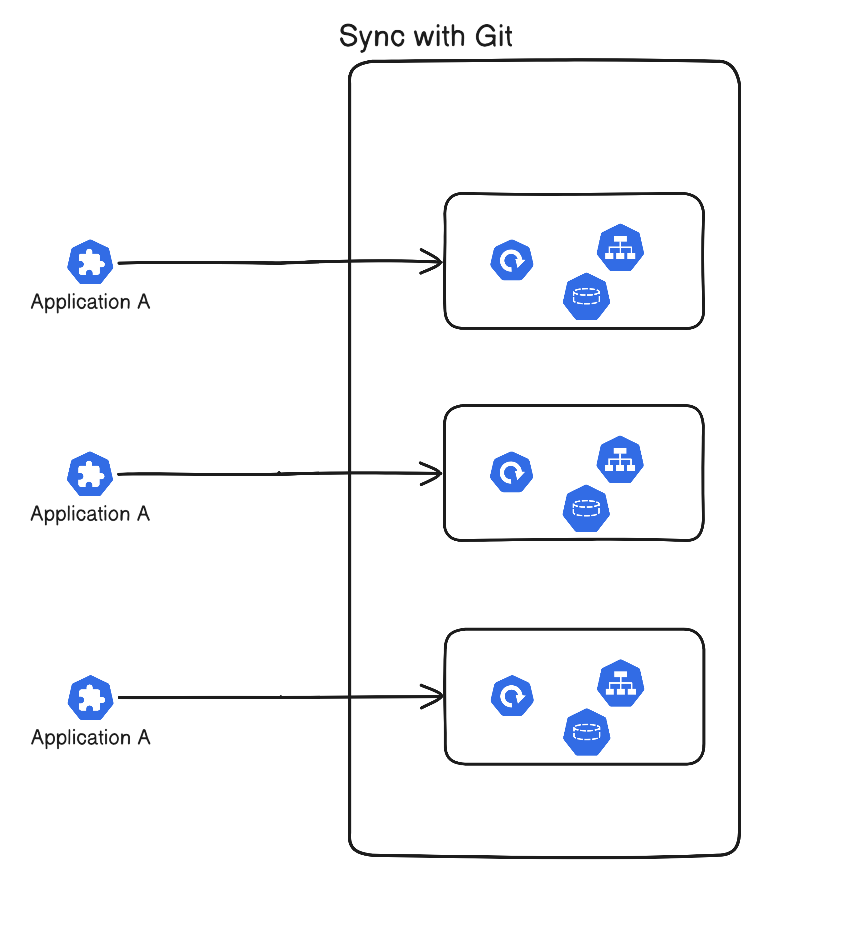

## 🪆 App of Apps 패턴이란

ArgoCD에는 Application이라는 배포 단위를 가진다.  
그러나, Application들 자체는 GitOps로 관리되지 못한다.  
그래서, 이 문제에 대한 해결 방법으로, Application들을 감시하는 Root Application을 만들어서, 단일 배포 시작점으로 만든 뒤, 하위 Application들을 GitOps로 관리하는 App of Apps라는 패턴을 사용할 수 있다.




이후에는 Root App을 제외하고는 모두 선언형으로 관리되어, Application CRD의 명령형 관리영역을 단일 지점으로 줄일 수 있다.

## 🍳 Root App 예시


아래의 디렉토리 구조를 가정한다:
```bash
.
├── apps              # 서비스할 애플리케이션들의 yaml
├── argocd
│   ├── apps          # apps/ 디렉토리의 Application들
│   ├── infra         # infra/ 디렉토리의 Application들
│   └── root-app.yaml # Root Application
└── infra             # Infra 레벨의 yaml
    ├── network
    └── storage
```

`root-app.yaml`에는 아래와 같이 작성해주면 된다:
```yaml
# Root-App.yaml
apiVersion: argoproj.io/v1alpha1
kind: Application
metadata:
  name: root-app
  namespace: argocd
spec:
  project: default
  sources:
    # Apps를 위해서
    - repoURL: <your-git-repo>
	  targetRevision: HEAD
      path: argocd/apps
	    directory:
	      recurse: true
    # Infra를 위해서
    - repoURL: <your-git-repo>
	  targetRevision: HEAD
      path: argocd/infra
	    directory:
	      recurse: true
  destination:
    server: https://kubernetes.default.svc  # in-cluster.
    namespace: argocd
  syncPolicy:
    automated:
      prune: true
      selfHeal: true
```


이제, 적용해준다.
```bash
kubectl apply -f argocd/root-app.yaml
```

이제, 클러스터를 옮겨도 Root App을 통해서 한 번에 여러 애플리케션들을 연쇄적으로 업데이트 할 수 있다.