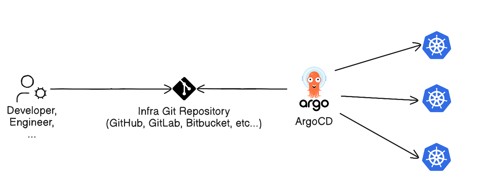
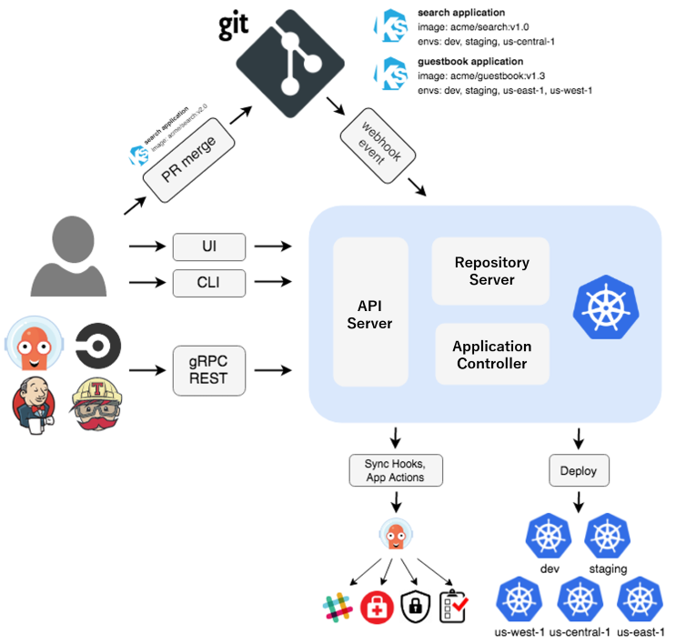
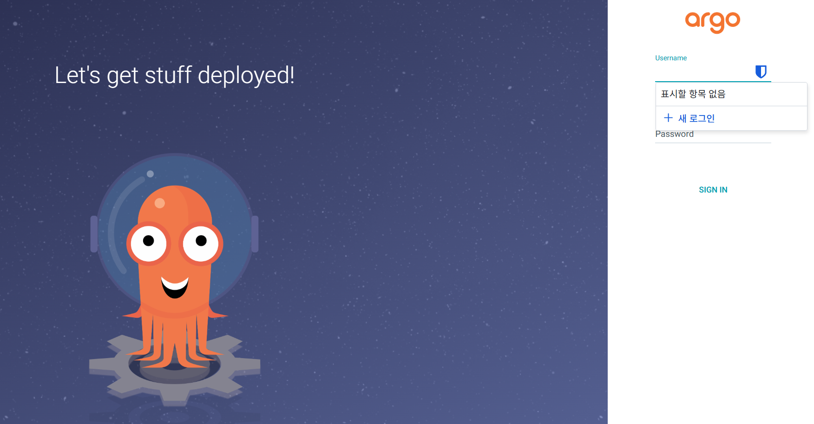

## 🐙 ArgoCD란
ArgoCD는 선언형 GitOps를 제공하는 쿠버네티스 오퍼레이터이다.  
GitOps란, 인프라 및 애플리케이션의 설정과 원하는 상태를 Git에 저장하고, 해당 Git 레포지토리를 **Single Source of Truth**로 두는 방법이다.  
GitOps의 이점은 다음과 같다:
- 선언적으로 정리된 시스템의 상태들을 Git과 연동
- 배포 속도 향상
- 쉬운 감사 및 롤백
- 높은 안정성 및 일관성



## 🔬 ArgoCD 내부 구조



ArgoCD는 다음의 세 가지 구성요소를 가진다:
- **API Server**
gRPC, REST API를 제공하는 서버이다.  
Web UI, CLI, CI/CD시스템으로부터 상호작용하여, 애플리케이션 작업, repository 및 credential 관리, 인증 및 인가, RBAC관리, Git webhook 이벤트 수신 등의 다양한 역할을 한다.
- **Repository Server**
애플리케이션의 manifest의 로컬 캐시를 유지한다.(레포지토리를 영구히 받아 저장하지는 않는다, 즉 stateless하다)  
레포지토리, revision(commit, tag, branch), 어플리케이션 경로, 탬플릿 세팅(파라미터, helm values 등)의 입력을 받아서 k8s manifest를 생성한다.
- **Application Server**
지속적으로 클러스터의 상태와 레포지토리에서 쓰인 desired state와 비교한다.  
즉, Kubernetes API와 상호작용하며 실제 작업을 맡는 역할을 한다.

## 🚀 클러스터에 ArgoCD 설치

### 명령어를 통한 설치

```bash
kubectl create namespace argocd
kubectl apply -n argocd -f https://raw.githubusercontent.com/argoproj/argo-cd/stable/manifests/install.yaml
```

### Helm을 통한 설치
[여기](https://github.com/argoproj/argo-helm/tree/main/charts/argo-cd)에서 다양한 values 옵션을 참고 가능하다.

### ArgoCD CLI 설치
[ArgoCD Installation](https://argo-cd.readthedocs.io/en/stable/cli_installation/)을 참고한다.

## 🖥️ ArgoCD Dashboard에 접속

Port-forward, NodePort, LoadBalancer, Ingress, Gateway API등을 이용할 수 있다.

### Port-forward로 접근
```bash
kubectl port-forward -n argocd svc/argocd-server 8080:80
```
이후. localhost:8080으로 들어가면 된다.

### LoadBalancer로 노출시키기
MetalLB / Cilium L2 Announcement / 기타 클라우드 로드 밸런서가 있을 시, 이용하능하다
```bash
kubectl patch svc argocd-server -n argocd -p '{"spec": {"type": "LoadBalancer"}}'
```

### CLI로 비밀번호 받기
아래 명령어로 최초의 admin 비밀번호를 얻을 수 있다.
```bash
argocd admin initial-password -n argocd
```

### Web UI 접속
ID: admin, Password: <CLI를통해 받은 비밀번호>를 이용하여 로그인할 수 있다.

