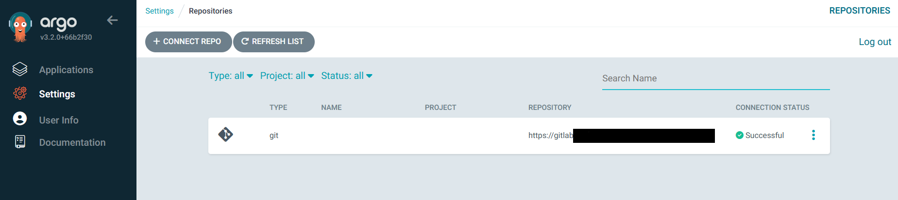

## ArgoCD에 Repository 추가
우리는 항상 퍼블릭한 저장 공간만을 사용하는 것이 아니다.  
오히려 프로덕션에서는 Private 레포지토리를 이용하는경우가 거의 대부분이다.  

아래와 같이 `Secret`을 추가해주면 된다.

```yaml
apiVersion: v1
kind: Secret
metadata:
  name: repo-k8s-https
  namespace: argocd
  labels:
    argocd.argoproj.io/secret-type: repository # 이 label이 핵심
stringData:
  type: git
  url: <private-git-repo> # GitHub, GitLab 등
  username: <username>
  password: <Personal Access Token>
```

ArgoCD Web UI에서도 아래와 같이 뜨는것을 확인할 수 있다:
