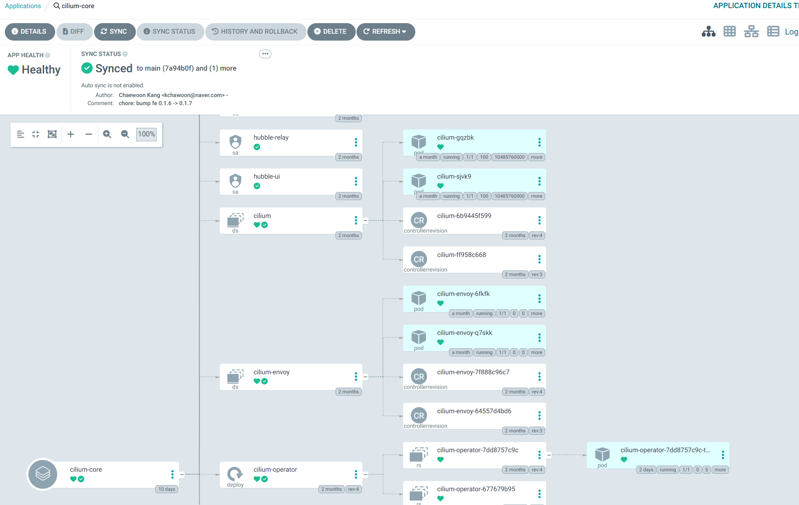
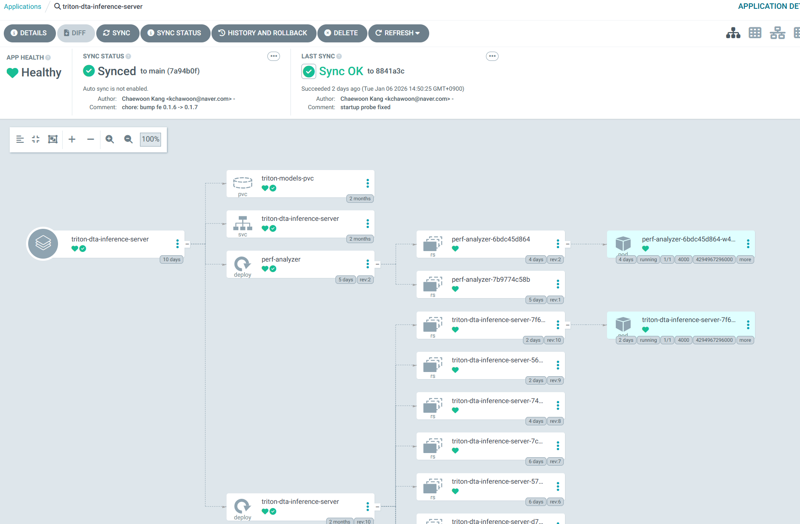

레포지토리 구조 전략을 알아보고, 배포의작은 단위인 Application 배포도 해보자

## 레포지토리 구조 

쿠버네티스 yaml 레포지토리의 구조를 아래와 같이 하였다.   
이 방법 외에도 정답은 많다, 하나의 전략일 뿐이다.  

```bash
.
├── apps
│   ├── service-a
│   ├── service-b
│   └── service-c
│       ├── deploy.yaml
│       └── svc.yaml
├── argocd
│   ├── app
│   │   ├── service-a.yaml
│   │   ├── service-b.yaml
│   │   └── service-c.yaml
│   └── infra
│       └── cilium-core.yaml
└── infra
    └── network
        └── cilium-core
            └── values.yaml
```

- `apps`: 서비스할 애플리케이션에 대한 yaml들을 각 서브폴더 안에 넣는다.
예를 들면, `deployment`와 `service`등이 있다.
- `argocd`: ArgoCD는 Application이라는 CRD로 배포 단위를 묶는다. 
`argocd/app` 서브폴더에 `apps`의 Application들을 선언해줄 것이고,
`argocd/infra` 서브폴더에 `infra`의 Application들을 선언해줄 것이다.
- `infra`: 인프라 요소들(네트워킹, 스토리지 등)도 GitOps로 관리하면 깔끔한 운영이 가능하다.
여기서는 Cilium을 ArgocD가 감시하도록 만들 것이다.


## Application yaml 예시

아래는 Cilium을 Application으로 관찰하기 위한 예시이다.
```yaml
apiVersion: argoproj.io/v1alpha1
kind: Application
metadata:
  name: cilium-core
  namespace: argocd
spec:
  project: default
  sources:
    - repoURL: https://github.com/fudoge/kube-manifests-lab.git # 당신의 레포지토리로 하세요
      targetRevision: main
      ref: values
    - chart: cilium
      repoURL: https://helm.cilium.io/
      targetRevision: 1.18.1
      helm:
        releaseName: cilium
        valueFiles:
          - $values/infra/network/cilium-core/values.yaml
  destination:
    server: https://kubernetes.default.svc
    namespace: kube-system
  syncPolicy:
    syncOptions:
      - RespectIgnoreDifferences=true
  ignoreDifferences:
    - kind: Secret
      name: cilium-ca
      namespace: kube-system
      jsonPointers:
        - /data
    - kind: Secret
      name: hubble-relay-client-certs
      namespace: kube-system
      jsonPointers:
        - /data
    - kind: Secret
      name: hubble-server-certs
      namespace: kube-system
      jsonPointers:
        - /data
```

- `apiVersion: argoproj.io/v1alpha1`:  Argo 프로젝트의 CRD를 위한 API버전.
- `.spec: Application`:  Application 리소스. ArgoCD의 기본적인 서비스단위이다.
- `.metadata.name`: Application의 이름.
- `spec.project`: 어느 Project에 속하는지 정한다. 여러 Application들을 Project로 묶어 관리가능하다. 지금은 default로 했다.
- `spec.sources[0]`을 보면, cilium helm 레포지토리로부터 차트를 받음을 알 수 있다.
  버전은 1.18.1로 정했고, helm의 릴리즈명은 cilium, values파일은 `$values/infra/network/cilium-core/values.yaml`로부터 가져옴을 알 수 있다. 
- `spec.sources[1]`을 보면, github의 쿠버네티스 마니페스트 레포지토리로부터 값을 가져옴을 알 수 있다.
  main브랜치로 정하고, values로 참조할 수 있도록 설정한 것을 볼 수있다.
  즉, `spec.sources[0]`에서 $values로 끌어와서 사용함을 볼 수 있다.
- `spec.destination`에는 적용 대상이 적혀있다. 
  자신의 클러스터의 `kube-system`에 배포하라는 의미이다.
- `spec.syncPolicy.syncOptions`에서 `RespectIgnoreDifferences=true`로 설정된 것을 볼 수 있다.
  아래의 `ignoreDifferences`를 활성화시키기 위해서이다.
- `spce.ignoreDifferences`들의 요소를 보자. `cilium-ca`, `hubble-relay-client-certs`, `hubble-server-certs`들의 `.data`부분을 무시한다는 의미이다.
  이 작성법은 RFC6902 JSON patches기반이다. 
  이 부분을 무시하는 이유는, Cilium의 이 시크릿들이 주기적으로 자동 롤링되기 때문에, GitOps의 추적에는 무시하는 것이 좋다.


아래는 Triton Inference Server를 Application으로 배포하는 예시이다:
앞에서는 `sources`로 참조했는데, 이번에는 `source`로 참조하는 것을 볼 수 있다.
```yaml
apiVersion: argoproj.io/v1alpha1
kind: Application
metadata:
  name: triton-dta-inference-server
  namespace: argocd
spec:
  project: default
  source:
    repoURL: https://github.com/fudoge/kube-manifests-lab.git
    targetRevision: main
    path: apps/triton-dta-inference-server
  destination:
    server: https://kubernetes.default.svc
    namespace: triton-dta
  syncPolicy:
    automated:
      enabled: true
    syncOptions:
      - CreateNamespace=true
```

`spec.syncPolicy.automated.enabled`를 `true`로 두면, 자동으로 Sync된다.

## Application 적용해보기
레포지토리를 커밋 및 푸시해주자. 그 뒤, 이 애플리케이션을 적용하여 만들어보자.
```bash
kubectl apply -f argocd/infra/cilium-core.yaml
```

Refresh후, Sync해주자.  
Warning메시지가 뜨는데, 기존 Cilium에는 없던 argocd관련 어노테이션들이 추가되기 때문이다.    
그냥 replace로 덮어씌우면 된다. 
혹시 걱정된다면 diff로 뭐가 다른지 확인해보면 된다.   
이제, ArgoCD가 Cilium의 코어 리소스들을 추적한다.   
그러면서 롤링되는 시크릿은 동기화 추적으로부터 벗어나도록 했다.

잘 된것을 확인할 수 있다!


