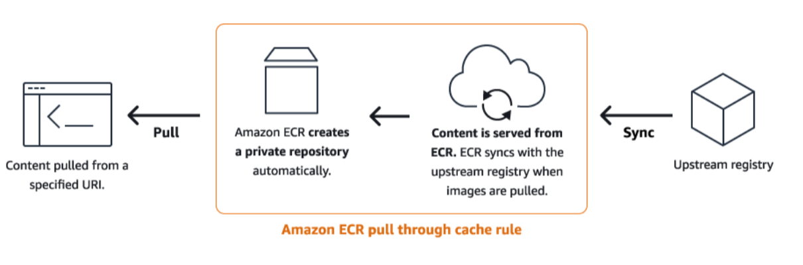
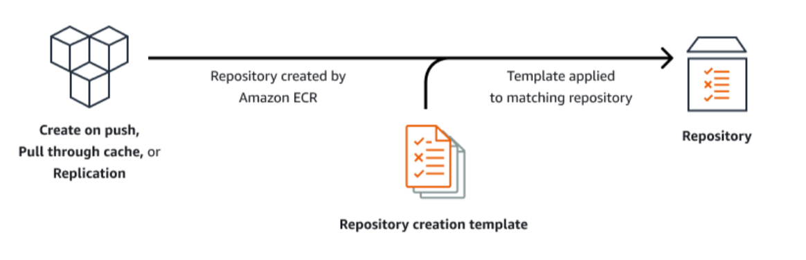
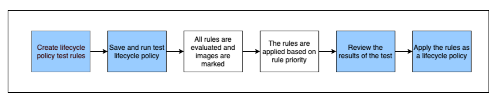

캡스톤디자인 프로젝트를 하는데, 예산 문제로 EKS 클러스터를 매일 올리고 내려야 하는 상황에 도달했다. \
EKS의 Control Plane 비용만 해도, 서울 리전 기준 $0.10 / hr이기 때문이다. \
그래서 작업할 때에만 클러스터를 올리고, 내려야 하며, NAT Gateway도 야간에는 내리는 방식의 운영을 하려고 한다. \
RDS는 suspend를, elasticache는 서버리스를 쓸 것 같다.

그러나, 한 가지 함정이 있었다. \
매일 새로운 클러스터가 똑같은 이미지들을 풀링하는 것이다. \
각종 운영도구들 말이다. \
Cilium, GitOps, Observability 등의 동일한 컨테이너 이미지들을 매일 받아야 한다. \
Docker Hub, Quay, ghcr.io, k8s.io, Public ECR 등, 여러 이미지들을 Pull 해와야 하는데, 이들을 모두 NAT Gateway를 통해서 노드가 받아온다. \
즉, NAT Gateway에서 추가 트래픽 비용이 발생한다. \
이를 방지하기 위해, ECR에 캐시 레지스트리르 만들고, VPC Endpoint로 비용을 줄여보고자 한다.

---
## ECR Pull Through Cache Rule

**Pull Through Cache Rule은 직접 레지스트리를 만들지 않는다.** \
이후, 첫 pull 요청이 오면, 이용하는 인스턴스(EC2, ECS, EKS 등)는 실제 Private Registry를 만들고, 원본 이미지를 받아오도록 요청한다. \
이후 다른 이미지들도 그렇게 누적되면서, 그 Private Registry에 다른 캐시들도 쌓인다.



### 룰 사용을 위해 필요한 것들
AWS ECR은 업스트림으로부터 컨테이너의 캐시 레지스트리를 만드는 것을 지원한다. \
해당 레지스트리를 이용하는 주체(ECS, EKS 등)는 다음의 권한을 가져야 있는 것이 좋다:
- `ecr:BatchImportUpstreamImage`: 외부 이미지를 받고 프라이빗 레지스트리에 저장시키는 것을 요청
- `ecr:CreateRepository`: 프라이빗 레지스트리를 만들기 위한 권한, 레지스트리 자체가 없는 경우 필요

또한, ECR로부터 이미지를 받기 위해서는 다음의 권한도 가져야 한다:
```json
{
  "Version":"2012-10-17",		 	 	 
  "Statement": [
    {
      "Effect": "Allow",
      "Action": [
        "ecr:BatchCheckLayerAvailability",
        "ecr:BatchGetImage",
        "ecr:GetDownloadUrlForLayer",
        "ecr:GetAuthorizationToken"
      ],
      "Resource": "*"
    }
  ]
}
```

Pull Through Cache Rule을 만드는 주체는 `ecr:CreatePullThroughCacheRule`이 있어야 한다. \

업스트림 레지스트리에서 자격 증명을 요구한다면, secrets manager를 이용해서 값을 넣어야 한다. \
- Secret의 이름은 `ecr-pullthroughcache/`로 시작해야 한다.
- 해당 시크릿과 Pull Through Cache Rule의 리전이 일치해야 한다.

### 업스트림 레지스트리
업스트림 레지스트리들은 다음과 같다:
- `public.ecr.aws`: ECR Public
- `{registryId}.dkr.ecr.{region}.amazonaws.com`: ECR Private
- `registry.k8s.io`: Kubernetes 
- `quay.io`: Quay
- `cgr.dev`: ChainGuard
- `ghcr.io`: GitHub Container Registry
- `{custom}.azurecr.io`: Azure Container Registry
- `registry.gitlab.com`: GitLab Container Registry

### Repository Prefix
Pull Through Cache 레포지토리는 캐시 저장소 경로와 upstream 저장소 경로 사이의 prefix 변환 규칙을 설정할 수 있다. \
- ECR repository prefix: ECR 측에서 사용자가 pull 할 때 보는 캐시 레지스트리의 prefix이다.
- Upstream repository prefix: 원본 upstream registry측의 저장소 이름 prefix이다.

`ROOT`라는 특별한 키워드가 있는데, 이는 별도 prefix가 없음을 말한다. \
예시로, 다음의 변환들을 볼 수 있다:

| Cache(ECR repository) namespace | Upstream namespace | Mapping |
| --- | --- | --- |
| ecr-public | ROOT(default) | `ecr-public/my-app/image1` -> `ecr-public/my-app/image1` |
| ROOT | ROOT | `my-app/image1` -> `my-app/image1` |
| team-a | team-a | `ecr-public/my-app/image1` -> `ecr-public/my-app/image2` |
| my-app | upstream-app | `my-app/image1` -> `upstream-app/image1` |

> **NOTE**
> Prefix의 끝에는 자동으로 `/`가 적용된다. \
> 즉, `ecr-public`이라고 적으면, ECR은 `ecr-public/`이라고 인식한다.

---
## ECR Repository Creation Template

ECR Repository Creation Template은 최초 푸시 시 생성, Pull through Cache, 복제 등의 작업에서 여러 구성 설정을 적용시키기 위한 미리 정의해두는 탬플릿이다. \
Prefix로 매칭된다.



이미지 태그의 mutable설정, 암호화 설정, 레포지토리 정책, 태그, lifecycle policy, IAM Role할당 등을 할 수 있다.

---
## Lifecycle Policy

Amazon ECR에서는 컨테이너 이미지의 생명 주기 관리를 하여 비용 절감이 가능하다. \
lifecycle policy가 레포지토리에 적용되면, 


1. 사용자가 lifecycle policy 규칙을 생성
2. rule을 저장하고 미리 preview로 확인한다.
3. 확인 후 policy를 적용한다.
4. 적용 후에는 조건을 만족한 이미지가 24시간 이내에 처리된다.

Rule들은 priority가 있으며, 낮은 순서가 우선순위이다. \
그러나, ECR의 evaluator는 모든 이미지들에 모든 규칙들을 적용하여 검사하고, 이후 우선순위에 따라 적용한다. \

생명주기는 이미지를 제거하는 방법만 있지 않고, 다른 방법도 존재한다.
- `expire`: 완전히 삭제
- `archive`: 보관 상태로 전환

Rule은 json으로 작성되며, 아래의 포맷을 가진다:
```json
{
  "rules": [
    {
      "rulePriority": integer,
      "description": "string",
      "selection": {
        "tagStatus": "tagged"|"untagged"|"any",
        "tagPatternList": list<string>,
        "tagPrefixList": list<string>,
        "storageClass": "standard"|"archive",
        "countType": "imageCountMoreThan"|"sinceImagePushed"|"sinceImagePulled"|"sinceImageTransitioned",
        "countUnit": "string",
        "countNumber": integer
      },
      "action": {
        "type": "expire"|"transition",
        "targetStorageClass": "archive"
      }
    }
  ]
} 
```

여러 예제들은 [여기](https://docs.aws.amazon.com/AmazonECR/latest/userguide/lifecycle_policy_examples.html)]에서 확인가능하다.

여러 주의할 점들이 있다:
- `tagPatternList`와 `tagPrefixList`는 같이 사용할 수 없다
- `tagPatternList`와 `tagPrefixList`의 값들은 AND조건으로 맞아야 한다. \
예를 들어, `tagPrefixList = ["prod", "stable"]`이면, 해당 이미지는 `prod`로 시작하는 태그와 `stable`로 시작하는 태그 모두 있어야 한다.
- `untagged` 이미지들에 대한 정책은 하나의 `storageClass`만을 선택해야 한다.
- 시간 기준은 항상 최신 이미지들이 남는다

---
## VPC Endpoint

### 기본적으로 필요한 VPC Endpoint들
VPC Endpoint로 ECR에 비용 효율적으로 컨테이너를 받아올 수 있다. 
- `com.amazonaws.{region}.ecr.dkr`: Docker client 명령(`pull`, `push`)등에 대한 API를 위해 사용
- `com.amazonaws.{region}.ecr.api`: ECR API에 대해 연결(`DescribeImages`나 `CreateRepository`와 같은 API)

이 두 가지 Endpoint들에 대해서, Private DNS Name 옵션을 켜줘야 한다. \
또한, Endpoint의 ENI들에 적용할 보안그룹에서는 Ingress로 tcp 443, 즉 https를 허용해야 한다.

그러나, 이들만으로는 부족한데, ECR은 Amazon S3에 이미지 레이어들을 저장하기에, S3 gateway endpoint까지 필요하다. \
엔드포인트명은 `com.amazonaws.{region}.s3`이다. \

### EKS에서 필요한 VPC Endpoint들
이외에도, EKS를 사용한다면, 아래 표에서 더 많은 VPC Endpoint들을 고려해볼 수 있다:

| Service | Endpoint |
| --- | --- |
| Amazon EC2 | `com.amazonaws.{region}.ec2` |
| Amazon ECR | `com.amazonaws.{region}.ecr.api`, `com.amazonaws.{region}.ecr.dkr`, `com.amazonaws.{region}.s3` |
| Amazon ALB | `com.amazonaws.{region}.elasticloadbalancing` |
| (Optional) AWS X-ray | `com.amazonaws.{region}.xray` |
| (Optional) AWS SSM | `com.amazonaws.{region}.ssm` |
| Amazon CloudWatch Logs | `com.amazonaws.{region}.logs` |
| Amazon STS(Security Token Service) | `com.amazonaws.{region}.sts` |
| Amazon EKS Auth(required when using Pod Identity associations) | `com.amazonaws.{region}.eks-auth` |
| Amazon EKS | `com.amazonaws.{region}.eks` |

---
## Terraform 코드 예시

### Pull Through Cache 생성

```hcl
locals {
  # 자격증명들
  cache_creds = {
    docker-hub = {
      username    = var.dockerhub_username
      accessToken = var.dockerhub_access_token
    }
    ghcr = {
      username    = var.ghcr_username
      accessToken = var.ghcr_access_token
    }
  }
  
  # Pull through cache rule들 정보를 map형태로
  pull_through_cache_rules = {
    k8s = {
      upstream_registry_url = "registry.k8s.io"
      needs_auth            = false
    }
    ecr-public = {
      upstream_registry_url = "public.ecr.aws"
      needs_auth            = false
    }
    quay = {
      upstream_registry_url = "quay.io"
      needs_auth            = false
    }
    ghcr = {
      upstream_registry_url = "ghcr.io"
      needs_auth            = true
    }
    docker-hub = {
      upstream_registry_url = "registry-1.docker.io"
      needs_auth            = true
    }
  }
}

## ECR Caches for external registries

# 시크릿
# 기본 KMS(AWS Managed Key) 사용중
# 필요시 CMK(Customer Managed Key) 사용가능
resource "aws_secretsmanager_secret" "cache_cred" {
  for_each    = local.cache_creds
  name        = "ecr-pullthroughcache/${each.key}"
  description = "Credentials for ECP pull through cache: ${each.key}"
}

# 시크릿 정보 저장
# 주의: secret_version을 이용한 이러한 방법은 tfstate에 시크릿 정보가 저장될 수 있음
# 그래서 시크릿 데이터 자체는 IaC를 이용하지 않는 경우도 있음
resource "aws_secretsmanager_secret_version" "cache_cred" {
  for_each  = local.cache_creds
  secret_id = aws_secretsmanager_secret.cache_cred[each.key].id
  secret_string = jsonencode({
    username    = each.value.username
    accessToken = each.value.accessToken
  })
}

# Pull through cache rule
# locals에있는 레지스트리정보들마다 생성
# Template의 prefix와 맞춤
resource "aws_ecr_pull_through_cache_rule" "cache" {
  for_each = local.pull_through_cache_rules

  ecr_repository_prefix = each.key
  upstream_registry_url = each.value.upstream_registry_url

  credential_arn = each.value.needs_auth ? aws_secretsmanager_secret.cache_cred[each.key].arn : null
}

# Template
# Pull through cache에서 생성됨
# 태그는 IMMUTABLE
# prefix는 pull_through_cache_rule의 prefix와 맞춤
resource "aws_ecr_repository_creation_template" "cache_template" {
  for_each = local.pull_through_cache_rules

  prefix = each.key

  description          = "Template for cache registries"
  image_tag_mutability = "IMMUTABLE"

  applied_for = [
    "PULL_THROUGH_CACHE",
  ]

  # 기본암호화. 필요하다면 KMS + CMK암호화로 컴플라이언스 준수 가능.
  encryption_configuration {
    encryption_type = "AES256"
  }

  # 생명주기 정책
  # 1. tagged 이미지: 마지막으로 pull된지 14일이 지나면 정리
  # 2. Untagged 이미지: push된지 5일 지나면 정리
  lifecycle_policy = jsonencode({
    rules = [
      {
        rulePriority = 1
        description  = "Expire tagged images older than 14 days"
        selection = {
          tagStatus   = "tagged"
          countType   = "sinceImagePulled"
          countUnit   = "days"
          countNumber = 14
        }
        action = {
          type = "expire"
        }
      },
      {
        rulePriority = 2
        description  = "Expire untagged images older than 5 days"
        selection = {
          tagStatus   = "untagged"
          countType   = "sinceImagePushed"
          countUnit   = "days"
          countNumber = 5
        }
        action = {
          type = "expire"
        }
      }
    ]
  })
}
```

### VPC Endpoint 정의

#### VPC Endpoint 모듈 정의
```hcl
# 엔드포인트 타입에 따라 필요한 인자가 달라질 수 있음
resource "aws_vpc_endpoint" "this" {
  for_each = var.endpoints

  vpc_id            = var.vpc_id
  service_name      = each.value.service_name
  vpc_endpoint_type = each.value.endpoint_type

  private_dns_enabled = each.value.endpoint_type == "Interface" ? try(each.value.private_dns_enabled, true) : null
  subnet_ids          = each.value.endpoint_type == "Interface" ? try(each.value.subnet_ids, null) : null
  security_group_ids  = each.value.endpoint_type == "Interface" ? try(each.value.security_group_ids, null) : null
  route_table_ids     = each.value.endpoint_type == "Gateway" ? try(each.value.route_table_ids, null) : null

  policy          = try(each.value.policy, null)
  ip_address_type = try(each.value.ip_address_type, null)

  tags = merge(
    var.tags,
    try(each.value.tags, {}),
    {
      Name = each.key
    }
  )
}
```

#### 입력 변수
```hcl
variable "vpc_id" {
  description = "VPC ID"
  type        = string
}

variable "tags" {
  description = "Global Tags for endpoints"
  type        = map(string)
  default     = {}
}

variable "endpoints" {
  description = "Endpoint Informations"
  type = map(object({
    service_name        = string
    endpoint_type       = string
    private_dns_enabled = optional(bool)
    subnet_ids          = optional(list(string), [])
    security_group_ids  = optional(list(string), [])
    route_table_ids     = optional(list(string), [])
    policy              = optional(string)
    ip_address_type     = optional(string)
    tags                = optional(map(string), {})
  }))
}
```

#### 모듈 사용
```hcl
# VPC Endpoints

# 보안그룹 생성
resource "aws_security_group" "vpce" {
  vpc_id      = module.vpc.vpc_id
  name        = "allow-private-subnets"
  description = "Allow traffic from private subnets"
}

# ingress 룰 생성
resource "aws_vpc_security_group_ingress_rule" "allow_vpc" {
  security_group_id = aws_security_group.vpce.id

  cidr_ipv4   = var.vpc_cidr
  ip_protocol = "tcp"
  from_port   = 443
  to_port     = 443
}

module "vpc-endpoints" {
  source = "../../modules/vpc-endpoint" # 모듈 파일 참조 주의
  vpc_id = module.vpc.vpc_id 
  endpoints = {
    ec2 = {
      service_name        = "com.amazonaws.ap-northeast-2.ec2"
      endpoint_type       = "Interface"
      private_dns_enabled = true
      subnet_ids          = module.vpc.private_subnet_ids
      security_group_ids  = [aws_security_group.vpce.id]
    }
    ecr_api = {
      service_name        = "com.amazonaws.ap-northeast-2.ecr.api"
      endpoint_type       = "Interface"
      private_dns_enabled = true
      subnet_ids          = module.vpc.private_subnet_ids
      security_group_ids  = [aws_security_group.vpce.id]
    }
    ecr_dkr = {
      service_name        = "com.amazonaws.ap-northeast-2.ecr.dkr"
      endpoint_type       = "Interface"
      private_dns_enabled = true
      subnet_ids          = module.vpc.private_subnet_ids
      security_group_ids  = [aws_security_group.vpce.id]
    }
    s3 = {
      service_name    = "com.amazonaws.ap-northeast-2.s3"
      endpoint_type   = "Gateway"
      route_table_ids = [module.vpc.private_route_table_id]
    }
    cloudwatch_logs = {
      service_name        = "com.amazonaws.ap-northeast-2.logs"
      endpoint_type       = "Interface"
      private_dns_enabled = true
      subnet_ids          = module.vpc.private_subnet_ids
      security_group_ids  = [aws_security_group.vpce.id]
    }
    sts = {
      service_name        = "com.amazonaws.ap-northeast-2.sts"
      endpoint_type       = "Interface"
      private_dns_enabled = true
      subnet_ids          = module.vpc.private_subnet_ids
      security_group_ids  = [aws_security_group.vpce.id]
    }
    eks_auth = {
      service_name        = "com.amazonaws.ap-northeast-2.eks-auth"
      endpoint_type       = "Interface"
      private_dns_enabled = true
      subnet_ids          = module.vpc.private_subnet_ids
      security_group_ids  = [aws_security_group.vpce.id]
    }
    eks = {
      service_name        = "com.amazonaws.ap-northeast-2.eks"
      endpoint_type       = "Interface"
      private_dns_enabled = true
      subnet_ids          = module.vpc.private_subnet_ids
      security_group_ids  = [aws_security_group.vpce.id]
    }
  }
}
```

---
## References

- [AWS Docs - Creating a Pull Through Cache Rule](https://docs.aws.amazon.com/AmazonECR/latest/userguide/pull-through-cache-creating-rule.html)
- [AWS Docs - IAM Permissions required to sync an upstream registry with an Amazon ECR pricate registry](https://docs.aws.amazon.com/AmazonECR/latest/userguide/pull-through-cache-iam.html)
- [AWS Docs - Using Amazon ECR Images with Amazon EKS](https://docs.aws.amazon.com/AmazonECR/latest/userguide/ECR_on_EKS.html?utm_source=chatgpt.com)
- [AWS Docs - ECR Lifecycle Policy](https://docs.aws.amazon.com/AmazonECR/latest/userguide/LifecyclePolicies.html)
- [AWS Docs - Customizing Repository Prefixes for ECR to ECR pull through cache](https://docs.aws.amazon.com/AmazonECR/latest/userguide/pull-through-cache-private-wildcards.html)
- [AWS Docs - ECR interface VPC endpoints](https://docs.aws.amazon.com/AmazonECR/latest/userguide/vpc-endpoints.html)
- [AWS Docs - VPC Endpoint](https://docs.aws.amazon.com/vpc/latest/privatelink/create-interface-endpoint.html#create-interface-endpoint)
- [AWS Docs - Deploy private clusters with limited internet access](https://docs.aws.amazon.com/eks/latest/userguide/private-clusters.html?utm_source=chatgpt.com)
- [Terraform Registry - AWS Provider](https://registry.terraform.io/providers/hashicorp/aws/latest/docs)
