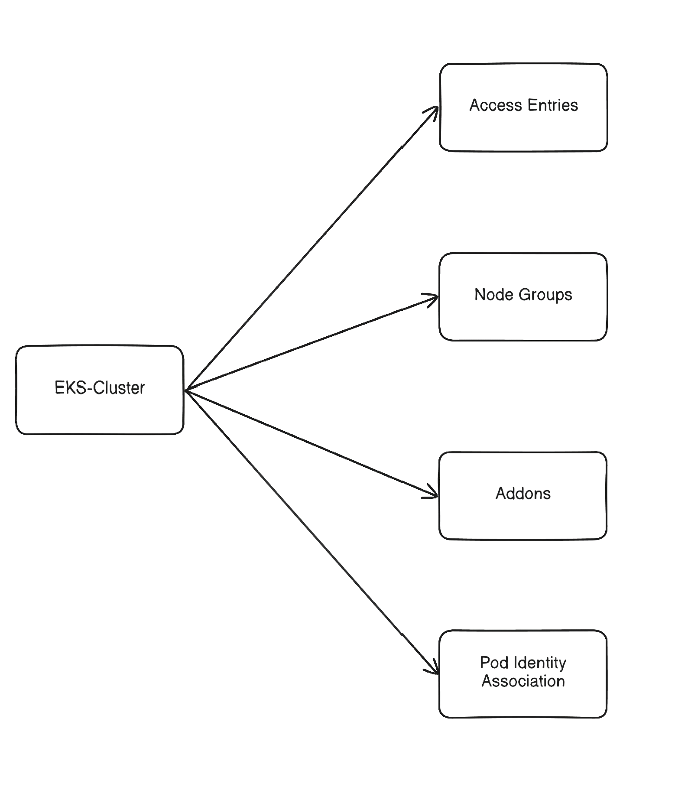

## 🌯 Introduction

작년 여름에 K-DT에서 Amazon EKS를 쓴 경험이 있는데, 내가 클러스터를 구축하고 관리하지는 않았었다. \
이번 프로젝트에서는 AWS에 대한 전권을 내가 쥐고 있어서, 내가 EKS 클러스터를 구축해야 한다.

처음에는, [terraform-aws-modules/eks/aws](https://registry.terraform.io/modules/terraform-aws-modules/eks/aws/latest) 모듈을 쓰려고 했다. \
그러나, 너무 추상화가 되어있고, 입력 매개변수들이 너무 많아서 이게 어떤 구조인지 이해하기 어려웠다. \
그래서 추상화가 이미 된 모듈을 사용하는 대신, 내가 직접 모듈들을 만들어서 EKS 클러스터를 만들어보기로 했다. \
직접 모듈을 만들면서 각 컴포넌트의 역할을 더 잘 이해할 수 있었다. 

여러 모듈로 구성되어있는데, 의존 관계는 다음과 같다:


## ❓ Amazon EKS?

**Amazon EKS(Elastic Kubernetes Service)** 는 AWS의 관리형 Kubernetes 서비스이다. \
AWS에서 Kubernetes를 운영하면서, Control Plane을 운영하는 것에 대한 복잡도를 줄여준다. 

퍼블릭 클라우드에서 Kubernetes를 운영한다면, 이러한 관리형 서비스를 쓰는 것이 직접 클라우드 VM위에서 띄우는 것보다 좋은 선택이다. \
운영 복잡도를 줄이고, 클라우드 플랫폼에서의 통합 기능을 강력하게 이용할 수 있다.

주된 이점들은 다음과 같다:
- Control Plane운영 자동화
- Worker Node의 확장 및 관리
- VPC, 보안그룹, LB, CNI등의 네트워크 설정
- IAM, CloudWatch, EBS등 통합

### EKS Standard vs Auto Mode

Amazon EKS 는 두 가지의 주요 옵션이 있다:
- **EKS Standard**
    - AWS 는 Control Plane만 관리
    - 직접 클러스터 컴포넌트에 대한 운영 필요
        - node groups, addons 등
- **EKS Auto Mode**
    - AWS가 여러 운영 기능들을 자동 지원
    - 추가 비용이 발생할 수 있음


여기서는 **EKS Standard**를 쓰는데, 추가 비용이 내기 싫은 것도 있고, 직접 관리하기를 원하기 때문이다. \
프로젝트에는 학습 목적도 있기에, Auto Mode등의 기능은 쓰지 않는 것이 더 도움될 듯 하기도 하다.

---
## 🧀 EKS Cluster

이 모듈은 코어 EKS control plane을 생성한다. \
클러스터 자체와 control plane에 필요한 IAM role, 그리고 Kubernetes API에 대한 접근제어 등을 정의한다. \
Public API 노출과 Private API노출을 토글가능하게 만들었으며, 이외에도 로깅 설정이나 Auto Mode비활성화 등의 설정이 들어있다.

### `main.tf`

메인 리소스는 `aws_eks_cluster` 인데, EKS control plane을 생성한다.

**Private mode**를 설정가능하게 만들어서, Public Access 또는 Private Access를 전환할 수 있으며, Private인경우 bastion host가 접속할 수 있도록 VPC cidr로부터 보안그룹을 허용해주고 있다. 

`access_config`에서는, `authentication_mode = "API"`를 써서, `aws-auth` ConfigMap를 이용한 구형 인증방식 대신 새로운 인증방식을 사용하도록 했다.

이 모듈은 또한 Control Plane에 필요한 IAM role도 생성하여, 클러스터 작업을 할 수 있도록 해준다.

기본적으로, **EKS cluster는 ETCD암호화를 제공한다.** \
컴플라이언스 등으로 인해서**CMK(Customer Managed Key)** 를 원한다면, `encryption_config` 블록을 이용할 수 있다. \
[여기](https://registry.terraform.io/providers/hashicorp/aws/latest/docs/resources/eks_cluster#encryption_config) 에서 세부 정보를 확인가능하다.

```hcl
resource "aws_security_group" "eks_control_plane_access" {
  count = var.private_mode ? 1 : 0

  name        = "${var.cluster_name}-eks-control-plane-access"
  description = "Allow bastion to reach EKS private API"
  vpc_id      = var.vpc_id
}

resource "aws_vpc_security_group_ingress_rule" "eks_api_from_vpc" {
  count = var.private_mode ? 1 : 0

  security_group_id = aws_security_group.eks_control_plane_access[0].id
  cidr_ipv4         = var.vpc_cidr
  ip_protocol       = "tcp"
  from_port         = 443
  to_port           = 443
}
resource "aws_eks_cluster" "eks" {
  name = var.cluster_name

  access_config {
    authentication_mode = "API"
  }

  role_arn                      = aws_iam_role.eks.arn
  version                       = var.kubernetes_version
  bootstrap_self_managed_addons = var.bootstrap_self_managed_addons
  enabled_cluster_log_types     = var.enabled_cluster_log_types

  vpc_config {
    subnet_ids              = var.subnet_ids
    endpoint_public_access  = !var.private_mode
    endpoint_private_access = var.private_mode

    security_group_ids = aws_security_group.eks_control_plane_access[*].id
  }

  # Disable Auto-Mode
  compute_config {
    enabled = false
  }

  control_plane_scaling_config {
    tier = var.cp_scaling_tier
  }

  upgrade_policy {
    support_type = "STANDARD"
  }

  depends_on = [aws_iam_role_policy_attachment.cluster_AmazonEKSClusterPolicy]

}

# IAM Role for Contorl Plane
resource "aws_iam_role" "eks" {
  name = "${var.cluster_name}-role"
  assume_role_policy = jsonencode({
    Version = "2012-10-17"
    Statement = [
      {
        Action = [
          "sts:AssumeRole",
          "sts:TagSession"
        ]
        Effect = "Allow"
        Principal = {
          Service = "eks.amazonaws.com"
        }
      },
    ]
  })
}

resource "aws_iam_role_policy_attachment" "cluster_AmazonEKSClusterPolicy" {
  policy_arn = "arn:aws:iam::aws:policy/AmazonEKSClusterPolicy"
  role       = aws_iam_role.eks.name
}

```

### `variables.tf`

```hcl
variable "cluster_name" {
  description = "EKS cluster name"
  type        = string
}

variable "kubernetes_version" {
  description = "EKS version"
  type        = string
}

variable "bootstrap_self_managed_addons" {
  description = "Wheter to Enable VPC CNI and kube-proxy"
  type        = bool
  default     = true
}

variable "vpc_id" {
  description = "VPC ID"
  type        = string
}

variable "vpc_cidr" {
  description = "VPC CIDR Block"
  type        = string
}

variable "subnet_ids" {
  description = "Subnet IDs"
  type        = list(string)
}

variable "private_mode" {
  description = "Enable EKS private access"
  type        = string
}

variable "cp_scaling_tier" {
  description = "Scaling tier for Control Plane"
  type        = string
  default     = "standard"
}

variable "enabled_cluster_log_types" {
  type    = set(string)
  default = []
  validation {
    condition = alltrue([
      for t in var.enabled_cluster_log_types :
      contains(["api", "audit", "authenticator", "controllerManager", "scheduler"], t)
    ])
    error_message = "enabled_cluster_log_types must contain only valid EKS control plane log types."
  }
}
```

### `outputs.tf`

기본적으로, 클러스터의 보안그룹이 생성된다. \
`vpc_config`블록 안에서 `cluster_security_group_id`라는 attribute를 가진다.
더 자세한 내용은 [여기](https://docs.aws.amazon.com/eks/latest/userguide/sec-group-reqs.html)에서 볼 수 있다.

```hcl
output "cluster_name" {
  value = aws_eks_cluster.eks.name
}

output "endpoint" {
  value = aws_eks_cluster.eks.endpoint
}

output "ca_certificate" {
  value = aws_eks_cluster.eks.certificate_authority[0].data
}

output "arn" {
  value = aws_eks_cluster.eks.arn
}

output "cluster_security_group_id" {
  value = aws_eks_cluster.eks.vpc_config[0].cluster_security_group_id
}
```

---
## 🔑 Access Entries

클러스터가 `authentication_mode = "API"`를 쓰기에, 클러스터의 액세스는 `aws-auth` ConfigMap 대신 access entries를 이용한다.

둘의 큰 차이는 어디에서 액세스가 관리되느냐이다. \
`aws-auth`는 IAM-Kubernetes의 매핑이 클러스터 내부 ConfigMap에 저장되어있다. \
Access entries는 AWS의 영역에서 관리된다. \
새로운 모델이 더 선호되는데, IaC친화적이며, 관리 모델이 더 단순하고 깔끔하기 때문이다.

IAM user를 이용하는 것보다, IAM role을 assume하여 클러스터에 접근하는 것이 더 권장되는 패턴이다. \
즉, 엔지니어가 role을 assume하여 클러스터에 해당 role로써 접근하는 것이다. \
IAM role은 임시 자격증명을 이용한 방식이기에, IAM user보다 더 안전한 패턴이다. \
또한, 운영의 관점에서도, role을 기반으로 인증하는 것이 더 자연스러운 접근이다. \
IAM user가 IAM role을 assume하기 위해서는, `"sts:AssumeRole"` action을 해당 role에 대해 할 수 있어야 하며, 그 role은 trust policy로 해당 IAM user가 assume하는것을 허용해야 한다. 

하나 짚고 가야하는건, **EKS access entries가 Kubernetes RBAC를 대체하는 것은 아니라는 것이다.** \
Access Entries는 IAM principal이 클러스터에 접근할 수 있는지에 대한 것만 판단하고, Kubernetes RBAC는 해당 API작업을 할 수 있는지를 더 세부적으로 정한다. \
즉, 두 개의 계층이 함께 동작한다. \
이 모듈에서는 `kubernetes_group`라는 옵셔널한 필드가 있는데, 여기에 access entry가 kubernetes내부에서 어떤 그룹에 속하는지를 정할 수 있다. \
더 많은 정보는 [여기](https://www.eksworkshop.com/docs/security/cluster-access-management/kubernetes-rbac/)에서 볼 수 있다.

이 모듈은 두 개의 리소스로 구성된다:
- `aws_eks_access_entry`, IAM principal을 EKS에 entry로 등록한다.
- `aws_eks_access_policy_association`, 액세스 정책을 entry에 붙일 수 있다.
    - 여기서의 액세스 정책은 RBAC와는 다른 EKS수준에서의 접근제어이다. 대략적인 접근제어가 가능하지만, RBAC만큼 정교하지는 못하다.

### `main.tf`

`aws_eks_access_entry` 리소스는 하나의 IAM principal을 eks에 entry로 등록한다. \
이후, `aws_eks_access_policy_association` 리소스는 map형태로 입력받아서, 여러 개의 policy를 추가할 수 있도록 설정하였다. 

각 policy association 은 또한 access scope도 존재하는데, 클러스터 레벨 또는 namespace에 대해 접근 권한을 할당받을 수 있도록 되어있다.

```hcl
resource "aws_eks_access_entry" "access" {
  cluster_name  = var.cluster_name
  principal_arn = var.principal_arn
  kubernetes_groups = var.kubernetes_groups
}

resource "aws_eks_access_policy_association" "access" {
  for_each = var.eks_access_policy_association

  cluster_name  = var.cluster_name
  principal_arn = var.principal_arn
  policy_arn    = each.value.policy_arn

  access_scope {
    type       = each.value.access_scope_type
    namespaces = each.value.namespaces
  }
}
```

### `variables.tf`

```hcl
variable "cluster_name" {
  description = "EKS cluster name"
  type        = string
}

variable "principal_arn" {
  description = "IAM role ARN registering access policy"
  type        = string
}

variable "kubernetes_groups" {
  description = "List of Kubernetes groups to assign to the principal"
  type        = list(string)
  default     = []
}

variable "eks_access_policy_association" {
  type = map(object({
    policy_arn        = string
    access_scope_type = string
    namespaces        = optional(list(string))
  }))
  default = {}
  validation {
    condition = alltrue([
      for t in var.eks_access_policy_association :
      contains(["namespace", "cluster"], t.access_scope_type)
    ])
    error_message = "eks_access_policy_association must contain only 'namespace' or 'cluster'"
  }
}
```

---
## 👪 Node Groups

EKS managed 노드 그룹은 워커 노드들의 프로비저닝과 생명 주기 관리를 자동화한다.

이 모듈은 여러 입력 변수들이 존재하는데, 인스턴스 타입이나 스케일링 제한, label, taint 등의 다양한 구성이 가능하도록 해야 하기 때문이다. 

워커 노드들은 role과 AWS권한들이 일부 요구된다. \
최소한으로, `AmazonEKSWorkerNodePolicy`, `AmazonEC2ContainerRegistryPullOnly` 가 있어야 EKS Control Plane에 연결될 수 있으며, ECR에서 이미지를 불러온다.

### `main.tf`

코어 리소스는 `aws_eks_node_group`이다.

`labels`과 `taints`를 변수화하여 스케줄링 옵션에서 사용할 수 있도록 하였다. \
예를 들어, 다른 애플리케이션들은 SPOT노드그룹에 올리더라도, 다른 운영 도구들은 ONDEMAND 인스턴스인 노드그룹에 올릴 수 있다.

`desired_size`는 상태 비교에서 무시되는데, 만약 추가 scale이 된경우에는 무시하여 설정 드리프트로 인식하지 않게 하기 위함이다.


```hcl
resource "aws_eks_node_group" "ng" {
  cluster_name    = var.cluster_name
  node_group_name = var.node_group_name
  node_role_arn   = aws_iam_role.ng.arn

  ami_type       = var.ami_type
  instance_types = var.instance_types
  subnet_ids     = var.subnet_ids
  capacity_type  = var.capacity_type
  disk_size      = var.disk_size

  scaling_config {
    desired_size = var.scaling.desired_size
    min_size     = var.scaling.min_size
    max_size     = var.scaling.max_size
  }

  labels = var.labels

  dynamic "taint" {
    for_each = var.taints
    content {
      key    = taint.value.key
      value  = taint.value.value
      effect = taint.value.effect
    }
  }

  lifecycle {
    ignore_changes = [scaling_config[0].desired_size]
  }

  depends_on = [aws_iam_role_policy_attachment.ng_attachment]
}

resource "aws_iam_role" "ng" {
  name = "${var.node_group_name}-role"

  assume_role_policy = jsonencode({
    Version = "2012-10-17"
    Statement = [{
      Action = "sts:AssumeRole"
      Effect = "Allow"
      Principal = {
        Service = "ec2.amazonaws.com"
      }
    }]
  })
}

resource "aws_iam_role_policy_attachment" "ng_attachment" {
  for_each = var.role_policy_attachment

  policy_arn = each.value
  role       = aws_iam_role.ng.name
}
```

### `variables.tf`

```hcl
variable "cluster_name" {
  description = "Name of EKS Cluster"
  type        = string
}

variable "node_group_name" {
  description = "Name of node group"
  type        = string
}

variable "subnet_ids" {
  description = "ID list of subnet"
  type        = list(string)
}

variable "ami_type" {
  description = "Type of AMI"
  type        = string
  validation {
    condition = contains([
      "AL2_x86_64", "AL2_x86_64_GPU", "AL2_ARM_64", "CUSTOM",
      "BOTTLEROCKET_ARM_64", "BOTTLEROCKET_x86_64",
      "BOTTLEROCKET_ARM_64_FIPS", "BOTTLEROCKET_x86_64_FIPS",
      "BOTTLEROCKET_ARM_64_NVIDIA", "BOTTLEROCKET_x86_64_NVIDIA",
      "BOTTLEROCKET_ARM_64_NVIDIA_FIPS", "BOTTLEROCKET_x86_64_NVIDIA_FIPS",
      "WINDOWS_CORE_2019_x86_64", "WINDOWS_FULL_2019_x86_64",
      "WINDOWS_CORE_2022_x86_64", "WINDOWS_FULL_2022_x86_64",
      "WINDOWS_CORE_2025_x86_64", "WINDOWS_FULL_2025_x86_64",
      "AL2023_x86_64_STANDARD", "AL2023_ARM_64_STANDARD",
      "AL2023_x86_64_NEURON", "AL2023_x86_64_NVIDIA", "AL2023_ARM_64_NVIDIA"
    ], var.ami_type)
    error_message = "amiType does not match. check: https://docs.aws.amazon.com/eks/latest/APIReference/API_Nodegroup.html#AmazonEKS-Type-Nodegroup-amiType"
  }
}

variable "instance_types" {
  description = "List of instance type"
  type        = list(string)
}

variable "capacity_type" {
  description = "Node Capacity Type"
  type        = string
  validation {
    condition     = contains(["ON_DEMAND", "SPOT"], var.capacity_type)
    error_message = "Valid value: <ON_DEMAND | SPOT>"
  }
}

variable "disk_size" {
  description = "Disk size for each worker node"
  type        = number
  default     = 20
}

variable "scaling" {
  description = "Scaling Capacity"
  type = object({
    desired_size = number
    min_size     = number
    max_size     = number
  })
}

variable "labels" {
  description = "Node labels"
  type        = map(string)
}

variable "taints" {
  description = "Taints for rule"
  type = map(object({
    key    = string
    value  = optional(string)
    effect = string
  }))

  validation {
    condition = alltrue([
      for _, v in var.taints :
      contains(["NO_SCHEDULE", "NO_EXECUTE", "PREFER_NO_SCHEDULE"], v.effect)
    ])
    error_message = "Valid effect: <NO_SCHEDULE | NO_EXECUTE | PREFER_NO_SCHEDULE>"
  }
}

variable "role_policy_attachment" {
  description = "Role policies to attach nodes"
  type        = set(string)
  default     = []
}
```

---
## 📲 Addons

EKS의 다른 부분들과는 다르게, 애드온들은 상대적으로 간단하다. \
`aws_eks_addon` 리소스 하나로 되어서 굳이 모듈화할 필요는 없을 수 있지만, 일관된 형태를 위해 여기서는 모듈화하였다.

### `main.tf`

```hcl
resource "aws_eks_addon" "addon" {
  cluster_name = var.cluster_name
  addon_name   = var.addon_name
}
```

### `variables.tf`
```hcl
variable "cluster_name" {
  description = "Name of EKS Cluster"
  type        = string
}

variable "addon_name" {
  description = "Name of Addon"
  type        = string
}
```

---
## ⛓️ Pod Identity Associations

**EKS Pod Identity** 는 Pod가 AWS 서비스를 IAM role을 할당받을 수 있도록 한다. \
EC2 instance profile가 EC2 instance에게 자격증명을 부여하는 것과 비슷하게 동작하는데, 단위가 Kubernetes의 워크로드인 Pod인 것이다.

Worker Node와는 별도의 IAM role을 사용하여 실제 필요한 권한만 최소한으로 할당하도록 할 수 있다.

### `main.tf`
우선, Pod에 할당한 IAM role을 만들어준다. \
이후, AWS 서비스를 사용하기 위한 IAM Policy를 적절히 할당해준다. \
마지막으로, pod identity association자원을 생성하여 IAM role이 namespace내부의 특정 serviceAccount에 할당되도록 한다. \
Pod identity agent라는 daemonset이 클러스터 내부에서 동작하며, Pod에 임시 자격증명을 전달한다.

```hcl
resource "aws_iam_role" "pod" {
  name = var.role_name

  assume_role_policy = jsonencode({
    Version = "2012-10-17"
    Statement = [
      {
        Effect = "Allow"
        Principal = {
          Service = "pods.eks.amazonaws.com"
        }
        Action = [
          "sts:AssumeRole",
          "sts:TagSession"
        ]
      }
    ]
  })
}

resource "aws_iam_role_policy_attachment" "pod" {
  role       = aws_iam_role.pod.name
  policy_arn = var.policy_arn
}

resource "aws_eks_pod_identity_association" "association" {
  cluster_name    = var.cluster_name
  namespace       = var.namespace
  service_account = var.service_account
  role_arn        = aws_iam_role.pod.arn
}
```

### `variables.tf`

```hcl
variable "cluster_name" {
  description = "Name of EKS Cluster"
  type        = string
}

variable "role_name" {
  description = "IAM role name to assign pod"
  type        = string
}

variable "policy_arn" {
  description = "IAM policy arn"
  type        = string
}

variable "namespace" {
  description = "Kubernetes namespace"
  type        = string
}

variable "service_account" {
  description = "Name of serviceAccount"
  type        = string
}
```

---
## 🚪 (Optional) Bastion Host

Private API로 EKS를 노출한다면, 퍼블릭 인터넷으로는 접근할 수 없다. \
즉, 같은 VPC에서 관리를 할 수 있는 bastion host가 필요하다. 

Bastion host만이 정답은 아니다. 다른 옵션들 역시 존재한다. \
Client VPN이나 Site-to-Site VPN등의 옵션도 있지만, 비용의 측면에서도 부담스러우며, 및 소규모 팀에서 쓰기에는 부적절하다고 생각되었다. \
그래서 EC2 bastion host를 만들어서 AWS SSM을 이용한 접근으로 클러스터를 관리할 수 있는 워크스테이션을 만드는 것을 선택했다. 

### `main.tf`

이 모듈은 작은 EC2인스턴스를 생성한다. 

대신, ssh기반의 접속이 아닌, SSM으로 외부 인터넷 노출 포트 없이 더 안전하다. \
또한, SSH키의 관리와 추가 보안그룹 규칙 관리 등의 부담도 없어진다. 

`eks:DescribeCluster` 를 실행할 수 있도록 IAM policy를 할당해준다. \
`aws eks update-kubeconfig` 를 통해서 kuberntes api에 접근할 수 있게 된다.


```hcl
data "aws_ami" "ubuntu" {
  most_recent = true

  filter {
    name   = "name"
    values = ["ubuntu/images/hvm-ssd-gp3/ubuntu-noble-24.04-arm64-server-*"]
  }

  filter {
    name   = "virtualization-type"
    values = ["hvm"]
  }

  owners = ["099720109477"] # Canonical
}

resource "aws_security_group" "bastion" {
  name        = "bastion_ssm"
  description = "Deny inbound traffic and allow outbound traffic"
  vpc_id      = var.vpc_id
}

resource "aws_vpc_security_group_egress_rule" "bastion_internet" {
  security_group_id = aws_security_group.bastion.id

  cidr_ipv4   = "0.0.0.0/0"
  from_port   = 443
  ip_protocol = "tcp"
  to_port     = 443
}

resource "aws_iam_instance_profile" "ssm" {
  name = "${var.name}-profile"
  role = aws_iam_role.bastion.id
}

resource "aws_instance" "bastion" {
  ami           = data.aws_ami.ubuntu.id
  instance_type = var.instance_type

  subnet_id                   = var.subnet_id
  vpc_security_group_ids      = [aws_security_group.bastion.id]
  associate_public_ip_address = var.associate_public_ip_address

  iam_instance_profile = aws_iam_instance_profile.ssm.name

  metadata_options {
    http_tokens = "required"
  }

  root_block_device {
    encrypted   = true
    volume_type = "gp3"
  }

  user_data                   = file("${path.module}/user_data.sh")
  user_data_replace_on_change = true

  tags = {
    Name = var.name
  }
}

resource "aws_iam_role" "bastion" {
  name = var.name
  path = "/"
  assume_role_policy = jsonencode({
    Version = "2012-10-17"
    Statement = [
      {
        Sid    = "AllowEC2SSM"
        Effect = "Allow"
        Action = [
          "sts:AssumeRole"
        ]
        Principal = {
          Service = "ec2.amazonaws.com"
        }
      }
    ]
  })

  tags = {
    Purpose = "Bastion"
  }
}

resource "aws_iam_role_policy_attachment" "bastion_ssm" {
  role       = aws_iam_role.bastion.name
  policy_arn = "arn:aws:iam::aws:policy/AmazonSSMManagedInstanceCore"
}

data "aws_iam_policy_document" "bastion_access_eks" {
  statement {
    sid = "AllowEKStoBastion"
    actions = [
      "eks:DescribeCluster"
    ]
    resources = [
      var.eks_arn
    ]
  }
}

resource "aws_iam_policy" "bastion_access_eks" {
  name   = "${var.name}-access-eks"
  path   = "/"
  policy = data.aws_iam_policy_document.bastion_access_eks.json
}

resource "aws_iam_role_policy_attachment" "bastion_access_eks" {
  role       = aws_iam_role.bastion.name
  policy_arn = aws_iam_policy.bastion_access_eks.arn
}
```

### `user_data.sh`

인프라 도구들을 미리 설치시키고, 쉘 설정들도 일부 넣어준다. \
이 스크립트를 통해 bastion host가 VPC내부의 워크스테이션이 되게 해준다.

```bash
#!/usr/bin/env bash
set -euo pipefail

export DEBIAN_FRONTEND=noninteractive

apt-get update
apt-get upgrade -y

apt-get install -y apt-transport-https ca-certificates curl gnupg unzip

# kubectl
mkdir -p /etc/apt/keyrings
curl -fsSL https://pkgs.k8s.io/core:/stable:/v1.35/deb/Release.key |
    gpg --dearmor -o /etc/apt/keyrings/kubernetes-apt-keyring.gpg
echo 'deb [signed-by=/etc/apt/keyrings/kubernetes-apt-keyring.gpg] https://pkgs.k8s.io/core:/stable:/v1.35/deb/ /' \
    >/etc/apt/sources.list.d/kubernetes.list
apt-get update
apt-get install -y kubectl

# OpenTofu
install -m 0755 -d /etc/apt/keyrings
curl -fsSL https://get.opentofu.org/opentofu.gpg | tee /etc/apt/keyrings/opentofu.gpg >/dev/null
curl -fsSL https://packages.opentofu.org/opentofu/tofu/gpgkey | gpg --dearmor -o /etc/apt/keyrings/opentofu-repo.gpg
chmod a+r /etc/apt/keyrings/opentofu.gpg /etc/apt/keyrings/opentofu-repo.gpg

cat >/etc/apt/sources.list.d/opentofu.list <<'EOF'
deb [signed-by=/etc/apt/keyrings/opentofu.gpg,/etc/apt/keyrings/opentofu-repo.gpg] https://packages.opentofu.org/opentofu/tofu/any/ any main
deb-src [signed-by=/etc/apt/keyrings/opentofu.gpg,/etc/apt/keyrings/opentofu-repo.gpg] https://packages.opentofu.org/opentofu/tofu/any/ any main
EOF

apt-get update
apt-get install -y tofu

ARCH="$(uname -m)"

case "$ARCH" in
x86_64)
    AWSCLI_URL="https://awscli.amazonaws.com/awscli-exe-linux-x86_64.zip"
    ;;
aarch64 | arm64)
    AWSCLI_URL="https://awscli.amazonaws.com/awscli-exe-linux-aarch64.zip"
    ;;
*)
    echo "Unsupported architecture: $ARCH"
    exit 1
    ;;
esac

curl -fsSL "$AWSCLI_URL" -o "awscliv2.zip"
unzip -o awscliv2.zip
./aws/install

# SSM Agent
snap install amazon-ssm-agent --classic || true
systemctl enable snap.amazon-ssm-agent.amazon-ssm-agent.service || true
systemctl restart snap.amazon-ssm-agent.amazon-ssm-agent.service || true

# Shell
curl -fsSL https://starship.rs/install.sh | sh -s -- -y

cat <<'EOF' >>/home/ubuntu/.bashrc
eval "$(starship init bash)"
alias k='kubectl'
EOF

chown ubuntu:ubuntu /home/ubuntu/.bashrc
``````

### `variables.tf`

```hcl
variable "name" {
  description = "Name of the instance"
  type        = string
}

variable "vpc_id" {
  description = "VPC ID"
  type        = string
}

variable "subnet_id" {
  description = "Subnet ID"
  type        = string
}

variable "instance_type" {
  description = "EC2 Instance Type"
  type        = string
  default     = "t4g.nano"
}

variable "eks_arn" {
  description = "EKS Arn"
  type        = string
}

variable "associate_public_ip_address" {
  description = "Associate public IP address"
  type        = bool
}
```

### `outputs.tf`

```hcl
output "bastion_id" {
  value = aws_instance.bastion.id
}

output "bastion_role_arn" {
  value = aws_iam_role.bastion.arn
}
```


---
## 🚀 Modules 사용하기

아래는 모듈의 사용 예시이다.
```hcl
##########
# locals #
##########
locals {
  vpc_cidr = "10.0.0.0/16"

  # Enable/disable EKS private access
  eks_private_mode = true

  # EKS Addon list
  eks_addons = toset([
    "coredns",
    "kube-proxy",
    "vpc-cni",
    "aws-ebs-csi-driver",
    "eks-pod-identity-agent",
  ])

  # Pod identity associations
  pod_identity_associations = {
    vpc_cni = {
      role_name       = "${var.cluster_name}-vpc-cni"
      policy_arn      = "arn:aws:iam::aws:policy/AmazonEKS_CNI_Policy"
      namespace       = "kube-system"
      service_account = "aws-node"
    }
    ebs_csi = {
      role_name       = "${var.cluster_name}-ebs-csi"
      policy_arn      = "arn:aws:iam::aws:policy/service-role/AmazonEBSCSIDriverPolicy"
      namespace       = "kube-system"
      service_account = "ebs-csi-controller-sa"
    }
  }
}

########################################################
# EKS - Cluster                                        #
#                                                      #
# NOTE:                                                #
# By default, EKS secrets are protected with enveloped #
# encryption in EKS version 1.28 or higher             #
########################################################
module "eks_cluster" {
  source = "../../../modules/eks-cluster"

  cluster_name       = var.cluster_name
  kubernetes_version = "1.35"
  vpc_id             = module.vpc.vpc_id
  vpc_cidr           = local.vpc_cidr
  subnet_ids         = module.vpc.private_subnet_ids
  private_mode       = local.eks_private_mode

  enabled_cluster_log_types = []
  cp_scaling_tier           = "standard"
}

######################
# EKS - Access Entry #
######################
module "eks_access_entry_private" {
  count  = local.eks_private_mode ? 1 : 0
  source = "../../../modules/eks-access-entry"

  # Use module output instead of var.cluter_name because of the dependency implication.
  cluster_name  = module.eks_cluster.cluster_name
  principal_arn = module.bastion[0].bastion_role_arn

  eks_access_policy_association = {
    clusteradmin = {
      policy_arn        = "arn:aws:eks::aws:cluster-access-policy/AmazonEKSClusterAdminPolicy"
      access_scope_type = "cluster"
    }
  }
}

module "eks_access_entry_public" {
  count  = local.eks_private_mode ? 0 : 1
  source = "../../../modules/eks-access-entry"

  cluster_name  = module.eks_cluster.cluster_name
  principal_arn = data.terraform_remote_state.shared.outputs.eks_fullaccess_role_arn

  eks_access_policy_association = {
    clusteradmin = {
      policy_arn        = "arn:aws:eks::aws:cluster-access-policy/AmazonEKSClusterAdminPolicy"
      access_scope_type = "cluster"
    }
  }
}

#####################################
# EKS - Node Group                  #
# Desired Node group size is ignored #
# when comparing the state           #
#####################################
module "eks_node_group" {
  source = "../../../modules/eks-node-group"

  cluster_name    = module.eks_cluster.cluster_name
  node_group_name = "${var.cluster_name}-ng"

  ami_type       = "AL2023_ARM_64_STANDARD"
  subnet_ids     = module.vpc.private_subnet_ids
  instance_types = ["t4g.large"]

  capacity_type = "ON_DEMAND"
  disk_size     = 20

  scaling = {
    desired_size = 2
    min_size     = 2
    max_size     = 4
  }

  labels = {
    NodeGroupName = "default"
  }

  taints = {}

  # Role policy Attachment
  role_policy_attachment = [
    "arn:aws:iam::aws:policy/AmazonEKSWorkerNodePolicy",
    "arn:aws:iam::aws:policy/AmazonEC2ContainerRegistryPullOnly"
  ]
}

################
# EKS - Addons #
################
module "eks-addons" {
  source   = "../../../modules/eks-addons"
  for_each = local.eks_addons

  cluster_name = module.eks_cluster.cluster_name
  addon_name   = each.value
}


###################################
# EKS - Pod identity associations #
###################################
module "pod_identity_association" {
  source   = "../../../modules/eks-pod-identity-association"
  for_each = local.pod_identity_associations

  cluster_name    = module.eks_cluster.cluster_name
  role_name       = each.value.role_name
  policy_arn      = each.value.policy_arn
  namespace       = each.value.namespace
  service_account = each.value.service_account
}

################
# Bastion Host #
################
module "bastion" {
  count  = local.eks_private_mode ? 1 : 0
  source = "../../../modules/ec2-ssm-bastion"

  name                        = "bastion-prod"
  vpc_id                      = module.vpc.vpc_id
  subnet_id                   = module.vpc.private_subnet_ids[0]
  instance_type               = "t4g.nano"
  eks_arn                     = module.eks_cluster.arn
  associate_public_ip_address = false
}
```

---
## 🪪 EKS Cluster에 접속

EKS가 퍼블릭 API를 노출한다면, kubeconfig를 업데이트하여 로컬 환경에서 바로 접근할 수 있다.

```bash
# Add --role-arn <role-arn> if you need to assume a role
aws eks update-kubeconfig --region <region> --name <cluster-name>
```

클러스터가 private mode에서 돌아간다면, ssm으로 bastion host에 들어가는 것이 먼저이다.
```bash
aws ssm start-session --target <instance-id>
```

이후, 안에서 kubeconfig를 업데이트해주면 된다.

---
## ➡️ 더 해야 할 일들

EKS 클러스터를 프로비저닝 하는 것은 이제 시작일 뿐이다. \
클러스터 내부에 운영을 위해 더 설치를 고려해야 하는 것들이 더 많다:

예를 들면, 아래와 같다:
- **ArgoCD** 를 통한 GitOps
- **cert-manager** 를 통한 TLS연결
- **AWS Load Balancer Controller** 를 통한 Load Balancer연동
- **Karpenter** 를 통한 노드 오토스케일링
- **Gateway API CRD** 
- **관찰성(Observability) 스택**
- 이외 더 많은 운영 도구들

[AWS EKS Capabilities](https://docs.aws.amazon.com/eks/latest/userguide/capabilities.html)를 고려할 수도 있다.

---
## 📚 References

- [Terraform Registry - Hashicorp/AWS](https://registry.terraform.io/providers/hashicorp/aws/latest)
- [AWS Documents - What is EKS](https://docs.amazonaws.cn/en_us/eks/latest/userguide/what-is-eks.html)
- [AWS Documents - Default envelope encryption for all Kubernetes API Data](https://docs.aws.amazon.com/eks/latest/userguide/envelope-encryption.html)
- [AWS Documents - Access Entries](https://docs.aws.amazon.com/eks/latest/userguide/access-entries.html)
- [AWS Documents - Managed node groups](https://docs.aws.amazon.com/eks/latest/userguide/managed-node-groups.html)
- [AWS Documents - Create node role](https://docs.aws.amazon.com/eks/latest/userguide/create-node-role.html)
- [AWS Documents - Pod Identity](https://docs.aws.amazon.com/eks/latest/userguide/pod-identities.html)
- [Medium - Secure EC2 Access Using AWS SSM](https://medium.com/@rratan100/secure-ec2-access-using-aws-systems-manager-ssm-a-beginners-guide-a49a7923b3d4)
- [AWS re:Post - How do I create Amazon VPC endpoints so that I can use Systems Manager to manage private Amazon EC2 instances without internet access?](https://repost.aws/knowledge-center/ec2-systems-manager-vpc-endpoints)
