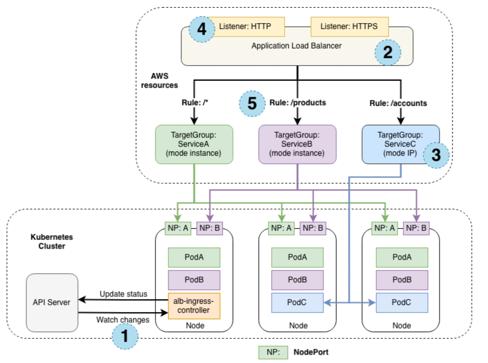
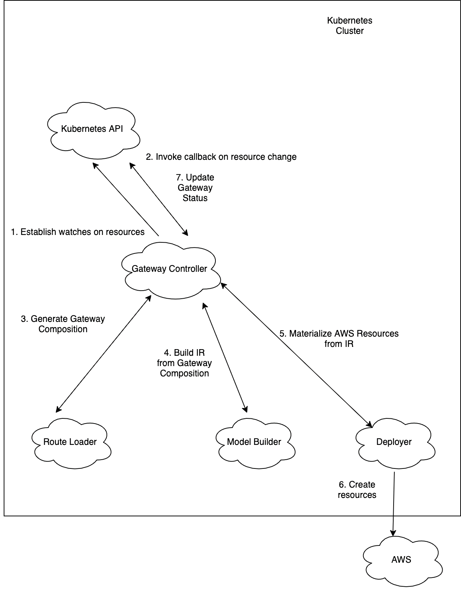
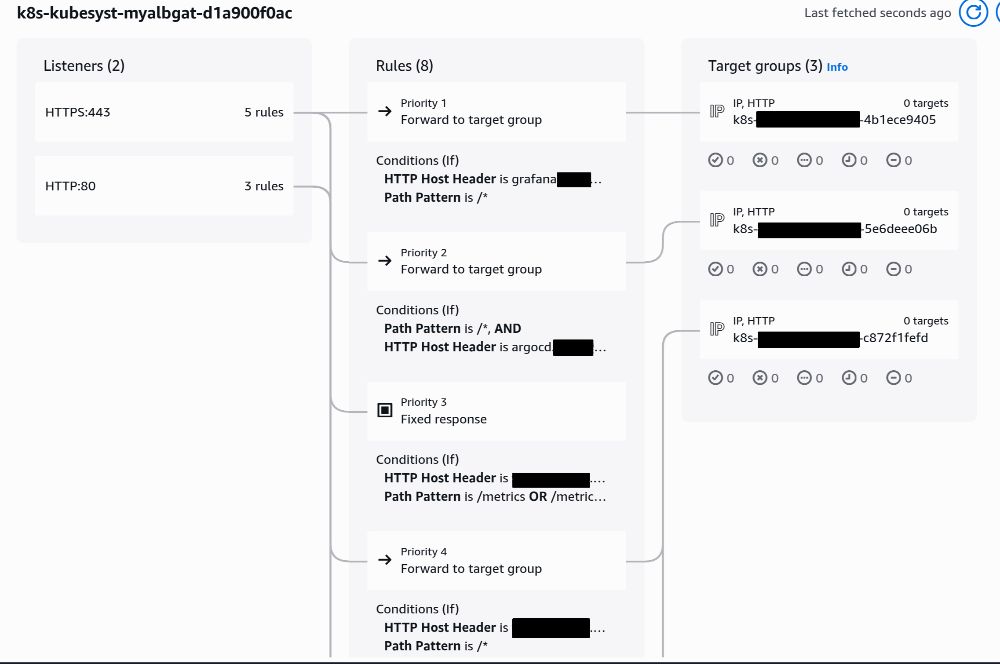
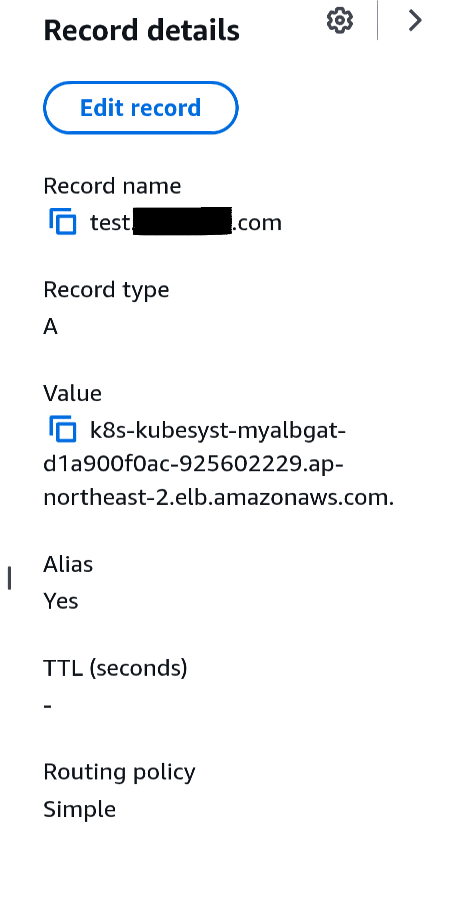
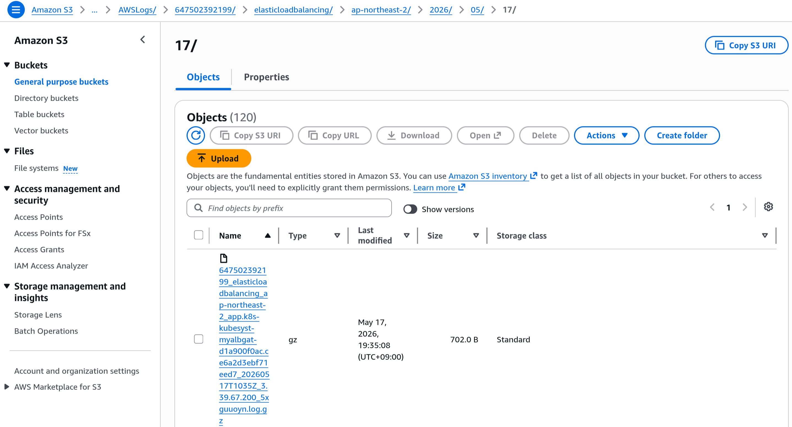

AWS Load Balancer Controller lets you manage Elastic Load Balancers in Kubernetes environments. \
It supports resource types such as Ingress and `LoadBalancer`, and on AWS it can provision Application Load Balancers, Network Load Balancers, and Classic Load Balancers.

---
## ⚙️ How It Works

### For Ingress

#### Reconciliation Flow



For a single Ingress resource, the controller behaves as follows:

1. The controller watches Ingress events from the API server. \
   If the conditions are met, it starts creating AWS resources.
2. An ALB is created for the new Ingress resource. \
   It can be either internet-facing or internal.
3. AWS creates target groups based on the Ingress resource.
4. Listeners are created for the configured ports. By default, ports 80 or 443 are used. \
   You can also attach certificates through annotations.
5. Rules are created from the Ingress definition. \
   Traffic is then routed to the appropriate Kubernetes Service.

The Load Balancer Controller also performs the following tasks:
- Removes related AWS resources when an Ingress is deleted in Kubernetes
- Updates AWS resources when an Ingress changes
- Reconstructs and reconciles related AWS resources after the controller restarts

#### Traffic Handling

The Load Balancer Controller supports two traffic modes:
- **Instance mode (default):** The ALB sends traffic to Kubernetes nodes, which then forward it through the Service's NodePort.
- **IP mode:** The ALB sends traffic directly to Kubernetes pods. Your CNI must support direct access to pod IPs.
    - This reduces hops and generally provides better performance.
    - Configure it with the `alb.ingress.kubernetes.io/target-type: ip` annotation.

### For Gateway API



The controller follows a reconciliation loop like this:
1. **API Monitoring**: The controller continuously monitors Gateway API resources through the API server.
2. **Queueing**: Detected resources are added to an internal queue.
3. **Processing**: For each queued item:
    - It checks whether the referenced `GatewayClass` is managed by its controller. In other words, it verifies that `spec.controllerName` in the `GatewayClass` is either `gateway.k8s.aws/alb` or `gateway.k8s.aws/nlb`.
    - Gateway API definitions are mapped to AWS resources such as NLB/ALB listeners, rules, target groups, and add-ons.
    - The mapped resources are compared against the actual AWS state. \
      If the current state differs from the desired state, the controller calls the AWS API to synchronize it.
4. **Status Updates**: After reconciliation, the controller updates the `status` field of the `Gateway` resource. \
   This provides real-time feedback such as the load balancer DNS name, ARN, and whether the Gateway has been accepted and programmed.

> **NOTE: If this is Gateway API, why does it also support NLB?** \
> Gateway API is not limited to L7 routing. It can also replace L4 routing scenarios. \
> In other words, it can serve as an alternative to `type: LoadBalancer`. \
> A single Gateway cannot mix route types from different layers. \
> For example, `HTTPRoute` and `TCPRoute` cannot be used on the same Gateway.
> - L7 Gateway: `HTTPRoute`, `GRPCRoute`
> - L4 Gateway: `TCPRoute`, `UDPRoute`, `TLSRoute`

Gateway API also supports both Instance mode and IP mode.

---
## 🚀 Installing AWS Load Balancer Controller

### Installation with Helm

Add the Helm repository with the following command:
```bash
helm repo add eks https://aws.github.io/eks-charts
```

```bash
helm install aws-load-balancer-controller eks/aws-load-balancer-controller \
  -n kube-system \
  --version 3.33.0 \
  --set clusterName = <cluster_name> \
  --set region = <aws_region> \
  --set vpcId = <vpc_id> \
  --set serviceAccount.create = true \
  --set serviceAccount.name = aws-load-balancer-controller \
  --set controllerConfig.featureGates.ALBGatewayAPI = true # Important: required for ALB Gateway API
```

Or you can define the Helm values in `values.yaml` and install from that:
```yaml
# values.yaml
clusterName: <clutser_name>
region: <aws_region>
vpcId: <vpc_id>

serviceAccount:
  create: true
  name: aws-load-balancer-controller

controllerConfig:
  featureGates:
    ALBGatewayAPI: true
```

```bash
helm install aws-load-balancer-controller eks/aws-load-balancer-controller \
  -n kube-system \
  --version 3.33.0 \
  -f values.yaml
```

### Other useful values

In addition to the Helm values above, you may also want to consider the following:
- `autoscaling`: Adds an HPA for the controller. It can be useful if changes happen frequently.
- `enableWafv2`: Enables integration with AWS WAF v2.
- `enableCertManager`: Lets cert-manager manage the TLS certificates used by the admission webhook.

For more details, refer to [this README](https://github.com/kubernetes-sigs/aws-load-balancer-controller/blob/main/helm/aws-load-balancer-controller/README.md).

---
## 📝 Hands-on Example

We will create an ALB-based Gateway API setup to provide L7 rule-based routing. \
We will attach ACM for TLS termination, apply WAF ACL rules, and enable S3 access logging. \
We will also create a policy that blocks external access to the `/metrics` path.

### Required components

- An EKS cluster
- AWS Load Balancer Controller (see the installation section above)
    - The controller must assume a role through IRSA or Pod Identity with the [IAM policy](https://github.com/kubernetes-sigs/aws-load-balancer-controller/blob/main/docs/install/iam_policy.json) required to access AWS APIs
- The installation manifest from the [Gateway API CRD](https://github.com/kubernetes-sigs/gateway-api)

### Additional components

#### Route53 Hosted Zone, ACM Certificate, and External-DNS

These are listed as additional components, but in practice they are almost mandatory. \
In real environments, you usually do not expose an ALB by itself. You attach a custom domain.

Below is an example Terraform configuration that creates a Route53 hosted zone and issues an ACM certificate. \
If you purchased the domain in the AWS console, the hosted zone may already exist and should then be imported.
```hcl
resource "aws_route53_zone" "main" {
  name = var.root_domain_name
}

resource "aws_acm_certificate" "alb" {
  domain_name               = var.root_domain_name
  subject_alternative_names = var.certificate_subject_alternative_names
  validation_method         = "DNS"

  lifecycle {
    create_before_destroy = true
  }
}

resource "aws_route53_record" "alb_acm_validation" {
  for_each = {
    for dvo in aws_acm_certificate.alb.domain_validation_options :
    dvo.domain_name => {
      name   = dvo.resource_record_name
      record = dvo.resource_record_value
      type   = dvo.resource_record_type
    }
  }

  allow_overwrite = true
  zone_id         = aws_route53_zone.main.zone_id
  name            = each.value.name
  type            = each.value.type
  ttl             = 60
  records         = [each.value.record]
}

resource "aws_acm_certificate_validation" "alb" {
  certificate_arn         = aws_acm_certificate.alb.arn
  validation_record_fqdns = [for record in aws_route53_record.alb_acm_validation : record.fqdn]
}

## Variables
variable "root_domain_name" {
  description = "Primary public DNS zone managed in Route 53."
  type        = string
  default     = "example.com"
}

variable "certificate_subject_alternative_names" {
  description = "Additional DNS names to include in the shared ACM certificate."
  type        = list(string)
  default     = ["*.example.com"]

  validation {
    condition     = length(var.certificate_subject_alternative_names) > 0
    error_message = "At least one subject alternative name must be provided."
  }
}
```

You can install External-DNS from [here](https://artifacthub.io/packages/helm/external-dns/external-dns).

Below is an example Helm values file:
```yaml
provider:
  name: aws

serviceAccount:
  create: true
  name: external-dns

# See the following for available source types:
# https://kubernetes-sigs.github.io/external-dns/latest/docs/sources/about/
sources:
  - gateway-httproute

env:
  - name: AWS_DEFAULT_REGION
    value: ap-northeast-2

domainFilters:
  - example.com

policy: upsert-only

registry: txt
txtOwnerId: my-web
```

The required IAM policy is shown below. \
Attach this policy through IRSA or Pod Identity.
```json
{
  "Version": "2012-10-17",
  "Statement": [
    {
      "Effect": "Allow",
      "Action": [
        "route53:ChangeResourceRecordSets",
        "route53:ListResourceRecordSets",
        "route53:ListTagsForResources"
      ],
      "Resource": [
        "arn:aws:route53:::hostedzone/*"
      ]
    },
    {
      "Effect": "Allow",
      "Action": [
        "route53:ListHostedZones"
      ],
      "Resource": [
        "*"
      ]
    }
  ]
}
```

External-DNS works with the following logic:
1. External-DNS extracts DNS name candidates from `HTTPRoute` and similar resources
    - `spec.hostname`
    - `external-dns.alpha.kubernetes.io/hostname`
2. It identifies the parent Gateway from the `parents` section in the `HTTPRoute` status
3. It checks whether the Gateway accepted the route
4. It matches Gateway listeners with the route information
5. It checks `Gateway.status.addresses[].value` to find the load balancer address
6. It creates the DNS records

#### WAFv2 regional ACL

You can create a WAFv2 ACL with regional scope and attach it to the ALB. \
**In this example, you create only the ACL itself, not the association.** \
**The Load Balancer Controller will create the association for the ALB.**

#### S3 for access logging

ALB access logs can be written directly to S3, not to a CloudWatch log group. \
The following options are generally recommended:
- Lifecycle policy
- Block Public Access
- KMS encryption when needed

For the ALB to write logs to S3, the following policy must be attached to the S3 bucket:
```json
{
  "Version":"2012-10-17",
  "Statement": [
    {
      "Effect": "Allow",
      "Principal": {
        "Service": "logdelivery.elasticloadbalancing.amazonaws.com"
      },
      "Action": "s3:PutObject",
      "Resource": "arn:aws:s3:::amzn-s3-demo-bucket/prefix/AWSLogs/123456789012/*"
    }
  ]
}
```

### GatewayClass

You must select `gateway.k8s.aws/alb` in `spec.controllerName`.

```yaml
# GatewayClass.yaml
apiVersion: gateway.networking.k8s.io/v1beta1
kind: GatewayClass
metadata:
  name: aws-alb-gateway-class
spec:
  controllerName: gateway.k8s.aws/alb

```

### LoadBalancerConfiguration

`LoadBalancerConfiguration` is a CRD available after installing AWS Load Balancer Controller, and it lets you configure additional AWS ELB settings. \
The `Gateway` resource contains options that fit the Gateway API specification, while this CRD holds the AWS-specific configuration.

```yaml
apiVersion: gateway.k8s.aws/v1beta1
kind: LoadBalancerConfiguration
metadata:
  name: alb-config
  namespace: kube-system
spec:
  # Whether the load balancer should have a public or internal IP
  scheme: internet-facing
  ipAddressType: ipv4
  # Attach certificate information
  listenerConfigurations:
    - protocolPort: HTTPS:443
      defaultCertificate: <ARN of ACM Certificate>
      # For sslPolicy, see: https://docs.aws.amazon.com/elasticloadbalancing/latest/application/describe-ssl-policies.html
      sslPolicy: ELBSecurityPolicy-TLS13-1-2-2021-06
  # Attach WAF (use the ARN of the regional WAFv2 ACL)
  wafV2:
    webACL: <ARN of wafv2 regional web acl)
  # Configure the load balancer to store access logs in S3
  loadBalancerAttributes:
    - key: access_logs.s3.enabled
      value: "true"
    - key: access_logs.s3.bucket
      value: <s3 bucket name>
    - key: access_logs.s3.prefix
      value: ""
  # Used to control which subnets the load balancer is attached to
  loadBalancerSubnets:
    - identifier: <subnet-id>
```

If `loadBalancerSubnets` is left empty, the AWS subnets must have the following tags:
- For a public load balancer (`internet-facing`): `"kubernetes.io/role/elb" = "1"`
- For a private load balancer (`internal`): `"kubernetes.io/role/internal-elb" = "1"`

### Gateway

The Gateway must reference the name of the `GatewayClass`. \
It can also reference the `LoadBalancerConfiguration` to use additional load balancer options. \
Once the Gateway resource is created, the actual AWS ELB is provisioned and mapped to listeners.

```yaml
apiVersion: gateway.networking.k8s.io/v1beta1
kind: Gateway
metadata:
  name: aws-alb-gateway
  namespace: kube-system
spec:
  # Must reference the GatewayClass name
  gatewayClassName: aws-alb-gateway-class
  # Can reference additional ALB options
  infrastructure:
    parametersRef:
      kind: LoadBalancerConfiguration
      name: alb-config
      group: gateway.k8s.aws
  listeners:
    - name: http
      protocol: HTTP
      port: 80
      hostname: www.example.com
      allowedRoutes:
        namespaces:
          from: Selector
          selector:
            matchLabels:
              # The namespace name must be my-web
              kubernetes.io/metadata.name: my-web
    - name: https
      protocol: HTTPS
      port: 443
      hostname: www.example.com
      allowedRoutes:
        namespaces:
          from: Selector
          selector:
            matchLabels:
              kubernetes.io/metadata.name: my-web
```

### HTTPRoute

`HTTPRoute` is mapped to actual rules and target groups. \
In this example there are two rules. One blocks external requests to `/metrics`. \
This is explained in more detail below. \
The second rule forwards traffic for the root path (`/`) to the web server. \
If multiple prefixes match, `PathPrefix` prefers the more specific path.

```yaml
apiVersion: gateway.networking.k8s.io/v1beta1
kind: HTTPRoute
metadata:
  name: my-web
  namespace: my-web
  labels:
    app: my-web
    app.kubernetes.io/name: my-web
spec:
  # Maps to Gateway listeners
  parentRefs:
    - name: my-alb-gateway # Gateway name
      namespace: kube-system
      sectionName: http # Listener name
    - name: my-alb-gateway
      namespace: kube-system
      sectionName: https
  # Hostname to receive. External-DNS creates records from this hostname.
  hostnames:
    - www.example.com
  rules:
    - matches:
        - path:
            type: PathPrefix
            value: /metrics
      filters:
        - type: ExtensionRef
          extensionRef:
            group: gateway.k8s.aws
            kind: ListenerRuleConfiguration
            name: deny-metrics
    - matches:
        - path:
            type: PathPrefix
            value: /
      # Target service name
      backendRefs:
        - name: my-web
          port: 80
```

### ListenerRuleConfiguration

The following rule is attached to `/metrics` and returns a fixed `403` response.

```yaml
apiVersion: gateway.k8s.aws/v1beta1
kind: ListenerRuleConfiguration
metadata:
  name: deny-metrics
  namespace: my-web
spec:
  actions:
    - type: "fixed-response"
      fixedResponseConfig:
        statusCode: 403
        contentType: "text/plain"
        messageBody: "Forbidden for public access"
```

### TargetGroupConfiguration

The ELB needs health checks for the target group. \
So you need to define a health check endpoint. \
Also, just as Ingress uses annotations to choose between IP and Instance targets, here you define that with `targetType`.

```yaml
apiVersion: gateway.k8s.aws/v1beta1
kind: TargetGroupConfiguration
metadata:
  name: my-web
  namespace: my-web
spec:
  targetReference:
    group: ""
    kind: Service
    name: my-web
  defaultConfiguration:
    # Route directly to pod IPs
    targetType: ip
    healthCheckConfig:
      healthCheckPath: /helathz/
      healthCheckProtocol: http
      matcher:
        httpCode: 200-399
```

---
## 🌐 Result Example

Below is an example resource map created by the Load Balancer Controller after applying the configuration.


The reason there were no healthy pods in the target group in the screenshot is that I had removed all worker nodes at that time. \
When healthy targets do exist, you can see the pod IPs inside each target group. \
For convenience during the project, I had also exposed Grafana and ArgoCD publicly.

You can also see that Route53 records were created.


The S3 access logs are also being stored correctly.


---

## References
- [Kubernetes sigs - aws-load-balancer-controller](https://kubernetes-sigs.github.io/aws-load-balancer-controller/latest/)
- [AWS Docs - Enable access logs for ALB](https://docs.aws.amazon.com/elasticloadbalancing/latest/application/enable-access-logging.html)
- [External DNS - Gateway API Route Sources](https://kubernetes-sigs.github.io/external-dns/latest/docs/sources/gateway-api/#supported-api-versions)
- [External DNS - Gateway Sources](https://kubernetes-sigs.github.io/external-dns/latest/docs/sources/gateway/)
