대학교 조별과제로 공중화장실 위치를 알려주는 간단한 서비스를 만들었다.  
공공데이터를 이용하여 공중화장실 및 개방화장실 데이터를 DynamoDB에 저장하고, Geohash로 쿼리하여 주변 화장실들을 필터링하는 Lambda함수를 만들어서 서버리스 기반의 서비스를 구축했다.  
DynamoDB는 글로벌 테이블로 만들어서 최종일관성(eventually consistency)모델을 따르도록 했다.

아키텍처는 다음과 같다:
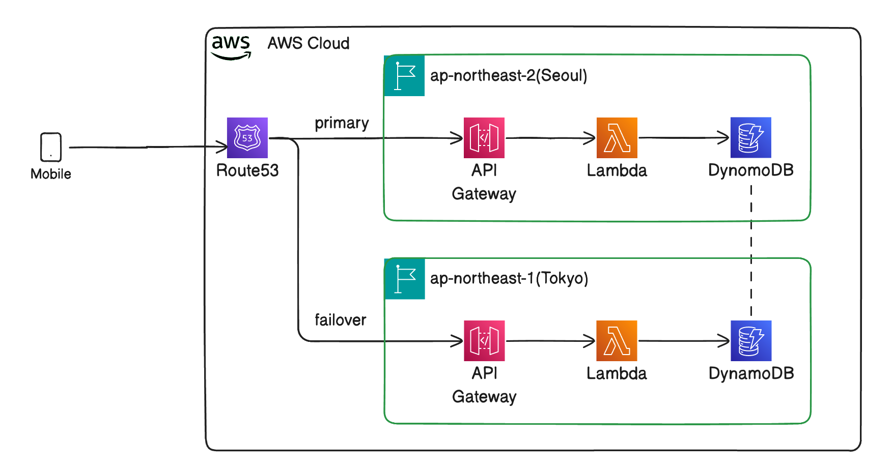

내가 맡은 부분은 DR구축이었는데, 이 과정을 기록하려고 한다.

---
## 🏷️ 도메인 구매
[가비아](www.gabia.com)에서 550원짜리 `.shop` 도메인을 구매하였다.

---
## 🌲 Route53 호스팅영역 생성
**호스팅 영역**을 생성한다.    
도메인 주소는 가비아에서 구입한 도메인주소로 한다.  
생성 시, NS레코드에 4개의 값이 있는데, 이걸 가비아에서 네임서버로 등록한다.

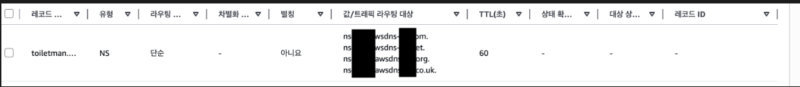

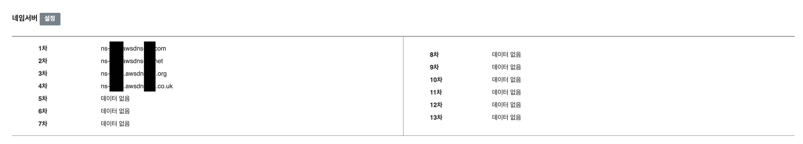

---
## 🪪 ACM 인증서 생성
루트도메인(2LD)과 그 아래 서브도메인을 커버하는 인증서를 만들기 위해,   
`example.com`과 `*.example.com`을 만든다.  
인증 방법은 간단하고, 권장되고, 자동으로 인증되는 DNS인증을 이용하면 된다.  
이메일 인증은 권장되지 않고, 오히려 해당 도메인에서의 admin과 같은 별도의 메일주소가 필요해서 번거롭다.
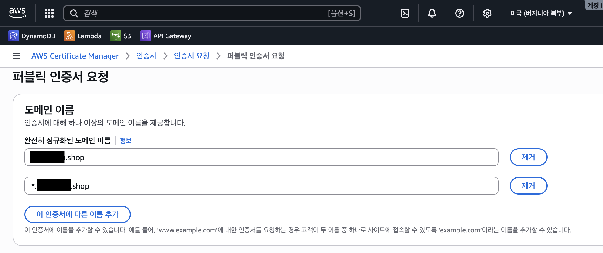

**Route53에서 레코드를 생성**을 누르고, 시간이 지나면, 발급된다.
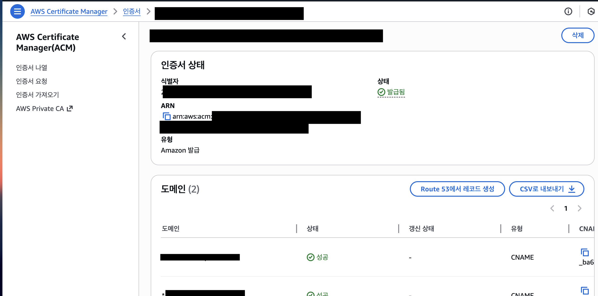

---
## 🚪 API Gateway에서 커스텀 도메인 추가
Route53에 API Gateway를 연결하려면, API Gateway에 **커스텀 도메인**을 붙여서 레코드를 생성해야 한다.
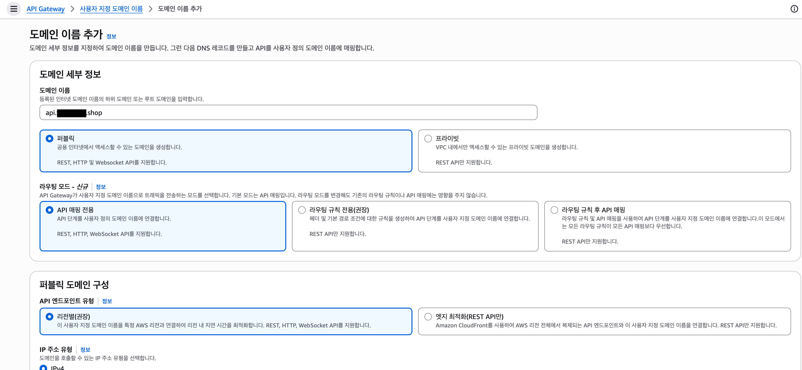
ACM인증서에서 만들어둔 인증서를 선택한다.
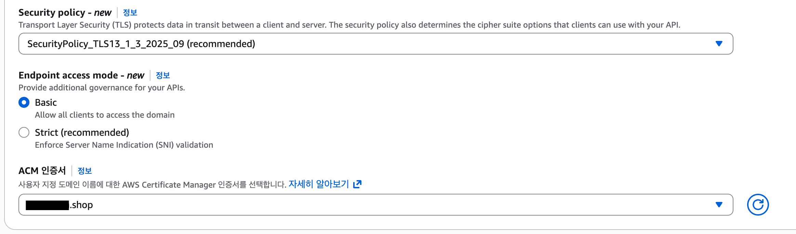
이후, API 매핑을 구성한다.
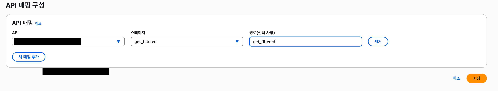

---
## 👼 DR리전에서 구성
똑같이 DR리전(여기서는 도쿄)에서도 **똑같은 인프라를 구성**해준다.
- DynamoDB 글로벌 테이블을 활성화
- Lambda 함수 생성
- API Gateway연결
- ACM생성(ACM은 리전단위 서비스이다)
- 커스텀 도메인 생성(여기서도 `api.example.com`으로 똑같이 만들어준다.)

---
## 🫀 Health check API 만들기
헬스체크 API를 별도로 만들어서, `/health`로 요청 시, 정상이면 200, 비정상 시 다른 응답을 주는 Lambda 함수를 실행할 것이다.   
서울리전에 단순라우트로 레코드를 추가해서, 헬스체크 엔드포인트를 만들 것이다.

### 헬스체크 함수 추가
헬스체크 Lambda함수를 생성한다.  
예시 함수는 다음과 같다:
```python
import json
import os

def lambda_handler(event, context):
    failover = os.environ.get("FAILOVER", "0")

    if failover == "1":
        return {
            'statusCode': 500,
            'body': json.dumps('Unhealthy!')
        }

    return {
        'statusCode': 200,
        'body': json.dumps('Healthy!')
    }
```

이후, 구성 -> 환경 변수에서 `FAILOVER=0`으로 해둔다.

### API Gateway에 연동
API Gateway에 Lambda함수를 연동한다.
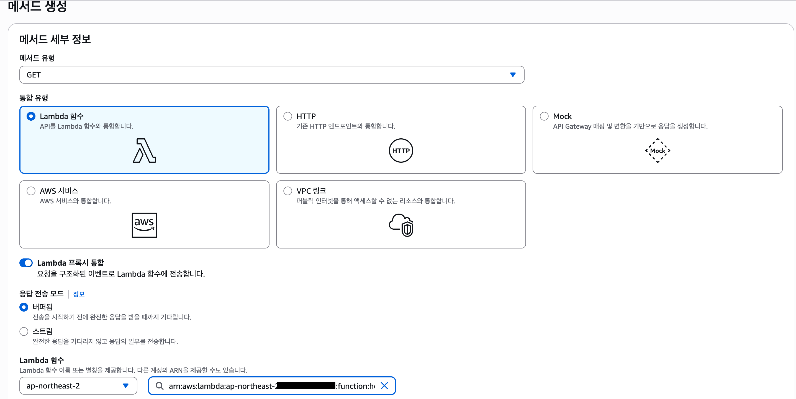   
  
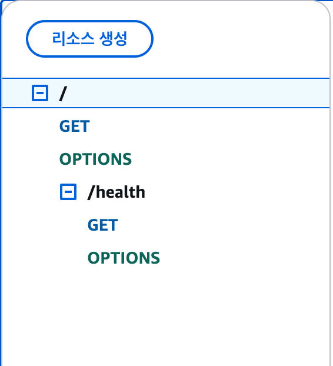

### 커스텀 도메인 추가 & 호스팅 존에 단순 라우트 연동
`seoul.example.com`으로 커스텀 도메인을 만들어준다.
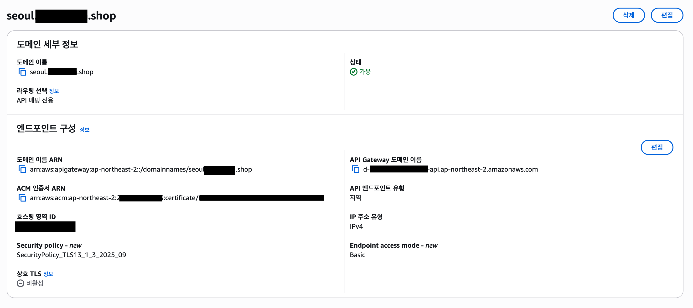
API 매핑도 추가해준다.
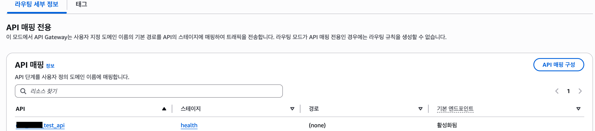

Route53의 호스팅 영역에서 단순레코드를 하나 만들어준다.  
`seoul.example.com`으로 레코드 이름을 만들고, 유형은 A.  
별칭을 활성화하고, API Gateway API에 대한 별칭 -> 아시아 태평양(서울) -> 커스텀 도메인에 바인딩된 API Gatewawy 도메인으로 연동해주면 된다.  
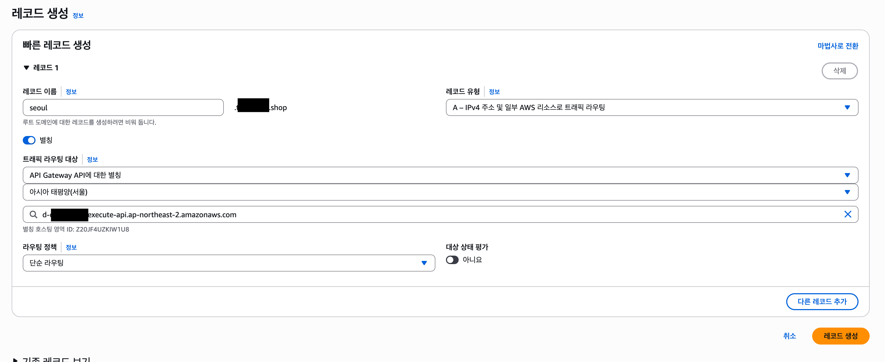

### 상태 확인 추가
Route53에서 **상태 확인**을 하나 생성한다.  
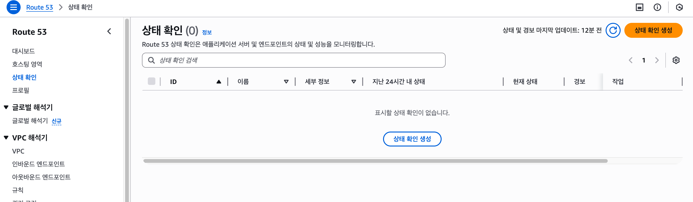
이번에는 엔드포인트 리소스를 이용할 것이고, 도메인 이름으로 한 뒤, 커스텀 도메인주소로 요청을 넣도록 하면 된다.  
임계치나 간격은 전략에 맞게 설정하면 된다.
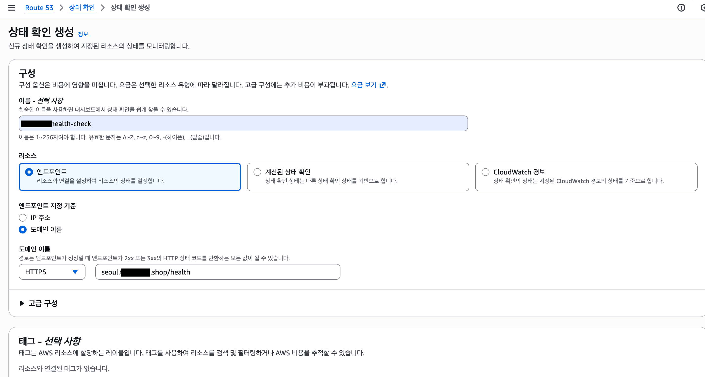
참고로, 고급 구성에서 SNI를 비활성화하여 TLS에러를 해결할 수 있다.
SNI가 커스텀 도메인 기반의 인증을 시도하지만, CloudFront와 미스매치로 TLS 핸드셰이크에 오류가 생길 수 있기 때문인듯 하다.  

---
## 🎥 DNS 레코드 추가
이제 본격적으로 DR대비 레코드를 추가하자.  
이름을 `api.example.com`으로 하고, 유형을 A, 대상으로 커스텀 도메인의 Cloudfront 배포 도메인으로 연결한다.  
그리고 라우팅 대상으로 커스텀 도메인의 API Gateway 도메인이름으로 해준다.  
헬스 체크로는 방금 만들어준 헬스체크와 연동하면 된다.
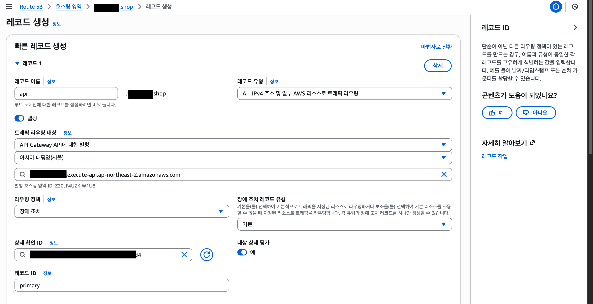

도쿄리전도 똑같은 `api.example.com`으로 만들어주고, A유형, 커스텀 도메인의 Cloudfront 배포 도메인으로 만들어주면 된다.
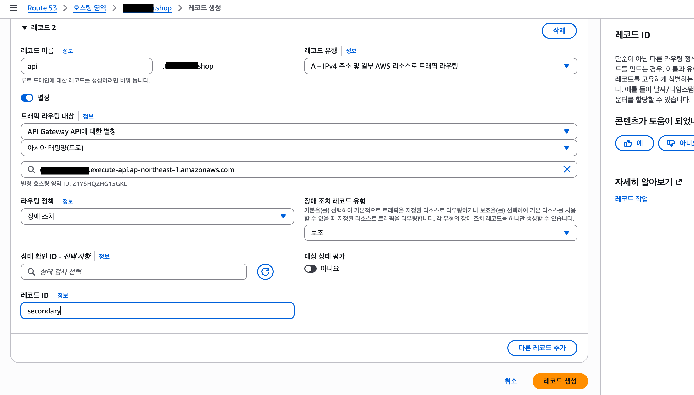

---
## 🧪 테스트 해보기
우선, 평시에는 서울리전으로부터 데이터가 온다.
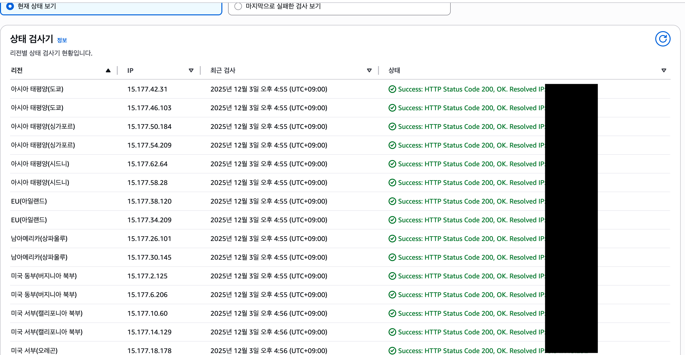
API 요청에도 `AWS_REGION`환경변수로 어느 리전의 Lambda함수가 실행되었는지 볼 수 있다.
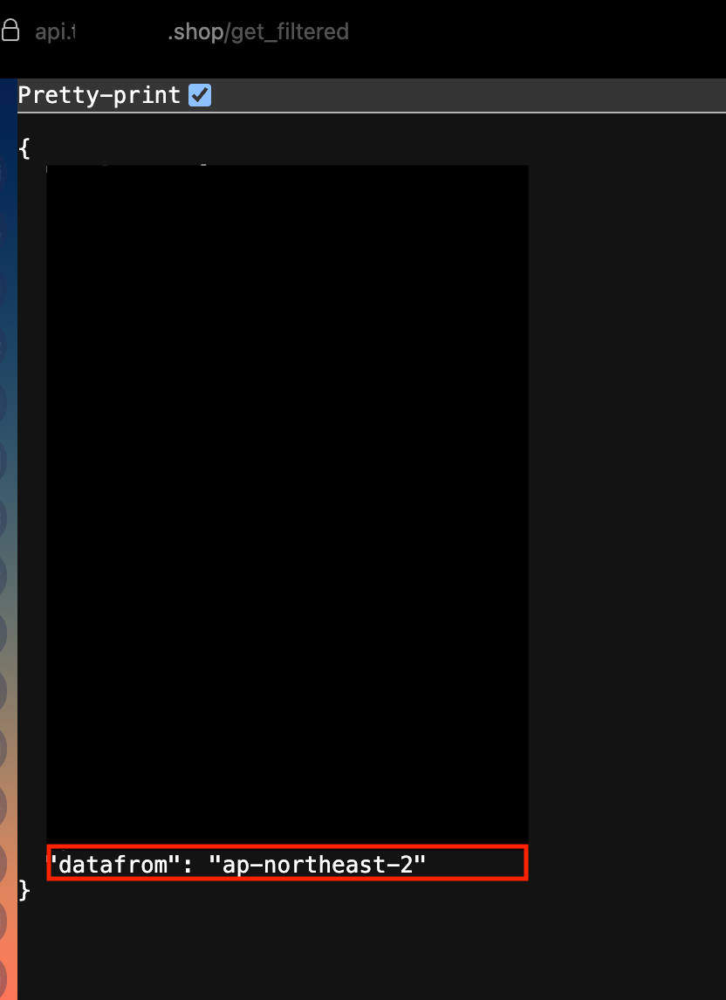
헬스 체크 lambda에서 환경 변수를 수정하여 `500`을 반환하도록 해보았다.
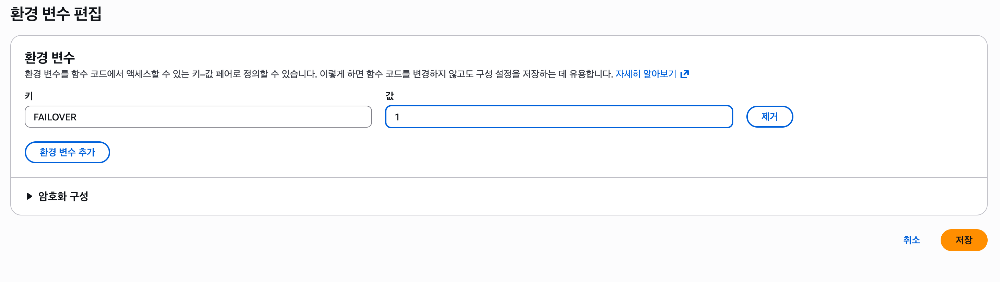

이제부터, **헬스 체크에 실패**한다.  
Route53의 헬스체크는 여러 리전들로부터 집계하여 18%미만으로 2XX, 3XX응답을 받지 못하면, 헬스 체크에 실패함으로 간주한다.  
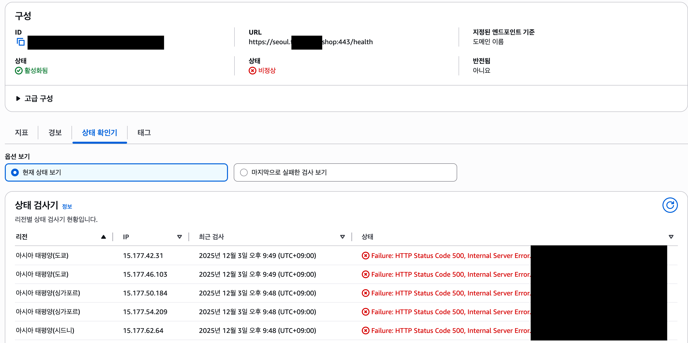
이제는 **도쿄리전으로부터 데이터가 옴**을 볼 수 있다.
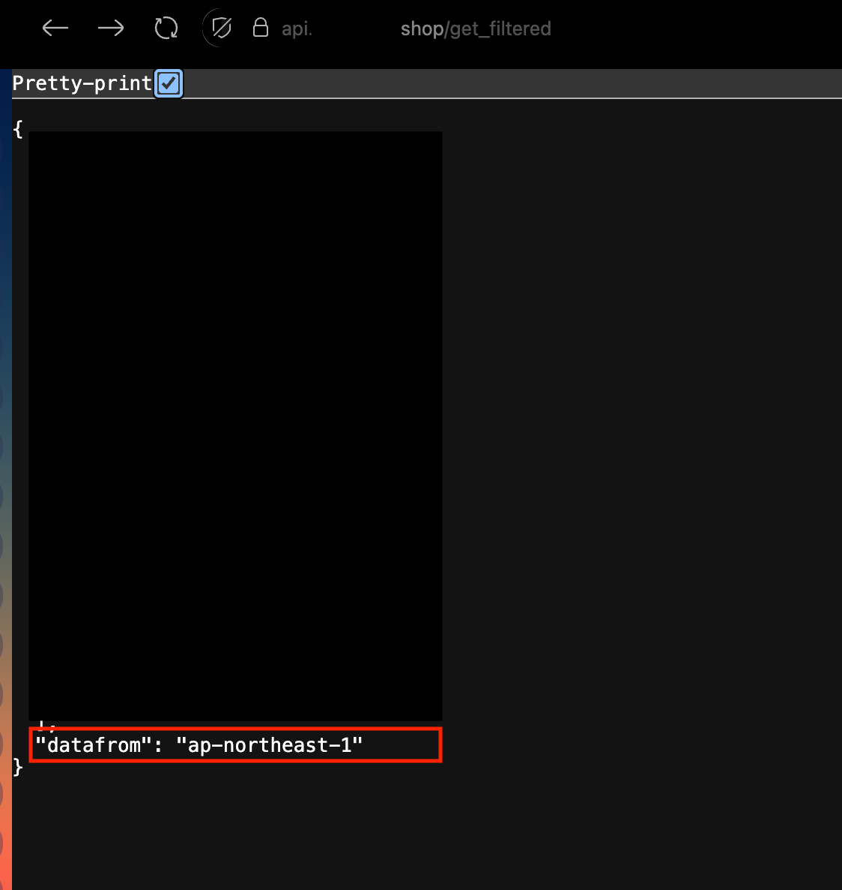

다시 `FAILOVER=0`으로 환경 변수를 바꿔보자. 이제 또 **다시 서울리전**으로부터 응답이 올 것이다.
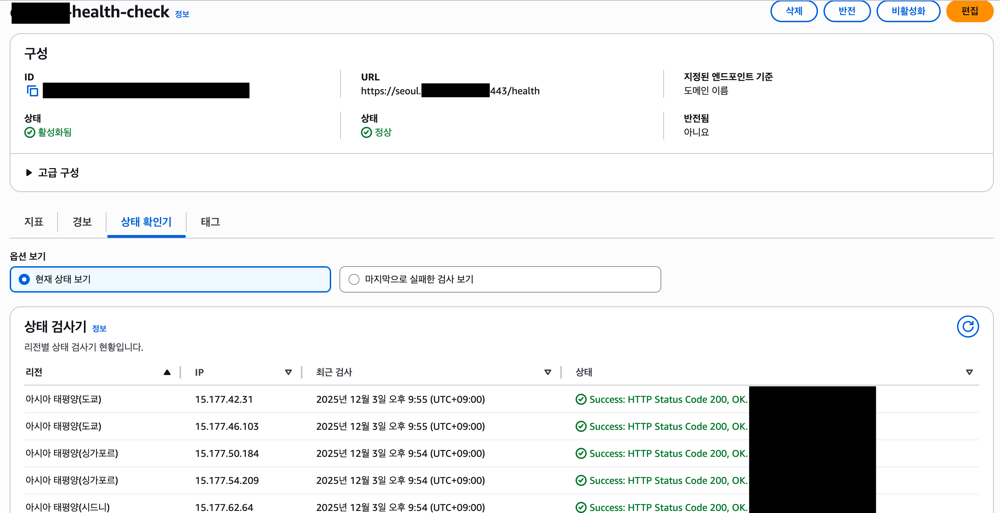


---
## 📚 후기
직접 서버리스 아키텍처와 DR을 구성한건 처음이었는데, Failover 및 Failback이 되는 과정을 직접 보니 재밌었다.  
DNS 수준에서의 DR을 구현해냈다.  
다음에는 Cloudwatch Alarm + Lambda를 이용한 다른 헬스체크 및 트리거로 시도해보고 싶다.  
또는, 여름 KDT에서 팀원이 Global Accelerator기반의 DR을 해보았는데, 나도 GA기반으로 직접 해보고싶다.