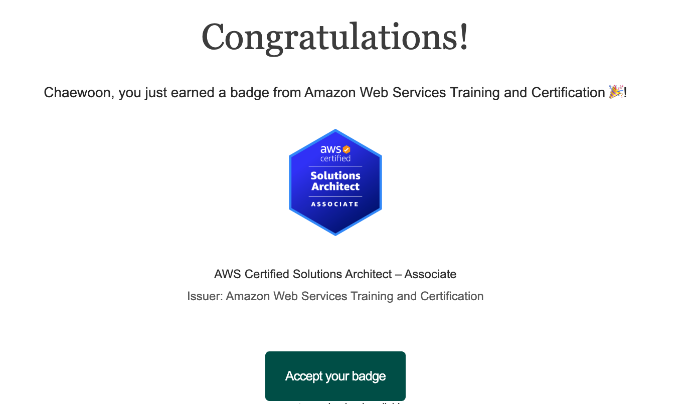

클라우드 교육수료 이후, 최대 10만원 지원을 받게 되어 교육 동안 다루었던 AWS 관련 자격증을 따야겠다는 생각을 했고, 그렇게 고른 것이 AWS SAA이다.

## 시험 정보
SAA-C03
- 비용: 150달러(25년 9월기준 약 19~20만원)
- 평가기준
    - 보안 아키텍처 설계
    - 복원력을 갖춘 아키텍처 설계
    - 고성능 아키텍처 설계
    - 비용에 최적화된 아키텍처 설계
- 문제: 65문제지만, 실제로는 50문제만 반영, 더미 15문제

응시장소는 처음에 온라인으로 했으나, 여권이 만료되어서 오프라인으로 응시했다.  
오프라인으로는 신분증(주민등록증, 운전면허증)과 영문이름이 적힌 신용/체크카드가 필요하다.  
서울 압구정의 헤럴드 테스트센터를 이용했다. 

---
## 시험 준비
문제 난이도 역시 일반적인 덤프들보다 더 어려웠다.  
섹션 카드도 제공해줘서 핵심 개념들을 보는 데에도 도움이 되었다.  

2주의 기간을 잡았고, 10일정도 강의만, 4일정도는 연습문제들을 달렸다.

다음 두 가지의 강의를 구매했다:
- [Udemy - Stephane Maarek의 강의](https://www.udemy.com/course/best-aws-certified-solutions-architect-associate/?couponCode=MT250915G1)
- [Tutorials Dojo - Jon Bonso의 모의고사 세트](https://portal.tutorialsdojo.com/courses/aws-certified-solutions-architect-associate-practice-exams/)  

각각 2만원 이내에 구매할 수 있다.

우선, 국룰이라고 불리는 **Stephane Maarek의 강의**를 들었다.  
이론 위주로 배속으로 들었다.  

기존에 유명한 examtopics의 문제들은 풀지 않았는데, 공식 정답은 틀려있고, discussion을 보려니 귀찮고 혼란스러웠기 때문이다.  
그리고, "문제 풀고 답 확인"이라는 패턴보다, 모의고사 형식으로 문제를 푼 뒤, 한 번에 피드백을 원했는데, Tutorials Dojo의 모의고사는 이러한 것들을 지원해주어서 매우 편리했다.  

---
## 시험 응시
130분의 응시 시간이 주어지지만, 영어가 모국어가 아니면 30분을 더 받을 수 있다.  
나는 이 제도가 영문으로 시험을 보는 경우에만 적용인줄 알았는데, 아닌가보다.  

문제는 기본 주요 자원들(EBS, EFS, VPC, EC2, S3, SQS, SNS, Kinesis, ECS, CloudFront)등에 대한 것들이 여럽게 나오는 경향이 있다.  
나머지 서비스들은 그래도 이름과 역할정도는 알긴 해야 할 것 같다.
시험에서 중요한 것은 "무엇을 원하는지"인 듯하다.  
예를 들자면, 비용 효율성을 원한다고 나오면, 성능이 좀 달리더라도 비용이 더 저렴한 솔루션이 정답이다.  

---
## 시험 결과

시험이 끝난 밤, 밤에 메일을 확인해보니 합격 이메일이 와있었다!  
주어진 링크를 따라가면 Open Badge형식의 전자배지를 수령받을 수 있다.  

좋은 결과가 나와서 기쁘다.  

---
## 시험 후기 및 마무리
자격증에 합격해서 기쁘지만, 여전히 갈 길이 멀다.  
이론적으로 무엇을 어디에 쓸지 안다고 하더라도, 실무에서 느끼는 것이 더 중요하다고 생각한다.  
자격증이 있다고 빠삭해지는 건 아닌 것 같다.  아무래도 자격증을 위한 공부를 하다보니 그런 점도 있는 것 같다.  

다음 자격증은 겨울방항 중에 CKA를 목표로 하고있다.  
또 잘 준비해서 좋은 결과가 있었으면 좋겠다.

