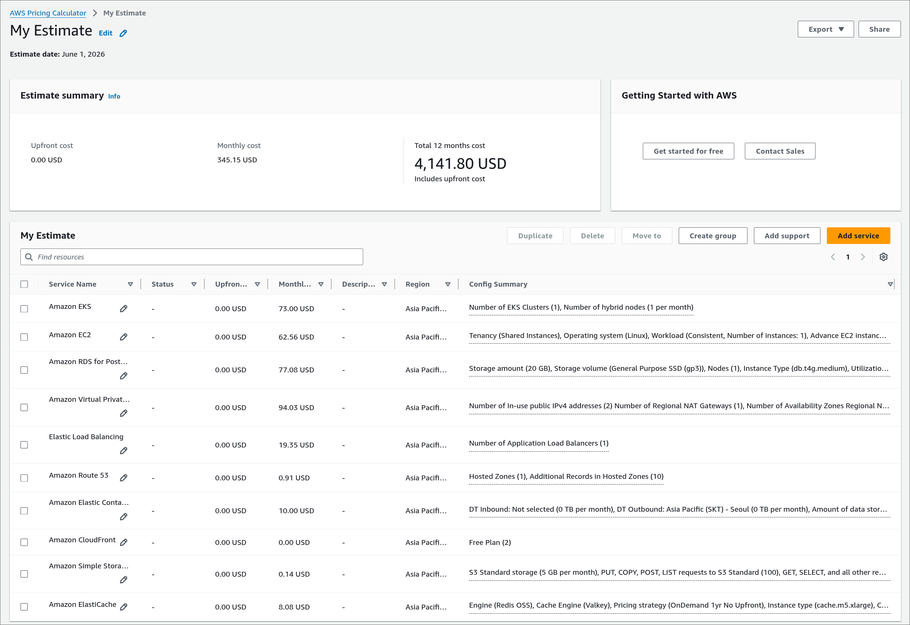
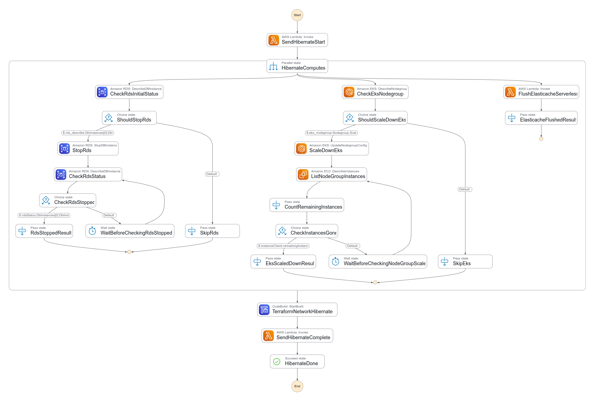
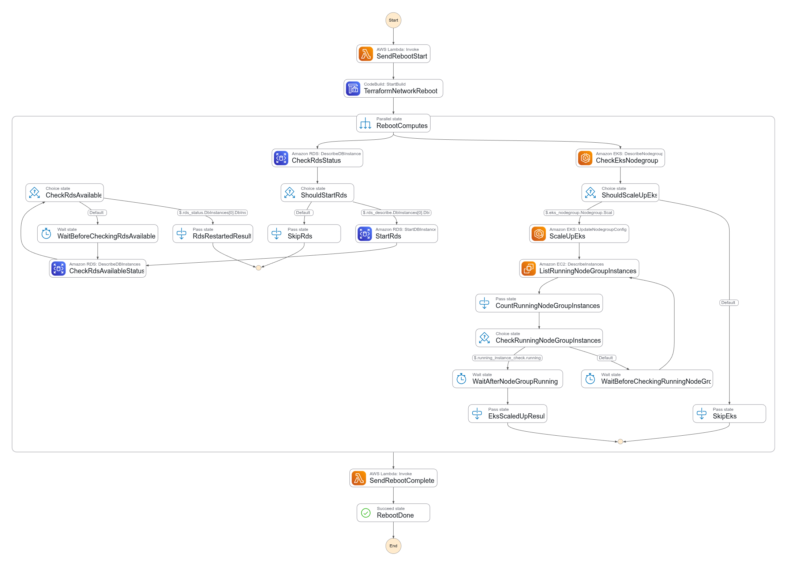
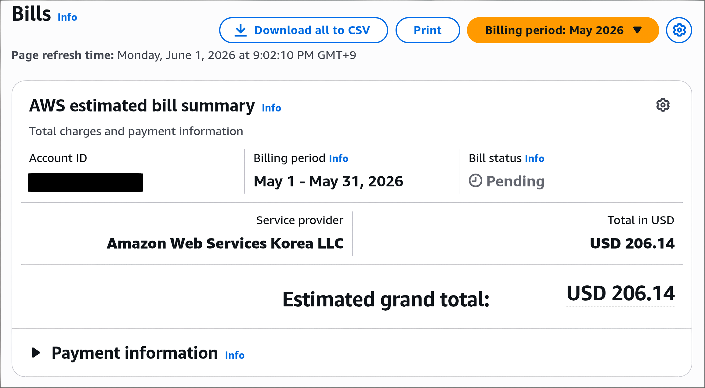

## 💰 Overview

During a capstone design project at school, we had a monthly budget of up to 200,000 KRW. \
However, our team had to use EKS, and realistically, that budget was far from enough. \
Even after configuring a minimal cluster with only the required database and network components, the estimated monthly cost was around 345 + α USD, where α includes additional network traffic costs and Karpenter Spot instances. (As of 2026.06, based on ap-northeast-2)

So we had to find a way to reduce cloud costs during the hours when the development environment was not being used.

---
## 💡 Cost Optimization Strategy

### Initial idea

At first, I considered simply destroying and applying all resources every day with Terraform. \
I eventually decided not to use this approach for the following reasons:
- At the time, all resources were declared in a single module, which made the workflow quite cumbersome.
    - In particular, if EKS was destroyed, the control plane would be removed and the cluster state would break.
        - For example, with Sealed Secrets, the decryption key would be lost and cause problems.
    - Since the modules had not been split properly yet, refactoring the structure felt too costly.
- For DB and S3 resources, shutting them down and recreating them could cause more problems.
- Pods inside the cluster might need graceful shutdown handling.

### Improved idea

Instead, I chose a strategy that shuts down only some of the resources:
- Scale all Pods inside the cluster to zero with kube-green.
- Stop RDS.
- Run a Lambda function to flush all data from ElastiCache Serverless.
    - This was especially important for Valkey, because billing happens in 0.1 GB increments.
- Set the desired node count of the default Managed Node Group to 0.
    - This was a very aggressive decision, but it had a major impact on cost reduction. Since off-hour monitoring was not required, removing those nodes was acceptable.
- Separate the NAT Gateway part into its own module and run Terraform only for that part.
    - Step Functions runs only that Terraform code through CodeBuild.
    - Even when removing only the NAT Gateway, changes to the EIP association, route tables, and related subnet routes come with it, so managing them together through Terraform state was simpler.
    - You can check that part [here](  ).

I also prepared the following cost-saving strategies for normal operation:
- Use ECR pull-through cache for externally installed containers to minimize NAT Gateway usage.
    - This is especially meaningful because the nodes are shut down and brought back up every day.
- Actively use Karpenter + Spot Instances.
    - The Managed Node Group desired count is kept at a maximum of 1, and any additional nodes are supplied from Spot Instances.
- Use Graviton nodes, such as `t4g.large`.
    - Since there were no strict CPU architecture constraints, ARM nodes were a good fit.

---
## 🔄 Step Functions Implementation

### Hibernate

Inside the cluster:
1. kube-green scales the deployment replicas down to 0.

Step Function:
1. EventBridge Scheduler starts the hibernate Step Function at the scheduled time.
2. The start Lambda sends a Slack notification.
3. The following jobs run in parallel:
    - MNG zero-scale:
      Starts a job that sets the desired size of the infra Managed Node Group to 0.
      It polls EC2/EKS status until the node group instances are actually removed.
    - RDS stop:
      Starts stopping the dev RDS instance.
      It polls RDS status until the instance reaches the stopped state.
    - ElastiCache Serverless:
      Flushes the cache to reduce unnecessary storage costs.
4. After the parallel jobs finish, CodeBuild pulls this repository and applies `live/cluster/vpc` again.
5. At this point, `hibernate.auto.tfvars.json` is injected to override `natgw_azs = []` and `enable_full_vpce = false`, removing the NAT Gateway, its associated EIP, and unnecessary VPC endpoint layers.
6. The end Lambda sends a Slack notification.

### Reboot

Step Function:

1. EventBridge Scheduler starts the reboot Step Function at the scheduled time.
2. It applies `live/cluster/vpc` again without injecting temporary variables.
3. As a result, the NAT Gateway, routing, associated EIP, and required network configuration are restored based on the default values.
4. The following jobs run in parallel:
    - MNG restore:
      Restores the desired size of the infra Managed Node Group to its normal operating value.
      It polls EKS status until scale-up is complete.
    - RDS start:
      Starts the dev RDS instance again.
      It polls RDS status until the instance becomes available.
5. The end Lambda sends a Slack notification.

Inside the cluster:
1. kube-green restores the Pods.

### Code

The full implementation includes Lambda, Step Functions, CodeBuild, and Terraform, so I did not include all of the code in this post. \
This post focuses on the cost optimization strategy and execution flow, while the implementation details are available in the links below.

- [Step Functions and overall Terraform configuration](https://github.com/Hallym-Workerbees/hivewiki-infra/blob/main/modules/stacks/tenant-dev-ops/main.tf)
- [Lambda functions](https://github.com/Hallym-Workerbees/hivewiki-infra/tree/main/modules/stacks/tenant-dev-ops/lambda)
- [CodeBuild buildspec - Hibernate](https://github.com/Hallym-Workerbees/hivewiki-infra/blob/main/live/cluster/vpc/buildspecs/hibernate-network.yml)
- [CodeBuild buildspec - Reboot](https://github.com/Hallym-Workerbees/hivewiki-infra/blob/main/live/cluster/vpc/buildspecs/reboot-network.yml)

--- 
## 📊 Actual Result

In practice, we reduced the cloud cost for May to 206.14 USD, which means we saved around (40 + α)%. \
Since the environment was not started at all for a few days near the end of the month, the realistic saving is closer to around 30-40%.

---
## ⚠️ Limitations

This method is not perfect. \
The following parts could be improved:
- The coordination between kube-green zero-scaling and Step Functions is quite rough. It simply relies on a schedule gap of 30 minutes.
    - The assumption was that 30 minutes after kube-green starts zero-scaling, all Karpenter-managed nodes should have disappeared.
    - In practice, this simple 30-minute gap was enough to clean everything up reliably.
- Checking that Managed Node Group instances are back in the Running state is not enough to catch bugs such as kubelet startup failures.
    - A better health check would be to query the EKS API from a serverless service and verify that the nodes are actually Ready.
    - However, that adds implementation complexity. The current method is simple and still covers most cases well.
- The Lambda functions are not very reusable.
    - If I improved this later, I might split the Slack notification logic into a shared component.
- If possible, it might also be worth shutting down Gateway API resources, meaning ELB as well. However, this can conflict with GitOps, and since load balancers are provisioned through Gateway resources, I expected the complexity to be much higher.

In the end, due to project time pressure and the need to keep the implementation simple, I chose the current approach.

---
## 📚 References

- [GitHub repo](https://github.com/Hallym-Workerbees/hivewiki-infra/tree/main)
