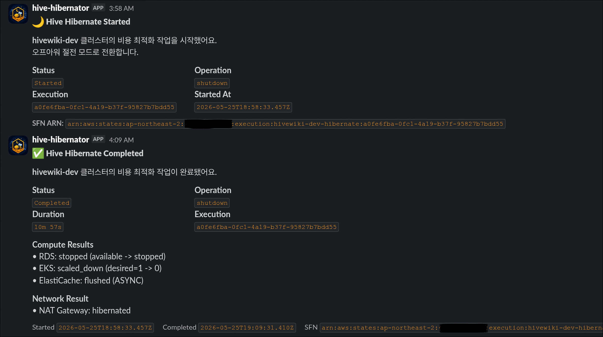
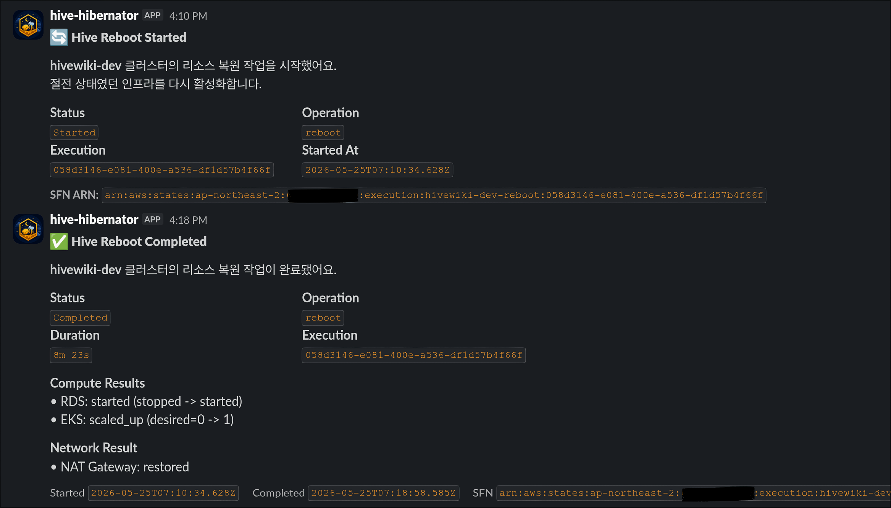

## 💰 개요

학교에서 캡스톤 디자인 프로젝트를 하면서, 월 최대 20만원의 예산이 주어졌다. \
그러나, 우리 팀은 EKS를 써야 했고, 현실적으로 턱 없이 부족하다. \
최대한 작은 규모의 클러스터에서 최소한의 DB 및 네트워크 설정 등을 구성해보았다. \
345 + α(추가적인 네트워크 트래픽 비용 및 Karpenter spot) 달러정도 나온다. (2026.06, ap-northeast-2 기준) 

그래서, 개발 환경에서 작업을 안 하는 시간동안 클라우드 비용을 줄일 방법을 생각해야만 했다.

---
## 💡 비용절감 전략

### 초기

처음에는 단순하게, Terraform 코드로 매일 전체 자원들을 destroy / apply하는 방법을 생각했다. \
이 방법은 결국 사용하지 않았는데, 이유는 다음과 같다:
- 당시에는 단일 모듈에 모든 리소스를 선언해놓아서 꽤 번거로웠음
    - 특히, EKS는 내리면 Control Plane이 날라가서, 상태가 망가져버림
        - Sealed Secret같은 경우도 복호화 키가 날아가서 문제가 됨
    - 당시에는 단일 모듈을 많이 분리하지 않아서 리팩토링하는데 부담을 느낌
- DB, S3의경우 내리고 올리는게 오히려 문제가 됨
- 내부 파드들에 대한 graceful shutdown이 필요할 수도 있음

### 발전 아이디어

대신, 일부 자원만 내리는 전략을 선택했다:
- 클러스터 내부 Pod들은 모두 kube-green을 이용하여 zero-scaling
- RDS는 Stop
- ElastiCache Serverless는 모든 데이터를 비우는 Lambda함수 실행
    - 특히 Valkey의경우, 0.1GB단위 과금이 발생하므로, 조금이라도 줄여야 한다.
- 기본 Managed Node Group의 desired node수를 0개로 설정
    - 매우 극단적인 결정이지만, 비용을 줄이는데 큰 몫을 했으며, off-hour에서의 모니터링까진 필요하지 않았어서 제거
- NAT Gateway 부분은 별도 모듈화를 해서 그 부분만 Terraform으로 실행
    - Step Function에서 CodeBuild를 이용해 해당 Terraform 코드만 실행한다.
    - NAT Gateway만 제거하더라도 EIP 연결, route table, 관련 subnet 경로 변경이 함께 따라오기 때문에 Terraform 상태로 묶어서 관리하는 편이 단순했다.
    - 이 부분은 [여기](  )에서 확인할 수 있다.

또한, 평상시 자원 절약 전략은 다음과 같이 준비했다:
- 외부에서 설치하는 컨테이너는 ECR Pull-through cache 이용, NAT Gateway 이용 최소화
    - 특히, 매일 노드들이 내려갔다가 올라오므로 유의미하다.
- Karpenter + Spot Instance 적극 이용
    - Managed Node Group의 desired는 최대 1로만 설정, 이후 추가 필요한 노드들은 Spot으로부터 수급
- Graviton 노드 활용(`t4g.large` 등)
    - CPU 아키텍처 등에 대한 제약이 없었어서, ARM노드를 이용했다.
 
---
## 🔄 Stepfunction 구현

### Hibernate

클러스터 내부:
1. Kube-green이 deployment들의 replica를 0으로 만든다.

Step Function:
1. EventBridge Scheduler가 예약된 시각에 hibernate Step Function 실행을 시작.
2. 시작 Lambda를 호출해 Slack 알림을 보냄
3. 아래 작업을 병렬로 실행
    - MNG zero-scale:
      infra 전용 Managed Node Group의 desired size를 0으로 내리는 작업을 시작.
      EC2/EKS 상태를 polling하면서 실제로 node group 인스턴스가 사라질 때까지 대기.
    - RDS stop:
      dev RDS stop을 시작.
      RDS 상태를 polling하면서 stopped가 될 때까지 대기.
    - ElastiCache Serverless:
      cache flush를 수행해 불필요한 저장 비용을 줄임
4. 병렬 작업이 끝나면 CodeBuild가 이 저장소 코드를 가져와 live/cluster/vpc를 다시 apply.
5. 이때 hibernate.auto.tfvars.json을 주입해 natgw_azs = [], enable_full_vpce = false로 덮어써서 NAT Gateway, 연결된 EIP, 불필요한 VPC endpoint 계층을 제거한다.
6. 종료 Lambda를 호출해 Slack 알림을 보낸다.

실행이 끝나면 아래처럼 각 작업 결과와 전체 상태를 Slack으로 확인할 수 있다.

### Reboot

Step Function:

1. EventBridge Scheduler가 예약된 시각에 reboot Step Function 실행을 시작.
2. 별도 임시 변수 주입 없이 live/cluster/vpc를 다시 apply.
3. 그 결과 기본 설정값 기준으로 NAT Gateway, 라우팅, 연결된 EIP, 필요한 네트워크 구성이 복구.
4. 아래 작업을 병렬로 실행.
    - MNG restore:
      infra 전용 Managed Node Group desired size를 원래 운영 값으로 복구
      EKS 상태를 polling하면서 scale-up 완료까지 대기
    - RDS start:
      dev RDS를 다시 기동합니다. RDS 상태를 polling하면서 available이 될 때까지 대기
5. 종료 Lambda를 호출해 Slack 알림을 보냄.

reboot 역시 동일하게 복구 작업 결과를 Slack 메시지로 확인할 수 있다.

클러스터 내부:
1. kube-green이 Pod들을 다시 복구.

### 코드

전체 구현 코드는 Lambda, Step Functions, CodeBuild, Terraform 구성이 함께 묶여 있어 본문에 모두 포함하지 않았다. \
이 글에서는 비용 절감 전략과 실행 흐름을 중심으로 설명하고, 세부 구현은 아래 링크에서 확인할 수 있다.

- [Step Functions 및 전체 Terraform 구성](https://github.com/Hallym-Workerbees/hivewiki-infra/blob/main/modules/stacks/tenant-dev-ops/main.tf)
- [Lambda 함수](https://github.com/Hallym-Workerbees/hivewiki-infra/tree/main/modules/stacks/tenant-dev-ops/lambda)
- [CodeBuild buildspec - Hibernate](https://github.com/Hallym-Workerbees/hivewiki-infra/blob/main/live/cluster/vpc/buildspecs/hibernate-network.yml)
- [CodeBuild buildspec - Reboot](https://github.com/Hallym-Workerbees/hivewiki-infra/blob/main/live/cluster/vpc/buildspecs/reboot-network.yml)

--- 
## 📊 실제 성과

실제로 5월간의 클라우드 비용을 206.14달러로 줄여서, 약 (40 + α)%를 절감한 셈이다. \
물론 월말 며칠은 아예 안켜서, 실제로는 30 ~ 40% 정도 절감한 셈이라고 보면 된다.

---
## ⚠️ 한계점

이 방법은 완전하지 않다. \
이러한 부분들을 보완할 수 있을 것 같다:
- Kube-green이 제로스케일 하는 것과 Stepfunction이 너무 러프함(단순 30분차이 예약스케줄링)
    - Kube-green이 제로스케일을 시작한지 30분 뒤면, Karpenter가 관리하는 노드들이 모두 내려가 있을거라 예상
    - 실제로도 단순하게 30분 텀을 두는 것으로 깔끔하게 모두 정리되는걸 확인했음.
- Managed Node Group의 인스턴스들이 다시 Running인거만으로는 kubelet실행 오류 등의 버그를 잡을 수 없음. 
    - 더 나은 상태 확인 방법으로는 서버리스 서비스에서 EKS API에서 노드들이 실제 Ready인지 조회
    - 그러나 구현이 복잡, 대신 현 방법은 단순하면서도 대부분의 상황을 커버하여 강력하다고 생각.
- Lambda가 재사용성이 떨어짐
    - 다시 보완한다면, 슬랙 메시지를 보내는 부분은 공통으로 분리했을 수도 있을 것 같다.
- 가능하면 Gateway API, 즉 ELB도 내려볼만 했던거같은데, GitOps와 충돌이 있기도 하고, Gateway를 통해 로드 밸런서가 프로비저닝되는 거라 복잡도가 높아질 것을 예상

결론적으로, 프로젝트 기간의 압박과 구현의 단순함 때문에, 현재 구현대로 선택했었다.

---
## 📚 References

- [GitHub repo](https://github.com/Hallym-Workerbees/hivewiki-infra/tree/main)
