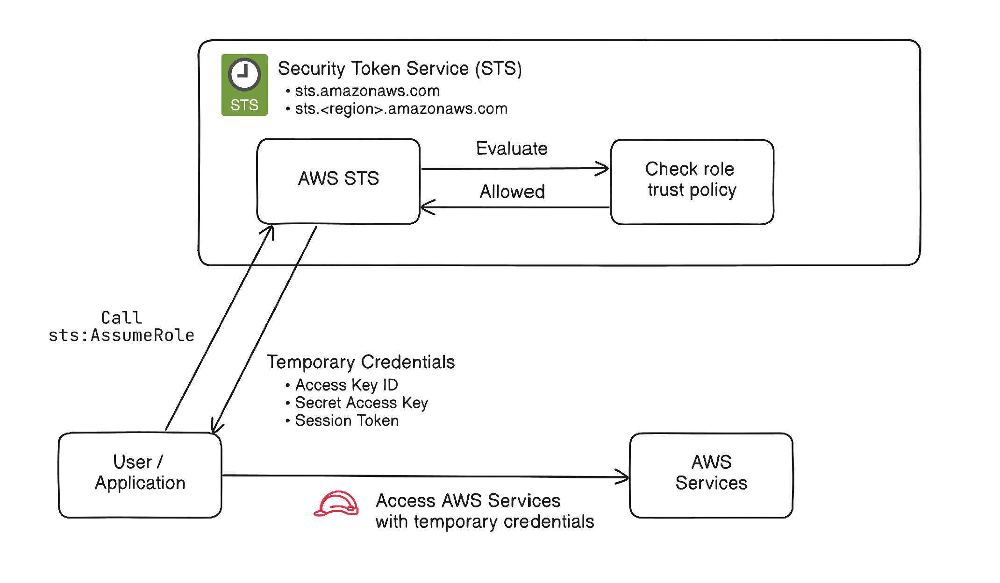

## 🔑 AWS Security Token Service (STS)란?  

AWS Security Token Service (STS)는 IAM user 또는 role에 단기자격증명을 부여하는 AWS 서비스이다. \
이러한 자격증명은 액세스 키와 같은 장기자격증명의 사용을 줄이고, 최소권한부여를 사용하도록 유도하게 된다.

---
## ❓ AWS STS를 쓰는 이유

- AssumeRole을 이용하면, 액세스 키와 같은 장기자격증명을 배포하는 것을 막을 수 있다.
- 임시자격증명은 자동으로 만료되고 롤링되기에, 더 안전하다.
- STS는 다중계정간 자격증명을 교환하는 데에 사용된다.
- 최소권한원칙을 따르기 쉬운 구조이다.
- SSO, OAuth등과 같은 페더레이션을 지원한다.

---
## ⚙️ AssumeRole의 동작방식



1. 사용자, 애플리케이션, 또는 AWS 서비스가 IAM Role을 맡도록 요청을 보낸다.
2. AWS는 Role의 **신뢰 정책(trust policy)**으로 해당 요청자가 그 Role을 받는 것이 허용되었는지 검사한다.
3. 만약 허용된다면, STS는 다음의 임시 자격증명 정보를 제공한다:
    - Access key ID
    - Secret access key
    - Session token
4. 요청자는 임시자격증명으로 AWS 자원에 접근할 수 있게 된다.
5. 해당 자격증명은 세션 유지기간이후 만료된다.


---
## 🚀 유스 케이스

- 다중계정간 액세스
- CI/CD 파이프라인
- AWS 워크로드에 자격증명 부여
- 임시로 권한상승을 받는경우 등

---
## 💻 Terraform 예시

아래 예시는 EC2 인스턴스에 IAM Role로 S3에 접근할 수 있게 되는 예시를 보여준다. \
EC2인스턴스에 Access Key ID나 Secrey Access Key를 주지 않고 S3에 접근할 수 있게 된다.


```hcl
provider "aws" {
  region = "ap-northeast-2"
}

# --------------------------------------------------
# S3 bucket
# --------------------------------------------------
resource "aws_s3_bucket" "app_bucket" {
  # bucket name must be unique
  bucket = "my-sts-demo-bucket-1234567890"
}

resource "aws_s3_bucket_public_access_block" "app_bucket" {
  bucket = aws_s3_bucket.app_bucket.id

  block_public_acls       = true
  block_public_policy     = true
  ignore_public_acls      = true
  restrict_public_buckets = true
}

# --------------------------------------------------
# IAM role for EC2
# EC2 can assume this role
# --------------------------------------------------
data "aws_iam_policy_document" "ec2_assume_role" {
  statement {
    effect = "Allow"

    actions = ["sts:AssumeRole"]

    principals {
      type        = "Service"
      identifiers = ["ec2.amazonaws.com"]
    }
  }
}

resource "aws_iam_role" "ec2_s3_role" {
  name               = "ec2-s3-access-role"
  # Trust Policy
  assume_role_policy = data.aws_iam_policy_document.ec2_assume_role.json
}

# --------------------------------------------------
# Policy: allow EC2 role to read objects from S3
# --------------------------------------------------
data "aws_iam_policy_document" "s3_read_policy" {
  statement {
    effect = "Allow"

    actions = [
      "s3:ListBucket"
    ]

    resources = [
      aws_s3_bucket.app_bucket.arn
    ]
  }

  statement {
    effect = "Allow"

    actions = [
      "s3:GetObject"
    ]

    resources = [
      "${aws_s3_bucket.app_bucket.arn}/*"
    ]
  }
}

resource "aws_iam_policy" "s3_read_policy" {
  name   = "ec2-s3-read-policy"
  policy = data.aws_iam_policy_document.s3_read_policy.json
}

resource "aws_iam_role_policy_attachment" "attach_s3_read" {
  role       = aws_iam_role.ec2_s3_role.name
  policy_arn = aws_iam_policy.s3_read_policy.arn
}

# --------------------------------------------------
# Instance profile for EC2
# --------------------------------------------------
resource "aws_iam_instance_profile" "ec2_profile" {
  name = "ec2-s3-instance-profile"
  role = aws_iam_role.ec2_s3_role.name
}

# --------------------------------------------------
# Networking (simple example)
# Replace with your existing VPC/subnet/security group if needed
# --------------------------------------------------
data "aws_vpc" "default" {
  default = true
}

data "aws_subnets" "default" {
  filter {
    name   = "vpc-id"
    values = [data.aws_vpc.default.id]
  }
}

resource "aws_security_group" "ec2_sg" {
  name        = "ec2-s3-demo-sg"
  description = "Security group for EC2 S3 demo"
  vpc_id      = data.aws_vpc.default.id

  ingress {
    description = "SSH"
    from_port   = 22
    to_port     = 22
    protocol    = "tcp"
    cidr_blocks = ["0.0.0.0/0"]
  }

  egress {
    from_port   = 0
    to_port     = 0
    protocol    = "-1"
    cidr_blocks = ["0.0.0.0/0"]
  }
}

# --------------------------------------------------
# EC2 instance
# Replace ami with one valid in your region
# --------------------------------------------------
resource "aws_instance" "app" {
  ami                    = var.ami
  instance_type          = "t3.micro"
  subnet_id              = data.aws_subnets.default.ids[0]
  vpc_security_group_ids = [aws_security_group.ec2_sg.id]
  iam_instance_profile   = aws_iam_instance_profile.ec2_profile.name

  tags = {
    Name = "sts-demo-ec2"
  }
}
```

---
## 👍 Best Practices

- 장기 액세스 키 대신 임시자격증명을 이용
- Role의 권한에 최소권한원칙을 적용
- 넓은 principal에게 assume되지 않도록, trust policy를 명확히
- 적절한 세션 길이를 유지
- 외부 계정과 연동 시, external ID를 사용
- CloudTrail로 role사용을 모니터링


---
## 📚 References

- [AWS Docs: Security Token Service - AssumeRole](https://docs.aws.amazon.com/STS/latest/APIReference/API_AssumeRole.html)
- [AWS Docs: Identity and Access Management - IAM roles](https://docs.aws.amazon.com/IAM/latest/UserGuide/id_roles.html)
- [Terraform Docs - Provision AWS resources across accounts using AssumeRole](https://developer.hashicorp.com/terraform/tutorials/aws/aws-assumerole)
- [Terraform - AWS Provider](https://registry.terraform.io/providers/hashicorp/aws/latest/docs)
