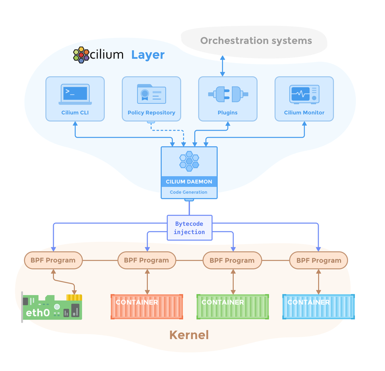
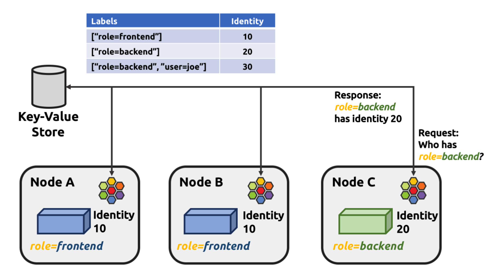

  

  

Cilium을 설치하면, 다양한 운영 컴포넌트들이 설치된다.

  

## 🧱 Cilium 구성요소

### Cilium Operator

Cilium Operator는 클러스터 전체에서 **딱 한번만 처리하면 되는 일을 수행**한다.  
즉, Agent들이 중복으로 수행하지 않는, 상위 레벨의 관리 작업을 수행한다.   
Cilium은 데이터 경로(critical path)에 위치하지 않는데, 이 말은 통신에 직접 개입하지 않는다는 것이다.  
**즉, Operator가 잠깐 다운되어도, 이미 통신하는 Pod들간에는 아무 영향이 없다!**. 
**물론, 오랫동안 다운이라면 IP를 할당받지 못하거나, 새로운 네트워크 정책이 적용되지 않을 수 있다.**

즉, Operator는 Cilium에서의 Control Plane이라 할 수 있다.

### Cilium Agent

Cilium Agent는 daemonset으로 동작하여 **노드 당 하나씩 동작**한다.  
에이전트는 다음의 일을 한다:
- Kubernetes API server와 클러스터 상태 연동을 위한 상호작용
- eBPF프로그램을 로딩하고 eBPF테이블을 업데이트하기 위한 리눅스 커널과의 상호작용
- 새롭게 스케줄된 워크로드에 대해 알림을 받도록 유닉스 소켓을 이용한 Cilium CNI플러그인 프로그램과 상호작용
- 네트워크 정책의 요구에 기반한 온디맨드 DNS 및 Envoy 프록시를 생성
- Hubble 필요시 gRPC서비스를 생성

  

### Cilium Client

노드의 Cilium의 상태와 eBPF 맵을 리소스를 관찰하기 위해 Cilium Agent의 Pod 데몬셋은 클라이언트 실행파일과 함께 동반한다.  
클라이언트는 daemonset과 REST API로 통신한다.  

> **Note**  
> Cilium CLI와는 다른 것이다.  
> Cilium client는 Cilium Agent Pod내부에 존재하여 Cilium Agent의 운영에 대해 진단 도구가 된다.  
> 일반적인 운영에서는 Cilium Client를 사용할 일이 없다.

### Cilium CNI Plugin

Cilium Agent daemonset이 처음 초기화되면, 호스트 노드의 특정 파일시스템에 CNI plugin 실행 파일을 설치한다.  
그 뒤, 이 실행파일을 사용하도록 노드의 설정을 변경한다(kubelet설정을 변경)

요구가 오면, Cilium CNI플러그인이 유닉스 소켓을 통해 daemonset에게 요청을 전달한다.  
즉, kubelet → Agent daemonset을 위한 창구라고 보면 된다.  
실제 네트워크 작업은 Agent daemonset에서 동작한다.  

  

### Hubble Server

각 노드에서 Hubble Server가 동작하며, Cilium으로부터 eBPF 기반의 시각정보를 받는다.  
Cilium Agent에 통합되어 고성능에 오버헤드가 적다.  
네트워크 흐름을 얻고 Prometheus 메트릭을 얻는 데 gRPC를 사용한다.  

### Hubble Relay

Hubble이 활성화되면, 각 노드의 Cilium Agent는 Hubble gRPC서비스를 시작하여 노드-로컬 관찰성을 제공한다.  
클러스터 전역의 관찰성을 위해, Hubble Relay Deployment가 클러스터에서 동작하고, 두 가지 서비스가 동작한다:  
- Hubble Observer Service
- Hubble Peer Service

**Hubble Relay Deployment** 는 각 노드의 Cilium Agent로부터 gRPC요청을 날려서 클러스터 전역의 네트워크 관찰성을 제공한다.  
**Hubble Peer Service** 는 클러스터 내 새로운 Hubble-활성화 Agent를 탐지할 수 있게 해준다.   
당신은 CLI도구와 GUI를 이용하여 Hubble Observer Service에 상호작용할 수 있다.

### Hubble CLI & GUI

Hubble CLI(hubble)는 hubble-relay또는 로컬 서버로부터 네트워크 플로우 이벤트를 받을 수 있는 gRPC API를 요청할 수 있는 CLI 도구이다.  
GUI(hubble-ui)는 시각적으로 의존 및 연결 맵을 제공한다.

### Cluster Mesh API Server

Cluster Mesh API Server는 여러 클러스터 간에 service를 공유하도록 해준다.  
고가용성이나 재해복구에 매우 유용하다.
Cluster Mesh를 활성화하면, 각 클러스터에 별도의 etcd가 설치된다. 이 etcd는 해당 클러스터의 Pod들의 Cilium Identity를 저장한다.   
그리고, 다른 클러스터에서 접근가능하게 프록시 서비스를 개방한다.

Cilium Agent는 다른 클러스터의 etcd 프록시에 접속해서, 클러스터에 어떤 Identity가 있는지 물어볼 수 있다.  
즉, 메시 내에서 신원이 전체 공유된다.  
이는 글로벌 서비스로 확장할 수 있게 해준다.

## 📍 Endpoint

Cilium은 애플리케이션 컨테이너에게 IP주소를 할당함으로써 네트워크에서 가용 가능하도록 한다.  
공통의 IP주소를 공유하는 모든 애플리케이션 컨테이너, 즉 Pod는 Endpoint라는 것으로 묶인다.  
즉, 1 Pod = 1 Endpoint를 가진다.  
Cilium은 Pod에게 1개의 Endpoint를 제공한다.  
Endpoint는 Cilium의 기본 네트워크 단위이다.  

## 🪪 Identity

Cilium이 효율으로 동작하는 데에는 Identity가 중요한 역할을 한다.  
모든 Cilium Endpoint는 label기반의 Identity를 가진다.  

Cilium Identity는 Label로 정해지고, 클러스터 전역에서 고유해야 한다.  
**보안에 관련된 label조합이 똑같은 Pod들은 모두 똑같은 Identity를 부여받는다.**.  

위 그림에서, `role=frontend`를 가진 모든 Pod들은 다 똑같은 10번 Identity를 받는다.  
이러한 Identity는 각각 고유한 정수값을 가져서, eBPF에서 정책조회가 매우 빠르다.  