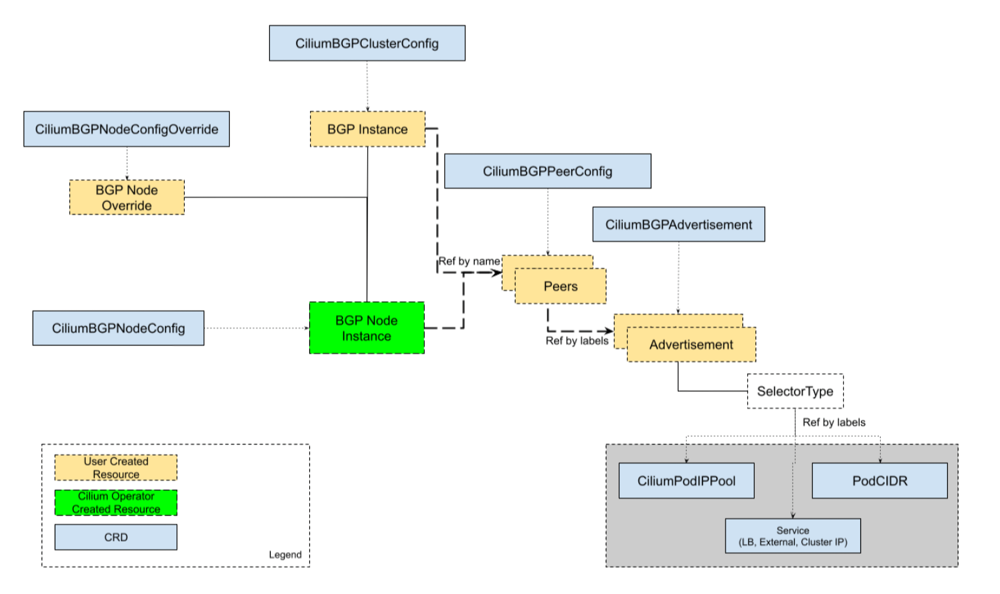

## 🧱 BGP Control Plane Resources

Cilium의 BGP Control Plane은 BGP Peer, Policy, advertisement 구성을 제공하는 유연한 커스텀 리소스들로부터 제공된다.  

BGP Control Plane을 관리하기 위해, 다음의 자원들이 사용된다:
- `CiliumBGPClusterConfig`: BGP 인스턴스와 피어링 구성을 정의한다. 여러 노드들에 적용된다.
- `CiliumBGPPeerConfig`: BGP Peering의 일반적인 설정 셋으로, 여러 peer들간에 사용될 수 있다.
- `CiliumBGPAdvertisement`: BGP Routing table에 주입되는 prefix들을 정의한다.
- `CiliumBGPNodeConfigOverride`: node-specific한 BGP구성을 정의하여 더 나은 제어를 제공한다.

아래의 다이어그램으로 보여질 수 있다:




---
## 📜 BGP 클러스터 구성

`CiliumBGPClusterConfig`는 `nodeSelector`필드에 있는 1개 이상의 노드에 대한 BGP설정을 하는 곳이다.  
각각의 `CiliumBGPClusterConfig`은 1개 이상의 BGP 인스턴스를 정의하며, 그들의 `name`필드에 대해 식별된다.

BGP 인스턴스는 1개 이상의 Peer를 가질 수 있다.  
각 Peer는 `name`필드에 의해 식별된다.  
Peer AS는 `peerASN`과 `peerAddress`필드에 의해 정의된다.  

Peer의 구성 설정은 `peerConfigRef`필드로 참조할 수 있다.  
`peerConfigRef`의 `Group`과 `kind`는 옵셔널하며, 기본적으로 `cilium.io`와 `CiliumBGPPeerConfig`이다.  

기본적으로, BGP 컨트롤 플레인은 리스닝 포트 없이 동작한다.  
설정된 Peering만 가능하다는 의미이며, 들어오는 Peering을 받을 수 없다는 뜻이다.  

이게 기본인데, 그 이유는 같은 노드에서 BGP라우터가 동작할 수 있음을 고려했기 때문이다.  
들어오는 커넥션을 받으려면, `localPort`필드로 리스닝 포트를 정할 수 있다.

> **NOTE**  
> 기본 BGP Port(179)를 쓸 때에는, `CAP_NET_BIND_SERVICE`가 필요하다.  
> 만약 기본 포트를 쓰고싶다면, `securityContext.capabilities.ciliumAgent`에서 `CAP_NET_BIND_SERVICE`를 helm value로 넣어줘야 한다.


아래는 `CiliumBGPClusterConfig`의 예시이며, `instance-65000`이 두 개의 peer와 피어링한 것이다.
```yaml
apiVersion: cilium.io/v2
kind: CiliumBGPClusterConfig
metadata:
  name: cilium-bgp
spec:
  nodeSelector:
    matchLabels:
      rack: rack0
  bgpInstances:
  - name: "instance-65000"
    localASN: 65000
    localPort: 179
    peers:
    - name: "peer-65000-tor1"
      peerASN: 65000
      peerAddress: fd00:10:0:0::1
      peerConfigRef:
        name: "cilium-peer"
    - name: "peer-65000-tor2"
      peerASN: 65000
      peerAddress: fd00:11:0:0::1
      peerConfigRef:
        name: "cilium-peer"
```

### Auto-Discovery
Cilium BGP Control Plane은 BGP Peer에 대한 자동 디스커버리 역시 지원한다.  
`mode`에서 특정 특정 IP주소를 정할 수 있다.

`DefaultGateway`모드도 있다.  
기본 게이트웨이를 이용하면, 자동으로 기본 게이트웨이와 BGP를 맺으려 한다.

아래와 같이 할 수 있다:
```yaml
peers:
- name: "tor-switch"
  peerASN: 65000
  autoDiscovery:
  mode: "DefaultGateway"
    defaultGateway:
      addressFamily: ipv6 # ipv4, ipv4중에 가능
  peerConfigRef:
    name: "cilium-peer"
```

ToR switch의 BGP 구성에는 다음 설정을 해줘야 한다:
```shell
router bgp 65100
  neighbor CILIUM peer-group
  neighbor CILIUM local-as 65000 no-prepend replace-as
  bgp listen range fd00:10:0:1::/64 peer-group CILIUM
```

설정이 적용되면, Cilium은 특정 Address Family의 기본게이트웨이를 식별하여 자동으로 BGP 세션을 맺는다.  
`peerConfigRef` 세션 파라미터를 참조하여 피어링을 맺는다.

**default gateway설정 + multi-homing(두 개 이상의 BGP와 연결)일때는 같은 address family에 대해서 동시에 여러 BGP세션을 맺을 수 없다.**  
대신, 우선순위가 더 높은 (metric이 더 낮은)경로를 하나 선택하여 BGP 세션을 맺는다.

Cilium은 BGP 세션을 address family당 하나만 맺을 수 있다.  
대신, failover로 연결가능한데, 처음에 아래와 같은 상황이라고 가정했을 때,
```shell
default via ToR A, metric 100 
default via ToR B, metric 200
```

ToR A가 장애가 난다면, ToR B와 새로 BGP 세션을 맺는다.  

아래 예시에서는, IP를 직접 명시하지 않았지만 기본 게이트웨이에서 가장 우선순위가 높은 하나를 고른다고 보면 된다.
```yaml
bgpInstances:
- name: "65001"
  localASN: 65001
  peers:
  - name: "instance-65001"
    peerASN: 65000
    autoDiscovery:
      mode: "DefaultGateway"
      defaultGateway:
        addressFamily: ipv6
    peerConfigRef:
      name: "cilium-peer"
```

대신, 같은 address family에서 여러 peer와 세션을 맺고 싶다면, 직접 두 peer를 명시해야 한다.

---
## 🛠️ BGP Peer Configuration

`CiliumBGPPeerConfig` 자원은 BGP Peer 연결설정을 정의할 때 사용한다.  
**여러 Peer와의 연결에서 같은 Configuration을 공유해서 사용할 수 있다.**

여러 옵션을 가질 수 있다:
- MD5 Password
- Timers
- EBGP Multihop
- Graceful Restart
- Transport
- Address Families

아래는 예시이다:
```yaml
apiVersion: cilium.io/v2
kind: CiliumBGPPeerConfig
metadata:
  name: cilium-peer
spec:
  timers:
    holdTimeSeconds: 9
    keepAliveTimeSeconds: 3
  authSecretRef: bgp-auth-secret
  ebgpMultihop: 4
  gracefulRestart:
    enabled: true
    restartTimeSeconds: 15
  families:
    - afi: ipv4
      safi: unicast
      advertisements:
        matchLabels:
          advertise: "bgp"
```


### MD5 Password

`AuthSecretRef`는 [RFC-2385](https://www.rfc-editor.org/rfc/rfc2385.html)의 TCP MD5 Password를 BGP Peering에 쓸 수 있다.

아래는 예시이다.
```yaml
apiVersion: cilium.io/v2
kind: CiliumBGPPeerConfig
metadata:
  name: cilium-peer
spec:
  authSecretRef: bgp-auth-secret
```

`AuthSecretRef`는 BGP secrets namespace에 써야 한다.  
(helm-chart 기본값은 `kube-system`)  
`password`라는 키를 가져야 한다.  
BGP 시크릿은 각 Cilium Agent 인스턴스가 최소로 쓸 수 있는 권한으로 제한되어있다.  

만약 namespace를 바꾸고싶다면, helm chart의 `bgpControlPlane.secretNamespace.name`의 값을 바꾸면 된다.  
생성도 자동으로 하고싶으면, `bgpControlPlane.secretNamespace.create`를 `true`로 해주면 된다.  

패스워드가 틀리다면, `dial: i/o timeout`으로만 뜬다.  
만약 `authSecretRef`의 시크릿을 찾을 수 없으면, BGP시션은 빈 패스워드를 쓰고, 아래와 같은 오류를 낸다:  
```yaml
level=error msg="Failed to fetch secret \"secretname\": not found (will continue with empty password)" component=manager.fetchPeerPassword subsys=bgp-control-plane
```

### Timers
BGP Control Plane은 BGP timer 파라미터를 수정하는 것을 지원한다.

| Name              | Field                     | Default |
| ----------------- | ------------------------- | ------- |
| ConnectRetryTimer | `connectRetryTimeSeconds` | 120     |
| HoldTimer         | `holdTimeSeconds`         | 90      |
| KeepaliveTimer    | `keepAliveTimeSeconds`    | 30      |

장애 감지를 더 빠르게 하기 위해서는, `HoldTimer`와 `KeepaliceTimer`를 더 짧은 주기로 설정하는것을 권장한다.  
최소수치인 `holdTmeSeconds=9`와 `keepAliveTimeSeconds=3`과 같은 식으로 할 수 있다.  

Peer와 연결이 끊기고 빠르게 회복하려면, `connectRetryTimeSeconds`를 줄이면 된다.  
내부적으로 랜덤 jitter가 적용되는데, `[ConnectRetryTimeSeconds, 2 * CoonnectRetryTimeSeconds)`이다.  

```yaml
apiVersion: cilium.io/v2
kind: CiliumBGPPeerConfig
metadata:
  name: cilium-peer
spec:
  timers:
    connectRetryTimeSeconds: 5
    holdTimeSeconds: 9
    keepAliveTimeSeconds: 3
```

### EBGP Multihop
기본적으로 BGP 패킷의 IP TTL은 1인데, Multihop 설정을 위해서는, `spec.ebgpMultihop`을 1보다 크게 해주면 된다.

### Graceful Restart
**Graceful Restart** 를 켜면, Cilium Agent가 재시작하는것과 같이 BGP 프로세스가 잠깐 내려가도, 실제 커널은 살아있어서 패킷 포워딩은 가능한 경우가 있다.  

이때 route를 지우면 트래픽 중단이 불필요하게 생기니, 금방 다시 올라올 수 있다고 알려주는 capacity가 graceful restart이다.

1. Cilium이 BGP OPEN 메시지에서 graceful restart capacity를 광고
2. Peer는 재시작중에도 경로유지를 할 것을 약속
3. Cilium Agent가 재시작되는 동안, BGP 세션이 끊기는데,  
   Peer는 route를 `RestartTime`동안 유지
4. Cilium은 다시 BGP를 복구하면, 트래픽 중단없이 계속 이어짐
5. 시간이 초과되면, 실제로 죽었다고 판단하고 route삭제

상대 라우터는 TCP FIN플래그 메시지를 받고, RestartTime 타이머를 시작한다.

```yaml
apiVersion: cilium.io/v2
kind: CiliumBGPPeerConfig
metadata:
  name: cilium-peer
spec:
  gracefulRestart:
    enabled: true
    restartTimeSeconds: 15
```

`RestartTime`의 기본값은 120초이다.


### Transport
`transport`는 TCP연결의 세부사항을 만진다.
기본 설정과 다르게 TCP연결을 설정할 때 사용한다.

```yaml
spec:
  transport:
    peerPort: 179
    sourceInterface: lo
```

### Address Families

`families`필드에는 **AFI(Address Family Identifier)** , **SAFI(Subsequent Address Family Identifier)** 의 리스트가 있다.  

기본적으로, address family가 없다면, BGP Control Plane은 IPv4 Unicast와 IPv6 Unicast를 멀티프로토콜 확장 capability로 광고한다.  

각 Address family에서는, `advertisements` label selector를 통해 라우트 광고를 제어할 수 있다.  
`CiliumBGPAdvertisement`를 골라야 한다.

> **NOTE**
> 매칭이 없으면, 아무 prefix도 광고될 수 없다.


```yaml
apiVersion: cilium.io/v2
kind: CiliumBGPPeerConfig
metadata:
  name: cilium-peer
spec:
  families:
    - afi: ipv4
      safi: unicast
      advertisements:
        matchLabels:
          advertise: "bgp"
    - afi: ipv6
      safi: unicast
      advertisements:
        matchLabels:
          advertise: "bgp"
```

---
## 📢 BGP Advertisements

`CiliumBGPAdvertisement`자원은 다양한 광고 타입을 정할 수 있다.  
`advertisements` label의 매칭은 Peer Configuration의 `familes`와 연관있다.

### BGP Attributes
BGP path attributes를 `advertisements[*]`에 정의할 수 있다.

두 가지의 속성이 있는데, `Communities`와 `LocalPreference`이다.
- Communities: BGP의 라우트 태그같은 개념이라고 보면 된다.
	- `standard`는 `:`으로 32비트 숫자를 나누며, 16비트:16비트숫자를 쓰는 형식이다.
	- `wellknown`은 `standard`와 같은 형식을 가지지만, well-known값에 대한 alias를 가진다.
		- ex. internet은 0:0, no-advertise는 "65535:65282"
	- `large`는 3개의 4바이트정수가 콜론으로 나뉘어진다.
		- ex. `64512:100:50`
- Local Preference: iBGP에서의 내부 우선순위 값이며, `eBGP` peer에게는 무시될것이다.
```yaml
apiVersion: cilium.io/v2
kind: CiliumBGPAdvertisement
metadata:
  name: bgp-advertisements
  labels:
    advertise: bgp
spec:
  advertisements:
    - advertisementType: "PodCIDR"
      attributes:
        communities:
          standard: [ "65000:99" ] # Route에 65000:99 태그를 붙임
        localPreference: 99 # iBGP내부 선호값(값이 클수록 더 선호)
```


### Advertisement Types

Cilium은 세 가지의 광고를 제공한다:
- Pod CIDR range
- Service VIPs
- Interface IPs

#### Pod CIDR Ranges
노드의 Pod CIDR prefix를 광고할 수 있다.  
BGP Peer가 로드밸런서 또는 NAT없이 접속할 수 있다.

IPAM모드 세팅별로 두 가지 방법이 있다.

Kubernetes나 ClusterPool IPAM인 경우, advertisement의 type을 `PodCIDR`로 하면 된다.
```yaml
apiVersion: cilium.io/v2
kind: CiliumBGPAdvertisement
metadata:
  name: bgp-advertisements
  labels:
    advertise: bgp
spec:
  advertisements:
    - advertisementType: "PodCIDR"
```

이 구성으로, BGP 인스턴스는 로컬 노드의 Pod CIDR prefix를 광고할 수 있다.

MultiPool IPAM에서는 `advertisementType`을 `CiliumIPPool`로 해야 한다.  
`selector`필드의 `.matchLabels` 또는 `matchExpressions`로 매칭할 수 있다.

```yaml
apiVersion: cilium.io/v2
kind: CiliumPodIPPool
metadata:
  name: default
  labels:
    pool: blue
---
apiVersion: cilium.io/v2
kind: CiliumBGPAdvertisement
metadata:
  name: pod-ip-pool-advert
  labels:
    advertise: bgp
spec:
  advertisements:
    - advertisementType: "CiliumPodIPPool"
      selector:
        matchLabels:
          pool: "blue"
```

이 설정에서는 선택된 Cilium Pod IP Pool에 할당된 PodCIDR prefix가 광고된다.  
이 예시에서, CiliumNode 리소스에 CIDR이 반드시 할당되어야 한다.

모든 CiliumPodIPPool CIDR를 클러스터 안에 광고하고 싶다면, `NotIn`으로 dummy key-value를 이용하여 쓸 수 있다.  

```yaml
apiVersion: cilium.io/v2
kind: CiliumBGPAdvertisement
metadata:
  name: pod-ip-pool-advert
  labels:
    advertise: bgp
spec:
  advertisements:
    - advertisementType: "CiliumPodIPPool"
      selector:
        matchExpressions:
        - {key: somekey, operator: NotIn, values: ['never-used-value']}
```

name이나 namespace를 기반으로 고르고 싶은 때가 있는데, 특별한 키를 제공한다.
- `io.cilium.podippool.name` -> `meta.name`
- `io.cilium.podippool.namespace` -> `meta.namespace`

```yaml
selector:
  matchExpressions:
    - key: io.cilium.podippool.namespace
      operator: In
      values:
        - kube-system
```

다른 IPAM Type은 BGP prefix 광고가 지원하지 않는다.


#### Service Virtual IPs

Service는 여러 virtual IP를 가질 수 있다.  
Service의 virtual IP를 BGP Peer로 광고할 수 있다.

> **NOTE**
> Cilium의 BGP Control Plane은 VIP를 /32또는 /128 prefix로 광고한다.

service의 virtual IP를 광고하기 위해, `advertisementType`의 필드를 `Service`로 하고,  
`service.addresses` 필드에 `LoadBalancerIP`, `ClusterIP`, 또는 `ExternalIP`로 해준다.

`.selector`에서 `.matchLabels`또는 `matchExpressions`로 가능하다.

```yaml
apiVersion: cilium.io/v2
kind: CiliumBGPAdvertisement
metadata:
  name: bgp-advertisements
  labels:
    advertise: bgp
spec:
  advertisements:
    - advertisementType: "Service"
      service:
        addresses:
          - ClusterIP # ClusterIP
          - ExternalIP # ExternalIP
          - LoadBalancerIP # LoadBalancerIP
      selector:
        matchExpressions:
          - { key: bgp, operator: In, values: [ blue ] }
```

업스트림 라우터가 **ECMP(Equal Cost Multi Path)**를 지원한다면, 같은 VIP에 대해서 실제로 로드밸런싱이 일어날 것이다.

> **NOTE**
> 많은 라우터들이 라우팅 테이블에 저장하는 ECMP 경로에 대해 한계를 가지는데,
> 많은 노드들로부터 Service VIP가 광고된다면, 한계를 넘을 수 있다.
> 이 기능을 쓰려면, 네트워크 관리자로부터 한계를 알아내는 것이 좋을 것이다.

각 주소 타입별로 특징이 있다:
- ClusterIP
	- 클러스터 내부 전용.
	- `kubeProxyReplacement`와 함께 쓰려면, [여기](https://docs.cilium.io/en/stable/network/kubernetes/kubeproxy-free/#external-access-to-clusterip-services)를 참고
- ExternalIP
	- 관리자가 직접 지정하는 외부 노출용 IP
	- `kubeProxyReplacement`와 함께 쓰려면, ExternalIP 지원이 켜져야 한다.
- LoadBalancerIP
	- Kubernetes에서는 이 IP를 자동할당하지 않는다.
	- 그래서, 별도 할당 주체가 필요하다.
	- Cilium은 [LoadBalancer IPAM](https://docs.cilium.io/en/stable/network/lb-ipam/#lb-ipam)을 이용할 수 있다.
특별한 metadata들 역시 제공된다:
- `io.kubernetes.service.namespace` -> `.meta.namespace`
- `io.kubernetes.service.name` -> `.meta.name`

service가 LoadBalancer 타입일때, `loadBalancerClass=io.cilium/bgp-control-plane`이거나 비어있다면, Cilium이 광고할 수 있다.  
또는, 미설정인 경우 광고할 수 있다.

대신, 다른 class를 지정하면, Cilium은 광고할 수 없다.

> **NOTE**
> `externalTrafficPolicy`가 `Cluster`인경우, 조건 없이 광고하지만, 
> `Local`인 경우, 해당 endpoint가 없으면 광고하지 않는다.

하나의 Service가 여러 advertisement selector에 동시에 걸릴 수 있는데, 이 경우 community는 합쳐지며(union), local-pref는 가장 큰 값 하나(max)를 쓴다.

기본적으로 service는 단일 IP(/32, /128)을 광고하지만, aggregation이 지원되기도 한다.  
아래와 같이 더 큰 대역단위로 광고할 수 있다.
```yaml
service:
  aggregationLengthIPv4: 24
  aggregationLengthIPv6: 120
```
이렇게 하면, 라우팅 테이블을 적게 차지하며, 광고 수를 줄일 수 있다.

그러나, 실제 service에 없는 트래픽도 클러스터로 들어올 수 있음을 유의해야 하며,  
또한 `externalTrafficPolicy=Local`인 경우, aggregation될 수 없다.

#### Interface IP
Service가 아니라, 노드 인터페이스에 붙은 IP자체를 광고할 수도 있다.  
멀티호밍에 유용하게 쓰일 수 있다.  
정확한 주소(/32, /128)로 광고되며, 다음의 주소는 광고되지 않는다:
- loopback
- multicast
- IPv6 link-local
- IPv4-mapped IPv6

인터페이스는 `up`이나 `unknown`상태여야 한다.
```yaml
apiVersion: cilium.io/v2
kind: CiliumBGPAdvertisement
metadata:
  name: bgp-advertisements
  labels:
    advertise: bgp
spec:
  advertisements:
    - advertisementType: "Interface"
      interface:
        name: lo
```
(여기서의 lo는 논리적 인터페이스로, `127.0.0.1`이 아닌 다른 주소를 붙인 것이다.)

---
## 📝 BGP Configurations Override

[현재는 이 글에서 다루지 않음, 대신 여기서 확인](https://docs.cilium.io/en/stable/network/bgp-control-plane/bgp-control-plane-configuration/#bgp-configuration-override)


---
## 🏋️ Hands-On

helm values에 다음과 같이 추가한 뒤, 업데이트한다:
```yaml
# bgpControlPlane
bgpControlPlane:
  enabled: true
```

### LoadBalancer IP 광고

다음의 네트워크 토폴로지를 가정한다:


쿠버네티스 노드들의 기본 게이트웨이가 FRRouter로 설정되어있다.  
FRRouter의 설정(`/etc/frr/frr.conf`)은 다음과 같다:
```shell
frr version 10.5.1
frr defaults traditional
hostname frr-router
log syslog informational
service integrated-vtysh-config
!
# 라우트맵 정의: 모든 경로 허용
route-map ALLOW-ALL permit 10
exit
!
# BGP 라우터 설정 (ASN 65000)
router bgp 65000
 # BGP 라우터 ID 설정
 bgp router-id 192.168.10.1
 # K8S-NODES라는 peer-group 생성
 neighbor K8S-NODES peer-group
 # K8S-NODES peer-group의 remote ASN을 65001로 설정
 neighbor K8S-NODES remote-as 65001
 # capability를 동적으로 협상 가능하게 하도록 설정(새로운 세션 없이)
 neighbor K8S-NODES capability dynamic
 # 192.168.10.0/24 대역의 노드들이 동적으로 BGP피어링이 가능하도록 설정
 bgp listen range 192.168.10.0/24 peer-group K8S-NODES
 !
 # IPv4 유니캐스트 Address family 설정
 address-family ipv4 unicast
  # K8S-NODES그룹에게 Next-hop을 자신으로 변경
  neighbor K8S-NODES next-hop-self
  # K8s-NODES그룹에서 받는 경로에 ALLOW_ALL 라우트맵 적용
  neighbor K8S-NODES route-map ALLOW-ALL in
  # K8s-NODES그룹으로 보내는 경로에 ALLOW_ALL 라우트맵 적용
  neighbor K8S-NODES route-map ALLOW-ALL out
  # ECMP(Equal-Cost Multi-Path) 설정 - 최대 경로 수를 64개 설정
  maximum-paths 64
 exit-address-family
exit
!
```

#### CiliumBGPClusterConfig

우선, `CiliumBGPClusterConfig`를 설정한다.  
이 설정은 모든 노드에 적용된다.

```yaml
apiVersion: cilium.io/v2
kind: CiliumBGPClusterConfig
metadata:
  name: cilium-bgp
spec:
  nodeSelector:
    matchLabels:
      kubernetes.io/os: linux
  bgpInstances:
  - name: "K8S-NODES"
    localASN: 65001
    localPort: 179
    peers:
    - name: "FRRouter" # frr 라우터
      peerASN: 65000 # frr AS
      peerAddress: 192.168.10.1 # frr IP
      peerConfigRef:
        name: "cilium-peer" # cilium-peer라는 CiliumBGPPeerConfig를 참조
```

`localPort`를 BGP의 기본 포트인 179번 well-known포트로 받기 위해서는, helm values에서 다음과 같이 설정되어야 한다:
```yaml
# Listening on the default BGP Port
securityContext:
  privileged: true
  capabilities:
    ciliumAgent:
      - CAP_NET_BIND_SERVICE
```

#### CiliumBGPPeerConfig

`cilium-peer`라는 `CiliumBGPPeerConfig`를 설정한다.

```yaml
apiVersion: cilium.io/v2
kind: CiliumBGPPeerConfig
metadata:
  name: cilium-peer
spec:
  timers:
    holdTimeSeconds: 90
    keepAliveTimeSeconds: 30
  gracefulRestart:
    enabled: true
    restartTimeSeconds: 120
  families:
    - afi: ipv4
      safi: unicast
      advertisements:
        matchLabels:
          advertise: "bgp" #CiliumBGPPeerConfig의 advertisements의 matchLabels와 일치 
```

#### CiliumBGPAdvertisement
```yaml
apiVersion: cilium.io/v2
kind: CiliumBGPAdvertisement
metadata:
  name: advertise-gateway-lb
  labels:
    advertise: bgp #CiliumBGPPeerConfig의 advertisements의 matchLabels와 일치
    bgp-advertisement: "true"
spec:
  advertisements:
  - advertisementType: Service # Service 광고
    selector:
      matchLabels:
        app: http-test # app: http-test 라벨을 가진 Service 광고
    service:
      addresses:
      - LoadBalancerIP # LoadBalancer IP 광고
```

#### 간단한 HTTP 앱 노출

```yaml
# http-test.yaml
apiVersion: apps/v1
kind: Deployment
metadata:
  name: http-test
  labels:
    app: http-test 
spec:
  replicas: 1
  selector:
    matchLabels:
      app: http-test
  template:
    metadata:
      labels:
        app: http-test
    spec:
      containers:
        - name: http-server
          image: riveroverflow/cilium-test-http:latest
          ports:
            - containerPort: 8080
---
apiVersion: v1
kind: Service
metadata:
  name: http-test
  labels:
    app: http-test # CiliumBGPAdvertisement의 selector와 일치
spec:
  selector:
    app: http-test
  ports:
    - protocol: TCP
      port: 80
      targetPort: 8080
  type: LoadBalancer
```

이제, `kubectl apply -f http-test.yaml`로 적용하면 된다.

단, `CiliumLoadBalancerIPPool`이 설정되어있어야 한다.
아래와 같이 설정할 수 있다:
```yaml
apiVersion: cilium.io/v2
kind: CiliumLoadBalancerIPPool
metadata:
  name: public-pool
spec:
  blocks:
  - cidr: 172.20.0.0/24
  disabled: false
```

생성된 service를 확인해보자.

```bash
cilium-playground on  main on ☁️  (ap-northeast-2) on ☁️  fudoge67@gmail.com
23:49:07  ❯ k get svc
NAME                             TYPE           CLUSTER-IP       EXTERNAL-IP   PORT(S)          AGE
...
http-test                        LoadBalancer   10.105.166.135   172.20.0.1    80:30525/TCP     5d8h
...
```

이제, `curl http://172.20.0.1:80`로 테스트해보면 된다.

```bash
cilium-playground on  main on ☁️  (ap-northeast-2) on ☁️  fudoge67@gmail.com
23:54:52  ❯ curl http://172.20.0.1
hello from http server
method=GET path=/ time=2026-03-12T14:54:54Z
```

BGP Peering 상태도 확인할 수 있다:
```bash
cilium-playground on  main on ☁️  (ap-northeast-2) on ☁️  fudoge67@gmail.com
23:54:45  ❯ cilium bgp peers
Node       Local AS   Peer AS   Peer Address   Session State   Uptime     Family         Received   Advertised
cp-1       65001      65000     192.168.10.1   established     76h5m19s   ipv4/unicast   1          1
worker-1   65001      65000     192.168.10.1   established     76h5m19s   ipv4/unicast   1          1
worker-2   65001      65000     192.168.10.1   established     76h4m51s   ipv4/unicast   1          1
```


## 📚 결론
- Cilium BGP Control Plane을 이용하여 BGP Peering을 맺은 라우터에 클러스터 내에서 쓰이는 IP들 및 LoadBalancer IP들을 광고할 수 있다.
- L2광고대신 실드가 LoadBalancer IP를 광고하는 "진짜 로드밸런싱"이 가능하다.
- Pod IP에 직접 접근할 수도 있으며, 서로 다른 네트워크에서 중간에 BGP라우터가 중개하는 경우, Pod간 통신에서 이 기능이 활용될 수 있다.

## 📚 References
- [Cilium BGP Control Plane](https://docs.cilium.io/en/stable/network/bgp-control-plane/bgp-control-plane-configuration/)
- [Cilium LoadBalancer IPAM](https://docs.cilium.io/en/stable/network/lb-ipam/)


