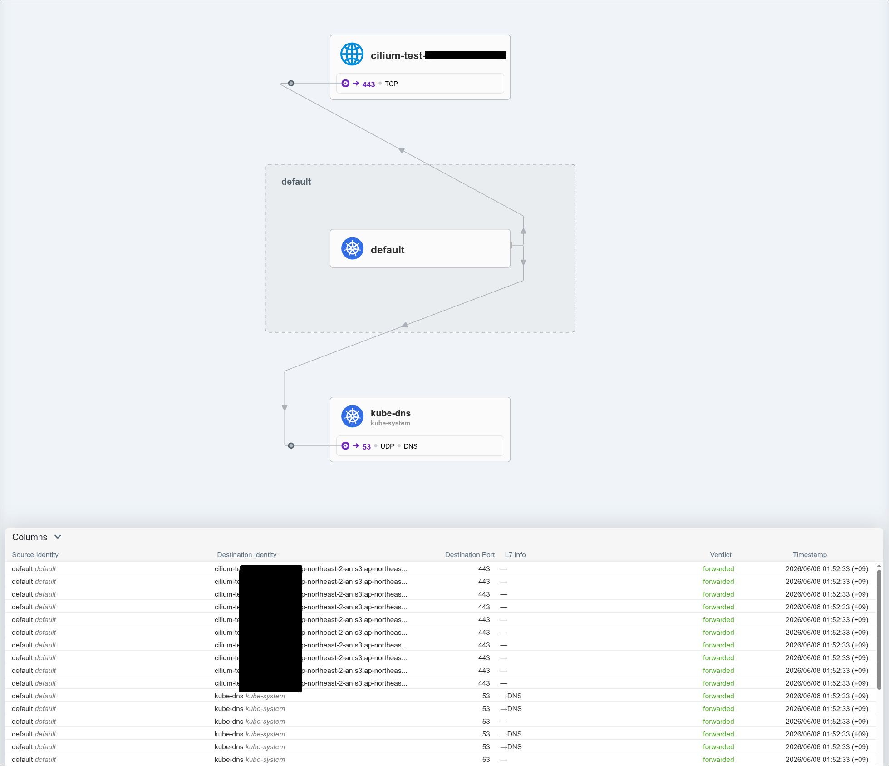

## 🚨 문제 상황

서버 Pod가 AWS S3에 접근해야 하는데, 계속해서 연결이 안되고 있었다. \
로그를 확인해보니, 아래와 같았다:

```plaintext
Traceback (most recent call last):
TimeoutError: timed out
...
urllib3.exceptions.ConnectTimeoutError: 
 (<AWSHTTPConnection(host='169.254.170.23', port=80) at 0xffffabb35d00>, 'Connection to 169.254.170.23 timed out. (connect timeout=2)')
...
botocore.exceptions.ConnectTimeoutError: 
 Connect timeout on endpoint URL: \"http://169.254.170.23/v1/credentials\"
...
```

Pod가 EKS Pod Identity Agent로부터 IAM 권한을 얻기 위해, `http://169.254.170.23/v1/credentials`에 요청을 하는데, 연결에 Timeout이 났다. \
egress 규칙으로 `169.254.170.23`에 `80`포트로 허용해도 계속 문제가 생겼다. \
Hubble UI를 통해서도 트래픽이 시각화되지 않았다.


---
## 🔐 EKS Pod Identity란

EKS Pod Identity는 EKS에서 Pod에게 IAM Role을 할당하는 새로운 방법이다. \
Pod Identity Agent는 daemonset으로 각 노드에 하나씩 있으며, Pod는 노드의 링크 로컬 주소 `169.254.170.23`에 자격 증명을 요청한다. \

동작 과정은 다음과 같다:
1. EKS에서 EKS Pod identity association으로 연결된 ServiceAccount를 사용하는 Pod가 새로 생성됨
2. EKS가 Pod의 manifest에 자동으로 환경변수를 및 token volume 주입
환경변수:
```yaml
env:
- name: AWS_CONTAINER_AUTHORIZATION_TOKEN_FILE
  value: "/var/run/secrets/pods.eks.amazonaws.com/serviceaccount/eks-pod-identity-token"
- name: AWS_CONTAINER_CREDENTIALS_FULL_URI
  value: "http://169.254.170.23/v1/credentials"
```
토큰:
```yaml
volumes:
- name: eks-pod-identity-token
  projected:
    sources:
    - serviceAccountToken:
        audience: pods.eks.amazonaws.com
        expirationSeconds: 86400
        path: eks-pod-identity-token
```
3. `/var/run/secrets/pods.eks.amazonaws.com/serviceaccount/eks-pod-identity-token`경로에 토큰이 생성
4. Pod를 노드에 스케줄링
5. SDK가 Pod Identity Agent에게 요청
    - 기본 credential provider chain을 따른다면, Pod Identity를 이용한다.
    - 노드의 링크 로컬 주소인 `http://169.254.170.23/v1/credentials`에 호출
6. Pod Identity Agent가 EKS Auth API호출(`AssumeRoleForPodIdentity` action을 사용)
    - EKS Auth API가 IAM Role의 자격 증명을 방급
7. Agent가 credentials를 SDK에 전달

> **IRSA(IAM Role for ServiceAccount)와의 비교** \
> IRSA는 기존의 전통적인 EKS에서의 Pod에게 자격 증명을 제공하는 방식이다. \
> Pod가 직접 sts에 접근하는 방식이었다.
>
> **EKS Pod Identity** 는 다음의 장점을 가진다:
> - 더 단순한 구조 
> - 더 높은 재사용성 구조 
> - OIDC provider에 대한 관리 필요 x 
> - IaC 친화적(ex. Terraform으로 association을 관리) 
> 
> 반면, **IRSA** 는 다음의 장점을 가진다: 
> - 기존 시스템 호환성 
> - cross-account 호환성 
> - EC2 Linux가 아닌 경우(Fargate, Outposts, EKS Anywhere 등) 
> 현재는 EC2 Linux 노드만 사용하는 경우, Pod Identity를 쓰는 것이 권장된다.

EKS Pod Identity는 EKS Auto Mode에서는 자동으로 설치되어 있으며, 직접 애드온으로 설치할 수 있다.

---
## 🛡️ CiliumNetworkPolicy의 Egress FQDN 룰 설정

노드의 링크 로컬 주소 `169.254.170.23` 대상으로 하는 트래픽이 `host` 대상 트래픽으로 식별한다고 한다. \
즉, CNP에서 `host` 엔티티 대상으로 허용해야 한다. 

Pod가 S3에 접근한다고 가정하면, 다음과 같은 CNP를 만들 수 있다:
```yaml
apiVersion: cilium.io/v2
kind: CiliumNetworkPolicy
metadata:
  name: aws-pod
  namespace: default
spec:
  endpointSelector:
    matchLabels:
      env: test
      cloud: aws
  egress:
    # Pod Identity Agent
    - toEntities:
      - host
      toPorts:
      - ports:
        - port: "80"
        - port: "2703"
    # S3 Bucket
    - toFQDNs:
      - matchName: s3.ap-northeast-2.amazonaws.com
      - matchPattern: "*.s3.ap-northeast-2.amazonaws.com"
      toPorts:
      - ports:
        - port: "443"
          protocol: TCP
    # Kube DNS
    - toEndpoints:
        - matchLabels:
            "k8s:io.kubernetes.pod.namespace": kube-system
            "k8s:k8s-app": kube-dns
      toPorts:
        - ports:
            - port: "53"
              protocol: ANY
          rules:
            dns:
              - matchPattern: "*"
```

Hubble UI를 보면, 다음과 같이 허용된다!


---
## 📚 Reference

- [AWS Docs - How Pod Identity Works](https://docs.aws.amazon.com/eks/latest/userguide/pod-id-how-it-works.html)
- [AWS Docs - EKS Pod identity vs IRSA](https://docs.aws.amazon.com/eks/latest/userguide/pod-identities.html)
- [GitHub Issue - cilium/ciium #34387](https://github.com/cilium/cilium/issues/34387)
