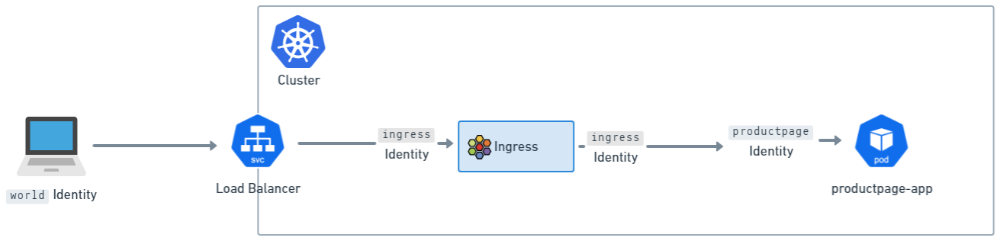
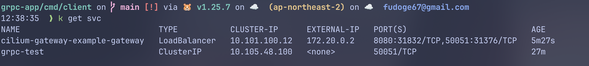
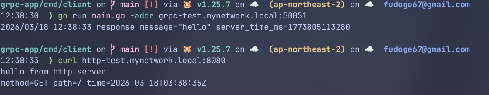

## 🛣️ Cilium Gateway API
Cilium Gateway API는 두 가지 모드를 지원한다:
- **Standalone DaemonSet mode**: 각 노드마다 별도의 Envoy를 실행
- **Embedded mode**: Cilium Agent에 Envoy를 내장

기본적으로 신규 설치에서는 Standalone DaemonSet mode를 사용한다. \
helm values에서 `envoy.enabled`를 false로 설정하면 Embedded mode로 변경할 수 있다.

```yaml
envoy:
  # @schema
  # type: [null, boolean]
  # @schema
  # -- Enable Envoy Proxy in standalone DaemonSet.
  # This field is enabled by default for new installation.
  # @default -- `true` for new installation
  enabled: ~
```

### 다른 Controller들과의 차이점

구현이 CNI와 결합이 얼마나 되었는가의 차이가 가장 크다. \
Cilium에게는 Ingress와 Gateway API는 네트워킹 스택의 일부이고, 다른 컨트롤러들과는 다르게 동작한다. \
다른 Ingress 또는 Gateway API 컨트롤러는 Deployment 또는 Daemonset으로 설치되어서 LoadBalancer 등으로 노출된다(Cilium도 가능하다) \
Cilium의 Ingress와 Gateway API의 설정은 Loadbalancer 또는 NodePort로 노출되어 있거나, Host network로 노출될 수 있다. \
**트래픽이 도착하면, eBPF 코드는 트래픽을 가로채서 투명하게 Envoy로 전달한다.** \
`CiliumNetworkPolicy`와의 연동도 가능하다.

### Cilium의 Ingress Config와 CiliumNetworkPolicy

Ingress와 Gateway API의 트래픽은 노드마다 있는 Envoy 프록시를 통해서 벡엔드 서비스에 도달한다. \
노드의 Envoy 프록시는 eBPF 정책 엔진과 상호작용하는 특수 코드가 있어서, 정책을 조회할 수 있다. \
수평 트래픽의 네트워크 정책을 조정할 수 있다.

그러나, ingress 설정에서는 추가 과정이 필요하다. \
Envoy에 도착한 트래픽은 Cilium Policy Engine에서 특별한 ingress 신원을 가진다. \
외부에서 오는 트래픽은 `world`라는 신원을 가진다. \
네트워크 정책을 클러스터에 적용할 때, `world → ingress → 목적지 pod`의 신원 설정이 중요하다.




> **NOTE** \
> Cilium을 통해 클러스터 내부에서 `ingress controller`를 사용하던, `gateway api` controller를 사용하던, envoy의 신원은 `ingress`이다.

### Source IP 가시성
벡엔드가 어느 IP에서 요청왔는지 이해하는 것에 대해서는 대부분의 애플리케이션에서 중요한 일이다. \
기본적으로, Cilium의 Envoy 인스턴스는 `X-Forwarded-For` 헤더를 붙여서 서버에 전달한다. \
그리고, 신뢰할 수 있는 hop 수를 조정해서, 어떤 IP를 실제 클라이언트로 볼지 결정한다.

`X-Forwarded-For`에는 값이 여러 개 추가될 수가 있다.

```Bash
# 순서대로 2, 1, 0번
X-Forwarded-For: 203.0.113.42, 10.0.0.5, 10.0.0.10
```

이 중에서 n번째 홉을 고르도록 해서, 맨 오른쪽 부터 0번이다. \
기본 값은 0으로, Envoy의 바로 앞단의 IP를 본다는 뜻이다. \
`X-Envoy-External-Address`에 실제 클라이언트 주소만 따로 떼어서 준다.

예를 들면, 앞단에 클라우드 로드 밸런서가 붙어있다면, `trusted hops=1`이어야 한다. \
이외 네트워크 구성에 따라 신뢰할 수 있는 앞단의 홉 수를 조정할 수 있다. 

홉의 수는 helm values에서 `gatewayAPI.xffNumTrustedHops`로 설정할 수 있다.

### externalTrafficPolicy
Cilium의 Ingress(Ingress, Gateway API 모두)는 `LoadBalancer` 또는 `NodePort`서비스를 사용한다.

Service 오브젝트는 Client IP를 가시성에 관련된 필드가 하나 있다: `externalTrafficPolicy`이다.

기존의 Kubernetes에서의 `externalTrafficPolicy`는 다음과 같다:
- `Local`: 로컬 노드의 Pod들에만 트래픽을 라우트한다.
    - 이 때문에, `kube-proxy`를 쓰는 기존 다른 CNI의 클러스터는 source IP 가시성을 보장하는 유일한 방법이다.
    - 이 경우, 노드들이 healthCheckNodePort를 열고, `http://<nodeIP>:<healthCheckNodePort>/healthz`로 요청을 보내면 로컬 Pod가 200을 응답할 것이고, 없으면 200이 아닌 응답을 보낼 것이다.
    - 때문에 실제 Pod로 라우트가능한 노드만 로드밸런서가 보낼 수 있다.
- `Cluster`: 노드는 클러스터 전역의 어디에도 트래픽을 보낼 수 있다.
    - 업스트림 로드밸런서들은 트래픽을 아무 노드에나 보낼 수 있다는 것을 알고, source IP를 변환할지도 모른다.
    - 즉, 대부분의 상황에서는 `externalTrafficPolicy: Cluster`는 벡엔드 Pod가 소스 IP를 안봐도 된다는 이야기이도 하다.

**그러나, Cilium Ingress에서는 트래픽이 어느 노드로 와도 그 노드의 로컬 Envoy가 TPROXY로 원본 source IP를 유지한 채 받기 때문에, Cluster여도 client IP visibility를 확보할 수 있다.** \
**또한 Envoy를 노출하는 Cilium Service에서는 Local이어도 모든 노드가 health check를 통과하도록 처리한다.**

즉, 아래와 같다:
- 로컬 노드에 애플리케이션 backend Pod가 없어도
- 로컬 Envoy는 존재하고 health check도 통과
- 요청은 일단 그 로컬 Envoy가 받고
- 이후 클러스터의 다른 노드에 있는 backend endpoint로 전달 가능

### TLS Passthrough 및 Source IP 가시성
Ingress와 Gateway API는 TLS Passthrough를 지원한다. \
TLS Passthrough에서는 Envoy가 TLS를 종료하지 않고 TCP 프록시로 동작하므로, HTTP 헤더인 X-Forwarded-For를 추가할 수 없다. 

Envoy는 TLS handshake의 `ClientHello`에 포함된 SNI(Server Name Indication) 를 보고 어떤 backend로 보낼지 결정한다. \
이후 backend와 새로운 TCP 연결을 만들어 TLS 스트림을 그대로 전달하기 때문에, backend 입장에서는 source IP가 원래 클라이언트가 아니라 Envoy IP로 보이게 된다.

### Host 네트워크 모드

Host 네트워크에 직접 연결하도록 노출할 수 있다. \
LoadBalancer가 불가능한 상황에서 외부에 노출할 때 유용하다.

helm values에 아래와 같이 설정하면 된다:
```YAML
gatewayAPI:
	enabled: true
	hostNetwork:
		enabled: true
```

한번 활성화되면, Gateway를 위한 호스트 네트워크 포트가 `spec.listeners.port`에 명시될 수 있다. \
포트는 `1023` 이상이어야 한다.

### Privileged Port로의 바인딩

기본적으로 Cilium L7 Envoy는 well-known포트를 쓸 권한이 없다. \
만약 1023이하의 포트를 고르려면, Helm 값에서 envoy.securityContext.capabilities.keepCapNetBindService=true가 설정되었고, `NET_BIND_SERVICE`를 설정해야 한다.

Standalone DaemonSet mode 예시:

```YAML
gatewayAPI:
  enabled: true
  hostNetwork:
    enabled: true
envoy:
  enabled: true
  securityContext:
    capabilities:
      keepCapNetBindService: true
      envoy:
      # Add NET_BIND_SERVICE to the list (keep the others!)
      - NET_BIND_SERVICE
```

Embedded mode 예시:

```YAML
gatewayAPI:
  enabled: true
  hostNetwork:
    enabled: true
envoy:
  securityContext:
    capabilities:
      keepCapNetBindService: true
securityContext:
  capabilities:
    ciliumAgent:
    # Add NET_BIND_SERVICE to the list (keep the others!)
    - NET_BIND_SERVICE
```

### Gatewat API리스너를 노드의 서브셋으로 배포

Cilium Gateway API Envoy 리스터는 노드의 부분집합으로 노출될 수 있다. \
host 네트워크 모드에서만 가능하고, node labelselector가 동작한다.

예시 values:

```YAML
gatewayAPI:
  enabled: true
  hostNetwork:
    enabled: true
    nodes:
      matchLabels:
        role: infra
        component: gateway-api
```

### Gateway API 주소 지원

Cilium Gateway는 Gateway API 스텍에 제공된 주소가 있다. \
`spec.addresses`는 Gateway의 IP주소로 쓰인다.

```YAML
apiVersion: gateway.networking.k8s.io/v1
kind: Gateway
metadata:
  name: my-gateway
spec:
  addresses:
  - type: IPAddress
    value: 172.18.0.140
  gatewayClassName: cilium
  listeners:
  - allowedRoutes:
      namespaces:
        from: Same
    name: web-gw
    port: 80
    protocol: HTTP
```

출력은 다음과 같이 예상된다:

```Bash
$ kubectl get gateway my-gateway
NAME         CLASS    ADDRESS        PROGRAMMED   AGE
my-gateway   cilium   172.18.0.140   True         2d7h
```
`io.cilium/lb-ipam-ips`를 `spec.infrastructure.annotations`를 IP설정에 썼다면, `spec.addresses`는 무시 될 것이다.

```YAML
apiVersion: gateway.networking.k8s.io/v1
kind: Gateway
metadata:
  name: my-gateway
spec:
  infrastructure:
    annotations:
      io.cilium/lb-ipam-ips: "172.18.0.141"
  addresses: # This will be ignored
  - type: IPAddress
    value: 172.18.0.140
  gatewayClassName: cilium
  listeners:
  - allowedRoutes:
      namespaces:
        from: Same
    name: web-gw
    port: 80
    protocol: HTTP
```

출력은 다음과 같다:

```Bash
$ kubectl get gateway my-gateway
NAME         CLASS    ADDRESS        PROGRAMMED   AGE
my-gateway   cilium   172.18.0.141   True         2d7h
```

---
## 🏃 Hands-On

### CRD설치 및 helm values 설정

Gateway API CRD를 설치해야 한다.
```bash
kubectl apply -f https://raw.githubusercontent.com/kubernetes-sigs/gateway-api/v1.4.1/config/crd/standard/gateway.networking.k8s.io_gatewayclasses.yaml
kubectl apply -f https://raw.githubusercontent.com/kubernetes-sigs/gateway-api/v1.4.1/config/crd/standard/gateway.networking.k8s.io_gateways.yaml
kubectl apply -f https://raw.githubusercontent.com/kubernetes-sigs/gateway-api/v1.4.1/config/crd/standard/gateway.networking.k8s.io_httproutes.yaml
kubectl apply -f https://raw.githubusercontent.com/kubernetes-sigs/gateway-api/v1.4.1/config/crd/standard/gateway.networking.k8s.io_referencegrants.yaml
kubectl apply -f https://raw.githubusercontent.com/kubernetes-sigs/gateway-api/v1.4.1/config/crd/standard/gateway.networking.k8s.io_grpcroutes.yaml
```

TLSRoute(experimental)도 설치하고 싶다면, 아래와 같이 설치한다.
```bash
kubectl apply -f https://raw.githubusercontent.com/kubernetes-sigs/gateway-api/v1.4.1/config/crd/experimental/gateway.networking.k8s.io_tlsroutes.yaml
```

gateway API가 활성화되어야 한다.
```yaml
gatewayAPI:
  enabled: true # ingress.enabled = false로 되어야 한다.
```

### 데모 애플리케이션 생성

```bash
git clone https://github.com/fudoge/cilium-playground.git
cd cilium-playground

# gRPC 애플리케이션
kubectl apply -f grpc/grpc-app

# HTTP 애플리케이션
kubectl apply -f http/http-app
```

### GatewayClass 생성

helm values에서 `gatewayAPI.gatewayClass.create: auto`로 설정하면 GatewayClass가 자동으로 생성된다. \

또는, 아래처럼 직접 만들 수있다.

```yaml
apiVersion: gateway.networking.k8s.io/v1
kind: GatewayClass
metadata:
  name: example-gateway-class
spec:
  controllerName: io.cilium/gateway-controller # Cilium gateway의 controller name임
  description: The default Cilium GatewayClass
  parametersRef:
    group: cilium.io
    kind: CiliumGatewayClassConfig
    name: example-gateway-config
    namespace: default
---
apiVersion: cilium.io/v2alpha1
kind: CiliumGatewayClassConfig
metadata:
  name: example-gateway-config
  namespace: default
spec:
  service:
    type: LoadBalancer
---
```

> **NOTE** \
> 로드밸런서 또는 외부 노출은 L2 announcement또는 BGP Peering으로 광고하거나, 다른 방법이 없다면 NodePort를 사용해야 한다.

### Gateway 생성

```yaml
apiVersion: gateway.networking.k8s.io/v1
kind: Gateway
metadata:
  name: example-gateway
spec:
  gatewayClassName: example-gateway-class
  listeners:
    - protocol: HTTP
      port: 8080
      name: web-gw
      # 같은 네임스페이스의 route만 허용. 만약 다른 namespace의 route를 허용하고 싶다면 `All`로 설정한다.
      # 또는 matchLabels등을 사용할 수 있다.
      allowedRoutes: 
        namespaces:
          from: Same
    - protocol: HTTP
      port: 50051
      name: grpc-gw
      allowedRoutes:
        namespaces:
          from: Same
```
grpc-gw도 HTTP 프로토콜임을 볼 수 있는데, gRPC도 http에서 동작하기 떄문이다.

### Route 생성

#### HTTPRoute

```yaml
apiVersion: gateway.networking.k8s.io/v1
kind: HTTPRoute
metadata:
  name: http-test-app
spec:
  parentRefs:
  - name: example-gateway
    namespace: default
    sectionName: http-gw # listener의 name과 일치해야 한다.
  hostnames:
    - http-test.mynetwork.local
  rules:
  - matches:
    - path:
        type: PathPrefix
        value: /
    backendRefs:
    - name: http-test
      port: 8080
```

#### GRPCRoute

```yaml
apiVersion: gateway.networking.k8s.io/v1
kind: GRPCRoute
metadata:
  name: grpc-test-app
spec:
  parentRefs:
    - name: example-gateway
      namespace: default
      sectionName: grpc-gw
  hostnames:
    - grpc-test.mynetwork.local
  rules:
    - matches:
        - method:
            service: test.v1.TestService
            method: Ping
      backendRefs:
        - name: grpc-test
          port: 50051
```

service와 method의 매칭은 아래 protobuf를 보면 이해 될 것이다. \
서비스명은 패키지 포함 풀 네임이어야 하며, 메서드 이름도 정확히 맞춰야 한다.
```protobuf
# proto/test/v1/test.proto
syntax = "proto3";

package test.v1;

option go_package = "test/v1;testv1";

service TestService {
  rpc Ping(PingRequest) returns (PingResponse);
}

message PingRequest {
  string message = 1;
}

message PingResponse {
  string message = 1;
  int64 server_time_ms = 2;
}
```

### 조회 및 요청 테스트

우선, service를 조회해보자. 
```bash
$ kubectl get svc
NAME                             TYPE           CLUSTER-IP      EXTERNAL-IP   PORT(S)                          AGE
cilium-gateway-example-gateway   LoadBalancer   10.101.100.12   172.20.0.2    8080:31832/TCP,50051:31376/TCP   5m27s
grpc-test                        ClusterIP      10.105.48.100   <none>        50051/TCP                        27m
http-test                        ClusterIP      10.96.66.40     <none>        8080/TCP                         5d12h
kubernetes                       ClusterIP      10.96.0.1       <none>        443/TCP                          17d
```



나는 /etc/hosts에서 EXTERNAL-IP를 추가해줬다.

```bash
# /etc/hosts
172.20.0.2 http-test.mynetwork.local grpc-test.mynetwork.local
```

이제, 요청을 보내보자.
```bash
# HTTP 요청
$ curl http-test.mynetwork.local:8080
hello from http server
method=GET path=/ time=2026-03-18T03:38:35Z

# gRPC 요청
# 데모 gRPC 서버에 대한 Client App: https://github.com/fudoge/cilium-playground/blob/main/grpc/grpc-app/cmd/client/main.go
$ go run main.go -addr grpc-test.mynetwork.local:50051
2026/03/18 12:38:33 response message="hello" server_time_ms=1773805113280
```



---
## 📚 Reference

- [Cilium - Gateway API](https://docs.cilium.io/en/stable/network/servicemesh/gateway-api/gateway-api/)
- [Cilium - Gateway API examples](https://docs.cilium.io/en/stable/network/servicemesh/gateway-api/gateway-api/#examples) - 더 많은 예시들은 여기에서 볼 수있다.
- [Hands-On GitHub Source Code](https://github.com/fudoge/cilium-playground)
