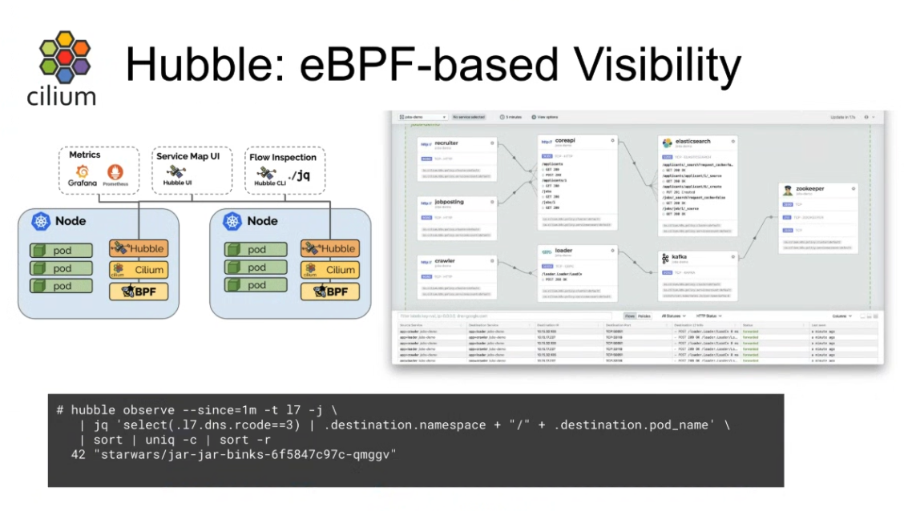
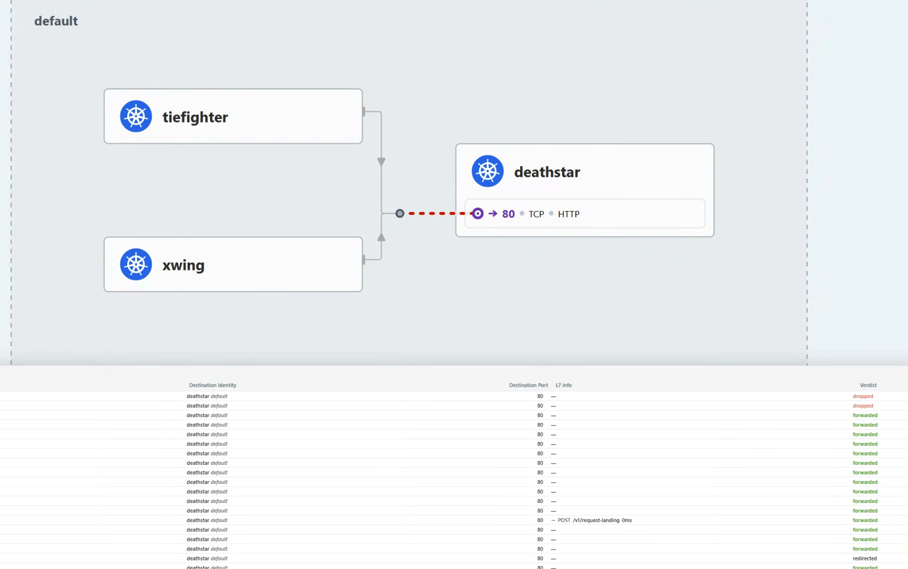
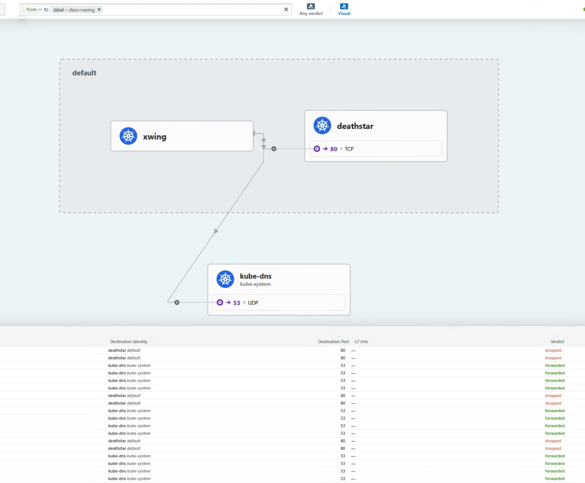
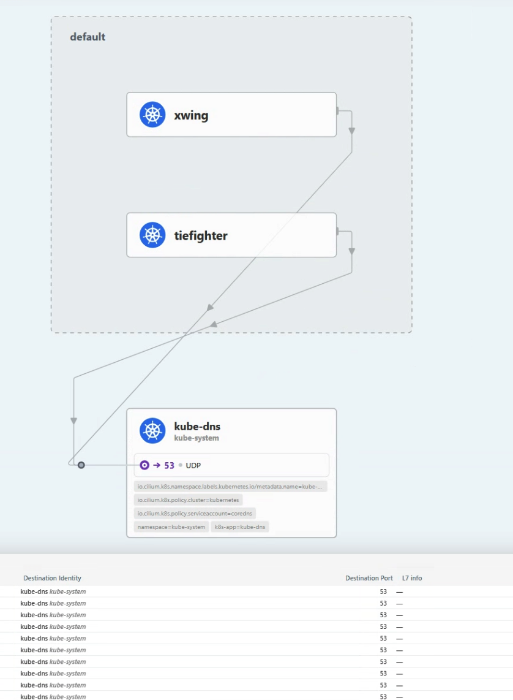
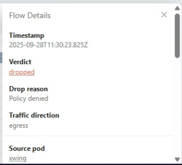
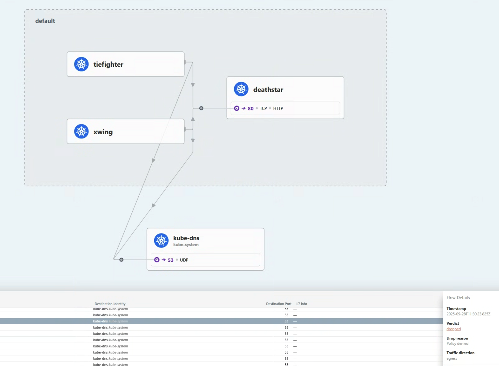

Hubble은 분산 네트워크 시각화 플랫폼이다.
서비스들의 통신을 깊게 관찰하기 위해 Cilium과 eBPF위에서 투명하게, 즉 애플리케이션 코드 없이 동작한다.

Cilium 위에서 동작하기에, Hubble은 eBPF를 이용할 수 있다.
eBPF를 이용함으로써, Hubble은 깊고 자세한 관찰성을 제공하는 동안 오버헤드를 제거하는 동적인 접근을 허용하는 프로그래머블한 관측, 즉 필요할 때 원하는 데이머만을 추출하는 관측을 제공한다.
  
---
## 🎯 Hubble이 제공하는 것들



- Service dependencies & communication map
    - 어떤 서비스들이 서로 통신하고 있고, 얼마나 자주 통신하는지
    - 서비스의 의존 그래프가 어떻게 생겼는지
    - 어떠한 HTTP 호출이 요청되고 있는지
    - 어떠한 Kafka 토픽이 생산되고 소비되는지
- Network moitoring & alerting
    - 실패하고 있는 네트워크 통신이 있는지, 있으면 왜 실패하는지
    - 어느 서비스가 최근 5분간 DNS문제를 겪었는지
    - 어떤 서비스가 TCP 타임아웃이 났는지
    - 응답받지 못한 TCP SYN응답이 있는지
- Application monitoring
    - HTTP 5xx 또는 4xx에러의 비율은 어떤지
    - HTTP요청과 응답에 p95, p99는 어떤지
    - 서비스의 성능 병목은 어느 지점인지
    - 레이턴시는 어느 정도인지
- Security observability
    - 어느 서비스가 네트워크정책에 의해 연결이 막히는지
    - 어느 서비스가 클러스터 외부와 통신하는지
    - 어느 서비스가 특정 DNS이름을 질의했는지


이러한 모든 것들은 eBPF에 의해 가능해졌다.
eBPF는 쿠버네티스 클러스터 내부에서 애플리케이션 워크로드들을 위한 네트워크 통신에 대해 깊은 시각화를 제공한다.
Hubble과 함께라면, 이러한 정보들을 보고 쿠버네티스 메타데이터로 필터링할 수 있다.

---
## 🐝 Hubble 운영 컴포넌트들
CIlium에서 Hubble을 사용하면, 다음의 컴포넌트들이 구성된다
- **Hubble Server**
    - Cilium Agent의 일부로 동작하게 되며, 각 Node마다 존재한다.
    - gRPC 옵저버 서비스를 구현하여, 노드의 네트워크 플로우에 접근하는 것을 지원한다.
    - gRPC peer 서비스를 구현하여, Hubble relay가 peer Hubble Servers를 디스커버리 하도록 쓰인다.
- **Hubble Peer Kubernetes Service**
    - Kuberentes Service 리소스.
    - Hubble Realy가 사용가능한 Hubbler Server들을 조회하도록 한다.
- **Hubble Relay Kubernetes Deployment**
    - 클러스터 내의 Hubble Server를 조회하기 위해, Cluster-wide의 범위의 Hubble Peer Service와 통신한다.
    - Hubble Server와 gRPC API로 계속 연결을 유지한다.
    - 클러스터 전역의 관찰성을 위해 API를 노출한다.
- **Hubble Relay Kubernetes Service**
    - Hubble UI Service에 의해 쓰인다
    - Hubble CLI도구에 의해 노출될 수 있다
- **Hubble UI Kubernetes Deployment**
    - Hubble UI Kubernetes Service의 서비스 벡엔드로 동작한다
- **Hubble UI Kubernetes Service**
    - 클러스터 네트워킹 시각화에 쓰인다

즉, Hubble Server각 Cilium Agent에 동작하고, Hubbel Relay가 그런 Hubble Relay들의 플로우 데이터를 모으고, Hubble UI가 Hubble Relay로부터 데이터를 받아서 UI 대시보드를 만든다.

---
## 🌊 네트워크 플로우

### 모든 것이 Context

네트워크 플로우는 Hubble의 값에 대한 핵심 개념이다.
플로우는 tcpdump와 같은 곳에서의 패킷 캡처와 같다.
패킷 내용에 집중하는 대신, 플로우는 당신이 어떻게 Cilium-managed Kubernetes Cluster에서 패킷이 프르는지를 이해시켜주는 데 특화되어있다.
즉, 내용은 담지 않는다.

Flow는 맥락적인 정보를 담는다.
그 맥락적인 정보는 당신이 source/destination IP도 모른채로 해당 패킷이 클러스터 내에서 어디로 가는지와 어디서 드롭되고 포워딩되는지에 대해 디해하는 데 돕는다.

Kubernetes에서 IP란, 임시적인 자원이기에, 필터링과 같은 곳에서 신뢰성이 없다.
단순히 같은 IP주소를 몇 분간 캡처하는 것은 데이터센터의 VM에서나 하는 일이고, Kubernetes Pod의 네트워킹에서의 방법은 아니다.
Flow는 Kubernetes 클러스터 내에서 더 내구성있는 맥략적 메타데이터를 제공한다.

더 나아가서, 당신은 플로우에 label을 달아서 context를 Prometheus 메트릭으로도 노출시킬 수도 있다.
Flow는 당신의 네트워킹 대시보드에서 보일 수 있도록 하고, 애플리케잇녀 성능에 상응하여 스케일 업 또는 다운에 좋은 지표가 된다.
Flow로부터 기반한 메트릭 label은 Cilium의 신원 모델에서의 큰 장점이다.

아래는 Hubble CLI도구로 캡처해서 얻은 플로우의 맥락적 메타데이터이다.
이 플로우는 Death Star 서비스 엔드포인트 노드에서 왔고, TIE fighter pod가 PUT Request를 거절받은 것을 볼 수 있다!

```JSON
{
      "time": "2023-03-23T22:35:16.365272245Z",
      "verdict": "DROPPED",
      "Type": "L7",
      "node_name": "kind-kind/kind-worker",
      "event_type": {
           "type": 129
      },
      "traffic_direction": "INGRESS",
      "is_reply": false,
      "Summary": "HTTP/1.1 PUT http:‌//deathstar.default.svc.cluster.local/v1/exhaust-port"
      "IP": {
"source": "10.244.2.73",
           "destination": "10.244.2.157",
           "ipVersion": "IPv4"
      },
      "source": {
           "ID": 62,
           "identity": 63675,
           "namespace": "default",
           "labels": [...],
           "pod_name": "tiefighter"
      },
      "destination": {
                 "ID": 601,
                 "identity": 25788,
                 "namespace": "default",
                 "labels": [...],
                 "pod_name": "deathstar-54bb8475cc-d8ww7",
                 "workloads": [...]
      },
      "l4": {
           "TCP": {
                "source_port": 45676,
                "destination_port": 80
             }
      },
      "l7": {
           "type": "REQUEST",
           "http": {
                "method": "PUT",
                "Url": "http:‌//deathstar.default.svc.cluster.local/v1/exhaust-port",
                ...
           }
      }
}
```

JSON객체 안에 다양한 맥락적 정보가 들어있는 것을 볼 수 있다.
이러한 정보 덕에, 네트워킹 디버깅에서 유용한 정보가 된다.

### 플로우 필터링

만약 당신이 특정 Node로부터의 이벤트 플로우를 보고 싶다면, 당신은 `hubble observe --follow`로 Cilium Agent로부터 정보를 받아와서
Cilium datapath에서 각 패킷을 어떻게 평가하는지 볼 수 있다.
  
우선 지금은, 단일 노드에서의 플로우를 봐보도록 하자.

```Bash
17:25:28 in ~/cilium-lab …
➜ kubectl -n kube-system exec -ti pod/cilium-5jhjt -c cilium-agent --  hubble observe --from-label "class=tiefigter" --to-label "class=deathstar" --verdict DROPPED --last 1 -o json
{"lost_events":{"source":"HUBBLE_RING_BUFFER","num_events_lost":"1"},"node_name":"kubernetes/worker1","time":"2025-09-28T08:25:44.749505064Z"}
```


`--from-label` 로 TIE fighter pod를 소스로 하고, `--to-label`로 deathstar 엔드포인트로 필터링했다.
`--verdict` 필터는 드롭된 패킷들만 보도록 해준다.


> **Note**  
> pod의 이름은 본인 클러스터 안에서의 Pod이름으로 해야 합니다

### 정보 스트림 통합

Cilium Agent의 Hubble Client를 이용하는건 Node의 상황만 보이기에, 한정적이다.
만약 당신이 같은 명령을 다른 노드에서 하면, 아무 것도 볼 수 없을 것이다.

Cluster전역에서 관찰하기 위해, Hubble Relay가 필요하다.
Hubble CLI도구를 사용하여 Death Star 엔드포인트에 대한 플로우를 필터할 수 있다.

Hubble Relay 서비스는 뒤에서 Hubble Server API들과 통신한다.
Hubble CLI가 설치되어있다면, 우린 Cluster단위의 Hubble Relay service에 접근가능하다.
Hubble Relay 서비스를 노출시켜서, hubble명령어를 사용할 수 있다.

```Bash
cilium hubble port-forward &
hubble status
Healthcheck (via localhost:4245): Ok
Current/Max Flows: 10,201/12,285 (83.04%)
Flows/s: 7.51
Connected Nodes: 3/3
```


포트포워딩이 되면, 당신은 Hubble CLI도구를 열어서 Cluster전역의 네트워크 흐름을 얻을 수 있다.
```Bash
hubble observe --to-label "class=deathstar" --verdict DROPPED --all
Mar 24 01:41:14.758: default/tiefighter:58374 (ID:63675) -> default/deathstar-54bb8475cc-4pv5c:80 (ID:25788) http-request DROPPED (HTTP/1.1 PUT http:‌//deathstar.default.svc.cluster.local/v1/exhaust-port)
Mar 24 01:41:17.254: default/tiefighter:48852 (ID:63675) -> default/deathstar-54bb8475cc-d8ww7:80 (ID:25788) http-request DROPPED (HTTP/1.1 PUT http:‌//deathstar.default.svc.cluster.local/v1/exhaust-port)
Mar 24 01:41:26.495: default/xwing:59940 (ID:828) <> default/deathstar-54bb8475cc-d8ww7:80 (ID:25788) policy-verdict:none INGRESS DENIED (TCP Flags: SYN)
Mar 24 01:43:38.458: default/xwing:42378 (ID:828) <> default/deathstar-54bb8475cc-4pv5c:80 (ID:25788) policy-verdict:none INGRESS DENIED (TCP Flags: SYN)
```

출력 결과는 Death Star 벡엔드 Pod의 플로우를 포함한다.
아무것도 안해도 되긴 하지만, label로 필터를 해줄 수 있다.
모든 플로우 정보가 집계되기에, 필터를 해주는 것이 좋다.

### Hubble UI를 연동하여 시각화

Hubble CLI 도구는 특정 문제를 진단하려는데, 클러스터 전반의 네트워크 흐름을 보고 싶을 때 좋다.
당신은 Hubble UI 서비스를 로컬에서 확인할 수 있다:

```Bash
cilium hubble ui
```

자동 port-forward를 지원하고, local에서 볼 수 있도록 해준다.
Hubble UI service는 반응형 서비스 맵을 제공하여 네트워크 흐름을 관찰할 수 있도록 해준다.
  


Hubble UI는 NetworkPolicy.io에서의 Hubble flow처럼 시각화를 제공한다.

---
## 💨 실습

### 상황
당신은 CiliumNetworkPolicy를 만들어서 Death Star API를 X-wing 요청으로부터 막았다.
그러나, Imperial cluster내부 전체에서는?
X-wings가 또 다른 무언가와 통신한다면?

### 세팅
이전 NetworkPolicy까지 되어있음을 가정합니다.
[Hubble CLI도구](https://docs.cilium.io/en/stable/observability/hubble/setup/index.html#install-the-hubble-client)를 깔아보자.

```Bash
20:00:16 in ~ …
➜ hubble version
hubble v1.18.0@HEAD-766e8c9 compiled with go1.24.5 on linux/amd64
```

우선, Hubble Relay를 Cilium CLI로 포트포워드 한다:
```Bash
cilium hubble port-forward &
```

이제, Hubble CLI는 통신가능하다.
추가 설정으로 원격에 포트포워드하지 않고도 가능하긴 하다.

```Bash
20:01:56 in ~/cilium-lab …
✦ ➜ hubble status
Healthcheck (via localhost:4245): Ok
Current/Max Flows: 8,190/8,190 (100.00%)
Flows/s: 39.05
Connected Nodes: 2/2
```
  
이렇게 착륙 요청을 여러 번 날려보자.
```Bash
20:03:00 in ~/cilium-lab …
✦ ➜ kubectl exec tiefighter -- curl --connect-timeout 10 -s -XPOST deathstar.default.svc.cluster.local/v1/request-landing
Ship landed

20:05:01 in ~/cilium-lab …
✦ ➜ kubectl exec tiefighter -- curl --connect-timeout 10 -s -XPOST deathstar.default.svc.cluster.local/v1/request-landing
Ship landed

20:05:03 in ~/cilium-lab …
✦ ➜ kubectl exec tiefighter -- curl --connect-timeout 10 -s -XPOST deathstar.default.svc.cluster.local/v1/request-landing
Ship landed

20:05:05 in ~/cilium-lab …
✦ ➜
```
  
Flow 메트릭에 변화가 생긴 것을 볼 수 있다.
```Bash
20:05:56 in ~/cilium-lab …
✦ ➜ hubble status
Healthcheck (via localhost:4245): Ok
Current/Max Flows: 8,190/8,190 (100.00%)
Flows/s: 45.50
Connected Nodes: 2/2
```
  
### X-wing 파드 플로우 필터링하기
X-wing으로 착륙요청을 날려보자.
L3/4정책에 의해 트래픽이 막힌다.

```Bash
20:06:01 in ~/cilium-lab …
✦ ➜ kubectl exec xwing -- curl --connect-timeout 2 -s -XPOST deathstar.default.svc.cluster.local/v1/request-landing
command terminated with exit code 28
```

X-wing 요청이 거부된 걸 확인했다면, curl명령을 더 해서 Death Star service가 요청을 거부하는지 봐보자.
Hubble CLI로 확인해보자.

```Bash

20:13:14 in ~/cilium-lab …
✦ ➜ kubectl exec xwing -- curl --connect-timeout 2 -s -XPOST deathstar.default.svc.cluster.local/v1/request-landing
command terminated with exit code 28

20:13:18 in ~/cilium-lab took 2.2s …
✦ ➜ kubectl exec xwing -- curl --connect-timeout 2 -s -XPOST deathstar.default.svc.cluster.local/v1/request-landing
command terminated with exit code 28

20:13:21 in ~/cilium-lab took 2.2s …
✦ ➜ kubectl exec xwing -- curl --connect-timeout 2 -s -XPOST deathstar.default.svc.cluster.local/v1/request-landing
command terminated with exit code 28

20:13:25 in ~/cilium-lab took 2.2s …
✦ ➜ kubectl exec xwing -- curl --connect-timeout 2 -s -XPOST deathstar.default.svc.cluster.local/v1/request-landing
command terminated with exit code 28

20:13:28 in ~/cilium-lab took 2.2s …
✦ ➜ kubectl exec xwing -- curl --connect-timeout 2 -s -XPOST deathstar.default.svc.cluster.local/v1/request-landing
command terminated with exit code 28

20:13:31 in ~/cilium-lab took 2.2s …
✦ ➜ hubble observe --label "class=xwing" --last 10
Sep 28 11:13:26.462: default/xwing:34428 (ID:13885) <> default/deathstar-74c8f5ff5c-h6rbl:80 (ID:24949) policy-verdict:none INGRESS DENIED (TCP Flags: SYN)
Sep 28 11:13:26.463: default/xwing:34428 (ID:13885) <> default/deathstar-74c8f5ff5c-h6rbl:80 (ID:24949) Policy denied DROPPED (TCP Flags: SYN)
Sep 28 11:13:28.467: default/xwing:46542 (ID:13885) -> kube-system/coredns-66bc5c9577-fsr7d:53 (ID:32219) to-overlay FORWARDED (UDP)
Sep 28 11:13:28.468: default/xwing:46542 (ID:13885) <- kube-system/coredns-66bc5c9577-fsr7d:53 (ID:32219) to-endpoint FORWARDED (UDP)
Sep 28 11:13:28.468: default/xwing:58261 (ID:13885) -> kube-system/coredns-66bc5c9577-qxshr:53 (ID:32219) to-overlay FORWARDED (UDP)
Sep 28 11:13:28.469: default/xwing:58261 (ID:13885) <- kube-system/coredns-66bc5c9577-qxshr:53 (ID:32219) to-endpoint FORWARDED (UDP)
Sep 28 11:13:28.469: default/xwing:43572 (ID:13885) -> kube-system/coredns-66bc5c9577-qxshr:53 (ID:32219) to-overlay FORWARDED (UDP)
Sep 28 11:13:28.470: default/xwing:43572 (ID:13885) <- kube-system/coredns-66bc5c9577-qxshr:53 (ID:32219) to-endpoint FORWARDED (UDP)
Sep 28 11:13:28.470: default/xwing:34440 (ID:13885) <> default/deathstar-74c8f5ff5c-rp7rx:80 (ID:24949) policy-verdict:none INGRESS DENIED (TCP Flags: SYN)
Sep 28 11:13:28.470: default/xwing:34440 (ID:13885) <> default/deathstar-74c8f5ff5c-rp7rx:80 (ID:24949) Policy denied DROPPED (TCP Flags: SYN)
Sep 28 11:13:28.473: default/xwing:60561 (ID:13885) -> kube-system/coredns-66bc5c9577-qxshr:53 (ID:32219) to-endpoint FORWARDED (UDP)
Sep 28 11:13:28.473: default/xwing:60561 (ID:13885) <- kube-system/coredns-66bc5c9577-qxshr:53 (ID:32219) to-overlay FORWARDED (UDP)
Sep 28 11:13:28.474: default/xwing:46542 (ID:13885) -> kube-system/coredns-66bc5c9577-fsr7d:53 (ID:32219) to-endpoint FORWARDED (UDP)
Sep 28 11:13:28.474: default/xwing:46542 (ID:13885) <- kube-system/coredns-66bc5c9577-fsr7d:53 (ID:32219) to-overlay FORWARDED (UDP)
Sep 28 11:13:28.475: default/xwing:58261 (ID:13885) -> kube-system/coredns-66bc5c9577-qxshr:53 (ID:32219) to-endpoint FORWARDED (UDP)
Sep 28 11:13:28.476: default/xwing:58261 (ID:13885) <- kube-system/coredns-66bc5c9577-qxshr:53 (ID:32219) to-overlay FORWARDED (UDP)
Sep 28 11:13:28.476: default/xwing:43572 (ID:13885) -> kube-system/coredns-66bc5c9577-qxshr:53 (ID:32219) to-endpoint FORWARDED (UDP)
Sep 28 11:13:28.477: default/xwing:43572 (ID:13885) <- kube-system/coredns-66bc5c9577-qxshr:53 (ID:32219) to-overlay FORWARDED (UDP)
Sep 28 11:13:29.528: default/xwing:34440 (ID:13885) <> default/deathstar-74c8f5ff5c-rp7rx:80 (ID:24949) policy-verdict:none INGRESS DENIED (TCP Flags: SYN)
Sep 28 11:13:29.528: default/xwing:34440 (ID:13885) <> default/deathstar-74c8f5ff5c-rp7rx:80 (ID:24949) Policy denied DROPPED (TCP Flags: SYN)
```

`deathstar-xxx` pod들 관련 통신을 볼 수 있다.
그러나, `kube-system/coredns-xxxxx` pod들도 볼 수 있다
DNS lookup이 있기 때문이다.

Hubble UI에서 확인해보자:

```Bash
cilium hubble ui
```
  


Hubble flows는 xwing Pod가 kube-dns와 통신한다는 것을 보여준다.
kube-dns를 클릭하면, kube-dns의 시점으로 플로우들이 보인다.
xwing과 tiefighter Pod들이 Kube-dns를 쓰는 것을 볼 수 있다.
xwing이 kube-dns도 못쓰게 해야한다.



### DNS Deny Policy 생성

X-wing이 DNS를 쓸 수 없게 하려면, EgressDeny정책을 적용해주면 된다:
`xwing-dns-deny-policy.yaml`을 만들자:

```YAML
apiVersion: "cilium.io/v2"
kind: CiliumNetworkPolicy
metadata:
  name: "xwing-dns-deny"
spec:
  endpointSelector:
    matchLabels:
      class: xwing
  egressDeny:
  - toEndpoints:
    - matchLabels:
        namespace: kube-system
        k8s-app: kube-dns
```

이 정책은 `class=xwing`으로 label이 붙은 모든 Pod의 `k8s-app=kube-dns`label이 붙은 Pod로의 통신을 모두 차단한다.

적용해보자.
```Bash
kubectl apply -f xwing-dns-deny-policy.yaml
```

이제, xwing의 요청 에러가 다르게 뜬 것을 볼 수 있다:

```Bash
20:29:59 in ~/cilium-lab took 2.2s …
➜ kubectl exec xwing -- curl --connect-timeout 2 -s -XPOST deathstar.default.svc.cluster.local/v1/request-landing
command terminated with exit code 28
```

KubeDNS의 사용도 막힌 것을 볼 수 있다.



그러나, tiefighter는 잘 동작한다!
```Bash
20:30:52 in ~/cilium-lab …
➜ kubectl exec tiefighter -- curl --connect-timeout 2 -s -XPOST deathstar.default.svc.cluster.local/v1/request-landing
Ship landed
```

---
## 📚 요약
Hubble CLI도구와 Hubble UI로 네트워크 흐름을 챙겨볼 수 있게 되었다.
Hubble CLI도구로, 당신은 시스템의 통신흐름을 관찰하고, 서비스의 엔드포인트 통신을 label로 필터링할 수 있다.
Hubble UI로 서비스 맵을 그려서 시각화를 할 수 있고, 통신이 어떻게 되어가고 있는지 확인할 수 있다.

