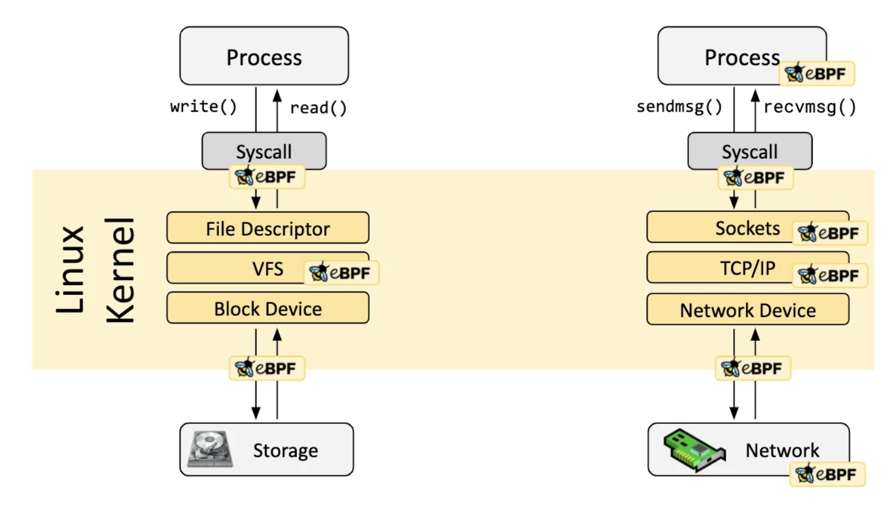
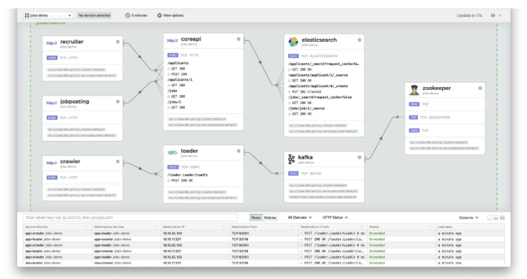
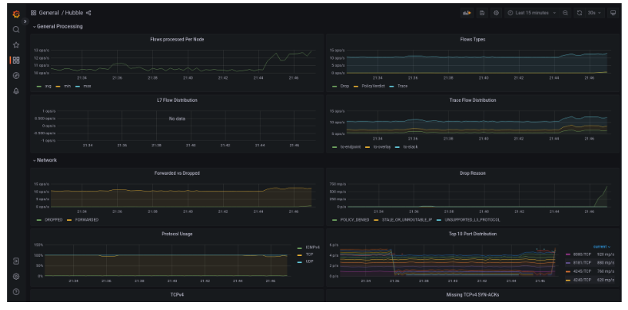

## 🐝 Cilium

**Cilium은 워크로드 간의 네트워크 연결을 제공하고, 보안을 책임지고, 관찰성을 부여하는 오픈 소스, 클라우드 네이티브 솔루션이다.**  
쿠버네티스 환경에서, Cilium은 Pod 간의 연결을 제공하는 네트워크 플러그인으로 동작한다.  
네트워크 정책과 투명한 암호화로 보안을 제공하고, Hubble 컴포넌트는 투명성을 제공한다.    
eBPF덕분에, Cilium의 기능들은 모두 커널에 직접 프로그래밍되어 애플리케이션의 워크로드에서 완전 투명하게 보일 수 있다.

---
## 🕸️ 대규모 네트워크에서의 컨테이너 네트워킹 문제 해결

동적이고 복잡한 마이크로서비스 세계에서, 네트워크 IP와 포트 주소를 맞추는 것은 매우 절망적일 수 있다.  
전통적인 도구들은 컨테이너 네트워킹에서 비효율적이고, 안전하지 못했다.  
Cilium은 대규모의, 동적으로 컨테이너화된 환경에서 컨테이너와 쿠버네티스에서의 HTTP, gRPC, Kafka와 같은 API 프로토콜들을 네티이브하게 이해한다.   
전통적인 방화벽보다 더 단순하고 강력하다.

---
## 🌐 eBPF

Cilium은 쿠버네티스와 같은 마이크로서비스 플랫폼에서 네트워크 스택을 생성해준다.  
eBPF는 Cilium의 보안 시각화와 제어 로직을 **리눅스 커널 수준에서 제공**한다.  
eBPF는 리눅스 커널을 프로그래머블하게 만들어서, Cilium과 같은 애플리케이션이 커널의 서브시스템으로 들어가게 한다.  
eBPF가 커널에서 동작하기에, Cilium의 보안 정책은 애플리케이션 코드나 컨테이너의 설정을 건드리지 않도록 한다.  
eBPF 프로그램이 리눅스 네트워크 경로로 들어가서, 패킷이 네트워크 소켓에 들어올 때, 정책에 따라 패킷을 드롭하는 등에 사할 수 있다.  

eBPF는 이전에는 불가능했던 수준의 세밀함과 효율성으로 시스템과 애플리케이션을 가시화하고 제어할 수 있게 해준다.  
애플리케이션을 변경할 필요 없이 완전히 투명하다.  
Cilium은 효율적인 ID개념을 도입하여, 쿠버네티스의 label과 같은 컨텍스트 정보를 eBPF기반 네트워킹 로직에 결합하여 eBPF의 강력한 기능을 활용한다.

---
## 🍯 Cilium이 제공하는 것들

### 네트워킹

파드와 다른 컴포넌트들을 포함한 통신을 제공한다.  
L3계층에서의 단순한 플랫 레이어를 구현하여, 여러 클러스터와 애플리케이션 컨테이너들이 통신할 수 있게 해준다.  
기본적으로, Cilium은 모든 호스트간 걸치는 가상의 네트워크인 **오버레이 네트워킹 모델**을 지원한다.  
오버레이 네트워크에서의 트래픽은 서로 다른 호스트간 캡슐화된다.  

이것이 기본적으로 사용되는 이유는, 최소한의 인프라와 호스트간 IP만 연결된 통합만을 요구하여 설정이 단순하기 때문이다.  
또한, **네이티브 라우팅 네트워크 모델** 또한 옵션으로 제공되는데, 각 호스트에서 전통적인 라우팅 테이블을 이용해서 파드 또는 외부 IP주소들간의 통신을 좌우한다.  

이 모드는 네트워크 인프라에 대한 이해도가 높은 사용자들에게 제공된다.  
이는 IPv6네트워크에서 잘 어울리고, 클라우드 네트워크 라우터나 기존 라우팅 데몬 등에서도 잘 동작한다.  

### 신원확인 네트워크 정책

네트워크 정책은 어느 워크로드가 다른 워크로드에 통신하도록 허용되는지를 정의하여 Deployment가 다른 예상치 못한 트래픽으로부터 통신하지 않게 한다.  
Cilium은 네이티브 Kubernetes **NetworkPolicies**를 강제할 수도 있고, 향상된 **CiliumNetworkPolicy**라는 CRD를 쓰게할 수도 있다.  
IP주소 및 포트 기반의 방화벽 워크로드는 기존 쿠버네티스 환경에서 모든 노드의 방화벽 규칙을 조작하게 하여 방화벽 규칙을 새로 구성시킨다.  
이는 확장에 매우 어렵다.  

이 상황을 피하기 위해, Cilium은 애플리케이션 컨테이너 그룹에 Kubernetes label과 같은 메타데이터로 신원을 부여한다.  
이 신원은 애플리케이션 컨테이너로부터 방출된 패킷에 연관되어, 패킷을 수신하는 노드의 eBPF 프로그램이 리눅스 방화벽 없이 효율적으로 신원을 확인할 수 있도록 한다.  

예를 들어, **deployment가 확장되어, 새로운 Pod가 클러스터 어딘가에 생기면, 새로운 Pod는 기존 Pod들과 같은 신원을 가진다.**  
eBPF 프로그램은 네트워크 정책의 잦은 업데이트를 시키지 않는다. Pod identity가 있기 때문이다!  
전통적인 방화벽이 L3~4의 정책을 시행했다면, Cilium은 REST/HTTP, gRPC, Kafka와 같은 L7급 정책까지도 추가로 가능하다.   

애플리케이션 프로토콜에 대응하는 네트워크 정책을 만드는 것을 제공할 수 있다:  
- HTTP GET을 `/public/.*.`에 대해서만 허용하고, 나머지 거부
- REST호출의 HTTP 헤더가 `X-Token: [0-9+]` 을 반드시 가지도록 설정

### 투명 암호화

서비스 간의 통신 중의 암호화는 PCI 또는 HIPPA와 같은 규제에서 필수 요구사항이 되었다.  
Cilium은 **설정하기 쉬운 투명 암호화를 제공**한다.  
IPSec이나 WireGuard를 이용하는데, 그들이 활성화되면, 노드 간의 보안 트래픽이 아무 재설정을 요구하지 않고 활성화된다.

### 멀티-클러스터 네트워킹

Cilium의 **Cluster Mesh** 는 서로 다른 쿠버네티스 클러스터의 서비스 간의 통신을 쉽게 지원한다.  
서비스를 서로 다른 리전의 클러스터에 배포하여 고가용서을 보장시킬 수도 있다.

### 로드 밸런싱

Cilium은 애플리케이션 컨테이너와 외부 서비스 간 분산된 로드밸런싱을 제공한다.  
Cilium은 기존의 kube-proxy를 대체하여 standalone load balancer로 동작할 수 있다.  
로드밸런싱은 eBPF에 구현어있고, 이는 해시 테이블을 이용하여 거의 **무한한 확장성을 가져 효율적**이다.

### 향상된 네트워크 관찰성

Cilium은 클러스터 내의 네트워킹 문제를 쉽게 식별하고 고칠 수 있게 제공한다.  
Cilium은 **Hubble**이란 네트워크 관찰성 도구를 포함한다.  
Hubble은 관찰성을 부여하여 Cilium의 트래픽 필터링을 더 쉽게 하여 신원 컨셉을 더 쉽게 만든다.  

또한 다음을 제공한다:
- L3/4, L7네트워크 트래픽에 대한 가시성 제공
- 메타데이터와 함께 이벤트 모니터링

패킷이 드롭되면, 도구는 소스와 목적지 IP 뿐만 아니라, 송신자와 수신자의 전체 label정보들도 추출해준다.
- Prometheus 메트릭 export와 조합이 좋다
- GUI로 보기 쉽게 제공한다

### Prometheus 메트릭

Cilium과 Hubble은 네트워크 성능과 지연 등을 **Prometheus로 제공**하여 Cilium 메트릭을 대시보드에 통합할 수 있다.

### 서비스 메시

Cilium은 **Ingress**와 **Gateway API** 호환을 제공하고, 사이드카 제공 없이 서비스 메시의 모든 스펙을 구현한다.
