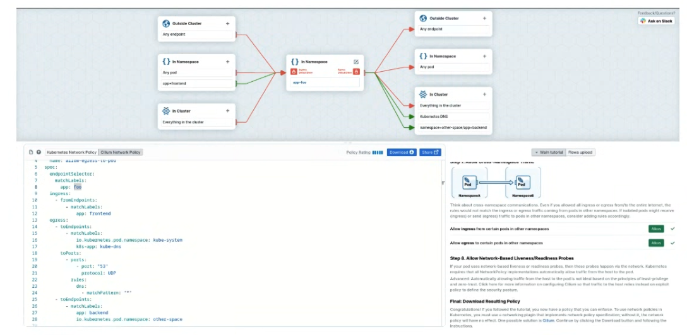
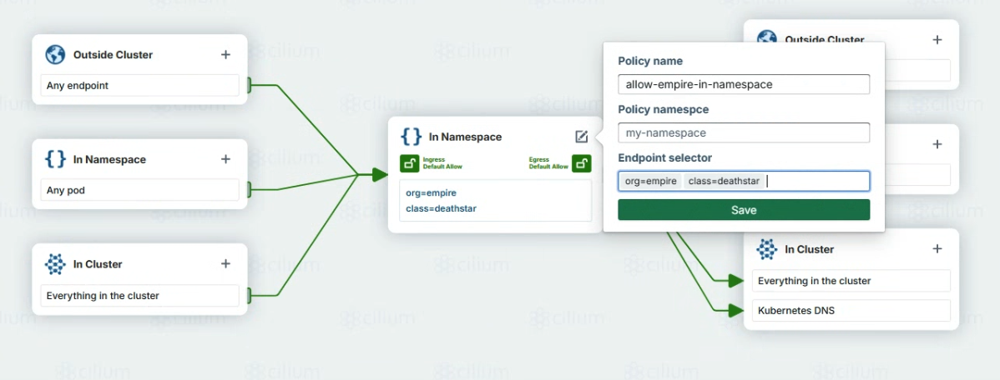
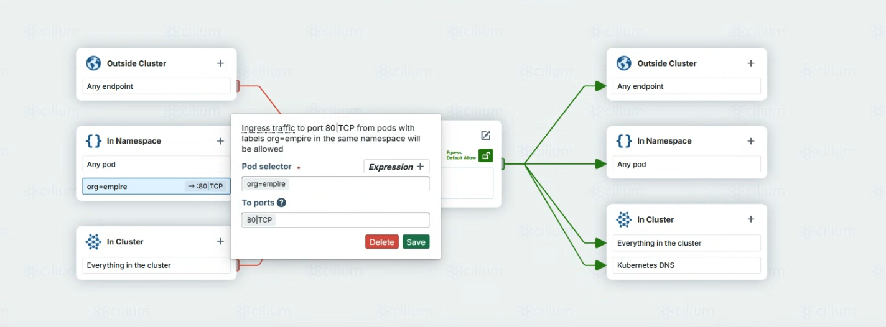

---
## 🧑‍⚖️ 네트워크 정책의 종류

네트워크 정책은 사용자가 클러스터 내에서 무슨 트래픽이 허용되는지 정하도록 한다.  
전통적인 방화벽은 source IP 또는 destination IP 및 포트 번호를 기반으로 permit 또는 deny를 시켰지만, Cilium은 label selector, namespace name, FQDN등과 같은 신원으로 룰을 생성해서 어떤 트래픽이 가능하고, 불가능한지를 정할 수 있도록 해준다.  
쿠버네티스와 같이 IP주소가 계속 바뀌고 Pod가 계속 살아나고 죽는 환경에서 네트워크 정책을 짓기 좋게 해준다.  

Cilium을 Kubernetes에서 실행할 때, Kubernetes Resource로 네트워크 정책을 정의할 수 있다.  
Cilium Agent는 네트워크 정책의 업데이트를 위해 Kubernetes APIserver를 관찰하며, 중요한 eBPF 프로그램을 로딩하여 적용하고자 하는 네트워크 정책의 구현이 되도록 한다.  

Kubernetes에서, Cilium은 세 가지 네트워크 정책이 가능하다:  
- L3/L4계층 정책을 지원하는 기본 Kubernetes의 `NetworkPolicy`
- L3/L4/L7계층 정책을 지원하는 `CiliumNetworkPolicy`
- 네임스페이스를 벗어나 클러스터 전체의 정책을 위한 `CiliumClusterwideNetworkPolicy`

Cilium은 이 세 가지 정책을 동시에 지원한다.  
그러나, 다양한 정책 타입을 사용할 때에는 주의해야 한다. 여러 정책 타입들 간의 허용된 트래픽들에 대한 이해가 어려워지기 때문이다.  
세심한 주의가 없다면, 의도치 않은 정책이 될 수 있다.

`networkpolicy.io`의 시각화 도구는 서로 다른 정책 정의가 미치는 영향을 보는 데 도움을 준다.

  
---
## 📏 NetworkPolicy 리소스

`NetworkPolicy` 자원은 IP주소 또는 포트 레벨에서의 트래픽 흐름을 제어하는 L3/L4 계층의 전통적인 쿠버네티스 자원이다.  
다음과 같은 것을 할 수 있다:
- Label Matching을 이용한 L3/L4 Ingress 및 Egress 정책
- 클러스터 외부의 L3 IP/CIDR에 대한 L3 IP/CIDR Ingress 및 Egress정책
- L4 TCP 및 ICMP 포트에 대한 Ingress 및 Egress 정책


---
## 📐 CiliumNetworkPolicy 리소스
`CiliumNetworkingPolicy`는 표준 `NetworkPolicy`의 확장이다.
다음의 기능들을 제공한다:
- Ingress와 Egress를 특정 HTTP path로 제한하는 L7 HTTP 프로토콜 정책 룰
- DNS, Kafka, gRPC등의 추가적인 L7 프로토콜 지원
- 클러스터 내부 통신에서의 Service이름 기반의 Egress 정책
- 특별한 Entity를 위한 Entity matching을 쓰는 L3/L4 Ingress 및 Egress 정책
- DNS FQDN 매칭을 사용하는 L3 Ingress 및 Egress 정책


[Cilium project documentation](https://docs.cilium.io/en/latest/security/policy/)에서 일부 YAML 사용사례를 확인할 수 있다.  
YAML만을 읽고, 어떤 트래픽이 허용되고 거부될지를 예측하는 것은 매우 어렵지만, 정확하게 의도된 정책을 만드는 것은 가만 둘 일이 아니다.  
다행히도, [networkpolicy.io](http://networkpolicy.io)에서는 이러한 작업을 더 쉽게 도와준다.


---
## ✍️ [Networkpolicy.io](http://Networkpolicy.io) Policy Editor
NetworkPolicy.io의 policy editor는 L3 및 L4 네트워크 정책을 찾아보고 만드는 것에 대해 좋은 방법을 제공한다.  
시각적인 자료를 보여주고, 정책을 고를 수 있게 해준다.  
Policy editor는 표준 Kubernetes NetworkPolicy와 CiliumNetworkPolicy 리소스를 제공한다.  
  


위에는 정책들을 시각화해주는 서비스 맵이 있다.  
초록 색은 허용, 붉은 색은 거부의 의미를 가진다.  
이러한 UI를 보면서 클러스터 내외의 Ingress와 Egress 정책을 세울 수 있다.  

좌측 하단에는, read-only YAML이 있다.  
표준 Kubernetes NetworkPolicy또는 CiliumNetworkPolicy중에서 고를 수 있다.  
또한 정책을 다운받아서 kubectl로 적용할 수도 있다.  
기존 존재하는 policy 정의를 업로드할 수 있고, 시각화로 어떻게 동작하는지도 볼 수 있다.  

정책을 시각화하는 것은 정책 룰이 의도한 대로 움직이는지 확인하기 좋다.  
우측 하단에는, 일반적인 상황에서의 정책을 만드는 방법등을 알려준다.  
Hubble flow를 업로드할수도 있고, Hubble이 무엇을 볼 수 있는지에 대한 일반적인 네트워크 정책을 생성할 수도 있다.  
주의할 점은, 아직 L7지원은 안된다는 것이다.

  
---
## ✅ L7 CiliumNetworkPolicy이 가능한 것
CiliumNetworkPolicy가 기존 정책과 다른 점은, L7 protocol을 이해하는 정책에 있다.
Cilium에서는, HTTP, Kafka, DNS등의 L7지원이 가능하다.
L7정책 룰은 L4의 toPorts를 확장하여 networkpolicy.io에서의 만들어진 YAML 마니페스트에 추가하기도 쉽다.
L7 정책 룰의 속성은 Cilium의 여러 프로토콜에 대해 다른 속성들을 가진다.
[https://docs.cilium.io/en/latest/security/policy/language/#layer-7-examples](https://docs.cilium.io/en/latest/security/policy/language/#layer-7-examples)에 있지만, 여기서는 HTTP만 볼 것이다.

  

---
## 🕸️ L7 HTTP 정책
L7 HTTP 정책이 활성화되면, 해당 파드가 돌아가는 노드의 Cilium Agent는 local-only의 HTTP proxy service와 eBPF프로그램을 실행하여 패킷을 local HTTP proxy에서 포워드되도록 한다.    

HTTP proxy는 L7 네트워크 정책을 따르고, 적절하게 패킷을 전달한다.  
추가적으로, HTTP 프록시가 있다면, Hubble flows에서 L7관찰성을 제공받는다.  

L7 HTTP 정책을 작성할 때, 다음의 필드들을 사용할 수 있다:
- Path  
    URL에서 POSIX정규표현식이 적용되어 매칭된다.  
    공백 시, 모든 path허용으로 간주한다.
- Method  
    요청의 HTTP 메서드이다(GET, POST, PUT, PATCH, DELETE).  
    공백 시, 모든 메서드 허용으로 간주한다.
- Host  
    POSIX 정규표현식이 매칭되어 적용되는 요청의 host 헤더이다.  
    공백 시, 모든 host허용으로 간주한다.
- Headers  
    필수로 요구하는 HTTP 헤더를 적어야 한다.  
    공백 시, 헤더에 상관없이 허용된다.


아래 예시는 `app=myService`라는 label을 가진 모든 endpoint들에 대해 TCP 80번 L4규칙을 업그레이드 하여 L7규칙들로 확장한다.  
다음의 트래픽들만 허용된다:
- `GET /v1/path1`  
    GET /v1/path1만 허용한다.
- `PUT /v2/path2.*`  
    ”/v2/path2.*”로 시작하는 모든 경로의 PUT을 허용한다.
- `Post .*/path3`  
    ”/path3”으로 끝나는 모든 path를 허용하고, HTTP 헤더로 `X-My-Header`가 `true`값을 가져야 트래픽이 허용된다.

  

```YAML
apiVersion: "cilium.io/v2"
kind: CiliumNetworkPolicy
metadata:
  name: "l7-rule"
spec:
  endpointSelector:
    matchLabels:
      app: myService
  ingress:
    - toPorts:
        - ports:
            - port: "80"
              protocol: TCP
          rules:
            http:
              - method: GET
                path: "/v1/path1"
              - method: PUT
                path: "/v2/path2.*"
              - method: POST
                path: ".*/path3"
                headers:
                  - "X-My-Header: true"
```

L7규칙은 L4규칙에서 더 확장된 것 처럼 형상하고 있다.  
즉, L7규칙은 L4규칙에서 시작해서 붙여나가는 식이 좋다.


---
## 🏃 실습: L4/L7 네트워크 정책

### 시나리오

당신은 Empire의 플랫폼 팀이 되어, IGKS(Imperial Galatic Kubernetes Service)에 Death Star API를 배포해야 한다.  
서비스는 이미 배포가 되어있지만, Empire의 TIE 전투기들만이 착륙 요청을 할 수 있도록 보장해야 한다.  

이 요청은 HTTP POST 메서드를 통해서만 가능해야 하고, 다른 경로에서는 PUT 메서드 등을 사용하지는 못하게 해야한다.  
물론 TIE 파일럿들이 일부터 exhaust port에 뭔가를 할 일은 없겠지만, 우리는 사고에 대비해야 한다.  

CiliumNetworkPolicy를 이용해야 한다.
이는 단순한 기술 문제가 아니라, 다스 베이더가 당신을 신뢰할 수 있을까에 대한 문제이다.  
그의 불신을 사는 순간… 결과는 끔찍해진다.  

즉, 목표는 TIE 전투기들이 오직 “착륙 요청”을 위한 HTTP POST요청만 가능하도록 Death Star 서비스에 접근을 제한하는 CiliumNetworkPolicy 리소스를 작성하는 것이다.

### 실습 세팅

우선, Cilium이 설치된 쿠버네티스 클러스터가 있어야 한다.
Death Star 애플리케이션을 배포해야 한다.
Cilium Project에는 [Death Star demo application](https://docs.cilium.io/en/latest/gettingstarted/demo/#deploy-the-demo-application)이 있다.

레포지토리에서 마니페스트를 받으면 된다.
```Bash
01:27:13 in ~
➜ kubectl create -f https://raw.githubusercontent.com/cilium/cilium/HEAD/examples/minikube/http-sw-app.yaml
service/deathstar created
deployment.apps/deathstar created
pod/tiefighter created
pod/xwing created
```

잠깐! X-wings가 클러스터에 있다? 이게 무슨 일이지?  
괜찮다. X-wings가 Death Star service에 접속하지 못한다.  
Death Star 서비스는 만들어졌고, 오직 클러스터의 내부 IP만 가진다.  
그러므로, 클러스터의 내부망에서만 접근 가능하다.  
```Bash
01:27:31 in ~
➜ kubectl get svc
NAME         TYPE        CLUSTER-IP       EXTERNAL-IP   PORT(S)   AGE
deathstar    ClusterIP   10.100.242.234   <none>        80/TCP    2m44s
kubernetes   ClusterIP   10.96.0.1        <none>        443/TCP   5d7h
```

추가로, Cilium Endpoint가 각 Pod를 위해 생긴 것을 볼 수 있다:  

```Bash
01:30:15 in ~
➜ kubectl get po,CiliumEndpoint
NAME                             READY   STATUS    RESTARTS   AGE
pod/deathstar-74c8f5ff5c-h6rbl   1/1     Running   0          3m11s
pod/deathstar-74c8f5ff5c-rp7rx   1/1     Running   0          3m11s
pod/tiefighter                   1/1     Running   0          3m11s
pod/xwing                        1/1     Running   0          3m11s

NAME                                                  SECURITY IDENTITY   ENDPOINT STATE   IPV4        IPV6
ciliumendpoint.cilium.io/deathstar-74c8f5ff5c-h6rbl   24949               ready            10.0.0.41
ciliumendpoint.cilium.io/deathstar-74c8f5ff5c-rp7rx   24949               ready            10.0.1.81
ciliumendpoint.cilium.io/tiefighter                   59640               ready            10.0.1.65
ciliumendpoint.cilium.io/xwing                        13885               ready            10.0.1.97
```

Cilium은 각 Death Star 벡엔드 Pod에 해당하는 Endpoint를 만들어주었다.  
X-wing과 TIE 전투기 Pod들 역시 그렇다.  

> Note  
> deathstar-* 엔드포인트는 같은 IDENTITY ID를 가진다.  
> 이전 챕터에서 언급했듯이, 같은 Cilium신원을 가진다.  
> label의 조합이 같기 때문이다.  
> Cilium Agent는 이 Identity ID로 적절한 네트워크 정책을 매칭한다.
  

아직 아무런 네트워크 정책이 없다.  
양쪽 다 Death Star 벡엔드 파드에 내릴 수 있다.  
  

둘다 착륙을 시켜보자:

```Bash
01:32:18 in ~ …
➜ kubectl exec xwing -- curl -s -XPOST deathstar.default.svc.cluster.local/v1/request-landing
Ship landed

01:50:48 in ~ …
➜ kubectl exec tiefighter -- curl -s -XPOST deathstar.default.svc.cluster.local/v1/request-landing
Ship landed
```

Death Star 서비스에 정책을 주어서, 원하는 Pod만 착륙할 수 있도록 해보자!


### Empore의 Ingress 허용 정책
X-wing Pod들이 Death Star의 서비스 엔드포인트에 접속하지 못하게 하는 가장 간단한 방법은 Label기반의 L3정책이다.  
L3정책은 모든 포트들을 막아버린다.  
포트 번호 기반으로 막고 싶다면, L4를 이용해야 한다.  

xwing Pod는 `org=alliance`를, tiefighter Pod는 `org=empire` label을 가진다.  
```Bash
01:51:01 in ~ …
➜ kubectl describe pod/xwing
Name:             xwing
Namespace:        default
Priority:         0
Service Account:  default
Node:             worker1/192.168.0.10
Start Time:       Sun, 28 Sep 2025 01:27:30 +0900
Labels:           app.kubernetes.io/name=xwing
                  class=xwing
                  org=alliance
01:54:55 in ~ …
➜ kubectl describe pod/tiefighter
Name:             tiefighter
Namespace:        default
Priority:         0
Service Account:  default
Node:             worker1/192.168.0.10
Start Time:       Sun, 28 Sep 2025 01:27:30 +0900
Labels:           app.kubernetes.io/name=tiefighter
                  class=tiefighter
                  org=empire
```

TCP 80번 포트를 참조하는 L4네트워크 정책은 `org=empire`라벨을 한 Pod만 허용하고, xwing Pod들을 Death Star 서비스 엔드포인트로부터 차단한다.  
우리는 networkpolicy.io의 policy editor를 이용할 수 있다.  

가운데를 수정해서, Policy의 이름을 넣어주고, Endpoint selector에 deathstar의 label을 넣어준다.  


  
Ingress측에 Namespace자원에 Pod selector로 `org=empire`, To ports에는 `80|TCP`로 입력한다.  

 


이제, YAML은 아래와 같이 나올 것이다:
```YAML
apiVersion: cilium.io/v2
kind: CiliumNetworkPolicy
metadata:
  name: allow-empire-in-namespace
spec:
  endpointSelector:
    matchLabels:
      org: empire
      class: deathstar
  ingress:
    - fromEndpoints:
        - matchLabels:
            org: empire
      toPorts:
        - ports:
            - port: "80"
              protocol: TCP
```

이 L4정책이 deathstar-* Pod service endpoint단위의 제어만 하고, Death Star service, 즉 L7수준의 제어는 되지 않는 것을 명심하라.  

만약 Pod의 Egress 접근을 제어하고 싶다면, client pod의 egress정책을 설정해서 toServices정보를 지정해주면 된다.  
이렇게도 위와 동일하게 가능은 하지만, 이 상황에서는 Ingress규칙만 사용하는 것이 더 간단하다.  

만약 Pod마다 어느 곳에 트래픽을 보낼 수 있는지 구체적으로 관리하고 싶을 때 Egress를 써주는것이 적절하다.  

이제, 실제로 적용해보자.

```Bash
02:34:33 in ~/cilium-lab …
➜ kubectl apply -f allow-empire-in-namespace.yaml
ciliumnetworkpolicy.cilium.io/allow-empire-in-namespace created
```

이제, X-Wing은 더이상 API를 날릴 수 없다.  
타임아웃이 나오는 것을 확인할 수 있다.

```Bash
02:39:29 in ~/cilium-lab …
➜ kubectl exec xwing -- curl --connect-timeout 10 -s -XPOST deathstar.default.svc.cluster.local/v1/request-landing
command terminated with exit code 28
```

그러나, tiefigher Pod는 성공한다:

```Bash
02:39:43 in ~/cilium-lab took 10.2s …
➜ kubectl exec tiefighter -- curl --connect-timeout 10 -s -XPOST deathstar.default.svc.cluster.local/v1/request-landing
Ship landed
```

이제 X-wing Pod는 아무 액세스도 없다.  
그러나, `org=empire`라면 모든 API를 누릴 수 있다.  
실수로 자원 고갈 요청을 날렸다고 해보자:

```Bash
02:40:56 in ~/cilium-lab …
➜ kubectl exec tiefighter -- curl -s -XPUT deathstar.default.svc.cluster.local/v1/exhaust-port
Panic: deathstar exploded
```

이런! 그러나 우리는 L7정책을 할당하여 이를 해결할 수 있다.
  

### L7 HTTP 정책 만들기

기존 YAML에서 path기반 정책을 확장해보자.  
아래 규칙은 org와 class label을 매칭하려든다.

```YAML
apiVersion: cilium.io/v2
kind: CiliumNetworkPolicy
metadata:
  name: allow-empire-in-namespace
spec:
  endpointSelector:
    matchLabels:
      org: empire
      class: deathstar
  ingress:
  - fromEndpoints:
    - matchLabels:
        org: empire
        class: tiefighter
    toPorts:
    - ports:
      - port: "80"
        protocol: TCP
      rules:
        http:
        - method: "POST"
          path: "/v1/request-landing"
  - fromEndpoints:
    - matchLabels:
        org: empire
        class: maintenance-droid
    toPorts:
    - ports:
      - port: "80"
        protocol: TCP
      rules:
        http:
        - method: "PUT"
          path: "/v1/exhaust-port"
```

저장 후, 적용해보자.

```Bash
02:46:21 in ~/cilium-lab took 1m 44.9s …
➜ kubectl apply -f allow-empire-in-namespace.yaml
ciliumnetworkpolicy.cilium.io/allow-empire-in-namespace configured
```

이제, TIE 전투기들은 자원고갈 API요청에 대해 HTTP 403 응답을 받는다.  
Cilium Agent에 내장된 HTTP proxy가 대신 응답해준 것이다.  

```Bash
02:46:25 in ~/cilium-lab …
➜ kubectl exec tiefighter -- curl -v -s -XPUT deathstar.default.svc.cluster.local/v1/exhaust-port
*   Trying 10.100.242.234:80...
* Connected to deathstar.default.svc.cluster.local (10.100.242.234) port 80 (#0)
> PUT /v1/exhaust-port HTTP/1.1
> Host: deathstar.default.svc.cluster.local
> User-Agent: curl/7.88.1
> Accept: */*
>
Access denied
< HTTP/1.1 403 Forbidden
< content-length: 15
< content-type: text/plain
< date: Sat, 27 Sep 2025 17:49:09 GMT
< server: envoy
<
{ [15 bytes data]
* Connection #0 to host deathstar.default.svc.cluster.local left intact
```

X-wing은 L4정책으로 접근하지 못해서 HTTP 메시지도 못받고 타임아웃이 난다.    
우리는 TIE 전투기들이 착륙 요청만 날릴 수 있고, 자원고갈 API는 요청할 수 없게 되었다.


> **Note**  
> L3/4 정책과 L7정책의 응답 차이는 구현이 다르기 때문이다.  
> L3/4이에서는 eBPF프로그램이 패킷을 드롭하고, 네트워크의 블랙홀에 빠지게 된다.  
> L7 네트워크 정책은 HTTP proxy가 요청에 대해 결정하고, HTTP 상태 메시지와 사유를 같이 응답하며 응답을 거절한다.

  

---
## 📚 결론
`CiliumNetworkPolicy`는 Pod간 통신에서 안전하게 접근제어를 하는 방식 중 하나이다.  
Pod들의 통신에서 전체 권한을 주기보다, CiliumNetworkPolicy를 통해서 최소 권한으로 유지하는 것이 좋다.  
이렇게 최소 권한으로 유지하는 것은 서비스가 의도지 않게 동작하는 것을 막아주고, 보안에도 좋다.