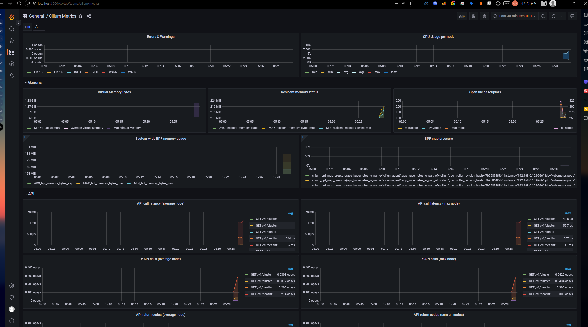

## 🌡️ Cilium Operator Metrics

Cilium Operator의 Prometheus 메트릭은 Helm Chart옵션으로 활성화될 수 있으며, 주로 오퍼레이터 성능 저하를 진단하거나 경고를 발생시키는 데 필요한 가시성을 제공하는데 사용된다.  
오퍼레이터 메트릭을 활성화하는 것은 Cilium의 설치 과정의 일부로 진행된다.  
오퍼레이터 Pod에는 Prometheus 엔드포인트 자동 발견을 돕는 어노테이션이 추가된다.  

오퍼레이터 메트릭에는 Cilium 오퍼레이터의 상태와 관련된 정보가 포함되며, 모든 메트릭은 `cilium_operator_` 접두사로 시작한다.  

---
## 🎯 Cilium Agent Metrics
Cilium Agent의 메트릭은 더 운영적인 면을 가지고 있다.  
메트릭이 활성화 되어있다면, Prometheus 엔드포인트 자동 발견을 돕는 어노테이션이 추가되어있다.  

또한, 각 에이전트의 내장 Envoy 프록시에 연결된 Prometheus 메트릭 엔드포인트를 가리키는 Headless cilium-agent service가 정의된다.  
Pod가 단일 Prometheus 엔드포인트에 대해서만 어노태이션을 가질 수 있기 때문이다.  
헤드리스 서비스는 파드 내의 추가적인 메트릭 엔드포인트를 Prometheus scraper가 DNS요청을 통해 발견할 수 있도록 해준다.  

다름과 같은 메트릭을 제공한다:
- Cluster Health  
    도달불가능한 노드 및 에이전트 상태 엔드포인트 관련 통계
- Node Connectivity  
    네트워크 전체 노드 간 지연 관련 통계
- Cluster Mesh  
    피어 클러스터 관련 통계
- Datapath  
    커넥션 트래킹의 가비지 컬렉션 관련 통계
- IPSec  
    IPSec 오류 관련 통계
- eBPF  
    eVPF맵 연산 및 메모리 사용 관련 통계
- Drop/Forward(L3/L4)  
    패킷 드롭/포워드 관련 통계
- Policy  
    활성 정책 관련 통계
- L7 Policy  
    내장 HTTP 프록시로의 L7 정책 리다이렉트 관련 통계
- Identity  
    Identity ↔ IP주소 매칭 관련 통계
- Kubernetes  
    수신된 Kubernetes 이벤트 관련 통계
- IPAM  
    IP주소 할당 통계

---
## 🔭 Hubble Metrics
Hubble Metrics는 네트워크 플로우의 정보들 위주로 제공된다.
- DNS  
    DNS 요청 통계
- Drop  
    패킷 드롭관련 통계
- Flow  
    총 플로우 처리량 통계
- HTTP  
    HTTP 요청 관련 통계
- TCP  
    TCP관련 통계
- ICMP  
    ICMP요청 관련 통계
- Port Distribution  
    목적지 포트 관련 통계

Hubble metrics가 활성화된다면, hubble-metrics라는 이름의 어노테이션된 헤드리스 서비스가 있다.  
Hubble metrics가 기본적으로 활성화되지는 않기에, 필요한 메트릭을 명시적으로 요구해야 한다.  
이때 flow context가 Prometheus 라벨에 매핑되며, 이를 통해 원하는 수준의 세밀한 관찰도 가능하다.  

### Hubble Metrics 컨텍스트 옵션
플로우는 너무 풍부하기에, 모든 메트릭을 매핑할순 없다.  
따라서, 어떤 플로우 정보를 label로 포함할지 선택해야 한다.  
또한, Hubble 메트릭은 Source와 Destination label을 설정할 수 있는 기능을 제공하며, 이를 통해 플로우 컨텍스트 중 가장 잘 표현할 수 있는 속성을 Label에 매핑할 수 있다.  

이때 sourceContext와 destinationContext 옵션을 지원하는 플로우 속성 중 하나로 지정하면 된다.  
예를 들어,
- `hubble_drop_total` 메트릭의 source label을 Pod이름과 함께 매핑하고 싶다면, `sourceContext=pod-nam`e으로 하면 된다.
- source label을 IP주소로 하고싶다면, `sourceContext=ip`로 하면 된다.

이처럼 source/destination label을 일관되게 지정해두면, 해당 label을 기반으로 대시보드를 구성하거나 Prometheus 쿼리 언어를 활용할 수 있다.  
추가적으로, 더 많은 카디날리티가 필요하다면, labelContext 옵션을 통해 플로우 정보에서 가져온 추가 label을 메트릭에 포함하도록 설정할 수도 있다.  

---
## 🍒 Prometheus 서버 준비하기

각 메트릭 엔드포인트는 두 가지의 어느테이션을 가진다:
- `prometheus.io/port`
- `prometheus.io.scrape`
  
클러스터에서 돌아가는 Prometheus server의 스크레이프 설정은 이러한 어노테이션을 가진 Pod와 headless service들을 찾아 메트릭을 수집하도록 구성할 수 있다.  

---
## ⚙️ Cilium Helm Chart Options

Cilium을 더 자세하게 구성하고 싶다면, Helm Chart를 써야 한다고 했었다.  
Chart Options은 다음과 같다:  
- Enabling Cilium Operator Metrics
    - `operator.prometheus.port`: operator tcp port값. 기본 9962
    - `operator.prometheus.enabled`: true/false, 기본 false
- Enabling Cilium Agent Metrics
    - `prometheus.proxy.port`: proxy metrics tcp port값. 기본 9964
    - `prometheus.port`: agemtn metrics tcp port값. 9962
    - `prometheus.metrics`: Cilium Agent metrics이 활성화/비활성화할 띄어쓰기로 구분되는 문자열    
        Ex: `“-cilium_node_connectivity_status + cilium_bpf_map_pressure”`
    - `prometheus.enabled`: true/false, 기본 false
- Enabling Hubble Metrics
    - `hubble.metrics.enableOpenMetrics` - true/false, 기본 false
    - `hubble.metrics.port`: Hubble metrics tcp port값. 기본 9965
    - `hubble.metrics.enabled`: 활성화할 메트릭, 콤마로 구분됨. 적어도 하나의 메트릭이 활성화되어야 함  
        Ex: `“{first-metric: metric-option1; metric-option2, second-metric, third-metric}”`
    - `prometheus.enabled`: true/false, 기본 false

---
## 💨 실습: Cilium Metrics

### 상황 
팀의 SRE들은 임페리얼 갤러틱 쿠버네티스 서비스에서의 중요한 서비스들의 더 나은 성능 메트릭을 접근하길 원한다.  
예를 들어, 특정 소스/데스티네이션 마이크로서비스간의 성능저하 이슈에 대해 경보를 받고싶어한다.  

모든 TIE 파이터들이 동등하지 않고, 베이더의 착륙 요청이 다른 클러스터 네트워크 트래픽들 대비 더 타이트한 SLO 버짓 이내로 오면 모두에게 이익이 온다.  
네트워크 플로우 컨텍스트에서 파생된 label들을 Hubble Prometheus 메트릭에 붙이면, 팀원들에게 더 풍부한 메트릭 기반 솔루션을 제공할 수 있다.  

### 세팅하기
Helm기반의 Cilium설치를 할것이다.  
기존 Cilium을 제거하려면, 다음을 실행한다:  
```Bash
cilium uninstall
```

kind를 쓴다면, 아래의 일반적인 Helm 인스트럭션을 쓸 수 있다.  
```Bash
helm install cilium/cilium --version 1.16.3 --namespace kube-system
```

바닐라 쿠버네티스 기준, 다음의 셋업으로 하면 된다:  
```YAML
# values.yaml
kubeProxyReplacement: false
k8sServiceHost: ""
k8sServicePort: ""

# Cilium Agent metrics
prometheus:
  enabled: true
  port: 9966
  metrics:
    - cilium_bpf_map_pressure
    - cilium_drop_totalcilium_forward_total
    - cilium_forward_total

# Operator metrics
operator:
  replicas: 1
  prometheus: 
    enabled: true
    port: 9963

# Hubble
hubble: 
  enabled: true
  relay:
    enabled: true
  ui:
    enabled: true
  metrics:
    enabledOpenMetrics: true
    port: 9965
    enabled:
      - dns
      - drop:sourceContext=pod;destinationContext=pod
      - tcp
      - flow
      - port-distribution
      - httpV2
      - policy

# IPAM
ipam:
  mode: cluster-pool # kubectl 무시
  operator:
    clusterPoolIPv4PodCIDRList: ["10.43.0.0/16"] # 클러스터 전체 CIDR. kubeadm과 똑같이 하는 것이 혼동이 적음
    clusterPoolIpv4MaskSize: 24 # Node단위 서브넷 CIDR
    clusterPoolIPv6PodCIDRList: ["fd00::/104"] # default
    clusterPoolIPv6MaskSize: 120 # default

# Masquerade(NAT)
enableIpv4Masquerade: true
enableIpv6Masquerade: false

# NetworkPolicy
enableNetworkPolicy: true
```

이 `values.yaml`을 적용해주자.
```Bash
helm repo add cilium https://helm.cilium.io/
helm repo update

# 첫 설치:
helm install cilium cilium/cilium \
  -n kube-system -f values.yaml

# 이미 helm으로 설치했다면:
helm upgrade cilium cilium/cilium \
	-n kube-system -f values.yaml
```

이전 네트워크 정책들은 초기화해주자:
```Bash
kubectl delete --all CiliumNetworkPolicies
```

Death Star API를 다시 설치해주자:
```Bash
kubectl apply -f https://raw.githubusercontent.com/cilium/cilium/refs/heads/main/examples/minikube/http-sw-app.yaml
```

간단한 CiliumNetworkPolicy 룰을 임페리얼 유닛에 적용한다:
```Bash
kubectl apply -f https://raw.githubusercontent.com/cilium/cilium/refs/heads/main/examples/minikube/sw_l3_l4_l7_policy.yaml
```

### Cilium Metrics 수집 허용하기
혹시라도 메트릭 허용이 켜져있지 않다면, helm의 `--set`으로 넣어주자.
```Bash
helm upgrade cilium cilium/cilium \
 --namespace -kube-system \
 --reuse-values \
 --set prometheus.enabled=true \
 --set operator.prometheus.enabled = true
```

cilium의 daemonset pod에서 어노테이션을 확인해주자. 본인의 데몬셋 포드에서 골라야 한다.
```Bash
kubectl get -n kube-system pod/cilium-n6vzs -o json | jq .metadata.annotations
{
  "kubectl.kubernetes.io/default-container": "cilium-agent",
  "kubectl.kubernetes.io/restartedAt": "2025-10-01T17:05:21+09:00",
  "prometheus.io/port": "9966",
  "prometheus.io/scrape": "true"
}
```

cilium-n6vzs Pod를 골랐는데, 이는 deathstar-74c8f5ff5c-rp7rx가 같은 노드에 있기 때문이다.  
Cilium Pod와 deathstar를 같은 노드에서 고르면, Cilium과 Hubble metrics가 TIE fighter 부터 Death star endpoint까지의 네트워크 플로우를 캡처할 것이다.  
Death Star endpoint pod를 포함하는 Pod는 ingress 플로우 메트릭을 가질 것이다.  
두 Pod를 띄우는 node는 한번에 ingress와 egress 플로우를 가질 것이다.  

노드의 IP를 알아내자.  
```Bash
kubectl get -n kube-system po/cilium-n6vzs -o json | jq .status.podIP
192.168.0.10
```

prometheus에 metrics를 보내보자:
```Bash
kubectl exec -it po/tiefighter -- curl http://192.168.0.10:9966/metrics
# HELP cilium_act_processing_time_seconds time to go over ACT map and update the metrics
# TYPE cilium_act_processing_time_seconds histogram
cilium_act_processing_time_seconds_bucket{le="0.005"} 0
cilium_act_processing_time_seconds_bucket{le="0.01"} 0
```

Prometheus 메트릭이 잘 측정되는것으로 보인다!  
이제, xwing이 착륙시도를 해보자. 블로킹 정책 때문에 막힐 것이다.  
```Bash
kubectl exec xwing -- curl -s --connect-timeout 2 -XPOST deathstar.default.svc.cluster.local/v1/request-landing
command terminated with exit code 28
```
  

```Bash
17:30:00 in ~/kube-practice took 2.2s …
➜ kubectl exec -it pod/xwing -- curl http://192.168.0.10:9966/metrics | grep drop_count_total
# HELP cilium_drop_count_total Total dropped packets, tagged by drop reason and ingress/egress direction
# TYPE cilium_drop_count_total counter
cilium_drop_count_total{direction="EGRESS",reason="Policy denied"} 1152
cilium_drop_count_total{direction="EGRESS",reason="Policy denied by denylist"} 307
cilium_drop_count_total{direction="EGRESS",reason="Unsupported L3 protocol"} 1587
cilium_drop_count_total{direction="INGRESS",reason="Policy denied"} 226
cilium_drop_count_total{direction="INGRESS",reason="Policy denied by denylist"} 23 
```

### Hubble Metrics 수집 활성화
혹시라도 hubble metrics가 비활성화 되어있다면, helm으로 추가해주자:  
위에 제공된 helm values를 사용했다면, 이미 적용되어있다.  
```Bash
helm upgrade cilium cilium/cilium --version 1.18.2 -n kube-system --reuse-values --set hubble.enabled=true --set hubble.metrics.enabled="{dns,drop,tcp,flow,port-distribution,httpV2}"
```

Cilium 데몬셋을 다시 켜주자.
```Bash
kubectl rollout restart ds/cilium -n kube-system
```

hubble metrics에 대한 headless service가 떠있을 것이다.
```Bash
17:45:06 in ~/kube-practice …
➜ kubectl get svc -n kube-system
NAME             TYPE        CLUSTER-IP      EXTERNAL-IP   PORT(S)                  AGE
cilium-envoy     ClusterIP   None            <none>        9964/TCP                 24h
hubble-metrics   ClusterIP   None            <none>        9965/TCP                 75s
hubble-peer      ClusterIP   10.100.44.200   <none>        443/TCP                  24h
hubble-relay     ClusterIP   10.97.173.112   <none>        80/TCP                   24h
hubble-ui        ClusterIP   10.106.161.84   <none>        80/TCP                   24h
kube-dns         ClusterIP   10.96.0.10      <none>        53/UDP,53/TCP,9153/TCP   9d

17:45:21 in ~/kube-practice …
➜ kubectl describe svc/hubble-metrics -n kube-system
Name:                     hubble-metrics
Namespace:                kube-system
Labels:                   app.kubernetes.io/managed-by=Helm
                          app.kubernetes.io/name=hubble
                          app.kubernetes.io/part-of=cilium
                          k8s-app=hubble
Annotations:              meta.helm.sh/release-name: cilium
                          meta.helm.sh/release-namespace: kube-system
                          prometheus.io/port: 9965
                          prometheus.io/scrape: true
Selector:                 k8s-app=cilium
Type:                     ClusterIP
IP Family Policy:         SingleStack
IP Families:              IPv4
IP:                       None
IPs:                      None
Port:                     hubble-metrics  9965/TCP
TargetPort:               hubble-metrics/TCP
Endpoints:                192.168.0.10:9965,192.168.0.4:9965
Session Affinity:         None
Internal Traffic Policy:  Cluster
Events:                   <none>
```

tiefighter pod에서 curl을 날려서 hubble metrics을 조회할 수 있다.
```Bash
17:48:26 in ~/kube-practice …
➜ kubectl exec -it pod/tiefighter -- curl http://192.168.0.10:9965/metrics | grep hubble_drop
# HELP hubble_drop_total Number of drops
# TYPE hubble_drop_total counter
hubble_drop_total{protocol="ICMPv6",reason="UNSUPPORTED_L3_PROTOCOL"} 1

17:48:44 in ~/kube-practice …
➜ kubectl exec -it pod/tiefighter -- curl http://192.168.0.10:9965/metrics | grep hubble_tcp
# HELP hubble_tcp_flags_total TCP flag occurrences
# TYPE hubble_tcp_flags_total counter
hubble_tcp_flags_total{family="IPv4",flag="FIN"} 1217
hubble_tcp_flags_total{family="IPv4",flag="RST"} 2
hubble_tcp_flags_total{family="IPv4",flag="SYN"} 613
hubble_tcp_flags_total{family="IPv4",flag="SYN-ACK"} 610
```

xwing으로 다시 요청을 날려보자. drop 수가 늘어난 것을 볼 수 있다.
```Bash
17:51:42 in ~/kube-practice …
➜ kubectl exec xwing -- curl -s --connect-timeout 2 -XPOST deathstar.default.svc.cluster.local/v1/request-landing
command terminated with exit code 28

17:55:38 in ~/kube-practice took 2.2s …
➜ kubectl exec -ti pod/tiefighter -- curl http://192.168.0.10:9965/metrics | grep hubble_drop
# HELP hubble_drop_total Number of drops
# TYPE hubble_drop_total counter
hubble_drop_total{protocol="ICMPv6",reason="UNSUPPORTED_L3_PROTOCOL"} 4
hubble_drop_total{protocol="TCP",reason="POLICY_DENIED"} 4
```

### Hubble Metrics에 Flow Context 추가하기
Hubble metrics에 label context를 달아서 플로우 컨텍스트를 넣어줄수 있다.  
soruce와 destination label을 넣어줄것이다.  
helm values에서 drop sourceContext, destinationContext를 pod로 해주자.  
위에 제공된 helm values를 사용했다면, 이미 적용되어있다.  
```Bash
helm upgrade cilium cilium/cilium --version 1.18.2 \
	-n kube-system --reuse-values \
	--set hubble.enabled=true \
	--set hubble.metrics.enalbed="{dns, drop:sourceContext=pod;destinationContext=pod, tcp, flow, port-distribution, httpV2}"
```

그 뒤, 다시 daemonset을 켜주자.
```Bash
kubectl rollout restart daemonset/cilium -n kube-system
```

X-wing으로 착륙 요청을 몇 번 날려보자.
```Bash
kubectl exec -it pod/xwing -- curl http://192.168.0.10:9965/metrics | grep hubble_drop
```

  
```Bash
19:46:28 in ~/kube-practice …
➜ kubectl exec -it pod/xwing -- curl http://192.168.0.10:9965/metrics | grep hubble_drop
# HELP hubble_drop_total Number of drops
# TYPE hubble_drop_total counter
hubble_drop_total{destination="",protocol="ICMPv6",reason="UNSUPPORTED_L3_PROTOCOL",source=""} 1458
```

### Grafana Dashboard
Cilium에서는 예시의 Grafana 대시보드 리소스를 제공한다.
```Bash
kubectl apply -f https://raw.githubusercontent.com/cilium/cilium/refs/heads/main/examples/kubernetes/addons/prometheus/monitoring-example.yaml
```

로컬로 포트포워딩 해보자:
```Bash
kubectl -n cilium-monitoring port-forward service/grafana --address 0.0.0.0 --address :: 3000:3000
```

http://localhost:3000에서 대시보드를 확인 가능하다.
