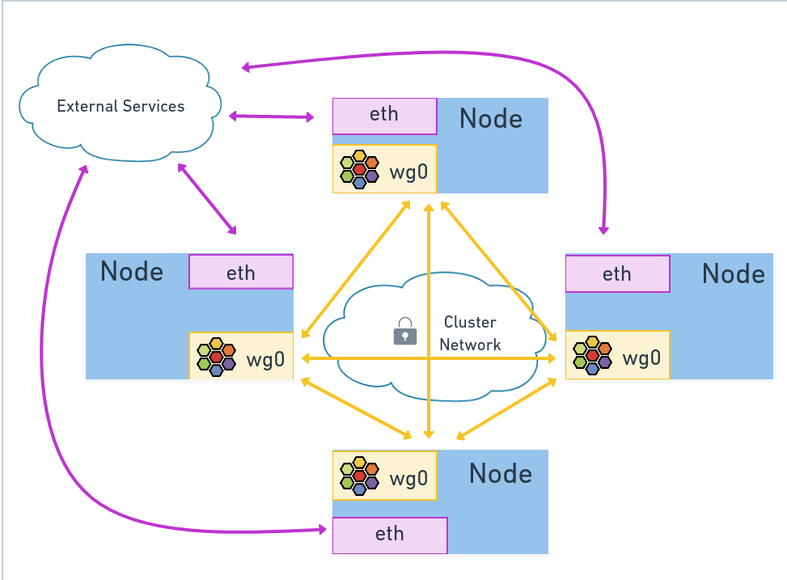

## 🍪 개요
Cilium은 IPSec와 WireGuard 트래픽 암호화를 모두 지원한다.  
이번에는 네트워크 보안을 향상하기 위해 transparent encryption을 해볼 것이다.  

---
## 🫥 Transparent Encryption이란?
클러스터 내부의 마이크로서비스는 클러스터 노드 사이를 통신한다.  
그러나, 이 노드들의 네트워크 토폴로지가 분리되어있을 수도 있다.  
클라우드 VPC나 자사 데이터센터의 Private Network에서도 물리적인 분리가 있을 수 있기에, 완전히 신뢰가능한 안전이 보장된다고 하기에는 어렵다.  
이러한 노드들의 트래픽을 보호할 필요가 있고, 특히나 PCI(금융)나 HIPPA(의료) 규제 등을 위해서는 더욱 그렇다.  
암호화를 요구하기 때문이다.  
**Transparent Encryption**은 이러한 요구사항을 만족한다.

Kubernetes 자체의 네이티브 기능으로는 데이터 암호화가 없다.  
클러스터 관리자가 구현에 대해 결정하는 문제이다.  
Cilium은 노드 간 암호화를 WireGuard 또는 IPSec를 이용하여 지원하고, 애플리케이션 코드의 수정은 하나도 필요없다.  
(그래서 투명한 암호화라 하는것이다. 애플리케이션 계층은 암호화가 일어나는지도 모르니 말이다.)  

여기서는 WireGuard기반의 통신 암호화를 이용한다.  

  
---
## 🔒 WireGuard 또는 IPSec를 쓰는 이유
WireGuard와 IPSec는 in-kernel의 투명한 트래픽 암호화를 제공하는 프로토콜이다.  
**WireGaurd**는 사용하기 쉽고, 경량의 VPN(Virtual Private Network)이고, 리눅스 커널 내부에서 제공된다.  
WireGuard는 Peer-to-Peer기반의 VPN 솔루션이다.  
VPN이 각 컴퓨터간 연결되고, 서로 공개 키를 공유한다.  
더 자세한 내용은 [이 게시글]()에서 확인가능하다.

**IPSec**는 비슷하지만, 더 전통적이고, FIPS(미국 연방 정보 처리 표준)을 준수한다.  
WireGuard나 IPSec가 Cilium에서 활성화되면, 각 노드의 CIlium Agent는 클러스터 내 Cilium 노드들 간의 암호화 터널을 생성한다.  

---
## 🤓 Transparent Encryption 활성화하기
`helm upgrade`를 통해서 암호화를 활성화한다
```Bash
helm upgrade cilium cilium/cilium --namespace kube-system \
  --set encryption.enabled=true \
  --set encryption.type=wireguard
```
파일로 하길 원한다면, 아래를 values에 추가하여 적용해주면 된다.
```YAML
# Encryption
encryption:
  enabled: true
  type: wireguard

```

```Bash
helm upgrade cilium cilium/cilium -n kube-system -f values.yaml
```

daemonest을 롤아웃 해주고, 다시 켜지기까지 기다려보자:
```Bash
kubectl rollout restart ds/cilium -n kube-system

cilium status --wait
```


---
## 🏋 실습
이전 실습의 상태에서 계속한다.

### 상황
베이더는 반역자 스파이들이 임페리얼 쿠버네티스 클러스터 내부에서 네트워크 통신을 감청하고 있을지 모른다는 걱정을 하고 있다.  

플랫폼 팀은 노드간 통신을 암호화 하는것을 목표로 한다.  
다행히도, 당신의 팀은 이미 Cilium을 쓰고 있다.  
노드 간 통신의 투명한 암호화를 쉽게 적용할 수 있다.  

### 투명 암호화 활성화하기
아직 활성화가 안되어있다면, 위를 참고하여, Transparent Encryption을 활성화하자.  
Cilium Pod들이 재시작되면, CiliumNode라는 커스텀 리소스를 업데이트한다.  
CiliumNode는 Cilium에 의해 관리되는 노드를 말한다.  

```Bash
kubectl get -n kube-system CiliumNodes

########################################################
15:35:23 in ~/kube-practice …
➜ kubectl get -n kube-system CiliumNodes
NAME      CILIUMINTERNALIP   INTERNALIP     AGE
master    10.0.0.115         192.168.0.4    17d
worker1   10.0.1.242         192.168.0.10   17d
#########################################################
```

노드에 public key가 생긴 것을 볼 수 있다.
```Bash
# worker1 대신 본인의 노드를 넣자. 
kubectl get -n kube-system CiliumNode worker1 -o json | jq .metadata.annotations

##################################################################
15:45:30 in ~/kube-practice …
➜ kubectl get -n kube-system CiliumNode worker1 -o json | jq .metadata.annotations
{
  "network.cilium.io/wg-pub-key": "u2i7vxpbamnGhg/C1DetSl6pTK2APvx8uWPCdxGlfXM="
}
##################################################################
```

### 암호화 인터페이스 검사하기
Cilium Agent Client를 이용하여 Agent가 암호화를 활성화했는지 볼 수 있다.
```Bash
kubectl exec -n kube-system -ti ds/cilium -- cilium status | grep Encryption

#####
15:48:16 in ~/kube-practice …
➜ kubectl exec -n kube-system -ti ds/cilium -- cilium status | grep Encryption
Encryption:              Wireguard       [NodeEncryption: Disabled, cilium_wg0 (Pubkey: u2i7vxpbamnGhg/C1DetSl6pTK2APvx8uWPCdxGlfXM=, Port: 51871, Peers: 1)]
#####
```

이 Agent는 WIreGuard가 활성화되어있으며, Peer의 개수도 보인다.  
현재 여기서는 2노드 구성이라 1개의 Peer가 있다고 보인다.  
3노드 구성이면 2개의 Peer가, n노드 구성이면 n-1개의 Peer가 있다고 보면 된다.  

노드의 네트워크 장치를 확인해보자. `cilium_wg0`이라는 새로운 디바이스를 볼 수 있다.  
(Cilium Agent는 호스트 네트워크 모드를 쓴다)  
```Bash
kubectl exec -n kube-system -ti ds/cilium -- ip link | grep cilium

#####
15:53:11 in ~/kube-practice …
➜ kubectl exec -n kube-system -ti ds/cilium -- ip link | grep cilium
3: cilium_net@cilium_host: <BROADCAST,MULTICAST,NOARP,UP,LOWER_UP> mtu 1500 qdisc noqueue state UP mode DEFAULT group default
4: cilium_host@cilium_net: <BROADCAST,MULTICAST,NOARP,UP,LOWER_UP> mtu 1500 qdisc noqueue state UP mode DEFAULT group default qlen 1000
5: cilium_vxlan: <BROADCAST,MULTICAST,UP,LOWER_UP> mtu 1500 qdisc noqueue state UNKNOWN mode DEFAULT group default
78: cilium_wg0: <POINTOPOINT,NOARP,UP,LOWER_UP> mtu 1420 qdisc noqueue state UNKNOWN mode DEFAULT group default

#####
```

새로운 WireGuard 링크가 다른 노드와의 통신에 쓰이는 것을 확인해보자.  
Agent의 bash쉘을 열어주자.  
```Bash
kubectl exec -n kube-system -ti po/cilium-kw52z -- /bin/bash
```

tcpdump를 설치하자.  
```Bash
apt-get update
apt-get -y install tcpdump
```

설치가 되면, `cilium_wg0`으로 패킷을 캡처해보자.  
```Bash
tcpdump -n -i cilium_wg0
```

같은 노드에서 돌아가는 것을 사용할 것이므로, 노드에서 돌아가는 tiefighter를 찾아보자.  
```Bash
kubectl describe node worker1

...
Non-terminated Pods:          (14 in total)
  Namespace                   Name                                CPU Requests  CPU Limits  Memory Requests  Memory Limits  Age
  ---------                   ----                                ------------  ----------  ---------------  -------------  ---
  cilium-monitoring           grafana-5c9877b8cd-pdnwh            0 (0%)        0 (0%)      0 (0%)           0 (0%)         92m
  cilium-monitoring           prometheus-bf7c454c-wtmrs           0 (0%)        0 (0%)      0 (0%)           0 (0%)         92m
  cilium-test-1               client-64d966fcbd-9vpvf             0 (0%)        0 (0%)      0 (0%)           0 (0%)         17d
  cilium-test-1               client2-5f6d9498c7-hzv2q            0 (0%)        0 (0%)      0 (0%)           0 (0%)         17d
  cilium-test-1               echo-same-node-6868c899c7-vp722     0 (0%)        0 (0%)      0 (0%)           0 (0%)         17d
  cilium-test-1               host-netns-nfqbl                    0 (0%)        0 (0%)      0 (0%)           0 (0%)         17d
  default                     deathstar-74c8f5ff5c-rp7rx          0 (0%)        0 (0%)      0 (0%)           0 (0%)         12d
  default                     test                                100m (0%)     200m (0%)   200Mi (0%)       500Mi (0%)     8d
  default                     tiefighter                          0 (0%)        0 (0%)      0 (0%)           0 (0%)         12d
  default                     xwing                               0 (0%)        0 (0%)      0 (0%)           0 (0%)         12d
  kube-system                 cilium-envoy-7qzk6                  0 (0%)        0 (0%)      0 (0%)           0 (0%)         8d
  kube-system                 cilium-kw52z                        100m (0%)     0 (0%)      10Mi (0%)        0 (0%)         29m
  kube-system                 cilium-operator-79d9c74856-r8f8f    0 (0%)        0 (0%)      0 (0%)           0 (0%)         29m
  kube-system                 kube-proxy-2kjpc                    0 (0%)        0 (0%)      0 (0%)           0 (0%)         17d
```

착륙 요청을 몇 번 해보자.
```Bash
kubectl exec tiefighter -- curl -s -XPOST deathstar.default.svc.cluster.local/v1/request-landing
```

아래는 실체 캡처이다.
```Bash
root@worker1:/home/cilium# tcpdump -n -i cilium_wg0
tcpdump: verbose output suppressed, use -v[v]... for full protocol decode
listening on cilium_wg0, link-type RAW (Raw IP), snapshot length 262144 bytes
07:05:59.518821 IP 192.168.0.10.43111 > 192.168.0.4.8472: OTV, flags [I] (0x08), overlay 0, instance 5951
IP 10.0.1.65.50644 > 10.0.0.236.53: 53090+ A? deathstar.default.svc.cluster.local.default.svc.cluster.local. (79)
07:05:59.518831 IP 192.168.0.10.43111 > 192.168.0.4.8472: OTV, flags [I] (0x08), overlay 0, instance 5951
IP 10.0.1.65.50644 > 10.0.0.236.53: 53348+ AAAA? deathstar.default.svc.cluster.local.default.svc.cluster.local. (79)
07:05:59.520362 IP 192.168.0.4.39105 > 192.168.0.10.8472: OTV, flags [I] (0x08), overlay 0, instance 54165
IP 10.0.0.236.53 > 10.0.1.65.50644: 53348 NXDomain*- 0/1/0 (172)
07:05:59.520395 IP 192.168.0.4.39105 > 192.168.0.10.8472: OTV, flags [I] (0x08), overlay 0, instance 54165
IP 10.0.0.236.53 > 10.0.1.65.50644: 53090 NXDomain*- 0/1/0 (172)
07:05:59.520459 IP 192.168.0.10.40573 > 192.168.0.4.8472: OTV, flags [I] (0x08), overlay 0, instance 5951
IP 10.0.1.65.36559 > 10.0.0.54.53: 736+ A? deathstar.default.svc.cluster.local.svc.cluster.local. (71)
07:05:59.520465 IP 192.168.0.10.40573 > 192.168.0.4.8472: OTV, flags [I] (0x08), overlay 0, instance 5951
IP 10.0.1.65.36559 > 10.0.0.54.53: 60926+ AAAA? deathstar.default.svc.cluster.local.svc.cluster.local. (71)
07:05:59.521630 IP 192.168.0.4.46335 > 192.168.0.10.8472: OTV, flags [I] (0x08), overlay 0, instance 54165
IP 10.0.0.54.53 > 10.0.1.65.36559: 60926 NXDomain*- 0/1/0 (164)
07:05:59.521657 IP 192.168.0.4.46335 > 192.168.0.10.8472: OTV, flags [I] (0x08), overlay 0, instance 54165
IP 10.0.0.54.53 > 10.0.1.65.36559: 736 NXDomain*- 0/1/0 (164)
07:05:59.521680 IP 192.168.0.10.48073 > 192.168.0.4.8472: OTV, flags [I] (0x08), overlay 0, instance 5951
IP 10.0.1.65.58437 > 10.0.0.236.53: 11665+ A? deathstar.default.svc.cluster.local.cluster.local. (67)
07:05:59.521684 IP 192.168.0.10.48073 > 192.168.0.4.8472: OTV, flags [I] (0x08), overlay 0, instance 5951
IP 10.0.1.65.58437 > 10.0.0.236.53: 22672+ AAAA? deathstar.default.svc.cluster.local.cluster.local. (67)
07:05:59.523037 IP 192.168.0.4.45455 > 192.168.0.10.8472: OTV, flags [I] (0x08), overlay 0, instance 54165
IP 10.0.0.236.53 > 10.0.1.65.58437: 22672 NXDomain*- 0/1/0 (160)
07:05:59.523150 IP 192.168.0.4.45455 > 192.168.0.10.8472: OTV, flags [I] (0x08), overlay 0, instance 54165
IP 10.0.0.236.53 > 10.0.1.65.58437: 11665 NXDomain*- 0/1/0 (160)
07:05:59.523174 IP 192.168.0.10.44086 > 192.168.0.4.8472: OTV, flags [I] (0x08), overlay 0, instance 5951
IP 10.0.1.65.53147 > 10.0.0.54.53: 31723+ A? deathstar.default.svc.cluster.local. (53)
07:05:59.523177 IP 192.168.0.10.44086 > 192.168.0.4.8472: OTV, flags [I] (0x08), overlay 0, instance 5951
IP 10.0.1.65.53147 > 10.0.0.54.53: 20628+ AAAA? deathstar.default.svc.cluster.local. (53)
07:05:59.524483 IP 192.168.0.4.43299 > 192.168.0.10.8472: OTV, flags [I] (0x08), overlay 0, instance 54165
IP 10.0.0.54.53 > 10.0.1.65.53147: 20628*- 0/1/0 (146)
07:05:59.524675 IP 192.168.0.4.43299 > 192.168.0.10.8472: OTV, flags [I] (0x08), overlay 0, instance 54165
IP 10.0.0.54.53 > 10.0.1.65.53147: 31723*- 1/0/0 A 10.100.242.234 (104)
07:05:59.524811 IP 192.168.0.10.36177 > 192.168.0.4.8472: OTV, flags [I] (0x08), overlay 0, instance 5951
IP 10.0.1.65.44882 > 10.0.0.41.80: Flags [S], seq 3572931691, win 65170, options [mss 1330,sackOK,TS val 2392963435 ecr 0,nop,wscale 7], length 0
07:05:59.525522 IP 192.168.0.4.54866 > 192.168.0.10.8472: OTV, flags [I] (0x08), overlay 0, instance 53764
IP 10.0.0.41.80 > 10.0.1.65.44882: Flags [S.], seq 427175017, ack 3572931692, win 64582, options [mss 1330,sackOK,TS val 1346063423 ecr 2392963435,nop,wscale 7], length 0
07:05:59.525558 IP 192.168.0.10.36177 > 192.168.0.4.8472: OTV, flags [I] (0x08), overlay 0, instance 5951
IP 10.0.1.65.44882 > 10.0.0.41.80: Flags [.], ack 1, win 510, options [nop,nop,TS val 2392963435 ecr 1346063423], length 0
07:05:59.525572 IP 192.168.0.10.36177 > 192.168.0.4.8472: OTV, flags [I] (0x08), overlay 0, instance 5951
IP 10.0.1.65.44882 > 10.0.0.41.80: Flags [P.], seq 1:119, ack 1, win 510, options [nop,nop,TS val 2392963435 ecr 1346063423], length 118: HTTP: POST /v1/request-landing HTTP/1.1
07:05:59.526735 IP 192.168.0.4.54866 > 192.168.0.10.8472: OTV, flags [I] (0x08), overlay 0, instance 53764
IP 10.0.0.41.80 > 10.0.1.65.44882: Flags [.], ack 119, win 504, options [nop,nop,TS val 1346063424 ecr 2392963435], length 0
07:05:59.530260 IP 192.168.0.4.54866 > 192.168.0.10.8472: OTV, flags [I] (0x08), overlay 0, instance 53764
IP 10.0.0.41.80 > 10.0.1.65.44882: Flags [P.], seq 1:164, ack 119, win 504, options [nop,nop,TS val 1346063427 ecr 2392963435], length 163: HTTP: HTTP/1.1 200 OK
07:05:59.530276 IP 192.168.0.10.36177 > 192.168.0.4.8472: OTV, flags [I] (0x08), overlay 0, instance 5951
IP 10.0.1.65.44882 > 10.0.0.41.80: Flags [.], ack 164, win 509, options [nop,nop,TS val 2392963440 ecr 1346063427], length 0
07:05:59.530335 IP 192.168.0.10.36177 > 192.168.0.4.8472: OTV, flags [I] (0x08), overlay 0, instance 5951
IP 10.0.1.65.44882 > 10.0.0.41.80: Flags [F.], seq 119, ack 164, win 509, options [nop,nop,TS val 2392963440 ecr 1346063427], length 0
07:05:59.531423 IP 192.168.0.4.54866 > 192.168.0.10.8472: OTV, flags [I] (0x08), overlay 0, instance 53764
IP 10.0.0.41.80 > 10.0.1.65.44882: Flags [F.], seq 164, ack 120, win 504, options [nop,nop,TS val 1346063429 ecr 2392963440], length 0
07:05:59.531442 IP 192.168.0.10.36177 > 192.168.0.4.8472: OTV, flags [I] (0x08), overlay 0, instance 5951
IP 10.0.1.65.44882 > 10.0.0.41.80: Flags [.], ack 165, win 509, options [nop,nop,TS val 2392963441 ecr 1346063429], length 0
07:06:00.509943 IP 192.168.0.10.35854 > 192.168.0.4.8472: OTV, flags [I] (0x08), overlay 0, instance 6
IP 10.0.1.242.35328 > 10.0.0.70.4240: Flags [S], seq 2866463020, win 65170, options [mss 1330,sackOK,TS val 733236680 ecr 0,nop,wscale 7], length 0
07:06:00.509969 IP 192.168.0.10.46438 > 192.168.0.4.8472: OTV, flags [I] (0x08), overlay 0, instance 6
IP 10.0.1.242 > 10.0.0.70: ICMP echo request, id 65139, seq 0, length 32
07:06:00.511058 IP 192.168.0.4.49247 > 192.168.0.10.8472: OTV, flags [I] (0x08), overlay 0, instance 4
IP 10.0.0.70.4240 > 10.0.1.242.35328: Flags [S.], seq 690249742, ack 2866463021, win 64582, options [mss 1330,sackOK,TS val 1259062935 ecr 733236680,nop,wscale 7], length 0
07:06:00.511058 IP 192.168.0.4.42590 > 192.168.0.10.8472: OTV, flags [I] (0x08), overlay 0, instance 4
IP 10.0.0.70 > 10.0.1.242: ICMP echo reply, id 65139, seq 0, length 32
07:06:00.511161 IP 192.168.0.10.35854 > 192.168.0.4.8472: OTV, flags [I] (0x08), overlay 0, instance 6
IP 10.0.1.242.35328 > 10.0.0.70.4240: Flags [.], ack 1, win 510, options [nop,nop,TS val 733236681 ecr 1259062935], length 0
07:06:00.511222 IP 192.168.0.10.35854 > 192.168.0.4.8472: OTV, flags [I] (0x08), overlay 0, instance 6
IP 10.0.1.242.35328 > 10.0.0.70.4240: Flags [P.], seq 1:101, ack 1, win 510, options [nop,nop,TS val 733236681 ecr 1259062935], length 100
07:06:00.512025 IP 192.168.0.4.49247 > 192.168.0.10.8472: OTV, flags [I] (0x08), overlay 0, instance 4
IP 10.0.0.70.4240 > 10.0.1.242.35328: Flags [.], ack 101, win 504, options [nop,nop,TS val 1259062936 ecr 733236681], length 0
07:06:00.512521 IP 192.168.0.4.49247 > 192.168.0.10.8472: OTV, flags [I] (0x08), overlay 0, instance 4
IP 10.0.0.70.4240 > 10.0.1.242.35328: Flags [P.], seq 1:76, ack 101, win 504, options [nop,nop,TS val 1259062937 ecr 733236681], length 75
07:06:00.512586 IP 192.168.0.10.35854 > 192.168.0.4.8472: OTV, flags [I] (0x08), overlay 0, instance 6
IP 10.0.1.242.35328 > 10.0.0.70.4240: Flags [.], ack 76, win 510, options [nop,nop,TS val 733236682 ecr 1259062937], length 0
```

참고로, DNS통신도 WireGuard에 의해 암호화될 수 있다. CoreDNS가 타 노드에 있는 경우이다.  
오해가 있을 수 있는데, 여기서는 암호화된 데이터가 보이진 않는다. 대신, 나가는 데이터의 암호화 직전, 또는 오는 트래픽의 복호화 이후를 본 것 뿐이다.  

암호화된 데이터는 실제로 나가는 데이터인 eth0에 실려있다.  
다시 착륙요청을 여러 번 해보자. 이렇게 보이는 UDP 트래픽이 WireGuard 트래픽인 것으로 보인다.  
WireGuard는 IP패킷을 암호화한 뒤, 새로운 UDP패킷의 페이로드에 담아서 보낸다.   

```Bash
tcpdump -n -i enp6s0
...
07:19:01.969043 IP 192.168.0.10.51871 > 192.168.0.4.51871: UDP, length 192
07:19:01.969050 IP 192.168.0.10.51871 > 192.168.0.4.51871: UDP, length 192
07:19:01.970441 IP 192.168.0.4.51871 > 192.168.0.10.51871: UDP, length 288
07:19:01.970476 IP 192.168.0.4.51871 > 192.168.0.10.51871: UDP, length 288
07:19:01.970610 IP 192.168.0.10.51871 > 192.168.0.4.51871: UDP, length 192
07:19:01.970613 IP 192.168.0.10.51871 > 192.168.0.4.51871: UDP, length 192
07:19:01.971858 IP 192.168.0.4.51871 > 192.168.0.10.51871: UDP, length 288
07:19:01.971885 IP 192.168.0.4.51871 > 192.168.0.10.51871: UDP, length 288
07:19:01.971945 IP 192.168.0.10.51871 > 192.168.0.4.51871: UDP, length 192
07:19:01.971948 IP 192.168.0.10.51871 > 192.168.0.4.51871: UDP, length 192
07:19:01.973390 IP 192.168.0.4.51871 > 192.168.0.10.51871: UDP, length 272
07:19:01.973417 IP 192.168.0.4.51871 > 192.168.0.10.51871: UDP, length 272
07:19:01.973477 IP 192.168.0.10.51871 > 192.168.0.4.51871: UDP, length 176
07:19:01.973485 IP 192.168.0.10.51871 > 192.168.0.4.51871: UDP, length 176
07:19:01.974599 IP 192.168.0.4.51871 > 192.168.0.10.51871: UDP, length 224
07:19:01.974704 IP 192.168.0.4.51871 > 192.168.0.10.51871: UDP, length 256
...
```

--
## 📚 마무리
Cilium의 투명 암호화가 켜지면, 노드간의 트래픽 WireGuard/IPSec에 의해 보호된다.  
또한, 애플리케이션 개발자들이 암호화에 대한 신경을 쓸 이유는 하나도 없다.