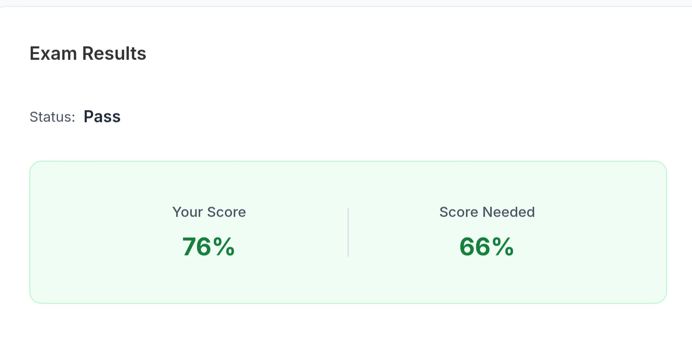

작년 말에 프로그래머스에서 얼리버드 할인으로 약 27~8만원에 바우처를 구매했는데, 올해 내로 모두 응시할 계획이고, 우선 CKA를 먼저 준비했다.

---
## ℹ️ Exam Information

**CKA(Certified Kubernetes Administrator)**
- **Provider:** Linux Foundation
- **Exam format and scope:** A **performance-based exam** focused on solving problems while working with Kubernetes
    - Storage: 10%
    - Troubleshooting: 30%
    - Workloads & Scheduling: 15%
    - Cluster Architecture, Installation & Configuration: 25%
    - Services & Networking: 20%
- **Exam duration:** 120 minutes
- **Kubernetes version:** v1.35 (as of April 18, 2026; The exam version is usually updated 1-2 months after a new minor version is released)
- **Cost:** $445
    - After purchase, you can schedule the exam within one year
    - One retake is included
    - It is recommended not to but at full price and instread look for discounts through coupons
- **Exam environment:** Online, using the PSI Secure Browser, with SSH access for each question on an Xfce-based Linux host
    - **Room and camera requirements:**
        - You must take the exam alone in the room
        - No one, including children, adults, or animals, may enter
        - The environment must be quiet and free of disturbances
        - You may not cover your mouth during the exam
        - There must be no printed materials posted on the walls
        - Framed pictures and similar items are allowed
        - If a whiteboard is mounted on the wall, it must be completely blank
        - There must be nothing under the desk
        - Other than the computer required for the exam, all other items must be removed and kept out of reach during the exam
        - Earphones are not allowed
        - You may not wear anything on your wrists
        - Water is allowed only if it is in a transparent, unlabeled bottle
    - **Exam equipment requirements:**
        - Supported operating systems: latest Windows 10 or 11 / macOS / Linux (Ubuntu only)
        - No other processes may be running besides the PSI browser (such as web browsers, note-taking apps, etc.)
        - A microphone and webcam must be available
        - A stable network connection is recommended
        - A personal PC or laptop is recommended rather than a company-issued device
        - A network without restrictions such as firewalls is recommended
        - A monitor of at least 15 inches is recommended
        - Additional monitors are not allowed
    - There may be additional restrictions (for detauls, refer to the [Linux Foundtation](https://docs.linuxfoundation.org/tc-docs/certification/tips-cka-and-ckad))
- **Identification:**
    - The ID must include a photo
    - The English name on the ID must match the name used for exam registration
    - Passport, international driver’s license, etc.

---
## 📖 Exam preparation

My total preparation period was three weeks. I think I spent about 1–2 hours per day on average. \
For lectures, I used [Udemy - Certified Kubernetes Administrator (CKA) with Practice Tests](https://www.udemy.com/course/certified-kubernetes-administrator-with-practice-tests/), and I also solved the **KodeKloud practice problems** provided alongside the course immediately after finishing each section. \
Overall, I was satisfied with the course. The explanations were clear and beginner-friendly, and since it is usually difficult to recreate these environments on your own, it was very convenient to have problem scenarios provided right away for practice. \
Also, the course did not only cover topics important for the CKA exam itself, but also explained related background knowledge. That made it a good review for topics I already knew, while helping me easily learn concepts I was unfamiliar with.

Two days before the exam, I worked through the Lightning Labs and Mock Exams provided on KodeKloud in connection with the course. \
And the day before the exam, I completed the two mock exams on Killer.sh that were included when I registered for the test.

On the day of the exam, I reread the notes I had made from the questions I had gotten wrong while walking in the morning.

---
## ✏️ During the exam

Because the exam conditions are quite strict, I felt it would be realistically difficult to take it at home. \
So, like many others in online reviews, I reserved a private room at a study café in advance and took the exam there. \
I booked the room from 09:00 to 12:00 and scheduled the exam for 09:30 to 11:30, which turned out to be just right.

**You can enter the exam environment 30 minutes before the start time, so if you go in early, you can complete the room check in advance and begin the exam right away.** \
Once the environment check started, they first verified my ID. In some other reviews, people said that if your photo had already been submitted during exam registration, they skipped the ID check, but in my case they checked it again. \
After that, I had to show my surroundings, and I carefully used my laptop webcam to show even the area under the desk. \
I also heard that by connecting through a QR code, you can briefly use your smartphone to help show the exam environment. \
Finally, I showed myself putting my smartphone away, then showed my wrists and ears by turning them toward the camera, and then the exam began. \
When I asked whether a laptop stand and a wireless mouse were allowed, I was told that both were permitted.

After that, I worked through the questions. \
**The difficulty level was a little harder than KodeKloud, but easier than Killer.sh.** \
People usually say that if you can pass Killer.sh, you are in a fairly safe range for the real exam. \
From what I have seen in the community, quite a few people still pass the actual exam even if they fail Killer.sh.

You can move freely between questions, and if you place a flag on a question, it gets marked in the list so it is easier to review later. \
At the top of each question, the system suggests relevant documentation links, and the SSH information you need to connect can be copied and pasted directly. \
The body of each question is divided into a context section explaining the scenario and a task section describing what you need to do. \
Some questions also include a test command to verify your work, though passing that check does not necessarily mean your answer is fully correct. For example, there could still be a namespace mismatch.

VSCodium is available, although you cannot install plugins. \
I personally just used the terminal and Vim, but if you prefer a VS Code–style environment, it seems like a good option.

---
## 🚀 Result

24 hours later, the result came out! \
I rememvered that I had used the wrong namespace on the exam, so I expected to lose a significant number of points because of it. \
Still, since I had already scored above the passing mark on Killer.sh, I was not too worried about whether I would pass.
I ended up with a score of 76%, which honestly did not quite meet my own expectations. \
That said, what matters most is that I passed, so I decided to put my disappointment behind me. \
(And anyway, I have to take it again in two years 😂)

The certificate can be downloaded as a PDF. \
You can also claim an Open Badge on Credly.

---
## 🍕 Latest informations (April 2026) and tips

**If you look at older reviews, many recommend setting up aliases and shell autocompletion yourself, but that is no longer necessary.** \
From the base host, you move into a different environment for each question via SSH, and alias k="kubectl" as well as autocompletion are already configured. \
Overly customized aliases are not very meaningful, since the environment changes from question to question. For example, something like kgpoy = kubectl get pod -o yaml is hardly useful. \
It is best to just use the default setup as provided.

The following are relatively newer topics, so they are quite likely to appear on the exam:
- Kustomize
- Helm
- Gateway API
- CustomResourceDefinition (CRD)

There are also several other useful tips for the exam:
- It is good to work imperatively when possible and make active use of `--dry-run=client -o yaml`.
- Even when practicing in the KodeKloud environment, try not to rely on lecture materials, notes, or personal memos. Instead, practice using the official documentation just as you would in the real exam.
- Since the exam is meant to test your Kubernetes knowledge, other details are usually explained kindly for you.
    - For example, it may tell you how an nginx configuration should be modified, or what command should be used inside a sidecar container.
- Still, the more commands you know, the better. For example:
    - `k get no <nodename> -o yaml | grep -A10 "taints"`: print the 10 lines after the taints section of a node
    - `journalctl -u kubelet`: check kubelet logs
    - `openssl x509 -noout -text -in <cert-file>`: inspect certificate information
    - `kubeadm token create --print-join-command`: create a join token and print the worker node join command
- It can also be helpful to become familiar with `crictl`, `yq`, and `kubectl` features such as jsonpath and custom headers.
- **Read each question carefully and avoid confusion over namespaces. Even a small phrase can be a subtask or an important condition.**
- **Make full use of copy and paste. Copying resource names and similar values can help reduce typos.**
    - In the browser, use `Ctrl + C / Ctrl + V`, and in the terminal, use `Ctrl + Shift + C / Ctrl + Shift + V`.

---
## 🛏️ Conclusion

Although I earned the CKA, it is important to remember that this does not mean I have mastered Kubernetes. \
I still have a lot of shortcomings, and there is still much more for me to learn. \
At most, I have learned how to juggle the ball and dribble on the training ground; what really matters is performing well in an actual match.

**Still, it is true that preparing for the exam helped me learn much more about Kubernetes, and significantly improved my fundamental hands-on ability to work with clusters.** \
I also still have vouchers for **CKAD** and **CKS**, so I am planning to take those later this year.
