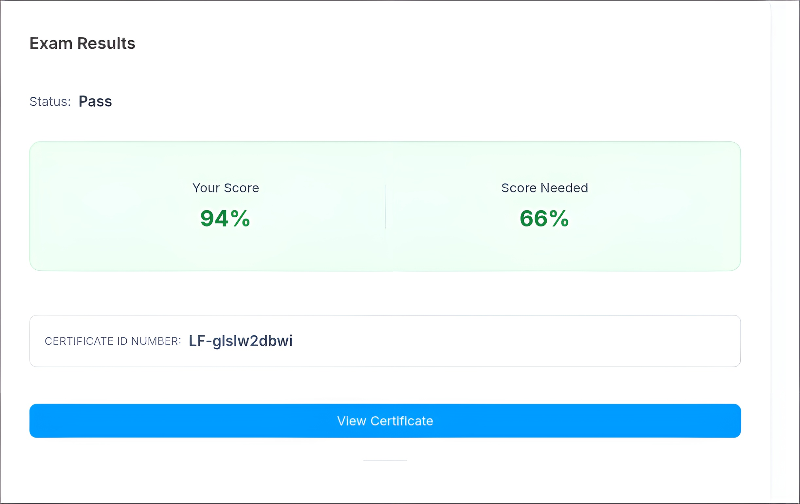
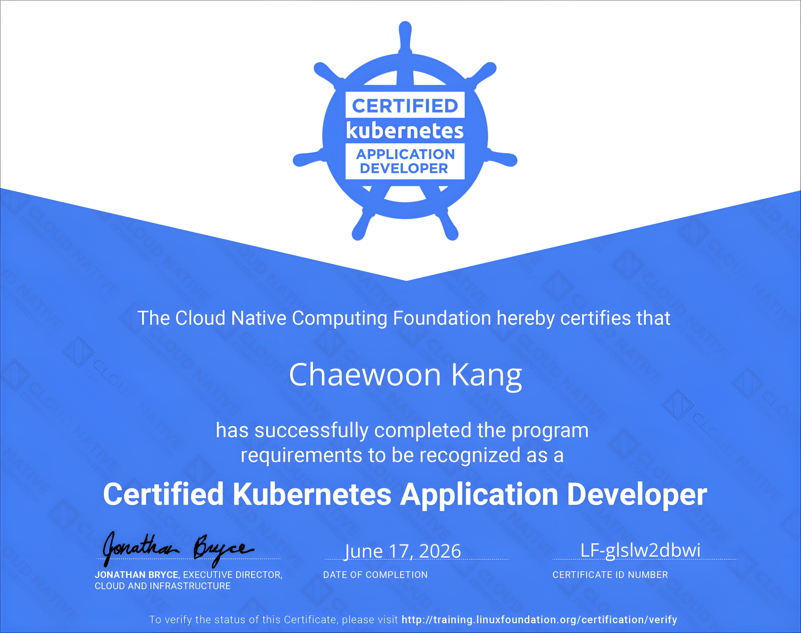

I bought the exam voucher late last year through an early-bird discount on Programmers for about 270,000 to 280,000 KRW.

---
## ℹ️ Exam Information

**CKAD(Certified Kubernetes Application Developer)**
- **Organizer:** Linux Foundation
- **Exam scope:** A performance-based exam about deploying applications on Kubernetes
    - Application Design and Build: 20%
    - Application Deployment: 20%
    - Application Observability and Maintenance: 15%
    - Application Environment, Configuration and Security: 25%
    - Services and Networking: 20%
- **Duration:** 120 minutes
- **Kubernetes version:** v1.35 (as of 2026.06.17; the exam version is usually updated 1 to 2 months after a new minor release)
- **Cost:** $445 (as of 2026.06)
    - After purchase, you can schedule the exam within 1 year.
    - 1 free retake is included.
    - I recommend looking for discount coupons instead of paying the full price.
- **Exam environment:** Online, using PSI Secure Browser, with an Xfce-based Linux host and SSH access for each task
    - See the [Linux Foundation guide](https://docs.linuxfoundation.org/tc-docs/certification/tips-cka-and-ckad) for details.
    - You can also refer to [my CKA review](  ).

---
## 📖 Preparation

My total preparation time was 3 days, including the exam day. \
This was shorter than my CKA preparation, partly because I already had CKA experience and partly because the course I chose this time was more optimized for the actual exam. \
I took the [Inflearn - CKAD Practical Exam Guide](https://www.inflearn.com/course/certified-kubernetes-2?cid=341153) course.

On day 1, I went through the lectures with hands-on practice. \
On day 2, I used the Killer.sh mock exam to get used to the environment. \
Some Killer.sh questions seemed to go beyond the actual exam scope, and the mock exam was difficult, but I still passed it. \
After that, I solved the practice questions from the course again on my own. \
Instead of using the virtualbox + vagrant environment provided by the course, I practiced on my homelab cluster with only Traefik installed.

On the morning of the exam, I reread my notes while walking to the study cafe.

---
## ✏️ Taking the Exam

I used a study cafe when I took the CKA exam before, and I reserved a study room again for this CKAD exam. \
I booked the room from 09:00 to 12:00 and scheduled the exam from 09:30 to 11:30, which was just about right.

You can enter the exam environment 30 minutes before the scheduled time, so if you join early, you can finish the room check early and start the exam right away. \
From the beginning of check-in, I had to show the surrounding environment, including the area under the desk, with my laptop webcam. \
The exact standards seem to vary by proctor. When I took CKA in the same study room, the CCTV in the room was not mentioned, but this time the proctor pointed it out, so I changed my seat to face away from the CCTV. \
It seems that you can also connect your smartphone through a QR code and briefly use it to show the exam environment. \
Finally, I showed that I had put my smartphone away, rotated my wrists and ears to show that I was not wearing anything, and then started the exam. \
I asked directly about using a laptop stand and a wireless mouse, and the proctor allowed both.

After the exam started, I began solving the tasks. \
Thanks to the course, I was able to take the exam comfortably. \
The overlap with CKA also helped a lot. \
I finished solving the questions in 60 minutes, reviewed them for another 20 minutes because I had too much time left, and ended the exam early with 40 minutes remaining.

You can move freely between questions, and if you flag a question, it is marked in the list, making it easy to revisit later. \
At the top of each question, related documentation links are suggested, and the SSH information you need to access the environment can be copied and pasted directly. \
Each question body is divided into a context section that describes the scenario and a task section that describes what you need to do.

VSCodium is available, but plugins cannot be installed. \
I just used the terminal and vim, but if you prefer a VS Code-based environment, it seems usable.

---
## 🚀 Result

The result came out about 24 hours after the exam started. \
I scored 94. Detailed scoring information is not provided.

The certificate can be downloaded as a PDF, and an Open Badge is provided through Credly.

---
## 🍕 Latest Notes (2026.06) and Exam Tips

Compared to CKA, CKAD seems to have a narrower scope and feels relatively easier. \
**Some older reviews say that you should configure aliases and shell completion yourself, but that is no longer necessary.** \
You move between different environments for each question by using SSH from the base host, and `alias k="kubectl"` and shell completion are already configured. \
Excessive alias setup is not very useful because the environment changes for each question (for example, `kgpoy = kubectl get pod -o yaml`). \
Just use the default setup.

I also have a few general exam tips:
- **Read each question carefully and avoid namespace mistakes. Even small wording details can be subtasks or conditions.**
- **Use copy and paste actively. Copying resource names helps reduce typos.**
    - In the browser, use `Ctrl + <C/V>`. In the terminal, use `Ctrl + Shift + <C/V>`.

---
## 🛏️ Final Thoughts

Even though I earned the CKAD certification, I still have a lot to learn. \
Next, I still have a **CKS** voucher, so I will probably prepare for it during summer vacation. \
Security-related topics are becoming increasingly important, and there are still many parts I do not know well, so I need to study beyond just preparing for the certification.
