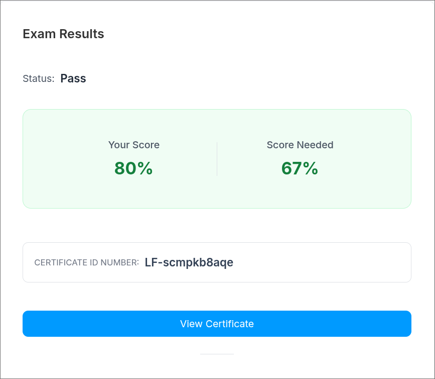
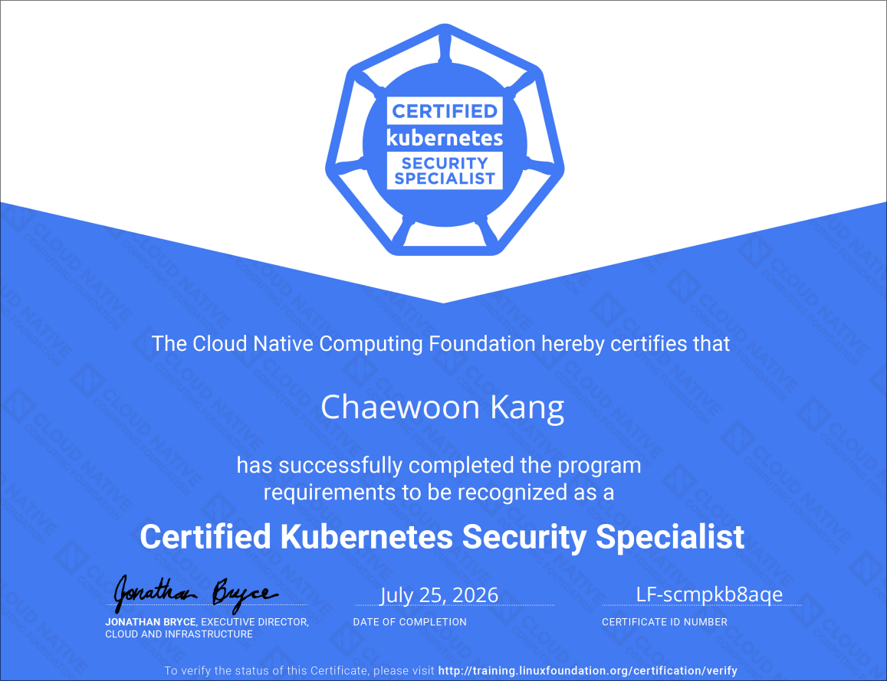

작년 말에 프로그래머스에서 얼리버드 할인으로 약 27~8만원에 바우처를 구매했고, CKA -> CKAD -> CKS순으로 시험을 봐서, 세 번째 Kubernetes 자격증 시험을 봤다.

---
## ℹ️ 시험 정보

**CKS(Certified Kubernetes Security Specialist)**
- **주관:** Linux Foundation
- **시험 내용 및 범위:** Kubernetes 생태계에서의 security best practices에 대한 내용
    - Cluster Setup: 15%
    - Cluster Hardening: 15%
    - System Hardening: 10%
    - Minimize Microservice Vulnerabilities: 20%
    - Supply Chain Security: 20%
    - Monitoring, Logging, and Runtime Security: 20%
- **시험 시간:** 120분
- **Kubernetes 버전:** v1.35 (2026. 07. 25기준, 보통 마이너 버전이 출시되고 몇 주 이후에 시험버전이 업데이트 된다고 함.)
- **비용:** $445(2026.07 기준)
    - 구매 시, 1년 이내로 시험을 신청할 수 있음
    - 1번의 재기회 제공
    - 정가에 구매하지 말고, 쿠폰을 통한 할인을 노리는 것 권장
- **시험 환경:** 온라인, PSI Secure browser 사용, Xfce 기반 Linux 호스트에서 문제별 SSH접속
    - 자세한건 [Linux Foundtation](https://docs.linuxfoundation.org/tc-docs/certification/tips-cka-and-ckad)에서 확인
    - 또는 [본 블로그에서의 CKA 후기](  ) 참고
- **조건:** CKA 취득
- **혜택:** CKA 자동갱신
    - [출처: Expanding CARE: Passing CKS can now extend your CKA certification](https://training.linuxfoundation.org/blog/expanding-care-passing-cks-can-now-extend-your-cka-certification/)
    - [Care Program](https://training.linuxfoundation.org/care-program/)

---
## 📖 시험 준비

준비 기간은 약 3주 정도 된다. \
강의로 [Udemy - Certified Kubernetes Security Specialist 2026 by Zeal Vora](https://www.udemy.com/course/certified-kubernetes-security-specialist-certification) 를 봤으며, 내용 설명이 좋고 PDF나 실습 자료도 잘 제공해줘서 좋았다. 

시험 이틀 전에는 killer.sh모의고사를 한 번 풀고 리뷰하였고, \
전날에는 killer.sh의 두 번째 모의고사를 풀고 리뷰하였다. \
killer.sh에서 이미 고득점을 맞아놨기에, 떨어질 것 같다는 생각은 하지 않았다. \
그리고 시험 당일 아침에 취약한 유형쪽 정리 및 오답노트를 폰으로 읽으며 스터디카페로 걸어갔다.

---
## ✏️ 시험 응시

이전 CKA, CKAD 응시때에도 스터디카페를 이용했는데, 이번에도 같은 스터디카페의 스터디룸을 미리 예약해서 시험을 봤다. \
스터디룸 예약을 09:00 ~ 12:00으로 잡고, 시험 예약을 09:30 ~ 11:30으로 해놓으니 딱 적절했다.

시험 환경에는 30분 전부터 입장가능해서 미리 들어가 있으면 일찍 주변 환경 점검을 할 수 있고, 바로 시험을 볼 수 있다. \
입실 시작부터 주변 환경을 보여주는데, 책상 아래까지 꼼꼼히 노트북 웹캠으로 보여줬다. \
여권 확인은 CKAD때에는 아니였지만, 이번에는 추가적으로 했다. 감독관마다 달라서 이미 PSI에 업로드 되어있더라도 준비해두는 것이 좋을 것 같다. \
이번에도 CKAD때처럼 CCTV에 대해 지적을 받아서, CCTV가 노트북 화면을 녹화하지 못하도록 하라고 하여 CCTV의 반대편에 앉아 시험을 봤다. \
마지막으로, 스마트폰을 치우는 모습을 보여주고, 손목과 귀를 돌리면서 아무 착용이 없는 것을 보여준 뒤, 시험을 시작했다. 

시험이 본격적으로 시작되고, 문제를 풀었다. \
절반 정도는 태스크가 꽤 있는 문제였고, 나머지는 준비가 되었다면 빠르게 풀 수 있었다. \
나는 Falco문제에서 시간을 많이 소모해버렸다.. 다행히도 다른 문제들을 먼저 풀고 마지막에 붙잡아서 그나마 다행이었다.

문제는 자유롭게 돌아다닐 수 있으며, flag를 세우면 리스트에서 마킹되어 다시 검토하기 편하게 되어있다. \
문제의 맨 위에는 관련 문서 링크를 제안해주고, 접속해야 할 SSH 정보도 바로 복사-붙여넣기 가능하다. \
본문은 시나리오를 설명하는 context와 해야하는 일인 task로 나뉜다. 

vscodium이 사용가능하며, 플러그인은 설치할 수 없다. \
나는 그냥 터미널 + vim을 이용했는데, vsc기반의 환경을 선호한다면 사용하는 것도 좋아보인다.

---
## 🚀 시험 결과

시험 시작 기준 약 24시간 뒤, 결과가 나왔다! \
점수는 80점이고, 세부 채점은 알 수 없다.

자격증은 PDF로 다운받을 수 있으며, Credly를 통해 Open Badge가 제공된다.

---
## 🍕 최신 정보 (2026. 07) 및 시험에 대한 팁

역시 CKS가 CKA, CKAD보다 더 어려운 것 같다. \
굳이 난이도를 매겨보자면, 이 정도인 것 같다.
- CKAD: ★★★☆☆ (3/5)
- CKA:  ★★★⯨☆ (3.5/5)
- CKS:  ★★★★☆ (4/5)

CKS는 쿠버네티스 리소스 뿐만 아니라, 클러스터 구성에서의 세부 옵션 hardening에 필요한 조건 및 옵션들을 맞추기 더 까다로웠고, 시험 범위 자체가 상당히 많다. \
Bom, Trivy, Istio, Cilium, Falco 등, 훨씬 더 넓게 알아야 한다. \
나의 경우는 Cilium의 경우는 이전에 사용한 적이 많기에 별로 부담이 없었지만, Istio와 Falco등은 제대로 사용해본 적이 없었다. \
그리고, 더 높은 수준의 리눅스 사용/활용 능력이 요구된다.

이외 시험에 대한 팁은 여러 가지 있다:
- **문제를 잘 읽고, namespace혼동이 없게 하자. 사소한 표현 하나하나가 서브태스크이거나 조건일 수 있다.**
- **복사-붙여넣기를 적극 활용하자. 리소스 이름과 같은 것들을 복붙하여 오타를 줄일 수 있다.**
    - 브라우저는 `Ctrl(Cmd) + <C/V>`, 터미널은 `Ctrl + Shift + <C/V>`.
- Falco출력 버퍼링 대신 즉각적으로 받기: `falco -U` 또는 `falco --unbuffered`
- 시간이 있다면, 무조건 직접 검증해서 정답을 확인하자. (ex. NetworkPolicy나 CiliumNetworkPolicy를 만들고 Pod끼리 통신해보기, ServiceAccount token이 projected volume으로 잘 마운트 되었는지 확인하기 등)

---
## 🛏️ 시험 후기 및 마무리

CKS를 취득해서 기쁘지만, 솔직히 Falco나 Istio의 경우는 더 깊게 경험할 필요가 있는 것 같다. \
시험 준비를 통해 경험하긴 했지만, 클러스터에 제대로 사용해보고 적용하는 건 다음 기회에 해야 할 것 같다. \
**그래도 역시 쿠버네티스 생태계에서의 보안에 대한 지식이 확실히 늘었고, 안전한 클러스터를 구축할 수 있는 기반이 되어주는 경험임은 확실하다.**

최근 CKS에 토익스피킹(졸업때문에..)에 많은 일들이 있어 블로그가 뜸했는데, 앞으로 더 많은 내용 정리들과 경험들로 채워나갈 것이다.
