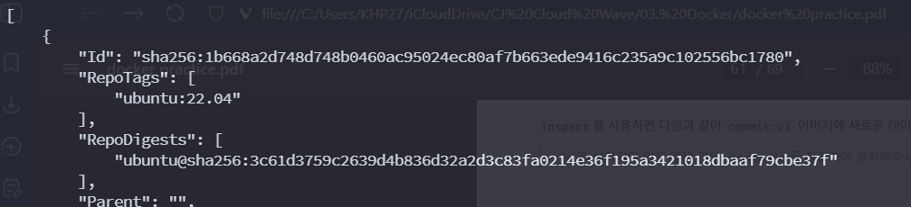
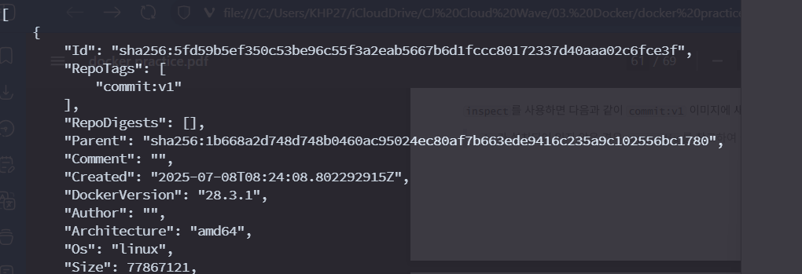

## Docker commit

commit을 자주 쓰이지는 않는다.  
보통은 Dockerfile로 이미지를 제작하지만, 긴급한 상황이나 디버깅의 경우에서 사용된다.  

```bash
docker commit [OPTIONS] CONTAINER [REPOSITORY[:TAG]]
```

**Options:**
- `--author(-a)`: author를 설정
- `--change(-c)`: 추가로 적용할 `Dockerfile` 명령어 설정
- `--message(-m)`: Commit message
- `--pause(-p):` : Commit 동안 컨테이너 중지(기본값 true)

> **주의사항**
> 
> - Production 에서 사용할 이미지라면 `commit` 대신 `Dockerfile`을 기반으로 제작하는 것이 좋다.  
> - 볼륨( volume )에 저장된 데이터는 포함되지 않는다.  
> - --pause 옵션을 설정하지 않은 경우, `commit` 하는 동안 컨테이너를 중지( pause )된다.  
> - `--change` 에서 지원하는 명령어는 다음과 같다:
>     - `CMD`
>     - `ENTRYPOINT`
>     - `ENV`
>     - `EXPOSE`
>     - `LABEL`
>     - `ONBUILD`
>     - `USER`
>     - `VOLUME`
>     - `WORKDIR`

### 연습: Commit을 이용하여 패키지가 추가로 설치된 이미지 생성

`ubuntu:22.04`이미지로부터 base라는 이름의 컨테이너 생성
```bash
docker run -itd --name base ubuntu:22.04
```

`curl``이 있는지 확인
```bash
docker exec base apt list --installed "curl"
                                                                                                                                                                                           WARNING: apt does not have a stable CLI interface. Use with caution in scripts.

Listing...
```

`curl`설치
```bash
docker exec base /bin/bash -c "apt-get update && apt-get upgrade -y && apt-get install -y curl"
Get:1 http://security.ubuntu.com/ubuntu jammy-security InRelease [129 kB]
Get:2 http://archive.ubuntu.com/ubuntu jammy InRelease [270 kB]
Get:3 http://security.ubuntu.com/ubuntu jammy-security/multiverse amd64 Packages [48.5 kB]
Get:4 http://security.ubuntu.com/ubuntu jammy-security/restricted amd64 Packages [4763 kB]
Get:5 http://archive.ubuntu.com/ubuntu jammy-updates InRelease [128 kB]
Get:6 http://archive.ubuntu.com/ubuntu jammy-backports InRelease [127 kB]
Get:7 http://archive.ubuntu.com/ubuntu jammy/multiverse amd64 Packages [266 kB]
Get:8 http://archive.ubuntu.com/ubuntu jammy/main amd64 Packages [1792 kB]
```

`curl`이 있는지 확인
```bash
docker exec base apt list --installed "curl"
                                                                                                                                                                                           WARNING: apt does not have a stable CLI interface. Use with caution in scripts.

Listing...                                                                                                                                                                                 
curl/jammy-updates,jammy-security,now 7.81.0-1ubuntu1.20 amd64 [installed]
```

base 컨테이너는 commit:v1으로 저장
```bash
docker commit base commit:v1                                                                                                                                                             
sha256:3a9f99c95d9812a5be56da9cad3c3950e2d20ada22eb8ab6b85efe4735e53ddb
```

`commit:v1`으로부터 새로운 컨테이너를 생성하여 `curl`이 있는지 확인
```bash
docker run --name restore commit:v1 apt list --installed "curl"

Listing...                                                                                                                                                                                 
curl/jammy-updates,jammy-security,now 7.81.0-1ubuntu1.20 amd64 [installed]
```


### 연습: 실행중인 컨테이너의 Port를 추가로 Expose하기

컨테이너를 하나 생성하고, 포트가 닫힌걸 확인
```bash
➜ docker run -it -d --name base ubuntu:22.04
016c47b24b5c553f4031380ca474918db296f58f5235589a5777e9dbc0200e7b

~ …
➜ docker ps
CONTAINER ID   IMAGE          COMMAND       CREATED         STATUS         PORTS     NAMES
016c47b24b5c   ubuntu:22.04   "/bin/bash"   4 seconds ago   Up 3 seconds             base
```

포트를 개방하며 무중단으로 커밋
```bash
~ …
➜ docker commit --change="EXPOSE 80" --pause=false base commit:v1
sha256:5fd59b5ef350c53be96c55f3a2eab5667b6d1fccc80172337d40aaa02c6fce3f

```

새로운 컨테이너를 열고, 포트가 열려있는지 확인
```bash
~ …
➜ docker run -itd commit:v1
490f7f67188e8a96ffdd67109fb8d389a8d47d590906801f6111150bcb0fcae4

~ …
➜ docker ps
CONTAINER ID   IMAGE          COMMAND       CREATED          STATUS          PORTS     NAMES
490f7f67188e   commit:v1      "/bin/bash"   3 seconds ago    Up 3 seconds    80/tcp    epic_brahmagupta
016c47b24b5c   ubuntu:22.04   "/bin/bash"   57 seconds ago   Up 56 seconds             base

```

`ubuntu:22.04`의 inspect


`commit:v1`의 inspcet

