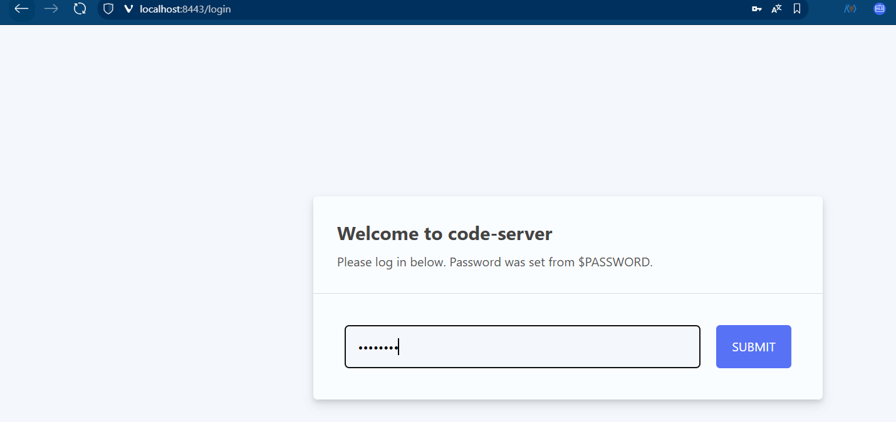
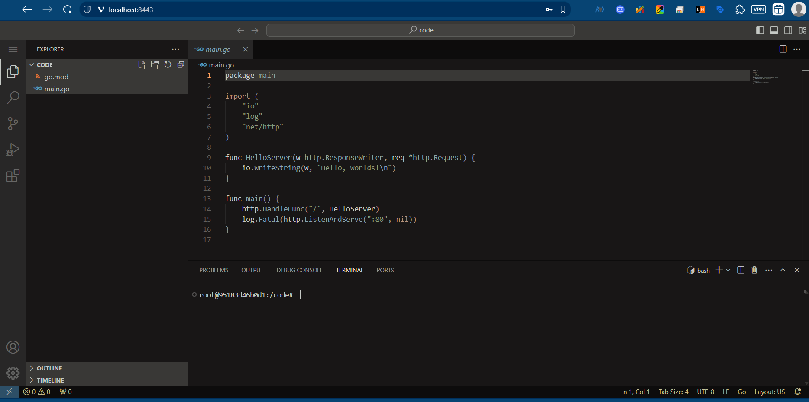
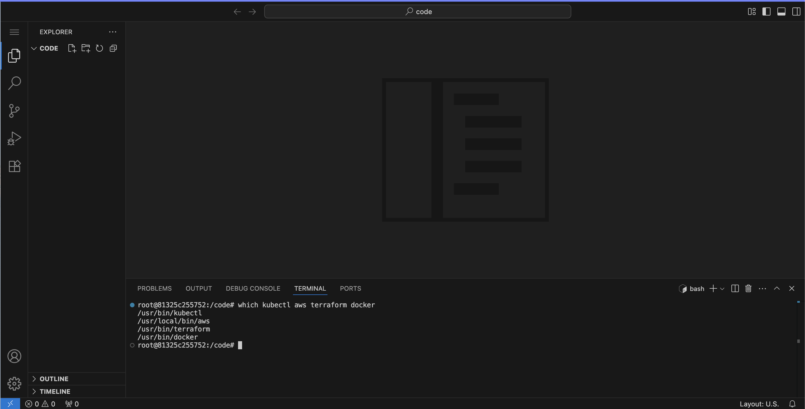

컨테이너는 **"서비스의 추상화"** 를 제공한다.  
호스트로부터 (논리적으로)격리된 네트워크, 파일시스템, 패키지, 라이브러리 등을 가진다.  
이러한 컨테이너 안에서, 나만의 개발환경을 만들 수 있다.  


## 🏃 Code-Server 실행해보기

`linuxserver/code-server:4.101.2`를 사용했다.  
- 컨테이너 이름은 `ide`
- `8443` 포트를 노출해보자.

아래의 환경변수를 주입할 것이다:
- `PASSWORD=password`
- `DEFAULT_WORKSPACE=/code`
- `PUID=0`
- `PGID=0`
- `TZ="Asia/Seoul"`

볼륨은 다음과 같이 마운트 해야 한다: 
- 로컬의 `/home/user/code`를 컨테이너의 `/code`에 마운트 할 것이다.
- `/var/run/docker.sock`을 `/var/run/docker.sock`에 마운트 할 것이다.
- 각종 익스텐션 및 테마 등을 저장하고 싶다면, `configvol`(또는 다른 이름을 선택할 수 있다) 볼륨에서 `/config`에 마운트 할 수 있다.  
유저 홈에서 `/code` 또는 원하는 디렉토리를 준비해주고, `config`를 영속적으로 저장할 볼륨을 하나 만들어놓아야 한다.  
예시: `docker volume create configvol`  


브라우저에서 [localhost:8443](localhost:8443)에 접속해서 서비스가 사용 가능한지 확인해보자.

```bash
docker run -d --name ide -e PASSWORD=password \
 -e DEFAULT_WORKSPACE=/code \
 -e PUID=0 -e PGID=0 \
 -e TZ="Asia/Seoul" \
 -p 8443:8443 \
 -v ~/code:/code \
 -v /var/run/docker.sock:/var/run/docker.sock \
 -v configvol:/config \
 linuxserver/code-server:4.101.2
```

성공적으로 접속했다!




## 🛠️ 추가 도구들 설치하고 멀티플랫폼으로 빌드하기

이러한 개발환경에 추가적인 소프트웨어들이 설치된 이미지를 만들고, 멀티플랫폼으로 빌드해놓으면, 언제 어디서든 컨테이너 기반으로 빠르게 개발 환경을 구성할 수 있을 것이다.  

`Docker`, `AWS CLI`, `kubectl`, `Terraform`이 설치되어있고, 모든 플랫폼에서 사용할 수 있도록 하는 이미지를 만들어 볼 것이다.  
`Dockerfile`을 통해서 `code-server`를 기반으로 하는 이미지를 base로 하여 각각의 설치 레이어들을 쌓아 이미지를 만들면, vscode부터 각종 인프라 도구들이 세팅된 이미지가 나오게 된다.   

`AWS CLI`는 플랫폼별로 설치 방식이 다르기 때문에,  
이를 간편하게 처리하기 위해 **멀티스테이지 빌드** 를 사용한다.  
`amazon/aws-cli` 이미지에서 CLI파일만 추출해 최종 이미지에 복사하는 방식이다.  
이렇게 하면 설치 복잡도를 낮추고, 이미지 용량도 줄일 수 있다.  

```Dockerfile
FROM amazon/aws-cli:2.17.9 AS awsbuilder

FROM linuxserver/code-server:4.101.2

ENV TZ="Asia/Seoul"
ENV PUID=0
ENV PGID=0

# Ubuntu Package Update & Install Requirements
RUN apt-get update && apt-get -y upgrade
RUN apt install -y ca-certificates curl gnupg software-properties-common wget apt-transport-https groff

# Install Docker: Add GPG Key
RUN install -m 0755 -d /etc/apt/keyrings
RUN curl -fsSL https://download.docker.com/linux/ubuntu/gpg -o /etc/apt/keyrings/docker.asc
RUN chmod a+r /etc/apt/keyrings/docker.asc

# Add the repository to Apt sources
RUN echo "deb [arch=$(dpkg --print-architecture) signed-by=/etc/apt/keyrings/docker.asc] https://download.docker.com/linux/ubuntu $(. /etc/os-release && echo \"${UBUNTU_CODENAME:-$VERSION_CODENAME}\") stable" | tee /etc/apt/sources.list.d/docker.list > /dev/null
RUN apt-get update
RUN apt-get install -y docker-ce docker-ce-cli

# Install AWS CLI
COPY --from=awsbuilder /usr/local/aws-cli/v2 /usr/local/aws-cli/v2
RUN ln -s /usr/local/aws-cli/v2/current/bin/aws /usr/local/bin/aws
RUN ln -s /usr/local/aws-cli/v2/current/bin/aws_completer /usr/local/bin/aws_completer

# Install Terraform
RUN apt-get update && apt-get install -y gnupg software-properties-common
RUN wget -O- https://apt.releases.hashicorp.com/gpg | gpg --dearmor | tee /usr/share/keyrings/hashicorp-archive-keyring.gpg > /dev/null
RUN gpg --no-default-keyring --keyring /usr/share/keyrings/hashicorp-archive-keyring.gpg --fingerprint
RUN echo "deb [signed-by=/usr/share/keyrings/hashicorp-archive-keyring.gpg] https://apt.releases.hashicorp.com $(lsb_release -cs) main" | tee /etc/apt/sources.list.d/hashicorp.list
RUN apt update && apt-get install -y terraform=1.6.6-1

# Install Kubectl
RUN curl -fsSL https://pkgs.k8s.io/core:/stable:/v1.29/deb/Release.key | gpg --dearmor -o /etc/apt/keyrings/kubernetes-apt-keyring.gpg
RUN echo 'deb [signed-by=/etc/apt/keyrings/kubernetes-apt-keyring.gpg] https://pkgs.k8s.io/core:/stable:/v1.29/deb /' | tee /etc/apt/sources.list.d/kubernetes.list > /dev/null
RUN apt-get update && apt-get install -y kubectl

# Install Kubens & Kubectx
RUN git clone https://github.com/ahmetb/kubectx /opt/kubectx && ln -s /opt/kubectx/kubectx /usr/local/bin/kubectx && ln -s /opt/kubectx/kubens /usr/local/bin/kubens


```

멀티플랫폼이 지원되는 `builder`를 선택하고, `linux/amd64`, `linux/arm64`로 빌드하고 푸시까지 해보자.  
```bash
docker buildx build --platform linux/amd64,linux/arm64 \
 -t riveroverflow/devcontainer:multiplatform.v1 --push .
```

이제, 컨테이너를 켜보자.
```bash
docker run -d --name ide -e PASSWORD=password \
 -e DEFAULT_WORKSPACE=/code \
 -e TZ="Asia/Seoul" \
 -p 8443:8443 \
 -v ~/src:/code \
 -v /var/run/docker.sock:/var/run/docker.sock \
 -v configvol:/config \
 riveroverflow/devcontainer:multiplatform.v1
```

이제, 각각 명령어들이 잘 있는지 컨테이너 내부에서 아래의 명령어를 실행해 확인해보자:  
```bash
which docker kubectl aws terraform
```


