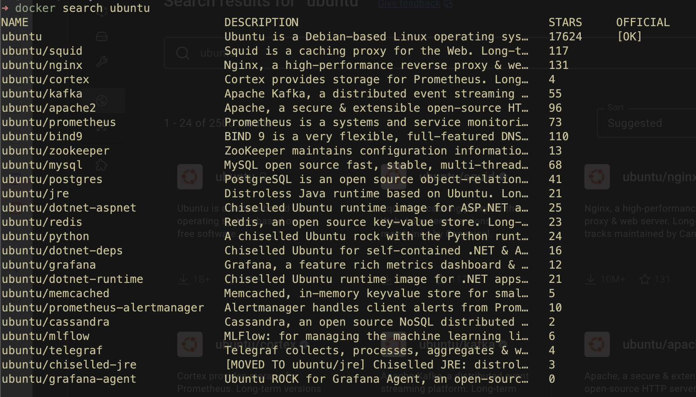
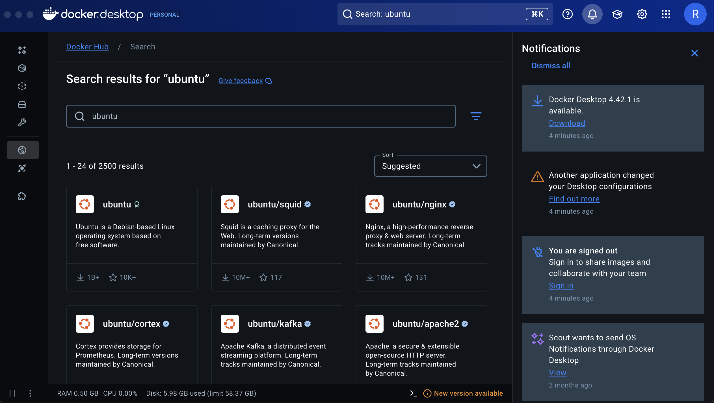

Docker의 사용은 기본적으로 Git/GitHub와 공통점이 많다.  
기존의 기술과의 공통점이 많을수록, 러닝커브가 줄어들어서 새로운 사용자들을 끌어들이기 좋기 때문이다.  


## 📀 Docker 이미지 관리

운영체제처럼, 컨테이너는 이미지가 존재한다.  
대신, 운영체제에 비하면 매우 가벼운 이미지이다.
어플리케이션을 실행하는 데 필요한 정보들을 담겨있다.  
즉, 코드, 라이브러리, 환경설정, 파일 시스템 등이 모두 준비되어있다.  


### Docker Search로 이미지 조회
```bash
docker search [OPTIONS] <Keyword>
```
**Docker Hub** 에 있는 이미지들을 조회한다.

CLI로 조회하면 다음과 같다:

Docker Desktop에서 조회하면 다음과 같다:


### Docker 이미지 다운로드
```bash
docker pull [OPTIONS] REPOSITORY[:TAG|@DIGEST]

# Default
docker pull <REPOSITORY>:latest

# By Tag
docker pull <REPOSITORY>:<TAG>

# By Digest <REPOSITORY>:<DIGEST>
```

기본적으로 Docker Hub에 존재하는 레포지토리로부터 불러온다.

**Options:**
- `--all-tags(-a)`: 태그된 모든 이미지들을 다운로드한다.
- `--platform`: 이미지의 Platform을 설정한다.  
여기서 Platform이란, arm, amd64와 같은 아키텍처를 말한다.

**Tag, Digest**  
Tag또는 Digest를 사용하지 않는 경우, `latest` 이미지를 기본으로 다운받는다.  

- `Tag`는 사용자가 특정 이미지에 부여한 사람이 읽기 좋은 태그 값으로, 같은 Tag더라도 서로 다른 이미지를 가리킬 수 있다.
- `Digest`는 변경이 불가능한 고유의 값이며, 동일한 방식으로 생성된 이미지라면 동일한 **`Digest`가 생성** 된다.  
이미지가 1바이트라도 바뀌면 다이제스트는 바뀐다.  
Digest는 이미지의 고유한 ID값이 되어, 신뢰성 있다.

> **CAUTION**
> - 동일한 Tag를 가진 이미지가 존재하면, 이미지를 교체하지 않는다.  
> - 동일한 이미지여도 Tag가 다르면, 이미지가 추가된다.  
> - 이미지마다 지원 Platform이 다를 수 있다.  

### 이미지 목록 보기
현재 로컬에 저장된 이미지를 확인할 수 있다.  
```bash
docker images [OPTIONS] [REPOSITORY[:TAG]]

# Aliases
docker image list
docker image ls
```

아래 두 개의 명령어들이 더 현대적인 명령어들이다.  

### 이미지 삭제
```bash
docker rmi [OPTIONS] IMAGE [IMAGE...]

# Alias
docker image rm
```

`docker rmi`는 한 개 이상의 명시된 이미지들을 삭제한다. 

**Options**  
- `--force(-f)`: 컨테이너가 존재하더라도, 이미지를 삭제한다.
원래는 컨테이너가 존재하면, 이미지를 삭제할 수 없다.  
그러나 이 옵션으로 삭제가능하다.  
컨테이너까지 kill시키는 것은 아니지만, 이미지가 삭제된 이후의 컨테이너는 재시작 및 커밋 등에서 불안정해진다.  

### 모든 이미지 삭제
```bash
docker image prune
```
모든 dangling 이미지를 삭제한다.  
dangling 이미지는, 더 이상 사용되지 않는 이미지를 말한다.  
예시를 들자면, nginx 이미지를 받았다고 해보자.  
여기에 build하여 새로운 이미지를 만드는 등의 작업을 하고 나서, 더 이상 쓰이지 않는 중간 레이어가 생긴다.  
이들을 dangling 이미지라고 한다.

### 이미지 정보 조회
```bash
docker inspect [OPTIONS] NAME|ID [NAME|ID...]
```

### 연습: ARM용 Ubuntu 다운로드
```bash
docker pull ubuntu:22.04 --platform linux/arm64/v8
22.04: Pulling from library/ubuntu
e730d307d74e: Pull complete 
Digest: sha256:3c61d3759c2639d4b836d32a2d3c83fa0214e36f195a3421018dbaaf79cbe37f
Status: Downloaded newer image for ubuntu:22.04
docker.io/library/ubuntu:22.04
```

설치 이후, `inspect`해보자. 
```bash
docker inspect ubuntu:22.04 -f "{{ .Architecture }}"
arm64
```

### 연습: PostgreSQL 이미지의 레이어 갯수 확인
Digest: `sha256:a2282ad0db623c27f03bab803975c9e3942a24e974f07142d5d69b6b8eaaf9e2`  
의 PostgreSQL을 `pull`해오자.  

```bash
docker pull postgres@sha256:a2282ad0db623c27f03bab803975c9e3942a24e974f07142d5d69b6b8eaaf9e2
docker.io/library/postgres@sha256:a2282ad0db623c27f03bab803975c9e3942a24e974f07142d5d69b6b8eaaf9e2: Pulling from library/postgres
1f7ce2fa46ab: Pull complete
7c23bdcac538: Pull complete
43187fdc5ebc: Pull complete
7bc6d5552c52: Pull complete
16648961c661: Pull complete
e36f0ab546af: Pull complete
a84cb0803492: Pull complete
b50a897e2632: Pull complete
c8161286a3f1: Pull complete
8a0c088137b8: Pull complete
11be68f68a2e: Pull complete
19f13c4e1d96: Pull complete
c2a71678092b: Pull complete
Digest: sha256:a2282ad0db623c27f03bab803975c9e3942a24e974f07142d5d69b6b8eaaf9e2
Status: Downloaded newer image for postgres@sha256:a2282ad0db623c27f03bab803975c9e3942a24e974f07142d5d69b6b8eaaf9e2
docker.io/library/postgres@sha256:a2282ad0db623c27f03bab803975c9e3942a24e974f07142d5d69b6b8eaaf9e2
```

레이어들을 확인해보자:
```bash
docker inspect a2282 -f "{{range $v := .RootFS.Layers}}{{println $v}}{{end}}"
sha256:92770f546e065c4942829b1f0d7d1f02c2eb1e6acf0d1bc08ef0bf6be4972839
sha256:94ef9904d4df70d048f10800d60a22f6df9f45fe3c4d2a12e485761b7d695892
sha256:65c0efddc8b86104633e023acee9707dfa41249636f3690d315c01c987da56fe
sha256:7e28e769eedfd948a6c6d1dd70ee5a4b0d14b4576f38bb23e64ee30d9afd4d48
sha256:7fad9b4e65a17abc549695d9529b286d97c2453cb2e43e288dcc9a31f87b01b0
sha256:b693edccc3930a496794bd45d6e0fb1d0e7a2d00c3ec72130fe944696479e379
sha256:4f0b1281c6dcf2ceca4094d9730ea0a6184894ca020f94ff43ede84742b4da03
sha256:059a984b41a09df6a5309e7928fdb61772b9db821cae4dad464b4091b126d78b
sha256:b885153181c241ae470af66c8ee62619bb667a0579f9a93fcbecaf1482bbafc3
sha256:931d2dae8d071197900c6b9fd55756e9db68d383fd863f9c1dc40e4e9545f46e
sha256:983e1162f18556cbac001e4a4ae18766a64d157ad14bfef23bdab9a836be4b63
sha256:e59308f2f1f587291d3de81d2df9893e8ee395981e5f753dc370f3b8eda44b24
sha256:39db9e416d9745d9160895485c1d22543edbcffb365bc7ececd44ceab38a9c67
```

---

## ⚙️ Docker 컨테이너 관리

### 컨테이너 실행
```bash
docker run [OPTIONS] IMAGE [COMMAND] [ARG...]
```
- `--name`: 컨테이너 이름 지정
- `--detach(-d)`: 컨테이너를 백그라운드에서 실행
- `--env(-e)`: 환경 변수 설정
- `--env-file`: 환경변수 파일 설정
- `--expose`: 포트 또는 포트 범위 노출
- `--publish(-p)`: 컨테이너 포트 공개
- `--rm`: 컨테이너 종료 시 자동 삭제
- `--interactive(-i)`: 표준 입력 활성화
- `--tty(-t)`: `pseudo-tty`활성화
- `--volume(-v)`: 볼륨을 설정

> **Expose vs Publish**  
> `Expose`는 컨테이너 내부에서 애플리케이션이 어떤 포트를 *"들을 것인지"* 를 **문서화** 한다.  
> 즉, 정보를 제공할 뿐이다.  
> 실제로 해당 포트를 호스트 머신이나 외부 네트워크에 개방하지 않는다.  
>  
> `Publish`는 **컨테이너 내부의 포트를 호스트 머신의 특정 포트에 매핑하여 외부에서 접근할 수 있도록 개방하는 역할** 을 한다.  
> `docker run` 명령어에서 사용되는 런타임 옵션이다.
> 컨테이너의 특정 포트를 호스트 머신의 특정 포트 또는 임의의 사용 가능한 포트에 연결(바인딩) 한다.  
> 외부 네트워크에서 호스트 머신의 지정된 포트로 접근하면, 해당 요청이 컨테이너 내부의 포트로 전달된다.  
> `docker run -p 8080:80 my_image` 명령은 my_image를 호스트 포트 8080 -> 컨테이너 포트 80으로 매핑한다.  

### 연습: Ubuntu 명령어 실행하기
`whoami`와 `date`를 실행한다.
```bash
➜ sudo docker run ubuntu:22.04 /bin/bash -c "whoami && date"
Unable to find image 'ubuntu:22.04' locally
22.04: Pulling from library/ubuntu
e735f3a6b701: Pull complete 
Digest: sha256:3c61d3759c2639d4b836d32a2d3c83fa0214e36f195a3421018dbaaf79cbe37f
Status: Downloaded newer image for ubuntu:22.04
root
Mon Jul  7 01:21:35 UTC 2025
```

### 연습: nginx 실행해보기
```bash
➜ sudo docker run -d -p 80:80 nginx:latest
Unable to find image 'nginx:latest' locally
latest: Pulling from library/nginx
3da95a905ed5: Pull complete
6c8e51cf0087: Pull complete
9bbbd7ee45b7: Pull complete
48670a58a68f: Pull complete
ce7132063a56: Pull complete
23e05839d684: Pull complete
ee95256df030: Pull complete
Digest: sha256:93230cd54060f497430c7a120e2347894846a81b6a5dd2110f7362c5423b4abc
Status: Downloaded newer image for nginx:latest
84b8f00d5513f3c856606a8275a75da7d6c01fda901aceb5804654a80a497532

~ took 9.2s …
➜ curl localhost:80
<!DOCTYPE html>
<html>
<head>
<title>Welcome to nginx!</title>
<style>
html { color-scheme: light dark; }
body { width: 35em; margin: 0 auto;
font-family: Tahoma, Verdana, Arial, sans-serif; }
</style>
</head>
<body>
<h1>Welcome to nginx!</h1>
<p>If you see this page, the nginx web server is successfully installed and
working. Further configuration is required.</p>

<p>For online documentation and support please refer to
<a href="http://nginx.org/">nginx.org</a>.<br/>
Commercial support is available at
<a href="http://nginx.com/">nginx.com</a>.</p>

<p><em>Thank you for using nginx.</em></p>
</body>
</html>
```

### 컨테이너 목록 보기
```bash
docker ps [OPTIONS]

# Include stopped container
docker ps -a
```

**Options:**  
- `--all(-a)`: 상태와 관계없이 모든 컨테이너 표시
- `--filter(-f)`: 지정된 조건에 맞는 컨테이너만 표기
- `--size(-s)`: 전체 파일 사이즈도 보기

### 연습: 종료된 컨테이너도 포함하여 목록 보기
```bash
➜ docker ps -a
CONTAINER ID   IMAGE           COMMAND                  CREATED          STATUS                      PORTS                                 NAMES
84b8f00d5513   nginx:latest    "/docker-entrypoint.…"   25 minutes ago   Up 25 minutes               0.0.0.0:80->80/tcp, [::]:80->80/tcp   clever_moore
9e6cca9c48b6   ubuntu:22.04    "/bin/bash -c 'whoam…"   28 minutes ago   Exited (0) 28 minutes ago                                         exciting_bartik
c0d68db6259e   ubuntu:latest   "/bin/bash"              34 minutes ago   Exited (0) 34 minutes ago                                         upbeat_pike
307ac663ded5   ubuntu:latest   "/bin/bash"              36 minutes ago   Exited (0) 36 minutes ago                                         sleepy_archimedes
```

### 연습: 이름에 "moore"가 들어간 컨테이너만 보기
```bash
➜ docker ps -f "name=moore" 
CONTAINER ID   IMAGE          COMMAND                  CREATED          STATUS          PORTS                                 NAMES
84b8f00d5513   nginx:latest   "/docker-entrypoint.…"   26 minutes ago   Up 26 minutes   0.0.0.0:80->80/tcp, [::]:80->80/tcp   clever_moore
```


### 연습: 컨테이너가 사용중인 볼륨(사이즈) 확인하기
```bash
➜ docker ps -s
CONTAINER ID   IMAGE          COMMAND                  CREATED          STATUS          PORTS                                 NAMES          SIZE
84b8f00d5513   nginx:latest   "/docker-entrypoint.…"   27 minutes ago   Up 27 minutes   0.0.0.0:80->80/tcp, [::]:80->80/tcp   clever_moore   1.09kB (virtual 192MB)
```

### 컨테이너 로그 확인
Docker는 기본적으로 stdout, stderr를 캡처하여 로그를 저장한다.
```bash
docker logs [OPTIONS] <NAME_OR_ID>
```

**Options:**  
- `--follow(-f)`: 로그 계속 표시
- `--tail(-n)`: 마지막 n개 로그 표시
- `--timestamps(-t)`: timestamp 표기
- `--since`: 특정시간 이후만
- `--until`: 특정시간 이전만

### 연습: nginx의 마지막 로그 가져오기
```bash
➜ docker logs --tail 1 nginx
172.17.0.1 - - [07/Jul/2025:02:00:54 +0000] "GET / HTTP/1.1" 200 615 "-" "curl/7.81.0" "-"
```

### 연습: 특정 기간의 로그 확인하기
매초마다 날짜를 출력하는 컨테이너를 생성하자.
```bash
➜ docker run --name clock -d busybox sh -c "while true; do $(echo date); sleep 1; done"
Unable to find image 'busybox:latest' locally
latest: Pulling from library/busybox
90b9666d4aed: Pull complete
Digest: sha256:f85340bf132ae937d2c2a763b8335c9bab35d6e8293f70f606b9c6178d84f42b
Status: Downloaded newer image for busybox:latest
80cfbf8e00d70e43f535fd776e1cabc2878c091312d82eccbc6e3a667de4d94d
```

현재 시간으로부터 20초 전 ~ 10초 전까지 발생한 로그를 확인한다. 
```bash
➜ sudo docker logs -f --since 20s --until 10s clock && echo current time is $(date)
Mon Jul  7 02:03:19 UTC 2025
Mon Jul  7 02:03:20 UTC 2025
Mon Jul  7 02:03:21 UTC 2025
Mon Jul  7 02:03:22 UTC 2025
Mon Jul  7 02:03:23 UTC 2025
Mon Jul  7 02:03:24 UTC 2025
Mon Jul  7 02:03:25 UTC 2025
Mon Jul  7 02:03:26 UTC 2025
Mon Jul  7 02:03:27 UTC 2025
Mon Jul  7 02:03:28 UTC 2025
current time is Mon Jul 7 11:03:39 KST 2025
```

---

## 🕹️ 컨테이너 접속하기

### Attach
```bash
docker attach [OPTIONS] CONTAINER
```
`docker attach` 명령은 현재 실행중인 컨테이너에 터미널의 `STDIO(STDIN, STDOUT, STDERR)`에 연결시킨다.  
- `Ctrl + C`를 통해 프로세스를 종료하면 컨테이너도 종료
컨테이너의 메인 프로세스가 죽으면, 컨테이너가 죽는다!
- 컨테이너를 종료하지 않고 접속을 종료하기 위해서는 `Ctrl + P + Q`를 사용해야 한다.


### Exec
```bash
docker exec -it [OPTIONS] <ID_OR_NAME> [COMMAND]
```
현재 실행중인 컨테이너의 메인 프로세스에 서브 프로세스를 실행시킨다.
- 일부 컨테이너는 쉘이 없을 수도 있다
- `-it`옵션이 없다면, 원격으로 명령어를 실행하고, 프로세스가 종료된다.

### Attach vs Exec vs COMMAND
| 구분 | Attach | Exec | Command |
| --------------- | --------------- | --------------- | --------------- |
| 프로세스 | 메인 프로세스를 현재 터미널에 붙임 | 서브 프로세스를 구동 | 메인 프로세스의 구동을 수정함 |
| 종료 방법 | `Ctrl + p + q` | `Ctrl + C` |  |
| PID | 1(Main Process) | Not 1(Subprocess) | 1(Main Process) |


Attach와 Exec를 각각 사용하여 PID를 출력해보자.
`ubuntu:22.04`를 실행한다. `--rm`은 종료 시 삭제함을 의미한다.
```bash
docker run --rm -it -d --name server ubuntu:22.04
7a54c775d4feef683dfa0b72ddad48b1721a63e97975422e8e86cda920cafa46
```

`attach`로 접속하여 PID를 확인해보자.
```bash
➜ docker attach server
root@069ca1a88359:/# ps aux
USER       PID %CPU %MEM    VSZ   RSS TTY      STAT START   TIME COMMAND
root         1  0.0  0.0   4628  3456 pts/0    Ss   02:15   0:00 /bin/bash
root         9  0.0  0.0   7064  2816 pts/0    R+   02:16   0:00 ps aux
root@069ca1a88359:/# echo $$
1
```

`exec`로 접속해서 PID를 확인해보자.
```bash
➜ docker exec -it server /bin/bash
root@a5894621ca21:/# ps aux
USER       PID %CPU %MEM    VSZ   RSS TTY      STAT START   TIME COMMAND
root         1  0.0  0.0   4628  3456 pts/0    Ss+  02:16   0:00 /bin/bash
root         9  0.0  0.0   4628  3584 pts/1    Ss   02:16   0:00 /bin/bash
root        18  0.0  0.0   7064  2816 pts/1    R+   02:17   0:00 ps aux
root@a5894621ca21:/# echo $$
9
```

> **주의사항**
> 명령어는 working directory를 기준으로 실행되므로, 파일 사용 시에 주의가 필요하다.  
> `docker exec clock sh -c "pwd"`  
> -> /  
> `docker exec -workdir /bin clock sh -c "pwd"`  
> -> /bin  

### 컨테이너 종료 및 시작
```bash
docker stop <NAME_OR_ID> # 종료
docker start <NAME_OR_ID> # 시작
```
> **주의사항**  
> `Dockerfile`을 통해 실행되지 않은 프로세스들은 종료 후 재시작할 경우, 살아나지 않는다.  

### 컨테이너 중지 및 재실행
```bash
docker pause <NAME_OR_ID> # 중지
docker unpause <NAME_OR_ID> # 재실행
```

> **주의사항**  
> 재실행하는 경우, 정지된 모든 프로세스가 재실행된다.  


### 컨테이너 삭제
```bash
docker rm [OPTIONS] CONTAINER [CONTAINER...]
```

**Options:**  
- `--force(-f)`: `SIGKILL` 시그널로 종료 시키고 컨테이너 삭제
- `--volume(-v)`: 컨테이너의 anonymous volumes도 함께 삭제

종료된 모든 컨테이너 삭제:
```bash
docker rm $(docker ps -a -q -f status=exited)
```

모든 컨테이너 삭제:  
```bash
docker rm $(docker ps -a -q)
```


### 컨테이너 리소스 사용량 조회
```bash
docker stats [OPTIONS] [CONTAINER...]
```

**Options**:  
- `—all(-a)`: 모든 컨테이너 표시
- `—no-stream`: 결과를 업데이트하지 않음

### 연습: ubuntu 컨테이너 리소스 사용량 조회 
우선, `docker run`으로 컨테이너를 실행한다.

```bash
docker run -itd --name server ubuntu:22.04
d4cc563b07b2ff66ca296a278376306cfaa1bc7386cc3f0b0dea98ebb4b6cb4a
```

`docker stats --no-stream` 으로 리소스 사용량을 조회한다.
```bash
docker stats --no-stream server
CONTAINER ID   NAME      CPU %     MEM USAGE / LIMIT     MEM %     NET I/O          BLOCK I/O      PIDS
d4cc563b07b2   server    0.00%     1.422MiB / 15.46GiB   0.01%     40.1MB / 295kB   13MB / 104MB   1
```

## 연습: Ubuntu에 접속해서 apt-get 업데이트 및 업그레이드

### 직접 접속
```bash
docker exec -it server /bin/bash
root@d4cc563b07b2:/# apt-get update && apt-get upgrade
```

### exec로 설치
```bash
docker exec server "/bin/bash" -c "apt update && apt upgrade"
```

### docker run으로 시작과 동시에 설치

```bash
sudo docker run -itd --name server3 ubuntu:22.04 /bin/bash -c "apt update && apt upgrade && /bin/bash"
239814b82b0560054d71647a7e630978ddb267fa8b4e6ef454d86c1e193324b8
```

## 실습: PostgreSQL DB에 Table 생성
`16.1 bullseye` 버전에서, `POSTGRES_PASSWORD=1234` 환경변수를 할당하여 `psql_db`라는 이름으로 생성해보자. 
이후, `/bin/bash`로 접속해야 하므로, `-itd` 옵션을 준다.
```bash
sudo docker run -itd --name psql_db -e POSTGRES_PASSWORD=1234 postgres:16.1-bullseye
10b31fd104146f48ff8a9e9df7e71ecfa9fbca270b5ad61f0a8b11ee45cd2b76
```

`/bin/bash`로 접속하여 컨테이너에 접속한 뒤, postgres에 접속해보자.

```bash
➜ docker exec -it psql_db "/bin/bash"  
root@10b31fd10414:/# psql -U postgres
psql (16.1 (Debian 16.1-1.pgdg110+1))
Type "help" for help.

postgres=# CREATE TABLE IF NOT EXISTS cloud_wave (
id SERIAL PRIMARY KEY,
timestamp timestamp
);
CREATE TABLE
postgres=# \dt
           List of relations
 Schema |    Name    | Type  |  Owner
--------+------------+-------+----------
 public | cloud_wave | table | postgres
(1 row)
```
