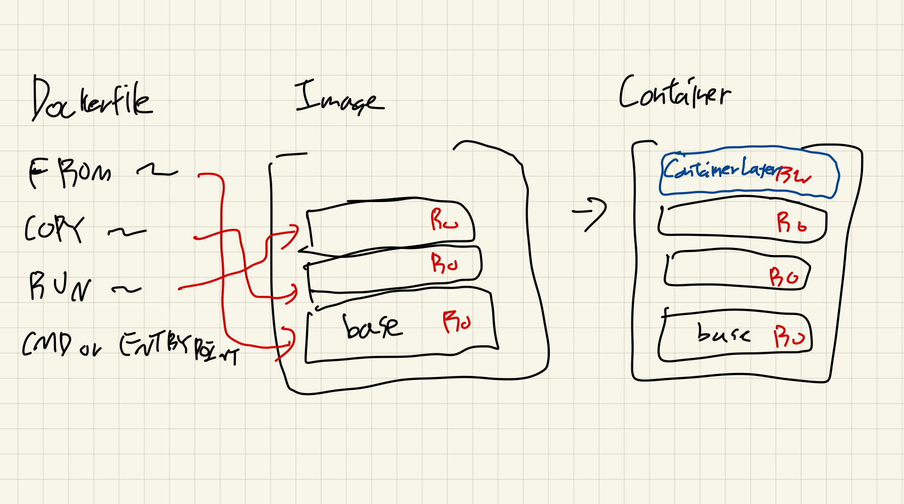

Dockerfile은 애플리케이션을 패키징하기 위한 스크립트이다.  
소프트웨어에서 가장 큰 위험은 사람의 실수(Human Error)이다.  
이런 실수를 줄이는 가장 좋은 방법은 **자동화** 이고, 
Dockerfile은 그런 자동화를 통해 **신뢰할 수 있는 이미지**를 만들도록 돕는다.  

## 🏗️ Docker 이미지 생성
기본적으로 Working Directory의 Dockerfile을 기반으로 한다.
```bash
# docker build [OPTIONS] PATH | URL | - [- <PATH_TO_FILE>]
docker build . [-f <PATH_TO_FILE>
```

**Options:**  
- `--build-arg`: `ARG`를 설정
- `--file(-f)` : `Dockerfile`의 경로 지정
- `--label` : 라벨 추가
- `--no-cache` : 이미지 빌드 시 캐시 사용하지 않음
- `--platform` : `platform`을 지정
- `--pull` : 관련된 이미지를 저장 유무에 관계없이 `pull`
    - 항상 최신버전의 관련 이미지를 가져올 수 있음
- `--tag(-t)` : 이름과 tag설정

### Dockerfile 명령
| Instruction   | Description    |
|--------------- | --------------- |
| `FROM`   | Base이미지 설정   |
| `ARG`   | build과정에서 쓰일 변수 설정   |
| `ENV`   | 환경 변수 설정(애플리케이션의)   |
| `ADD`   | (리모트 저장소로부터) 파일 또는 폴더를 추가   |
| `COPY`   | 파일 또는 폴더 복사   |
| `LABEL`   | 라벨 추가   |
| `EXPOSE`   |  포트를 외부에 노출()어느 포트로 서빙할지에 대한 정보 정도로만 쓰임)  |
| `USER`   | User와 Group을 설정   |
| `WORKDIR`   | Working Directory를 변경 |
| `RUN`   |  명령어 실행  |
| `CMD`   | 기본 명령어 정의   |
| `ENTRYPOINT`   |  필수로 실행할 명령어 정의  |

> **주의사항**
> - `-f`를 통해 Dockerfile을 명시하지 않는 경우, 커맨드를 실행하는 워킹디렉터리에서 Dockerfile을 찾습니다
> - `Dockerfile` 내 모든 상대 경로들은 build 시 입력된 Path(Context)를 기준으로 계산됩니다
> - `cache`를 사용할 경우, 설치한 패키지 버전이 최신이 아닐 수 있습니다
> - `ADD`는 `COPY`보다 강력한 기능을 가지지만, 예측이 어려운 동작(압축 자동 해제 등)이 있어서 일반적으로는 `COPY`가 권장된다!   

> **RUN vs CMD vs ENRTYPOINT**  
> `RUN`: 이미지를 빌드하는 과정에서 실행(필요한 Package 설치 등)  
> `CMD`: 컨테이너를 실행하는 순간 실행(그러나, `docker run`시에 변경 가능)  
> `ENTRYPOINT`: 컨테이너를 실행하는 순간 실행(**`docker run`으로 덮어쓰기 어려움**)
>  
> 만약 ENTRYPOINT와 CMD가 같이 쓰이면, ENTRYPOINT가  
> CLI 명령어에서의 arg[0]처럼 쓰이고, CMD는 그 이후 args처럼 쓰인다.

> **이미지 구조**
> `Dockerfile`의 명령어 하나하나가 실행되면서, 각각의 Read-only레이어가 쌓인다.  
> 현재 수정사항 레이어만 RW모두 가능하고, 이후에는 RO로 계속 쌓이는 방식이다.  
> 그래서, **중요한 환경변수**와 같은 것은 `docker run`과 같은 실행 환경에서 주입해주는 것이 안전하다. 

### 많이 사용되는 base이미지
- **Scratch**
    - binary를 실행하기 위한 최소한의 이미지이다.
- **Alpine**
    - 용량이 5MB이하로, 매우 가벼우며 보안성이 뛰어나다.
- **Distroless**
    - 애플리케이션 실행에 필요한 런타임 종속성이 포함되어있다.
    - bash와 같은 쉘은 없다.


## 🐣 Dockerfile부터 Container까지
Docker 컨테이너를 만드는 과정을 햄버거를 만드는 과정과 같다.  
우선, Base이미지가 있어야 한다. 햄버거의 빵의 역할을 한다.  
소스 코드들을 로컬에서 복사해온다. 햄버거의 패티이다.  
각종 의존성들 및 필요 작업을 진행한다. 이들은 소스, 토마토, 양상추가 된다.  
`CMD` 또는 `ENTRYPOINT`를 정의한다. 포장을 마무리하는 작업이다.  

이미지는 base이미지부터 시작해서, Read-Only의 레이어들이 쌓인다.  
이 레이어들은 변경사항만을 담는다.  
명령들이 실행되면,  새로운 레이어를 쌓는다.  
이는 Git의 Commit을 하는 것과 같다고 보면 된다.  
이러한 레이어들은 재사용되면 빠른 빌드가 가능하고, 저장공간 역시 아낄 수 있다.

Container에서는 RW가 가능한 Container Layer를 `run`과 동시에 받는다.  
Container Layer는 컨테이너의 고유한 **변경사항**인 것이다.




## 🐥 멀티스테이지 빌드
C/C++, Golang등에서는 런타임 환경과 빌드 환경이 보통 상이하다.  
보안성 증대 및 이미지 경량화 등의 이유로, Multi-Stage build를 활용하여 Application Code를 build 한 후,  
런타임을 위한 이미지로 옮겨 쓰는 경우가 많다.  

```Dockerfile
FROM golang:1.19-alpine as builder
WORKDIR /app
COPY src ./
RUN go build -o main CGO_ENABLED=0

# 위에서 컴파일한 소스코드만 'Scratch'이미지로 가져옴
FROM scratch as release
COPY --from=builder /app/main /app/
WORKDIR /app
CMD ["/app/main"]
```

```Dockerfile
# 'nginx:latest' 이미지에서 'nginx.conf'파일 가져오기
COPY --from=nginx:latest /etc/nginx/ningx.conf /nginx.conf
```

## ▶️ Dockerfile 연습하기

### Go 서버 이미지 제작
```plaintext
.
├── src
│ ├── go.mod
│ └── main.go
└── Dockerfile
```

**go.mod**
```Go
module example/hello
go 1.19
```

**main.go**

```Go
package main

import (
    "io"
    "net/http"
    "log"
)
func HelloServer(w http.ResponseWriter, req *http.Request) {
    io.WriteString(w, "Hello, Worlds!\n")
}
func main() {
    http.HandleFunc("/", HelloServer)
    log.Fatal(http.ListenAndServe(":80", nil))
}
```

1. Debian(bullseye)를 베이스
```Dockerfile
FROM golang:1.19-bullseye
WORKDIR /app
COPY src ./
RUN CGO_ENABLED=0 go build -o main
CMD ["/app/main"]
```

```bash
docker build -t go:bullseye .
```

2. Alpine을 베이스
```Dockerfile
FROM golang:1.19-alpine
WORKDIR /app
COPY src ./
RUN CGO_ENABLED=0 go build -o main
CMD ["/app/main"]
```

```bash
docker build -t go:alpine .
```

3. Scratch를 이용한 멀티 스테이지 빌드

```Dockerfile
FROM golang:1.19-alpine as builder
WORKDIR /app
COPY src ./
RUN CGO_ENABLED=0 go build -o main

FROM scratch as release
COPY --from=build /app/main /app/
WORKDIR /app
CMD ["/app/main"]

```

```bash
docker build -t go:multistage .
```

세 이미지를 비교해보자:
```bash
➜ docker image ls
REPOSITORY   TAG             IMAGE ID       CREATED              SIZE
go           multistage      7911e37a4fe0   About a minute ago   6.47MB
go           alpine          023bd1677bdf   3 minutes ago        378MB
go           bullseye        a90b6c1268f5   6 minutes ago        999MB
```

### 연습: Ubuntu 이미지 위에 Docker 설치
```plainetext

├── install_docker_engine.sh
└── Dockerfile
```

**install_docker_engine.sh**
```bash
set -e

# Add Docker's official GPG key:
apt-get update
apt-get install ca-certificates curl -y
install -m 0755 -d /etc/apt/keyrings
curl -fsSL https://download.docker.com/linux/ubuntu/gpg -o /etc/apt/keyrings/docker.asc
chmod a+r /etc/apt/keyrings/docker.asc

# Add the repository to Apt sources:
echo \
  "deb [arch=$(dpkg --print-architecture) signed-by=/etc/apt/keyrings/docker.asc] https://download.docker.com/linux/ubuntu \
  $(. /etc/os-release && echo "${UBUNTU_CODENAME:-$VERSION_CODENAME}") stable" | \
  tee /etc/apt/sources.list.d/docker.list > /dev/null
apt-get update
```

**Dockerfile**
```Dockerfile
FROM ubuntu:22.04

RUN mkdir -p /scripts
COPY install_docker_engine.sh /scripts

WORKDIR /scripts

RUN chmod +x install_docker_engine.sh
RUN ./install_docker_engine.sh

RUN apt-get install -y docker-ce docker-ce-cli containerd.io docker-buildx-plugin docker-compose-plugin

```

만들어진 이미지 확인하기
```
➜ sudo docker image list
[sudo] password for chaewoon:
REPOSITORY   TAG             IMAGE ID       CREATED          SIZE
cloudwave    base.v1         6048a41b468b   16 seconds ago   749MB

➜ docker run cloudwave:base.v1 docker version
Cannot connect to the Docker daemon at unix:///var/run/docker.sock. Is the docker daemon running?
Client: Docker Engine - Community
 Version:           28.3.1
 API version:       1.51
 Go version:        go1.24.4
 Git commit:        38b7060
 Built:             Wed Jul  2 20:56:22 2025
 OS/Arch:           linux/amd64
 Context:           default

```

### 연습: ARG를 이용하여 base이미지 변경하기
1. Go 서버 이미지 제작하기에서 사용한 `Dockerfile`을 수정
    1. `ARG`이름은 `OS`
    2. `ARG`를 이용하여 `Base`이미지를 입력받도록
    3. `ARG`의 값을 환경변수(`BASE`)에 저장
2. `--build-args` 옵션을 사용하여 `Debian(bullseye)`, `alpine`을 기반으로한 이미지 생성
3. `exec`를 이용하여 환경변수 BASE값을 확인

`Dockerfile`구성은 다음과 같다:
```Dockerfile
ARG OS
FROM golang:1.19-$OS
ARG OS
ENV BASE=$OS
WORKDIR /app
COPY src ./
RUN CGO_ENABLED=0 go build -o main
CMD [ "/app/main" ]
```

`ARG`는 `FROM`마다 스코프가 초기화되어, 새로 선언해주어야 한다.  
여기에서 첫 번쨰 `ARG OS`는 `FROM`에 주입하기 위해 쓰였고, 두 번째 `ARG OS`는 `FROM`이후의 스코프에서 쓰인다.  

이미지를 만들고, 이미지 리스트를 확인해보자:
```bash
➜ docker build --build-arg OS=bullseye -t go:argBullseye .
➜ docker build --build-arg OS=alpine -t go:argAlpine .
➜ docker image ls
REPOSITORY   TAG             IMAGE ID       CREATED          SIZE
go           argBullseye     bbefc7b02600   9 seconds ago    1.02GB
go           argAlpine       215a11602a9a   3 minutes ago    378MB
```

각각의 컨테이너를 켜보고, 확인해보자:
```bash
docker run -it go:argBullseye /bin/sh

echo $BASE

> bullseye
```

```bash
docker run -it go:argAlpine /bin/sh

echo $BASE

> alpine
```

---
## 🏁 빌드 캐시
이미지를 빌드할 때, 캐시되는 경우에 빠르게 빌드할 수 있다.  
이미지는 레이어들의 집합이고, 변경사항들인 각 레이어들은 immutable하다.  
즉, 동일한 이전의 레이어가 있다면, 그 레이어까지는 캐시되고, 이후의 작업만 한다면 빌드 속도가 매우 빨라질 것이다.  

캐시의 조건은 다음과 같다:
- 앞선 레이어가 같을 것
- 수행하는 명령어가 같을 것
- (ADD의 경우) 파일의 checksum이 동일할 것

소스 코드, 패키지, 환경 변수들 중에 자주 바뀌는 것은 무엇일까?  
정렬해보면 다음과 같을 것이다:
1. 소스 코드
2. 패키지
3. 환경 변수

아래의 `Dockerfile`을 생각해보자:
```Dockerfile
FROM
RUN
ENV
ADD
CMD
ENTRYPOINT
```

각 레이어별로 첫 빌드에서 이러한 레이어들이 추가되었다고 해보자.
- `FROM` → A
- `COPY` → B
- `RUN` → C
- `ENV` → D
- `ADD` → E
- `CMD` → F
- `ENTRYPOINT` → G

소스코드를 바꿔서 COPY부터 새로운 변경사항이 있다고 해보자.  
다시 빌드해보면..

- `FROM` → A(Cached)
- `COPY` → B`(새로 생성된 레이어)
- `RUN` → C`(새로 생성된 레이어)
- `ENV` → D`(새로 생성된 레이어)
- `ADD` → E`(새로 생성된 레이어)
- `CMD` → F`(새로 생성된 레이어)
- `ENTRYPOINT` → G`(새로 생성된 레이어)

RUN(패키지), ENV(환경변수)는 변경이 없음에도, 이전의 레이어가 변경되었기에, 새로 레이어를 만들어야 한다.  
**즉, 빈번히 자주 바뀌는 것들은 아래쪽에 하는게 좋고, 변경사항이 자주 일어나지 않는 것들을 먼저 실행하여 캐시를 최대한 활용하는 것이 좋다.**

### 캐시 사용에서 주의할 점
아래의 `Dockerfile`을 생각해보자:
```Dockerfile
FROM ubuntu:22.04
RUN apt-get update
```

이 Dockerfile은 오래 전에 실행되어 캐시가 되어 있다고 해보자.  
그러나, apt-get update의 결과물은 변경되어있을 수도 있다.  
이 경우, 의도한 대로 동작하지 않을 수 있다.  
캐시가 되지 않은 곳에서는 다른 결과가 나올 수 있다는 것이다.  
즉, 로컬에서의 빌드 결과와 다른 곳에서의 빌드 결과는 다를 수 있다.  

`docker pull`역시 주의하여야 한다. 
순서는 다음과 같다:
1. 내 로컬에 Image가 있는가?
2. 없다면 Registry에서 Pull해온다.

`docker build --no-cache`명령은 캐시를 무시하고 새로 받아오게 해준다.  
`docker build --pull` 명령은 base 이미지를 가져올 때 로컬의 이미지를 무시하고 새로 받아온다.   
이 두 명령어는 예측가능한 파이프라인을 만들 수 있게 해주면서, 캐시 오류들도 없애준다.

### 이전 예제에서의 문제

Ubuntu이미지에 Docker Engine을 설치하는 예제에서, 쉘 스크립트 파일이 변경되면 쉘 스크립트 전체가 재실행 되어야 한다.  
즉, 스크립트 파일 내에서 한 줄만 바뀌어도, 전체를 재실행해야 한다는 뜻이다.  
캐시의 측면에서는 각 쉘 스크립트 명령 한줄마다 `RUN`을 하는 방식이 더 나을지도 모른다.  

### 캐시와 ARG
아래의 Dockerfile을 보자:
```Dockerfile
FROM __
ARG ITMES=__
RUN apt-get upgrade
RUN apt-get install $(ITEMS)
```

`RUN apt-get upgrade`의 Parent Layer는 `FROM`부분이다.  
`ARG`는 레이어를 남기지 않고, 캐시에도 영향을 주지 않는다.  
즉, 이 예제에서는 `ARG ITEMS`가 바뀌더라도, `RUN apt-get upgrade`까지는 캐시가 된다는 것이다.
