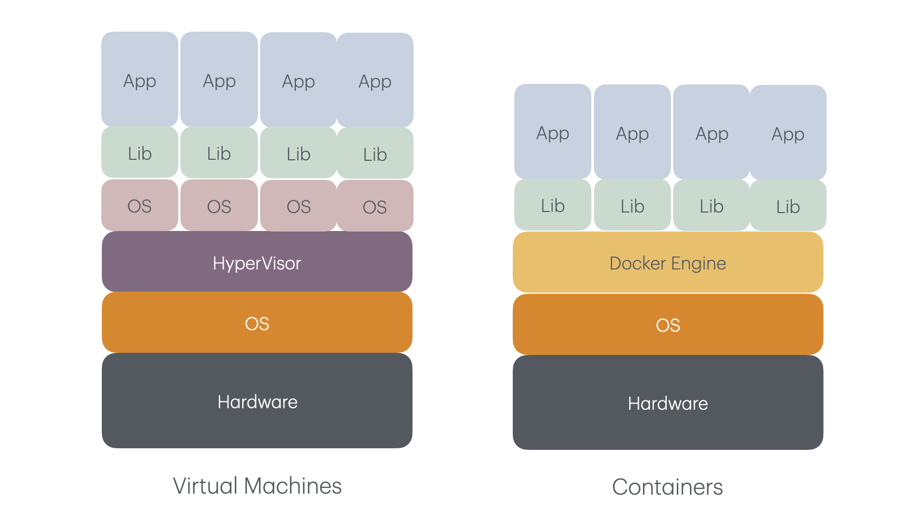

클라우드 컴퓨팅의 등장으로 인프라는 유연해졌고, 개발자들은 더욱 빠르고 빈번한 배포를 원하게 되었다. 
하루에도 수십 번 배포하는 시대가 되면서, 인프라 역시 이에 맞춰 한번 더 진화해야 했다.  
이 중심에는 **컨테이너** 라는 기술이 있다.  

컴퓨터의 자원이 낭비되는 것을 더 영리하게 사용하기 위해 **가상머신(Virtual Machine)** 이 등장했고,  
여기에, 빠른 빌드와 배포를 가능하기 위해, 애플리케이션의 실행 환경을 가볍게 추상화한 **컨테이너(Container)** 가 등장했다.  
컨테이너는 한 번 빌드되면, 어디에서나 실행(Run anywhere)이 가능하다.  
개발, 테스트, 운영 환경이 동일해져서, 소위 말하는 *"로컬에서는 잘 되는데, 배포하니 안 된다"* 라는 상황이 줄어들게 된다!  
이를 선도하는 서비스가 **Docker**이다.  
Podman등의 위협적인 존재가 있지만, 여전히 Docker는 가장 많이 쓰이고 있다.  
그러나, Docker만으로는 대형 서비스를 운영할 수 없다.  
대형 서비스는 중단 없이 배포하기를 원하고, 서비스의 다운타임을 최소화하기 위한 고 가용성의 인프라 환경을 구축하고 싶어한다.  
이를 위한 대표적인 솔루션이 컨테이너 오케스트레이션 툴인 **Kubernetes**이다.  

---

## 🆚 가상 머신 VS 컨테이너

**가상 머신(Virtual Machine)** 은 하드웨어를 가상화한 것이다.  
하나의 물리적인 컴퓨터 위에 여러 개의 운영체제(OS)를 독립적으로 실행할 수 있다.  
물리 서버가 하이버파이저를 가지고, 하이퍼 바이저를 통해 여러 가상머신들(운영체제 + 라이브럴리 + 애플리케이션)이 존재한다.   

호스트와 게스트의 시스템이 같은 **ISA(Instruction Set Architecture)** 를 사용한다면, CPU는 같은 명령어를 이해할 수 있어 빠르다.  
이를 **가상화(Virtualization)** 이라 한다.  
예시로는 VMWare, KVM, Hyper-V 등이 있다.  
그러나, 호스트와 게스트의 시스템이 다른 경우, 명령어를 해석 및 변환해야 해서, 유연하지만 시스템이 느리게 동작한다.   
이를 **에뮬레이션(Emulation)** 이라고 한다.
예시로는 QEMU(서로 다른 ISA의 경우), 게임 에뮬레이터 등이 있다.  
즉, 가상화는 성능이 빠르지만, 유연하지 못하고, 에뮬레이션은 유연하지만, 성능이 느리다.  
- ISA는 CPU가 이해할 수 있는 명령어 체계를 말한다. Intel, ARM처럼 CPU 아키텍처 종류마다 다른 명령어를 사용한다. 

**컨테이너(Container)** 는 운영체제를 공유하면서도 프로세스를 격리키시는 기술이다.  
각자의 파일시스템, 네트워크 인터페이스, 라이브러리를 가지고, 하나의 주 프로세스를 위해 생명주기가 존재한다.   
OS를 별도로 가지지 않아서 빠르고 효율적이고, 애플리케이션의 종속성 문제를 단순하게 해준다.  
이러한 컨테이너들은 서로 독립적인 환경을 가지지만, 같은 컴퓨터에서 실행된다.  

 
이러한 구도는 **격리(isolation)** 와 **밀집(density)** 을 동시에 만족시킨다.  
애플리케이션의 밀집으로, 컴퓨터의 CPU와 메모리가 할당되는 한 되도록 많은 수의 애플리케이션을 실행할 수 있다.  
기존에는 서로의 런타임의 버전이 다른 등의 문제가 일어나는 문제가 있지만, 이를 격리로 해결할 수 있게 되었다.

> *Docker는 가상 머신보다 빠르고, 애플리케이션을 환경과 함께 포장해 어디서든 일관되게 실행할 수 있게 해준다.*  
> *현대 개발에서는 없어서는 안되는 필수 도구이다.*

--- 

## 🐳 Docker 설치

GUI 환경에서는 Docker Desktop을 설치하면 Docker Engine이 같이 설치된다:  
[Download Docker Desktop](https://docs.docker.com/get-started/get-docker/)  

CLI 환경에서는 Distro에 맞는 Docker Engine을 설치해주면 된다:  
[Download Docker Engline](https://docs.docker.com/engine/install/)

