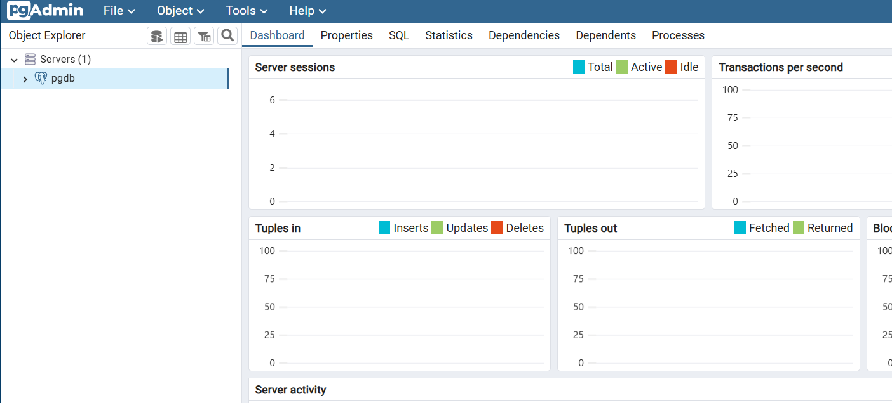

보통 마이크로서비스에서, 하나의 네트워크 안에서, 세 개의 서브넷으로 분리된다.  
- **Public 서브넷**: 외부의 요청을 직접 리스닝하고, Public-IP를 가진다.  
- **Private 서브넷**: 외부로부터 요청을 직접 받지 않는다. 비즈니스 로직 처리가 주로 일어나는 곳이다.  
- **DB 서브넷**: DB들이 위치한 서브넷이다. 외부(인터넷)과 어떠한 통신도 하지 않는다.  

이와 유사한 구조가 Docker 네트워크 내부에서 구현될 수 있다. 


컨테이너들은 각각 격리되어 있어서, 기본적으로는 서로 접근할 수 없다.  
그러나, 도커 네트워크를 이용하면, 도커 컨테이너들끼리 IP를 할당받고, 서로 통신할 수 있게 된다.  

도커는 컨테이너를 실행할 때, 자동으로 네트워크를 설정한다.  
크게 세 가지로 나뉜다: 
- `bridge`: 컨테이너 전용 가상 네트워크로, 보통 `docker run`시에 자동으로 연결된다.  
브릿지라는 이름이 L2 switch장비를 떠오르게 하지만, Docker에서의 브릿지는 NAT + 가상라우터 + DNS를 제공한다.  
- `host`: 호스트와 동일한 네트워크 네임스페이스를 공유한다.  
- `none`: 네트워크를 완전히 끊는다.  

---
## 🐣 네트워크 생성
```bash
docker network create [OPTIONS] NETWORK
```

**Options:**
- `--driver(-d)`: 네트워크에서 사용할 드라이버 선언
    - 기본값: bridge
    - `bridge`: 동일한 Host컴퓨터 내에서 컨테이너끼리 통신하기 위해 사용
    컨테이너들끼리 같은 브리지에 있으면 서로 통신할 수 있다. 
    - `host`: 컨테이너가 host와 동일한 네트워크를 사용
    - `none`: host와 완벽히 격리
- `--label`: 네트워크의 라벨을 설정

> **주의사항**  
> - `host`네트워크는 인스턴스별로 한 개만 생성할 수 있다.  

---
## 📋 네트워크 목록 보기
```bash
docker network ls [OPTIONS]

Aliases:
	docker network ls, docker network list
```

**Options:**
- `--filter(-f)`: 지정된 조건에 맞는 네트워크만 표시
- `--quiet(-q)`: 네트워크 ID만 표기
---
## 🔍 네트워크 정보 보기
```bash
docker network inspect [OPTIONS] NETWORK [NETWORK...]
```

---
## 🔌 네트워크 연결
```bash
docker network connect [OPTIONS] NETWORK CONTAINER
```

**Options:**
- `--alias`: 네트워크 ailas를 추가
- `--ip`: IPv4주소를 지정

---
## ⛓️‍💥 네트워크 연결 제거 
```bash
docker network disconnect [OPTIONS] NETWORK CONTAINER
```

---
## ❌ 네트워크 삭제
```bash
docker network rm NETWORK [NETWORK...]
```

한 개 이상의 명시된 네트워크들을 삭제한다. 

---
## 😵 모든 네트워크 삭제
```bash
docker network prune [OPTIONS]
```

사용하지 않는 모든 네트워크들을 삭제한다.

**Options:**
- `--filter`: 필터링 조건 설정

---
## 💪 실습

### bridge 네트워크로 컨테이너 연결
사용할 네트워크를 생성한다.
```bash
docker network create -d bridge private
```

네트워크가 생성됨을 확인한다.
```bash
docker network list
```

PostgreSQL과 PgAdmin 컨테이너를 생성한다.
PostgreSQL은 기본 브릿지(`docker0`), PgAdmin은 `private` 이라는 네트워크에만 연결되어있다.
즉, 둘은 현재 서로 다른 네트워크에 있다.
```bash
docker run --rm -d --name db \
 -e POSTGRES_PASSWORD=1234 \
 postgres:16.1-bullseye

docker run --rm -d -p 80:80 \
 --name pgadmin \
 -e PGADMIN_DEFAULT_EMAIL=user@sample.com \
 -e PGADMIN_DEFAULT_PASSWORD=1234 \
 --network private dpage/pgadmin4:7.4
```

`db`컨테이너의 network IP주소를 확인해보자.
```bash
docker inspect db -f '{{range $k, $v := .NetworkSettings.Networks}}{{print $k}}={{println
$v.IPAddress}}{{end}}'
bridge=172.17.0.4
```

`pgadmin`이랑은 서로 다른 네트워크에 있다. 
현재 이 둘은 통신할 수 없다.

```bash
docker inspect pgadmin -f '{{range $k, $v := .NetworkSettings.Networks}}{{print $k}}={{println
$v.IPAddress}}{{end}}'
private=172.18.0.2
```


`private` 브릿지에 `db`를 연결해보자.
```bash
docker network connect private db

docker inspect db -f '{{range $k, $v := .NetworkSettings.Networks}}{{print $k}}={{println
$v.IPAddress}}{{end}}'
bridge=172.17.0.4
private=172.18.0.3
```

로컬의 pgadmin의 콘솔([localhost](localhost))`private`의 ip로 접속해보자.  
잘 연결됨을 볼 수 있다!



### alias를 이용하여 ip 없이 컨테이너 통신
`ubuntu` 컨테이너를 생성하고 패키지를 설치해보자.
```bash
➜ docker run --name main -itd ubuntu:22.04
33339901112e966b360aac448e26addcb670678a79f5963f18a05f195e286320

~ …
➜ docker exec main /bin/bash -c "apt-get update && apt-get upgrade -y && apt-get install -y wget dnsutils"
```

`nginx` 컨테이너를 3개 생성하자.
```bash
➜ docker run --rm -d --net private --net-alias web_app --name nginx1 nginx:latest
952647679ba191f3fd635a035fff9c13ef144d1d3368a1f3299825a4e34ee732

~ …
➜ docker run --rm -d --net private --net-alias web_app --name nginx2 nginx:latest
d240766892522a21713471b1bab4035c9a302a67f6f6ca501d95be6df5d90945

~ …
➜ docker run --rm -d --net private --net-alias web_app --name nginx3 nginx:latest
44eb1f78f8ca0b2ae46c1170e78907220729474d54cfc43392eaa002967249d1
```

현재 main은 web_app들과 서로 다른 네트워크에 있다.  
`nslookup`도, `dig`로도 `web_app`을 질의해도, 응답을 받을 수 없다.  

`private`에 연결 후, 다시 dns 질의를 보내보자.
```bash
➜ docker exec main dig web_app
                                                                                                                                                                                           ; <<>> DiG 9.18.30-0ubuntu0.22.04.2-Ubuntu <<>> web_app
;; global options: +cmd
;; Got answer:
;; ->>HEADER<<- opcode: QUERY, status: NOERROR, id: 18299
;; flags: qr rd ra; QUERY: 1, ANSWER: 3, AUTHORITY: 0, ADDITIONAL: 0

;; QUESTION SECTION:
;web_app.                       IN      A

;; ANSWER SECTION:
web_app.                600     IN      A       172.18.0.2
web_app.                600     IN      A       172.18.0.3
web_app.                600     IN      A       172.18.0.4

;; Query time: 0 msec
;; SERVER: 127.0.0.11#53(127.0.0.11) (UDP)
;; WHEN: Tue Jul 08 07:45:43 UTC 2025
;; MSG SIZE  rcvd: 94
```

ping을 날려보면, 세 개의 nginx에 분산되어 전송됨을 알 수 있다.  
기본적으로 Round-Robin알고리즘을 따른다고 한다.  
```bash
root@33339901112e:/# ping web_app
PING web_app (172.18.0.2) 56(84) bytes of data.
64 bytes from nginx1.private (172.18.0.2): icmp_seq=1 ttl=64 time=0.202 ms
64 bytes from nginx1.private (172.18.0.2): icmp_seq=2 ttl=64 time=0.145 ms
64 bytes from nginx1.private (172.18.0.2): icmp_seq=3 ttl=64 time=0.085 ms
^C
--- web_app ping statistics ---
3 packets transmitted, 3 received, 0% packet loss, time 2011ms
rtt min/avg/max/mdev = 0.085/0.144/0.202/0.047 ms
root@33339901112e:/# ping web_app
PING web_app (172.18.0.3) 56(84) bytes of data.
64 bytes from nginx2.private (172.18.0.3): icmp_seq=1 ttl=64 time=0.318 ms
64 bytes from nginx2.private (172.18.0.3): icmp_seq=2 ttl=64 time=0.173 ms
^C
--- web_app ping statistics ---
2 packets transmitted, 2 received, 0% packet loss, time 1014ms
rtt min/avg/max/mdev = 0.173/0.245/0.318/0.072 ms
```

