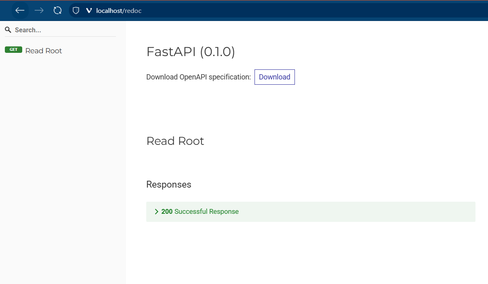
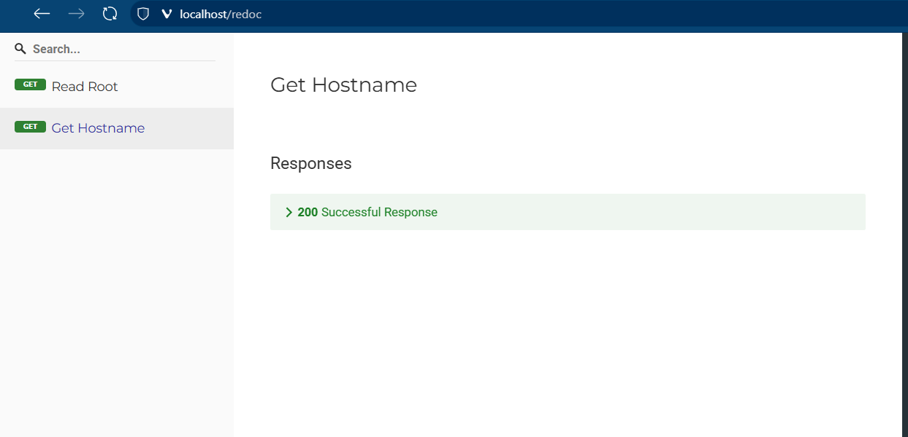

컨테이너는 이미지(RO Layer들의 집합)의 위에 **Container Layer(RW Layer)** 를 가진다.  
컨테이너가 새로 생성되면, 같은 이미지이더라도 다른 Container Layer를 가진다.  
이 RW Layer는 컨테이너 삭제 시에 함께 사라지므로, **데이터 유실의 위험** 이 있다.  
만약 DB컨테이너를 바꿔야 한다고 해보자. 새로운 컨테이너로 갈아끼워야 하는데, 이런 상황에서 어떻게 할 수 있을까?  
컨테이너와 독립적인 생명주기를 가지는 외부 드라이브가 있다면 좋지 않을까?  

Docker의 Volume은 **컨테이너에서 사용 및 관리하는 저장 공간** 이다.  
컨테이너에 종속되지 않고, 컨테이너와 다른 생명주기를 가진다.  

두 가지의 방법이 있다:  
- `bind mount`: Host의 디렉토리와 Container의 디렉토리를 공유한다.
경로를 명시적으로 지정해야 하고, 호스트 의존도가 높다.  
서브디렉토리를 주는 식으로 나눌 수 있다.  
- `named volume`: **Docker Volume**이라는 추상화된 오브젝트와 Container의 디렉토리를 공유한다.  
경로 지정 없이 이름으로 동작한다.  
이식성과 일관성 우수하여, 컨테이너 간 데이터 공에 유리하다.  
volume은 volume 통째로 사용된다.  

**bind를 이용하고 싶다면, 명확한 경로를 지정해줘야 한다.**  
만약 현재 디렉토리에 있는 src폴더를 바인드 시키고 싶다면, `./src`와 같이 지정해야 한다.  
`src`로 쓰면, 이름으로 인식되어 볼륨 오브젝트 중에서 이름을 찾는다.


---
## 🐣 볼륨 생성
```bash
docker volume create [OPTIONS] [VOLUME]
```
**Options:**
- `--name`: 이름을 지정

---
## 📋 볼륨 목록 보기
```bash
docker volume ls [OPTIONS]
```
**Options:**
- `--filter(-f)`: 지정된 조건에 맞는 볼륨만 표시
- `--quiet(-q)`: 볼륨 이름만 표시

---
## 🔍 볼륨 정보 보기
```bash
docker volume inspect [OPTIONS] VOLUME [VOLUME...]
```

---
## ❌ 볼륨 삭제
```bash
docker volume rm [OPTIONS] VOLUME [VOLUME...]
```
한 개 이상의 명시된 볼륨들을 삭제한다.  

---
## 😵 모든 볼륨 삭제
```bash
docker volume prune [OPTIONS]
```
**Options:**
- `--all(-a)`: 사용하지 않는 모든 볼륨 삭제
- `--filter`: 필터링 조건 설정

---
## 💪 실습

### Volume에 DB 데이터 저장
DB에서 쓰일 볼륨을 생성한다.
```bash
docker volume create db_data
```

볼륨이 생성됨을 확인한다.
```bash
docker volume ls
DRIVER    VOLUME NAME
local     db_data
```

`PostgreSQL`의 데이터는 ``/var/lib/postgresql/data``에 저장되므로, `db_data`볼륨을 해당 디렉토리에 마운트
```bash
docker run --rm -d --name psql_db \
 -v db_data:/var/lib/postgresql/data \
 -e POSTGRES_PASSWORD=1234 \
 postgres:16.1-bullseye
```

컨테이너 터미널에 접속하여 `psql`로 DB에 접속하여 테이블을 생성한다.
```bash
docker exec -it psql_db /bin/bash
root@cebda2fb67ef:/# psql -U postgres
psql (16.1 (Debian 16.1-1.pgdg110+1))
Type "help" for help.

postgres=# CREATE TABLE IF NOT EXISTS cloud_wave (
postgres(# id SERIAL PRIMARY KEY,
postgres(# timestamp timestamp
postgres(# );
CREATE TABLE
postgres=# \dt
           List of relations
 Schema |    Name    | Type  |  Owner
--------+------------+-------+----------
 public | cloud_wave | table | postgres
(1 row)
```

컨테이너를 종료한다. 
```bash
docker stop psql_db
```

컨테이너를 새로 생성하여, 테이블이 남아있는지 확인한다. 
```bash
➜ docker run --rm -d --name psql_db \
 -v db_data:/var/lib/postgresql/data \
 -e POSTGRES_PASSWORD=1234 \
 postgres:16.1-bullseye
65ff17dd3b391018efd00c20921a236455a1abb6efd9035e5cfc43ced09cc3e3

~ …
➜ docker exec -it psql_db /bin/bash
root@65ff17dd3b39:/# psql -U postgres
psql (16.1 (Debian 16.1-1.pgdg110+1))
Type "help" for help.

postgres=# \dt
           List of relations
 Schema |    Name    | Type  |  Owner
--------+------------+-------+----------
 public | cloud_wave | table | postgres
(1 row)
```

### bind mount를 사용하여 소스코드 변경
Python과 같은 경우, 스크립트 언어이기에, 런타임 중에 파일이 바뀌면 즉시 반영될 수 있다.  
이를 이용해서 특이한 빌드를 해볼 것이다.  
실제 프로덕션에서 사용되는 경우가 일부 있다.  

- Host의 `./app`은 컨테이너의 `/code.app`이랑 bind시킬 것이다.
- 이미지의 이름을 `was`로 했다.

폴더 구조:
```plaintext
/bind_mount
├── app
│ ├── __init__.py
│ └── main.py
├── Dockerfile
└── requirements.txt

```

**main.py**
```Python
from typing import Union
from fastapi import FastAPI

app = FastAPI()

@app.get("/")
def read_root():
    return {"Hello": "World"}

```

**Dockerfile**
```Dockerfile
FROM python:3.9
WORKDIR /code
COPY ./requirements.txt /code/requirements.txt
RUN pip install --no-cache-dir --upgrade -r /code/requirements.txt
CMD ["uvicorn", "app.main:app", "--host", "0.0.0.0", "--port", "80", "--reload"]
```

**requirements.txt**
```plaintext
fastapi[standard]>=0.113.0,<0.114.0
pydantic>=2.7.0,<3.0.0
```

이미지를 빌드한다.
```bash
docker build -t was:fast.1 .
```

FastAPI 서버를 실행한다:
```bash
docker run -d --name bind -p 80:80 -v $(pwd)/app:/code/app was:fast.1
cab0581caeea7cadf54808f1a38ecfc0213035bd91602c0abf7719a2b7e991fe
```

[localhost/redoc](localhost/redoc)에 접속해서 API 명세서를 확인해보자. 


**main.py**를 아래와 같이 수정해보자:
```Python
import socket
from typing import Union
from fastapi import FastAPI

app = FastAPI()

@app.get("/")
def read_root():
    return {"Hello": "World"}

@app.get("/hostname")
def get_hostname():
    return {"name": socket.gethostname()}

```

로컬의 파일에서 변경된 것이 반영됨을 확인할 수 있다.


