TailScale은 WireGuard기반의 VPN서비스이다.  
기존의 IPSec, OpenVPN과 같은 전통적인 VPN보다 더 빠른 성능을 제공한다.

---
## 🔒 Data Plane: WireGuard
Base Layer는 오픈소스 WireGuard패키지로 구성되어있고, [Go 구현체](https://git.zx2c4.com/wireguard-go/about/)를 사용한다.  
WireGuard는 컴퓨터, VM, 컨테이너들(WireGuard에서는 "endpoint"라고 하고, TailScale에서는 "node"라고 부른다.)간의, 네트워크 밖의 다른 노드들과 경량의 암호화 터널을 만들어준다.  

WireGuard는 기존 IPSec, OpenVPN보다 더 단순한 구조로 간단하면서, 강력하고, 성능이 좋다.  
전통적인 VPN들이 수만 줄로 구현되어있는 반면, 약 4천 줄의 코드로 구현되어있다.  
2017년 Jason A. Donefeld가 백서를 공개했다.  
최신 암호 프리미티브들을 사용한다:
- 암호화: ChaCha20
- 메시지 인증: Poly1305
- 키 교환: Curve25519
- 해시: BLAKE2s  
- 키 파생: HKDF

WireGuard 터널을 통해, IP패킷 전체를 암호화하여 UDP패킷의 페이로드에 담고, new IP Header를 만들어서 네트워크에 보낸다.  

### Hub and Spoke 네트워크
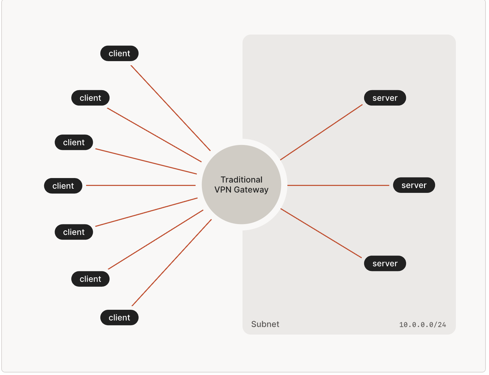
WireGuard를 세팅하는 가장 쉬운 방법은, 각 노드는 서로 Public Key, Public IP Address, Port Number를 모두 알아야 하기에, 10개의 노드를 연결하려면, 각각 9개의 Peer Node정보가 필요하다.

Hub-and-spoke 구조에서는, 하나의 중앙 허브 노드가 연결을 중개해주면 더 간단해진다.
Hub 노드는 정적인 IP 주소를 가지고, 방화벽도 일부 관용되어있어 모두가 찾아 연결하기 쉽다.

그러나, 단점도 있다.  
우선, 대부분의 회사들은 허브를 단일 지점으로 두고 싶어하지 않는다.
그들은 여러 지사를 가지고 있고, 여러 클라우드 데이터센터 리전/VPC를 가지고 있기 때문이다.  
전통적인 VPN에서, 회사들은 단일 VPN 집중장치를 만들고, 각 지점들 간의 보조 터널을 생성한다.  
그래서 VPN 집중장치에 접속해서, 최종 종착지로 통신한다.  

이러한 전통적인 구성은 확장성이 떨어진다.  
우선, 원격 사용자는 VPN 집중장치로부터 얼마나 거리가 되는 줄 모른다.  
그들이 멀리 있다면, 긴 지연시간이 기다리고 있다.  
또한, 데이터센터 역시 멀리 있다면 지연이 생긴다.  
뉴욕에서 일하는 사람이 뉴욕에 있는 서버에 접근하려고 한다고 가정하자.  
그러나 샌프란시스코에 있는 VPN 집중장치를 거쳐야 한다면, 곤욕일 것이다.  

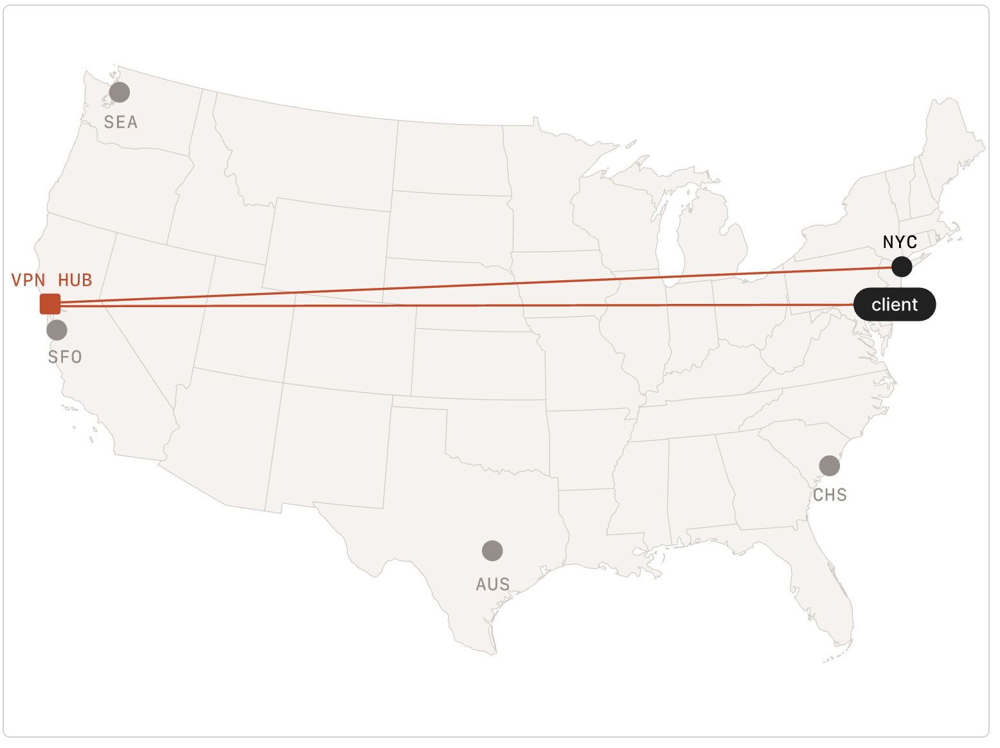

다행히도, WireGuard는 다르다.  
Multi Hub를 두어서 경량의 터널을 몇 개씩 둘 수 있다.  
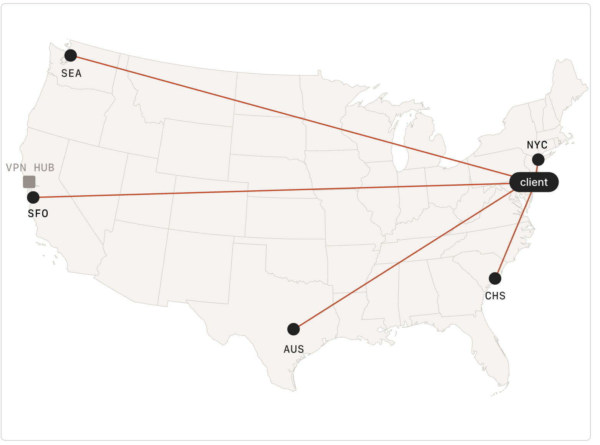

이제 다음 과제는, 각 데이터센터는 각각 정적인 IP주소, 방화벽으로부터 열린 포트, WireGuard 키들의 집합이 필요하다는 것이다.  
새로운 사용자가 추가되면, 이 다섯 서버들 모두에게 새로운 키를 주면 된다.  
새로운 서버를 추가할 때, 각 유저들에게 서버의 배포 키를 하나씩 주면 된다.  

### Mesh Networks
이전에 Hub-and-spoke를 보았다.  
WireGuard로 세팅하기 짜증날 수는 있어도, 어렵지는 않다.  
그러나, hub-and-spoke로부터 근본적으로 어색한 점은 또 있다.  
이 구조에서는 개별 노드들이 서로 통신할 수 없다.  
옛날 사람들이라면 알겠지만, 꼭 중앙 기관을 거칠 필요없이 파일을 주고받던 시대가 있었다.  
그리고, 그게 원래 인터넷의 근본이였다!  
슬프게도, hub-and-spoke모델로 인터넷은 발달되었고, 그 중심에는 대형 클라우드 업체들이 자리잡아 임대료를 받고 있다.  

모든 노드들끼리 서로 직접 연결되면 어떨까?  
이를 메시 네트워크라고 한다.  
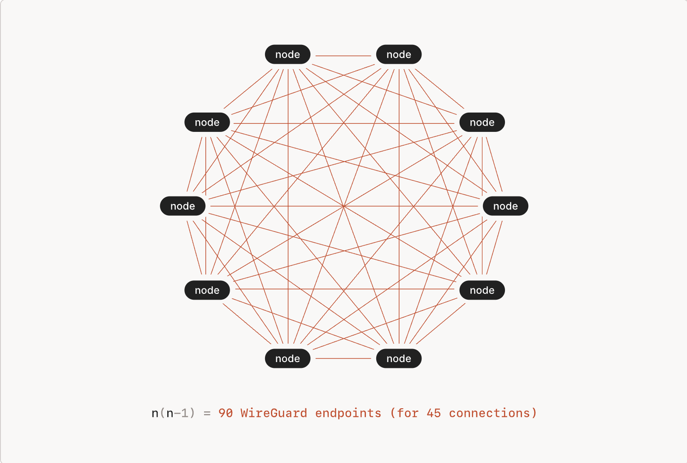

P2P 애플리케이션을 만드는 데에 매우 이상적일 것이다.  
10-노드 네트워크에는 $10 \times 9 = 90$개의 WireGuard 터널 엔드포인트 설정이 필요하다.  

모든 노드는 자신의 키에 9개씩을 더 알아야 하고, 키를 새로 발급받거나 사용자의 추가 및 제거가 있을 시, 업데이트 작업이 복잡해진다.  

그리고, 노드들은 서로를 찾을 수 있어야 한다.  
고정 IP도 없고, 이동 시에 다시 연결할 필요가 있다.  

카페, 호텔, 공항과 같이 방화벽이 있는 곳에서는 또 수신연결을 위한 포트를 열어줘야 하기도 한다.  

그리고, 회사의 보안 및 컴플라이언스 요구사항이 있다면, 이제는 중앙 허브가 없으므로 각 노드 간의 트래픽을 감사(audit)하거나, 차단(block)하기 힘들어진다.  
TailScale은 이런 복잡한 문제들을 해결해준다!

---
## ⚙️ Control Plane: 키 교환 및 코디네이션
모두가 정적인 IP를 가지고 있다고 가정하고, 방화벽이 없어서 포트 개방도 부담없다고 해보자.  
어떻게 WireGuard 암호화 키를 관리하도록 할것인가?  

오픈소스 [TailScale 노드 소프트웨어를](https://github.com/tailscale/tailscale) 제공한다.  
코디네이션 서버라고 부른다. TailScale의 서비스의 경우, login.tailscale.com이다.  
공개 키들에 대한 공유 박스라고 보면 된다.  

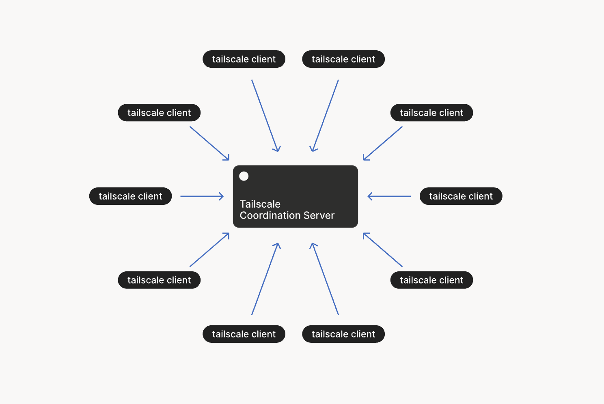
다시 hub-and-spoke로 돌아온 거 아니냐는 의문이 생길 수 있다.  
그러나, 좀 다르다. **트래픽을 중개하지 않기 때문이다.**  
그저 약간의 암호화 키 교환을 돕고 정책을 수립할 뿐, Data Plane은 메시로 이루어져있다.  

1. 각 노드들은 랜덤한 공개/비밀키 페어를 생성하고, 퍼블릭 키를 자격증명으로 연관짓는다. 
2. 노드는 코디네이션 서버에 접속하여 Public Key와 노드 자신의 인터넷 주소와 도메인을 알려준다.
3. 노드는 코디네이션 서버로부터 공개키와 접속 정보들을 얻어서 다른 노드들들의 정보를 얻을 수 있다.  
4. 노드는 적절한 공개키를 이용하여 WireGuard연결을 맺는다.  

**Private Key는 노드 밖으로 절대 노출되는 일이 없음을 주목하자.**  
이 덕분에, 오직 두 노드만이 세션 안에서 패킷을 풀어볼 수 있다.  
즉, TailScale 노드들은 종단간 암호화가 유지되어, 제로-트러스트 네트워킹을 실현한다.  

### 로그인 및 2FA
어떻게 코디네이션 서버가 각 노드의 인증정보와 공캐기를 바인딩 할 수 있을까?  
인증 결정에는 다양한 방법이 있다.  
명백한 방법은 PSK(Pre-Shared Keys)라고 불리는 username+password의 시스템이다.  
각 노드가 사용자 이름과 패스워드로 로그인해서, 공개키를 업로드하고 다른 공개키들과 접속 정보들을 다운로드하면 된다.  
2FA(2-Factor Authentication)을 이용할 수도 있다.  
SMS, Google Authenticator, Microsoft Authenticator등 다양한 방법이 있다.  

시스템 관리자는 [머신 인증서](https://tailscale.com/kb/1010/machine-certs)를 넣어주는 방법도 있다.  
사용자 계정대신 기기에 영속적으로 남는 키이다.  
맞는 사용자계정과 패스워드를 가지고 있는 악의적인 노드가 접속하지 못하게 막을 수 있다.  

TailScale은 코디네이션 서버를 이러한 컨셉에 맞게 운영한다.  
대신 인증 부분을 직접 운영하진 않고, OAuth2, OIDC(OpenID Connect), 또는 SAML제공자들을 통해서 운영하고 있다.  
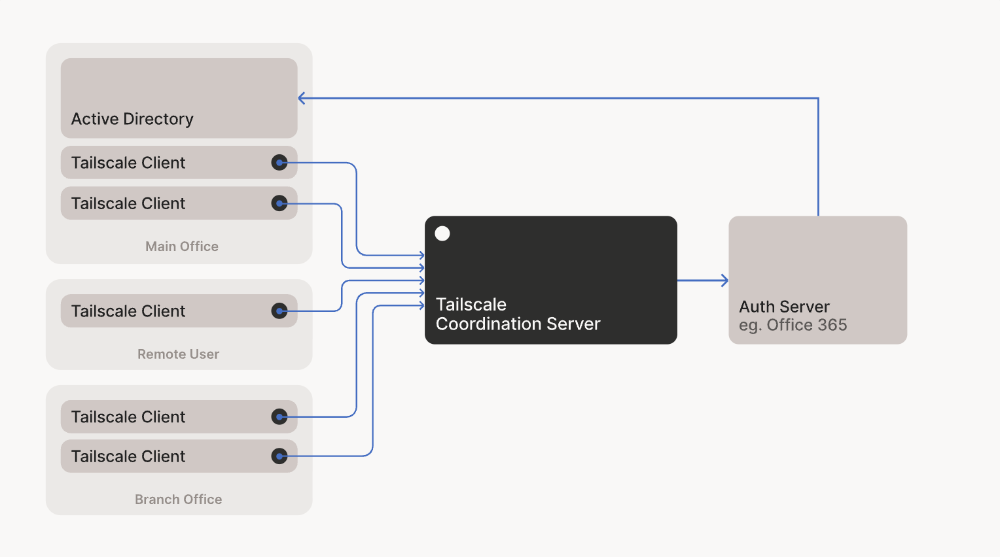

신원 제공자들은 도메인, 패스워드, 2FA세팅 등을 가지고 있다.  
Google Docs, Office 365 등에서의 세팅을 해주면 된다.
비밀의 사용자계정과 로그인데이터가 다른 서비스에서 호스팅되기에, Tailscale은 중앙 코디네이션 서버를 신뢰성있고, 관리 복잡도를 최소화하며 운영할 수 있다.  
이런 구조 덕분에, Tailscale 도메인은 로그인 즉시 바로 활성화된다.  

클라이언트에서 설치에서 접속하게되면, 도메인 전용의 보안 키 교환함이 생겨서, 다른 기기들과 공개키를 교환할 수 있다.  
그 이후, 노드가 서로의 공개키를 자동으로 내려받고, WireGuard 설정을 자동으로 구성해서, 노드 간의 P2P터널을 생성할 수 있다!

### NAT Traversal
그러나, 여기서 끝이 아니다!  
아까는 모든 노드가 정적 IP를 가지고 있고, 방화벽 포트도 열려 있는것으로 간주했다.  
현실에서는, 카페에서도 써야 하고, 공항에서도 써야 한다. 집에서도 우린 와이파이를 쓰고, 야외에서는 셀룰러 네트워크를 쓸 수도 있다.  
NAT와 방화벽이 둘러싸인 실제 환경에서는, 매우 골치아프다.  

아래와 같은 상황일 것이다:
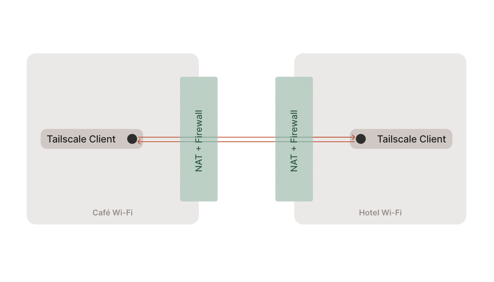

대부분의 방화벽은 "내가 보낸 UDP에 대한 트래픽만 허용"한다. 
즉, **두 클라이언트가 서로 동시에 패킷을 보내면, 양쪽 방화벽은 동시에 응답 허용 상태가 되어 통신이 가능해진다!**  
이를 Simultaneous Transmission이라고 한다.
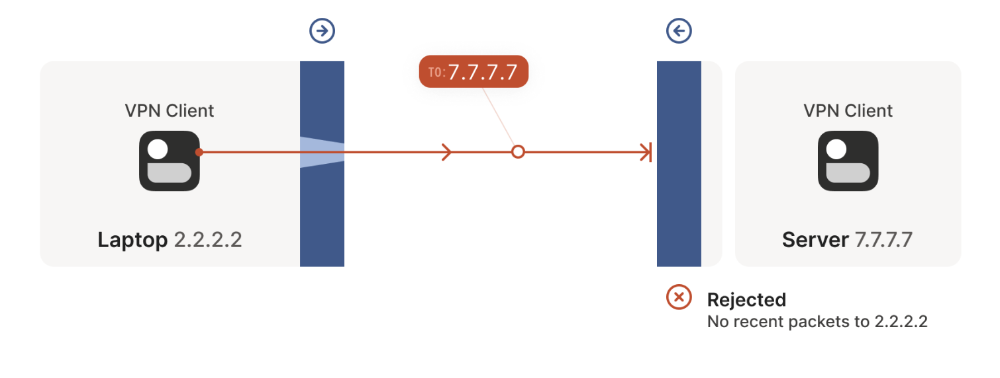
처음에 `2.2.2.2`가 `7.7.7.7`에게 보낸 트래픽은 닿지 않는다.  
그러나, 응답을 받으려고 잠시 포트가 열려 있다.
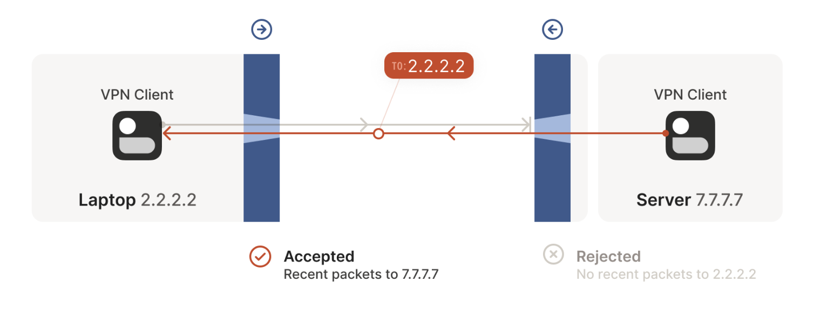
두 방화벽은 서로 자신이 보낸 트래픽에 대한 응답인줄 알고 서로의 트래픽을 승인한다.
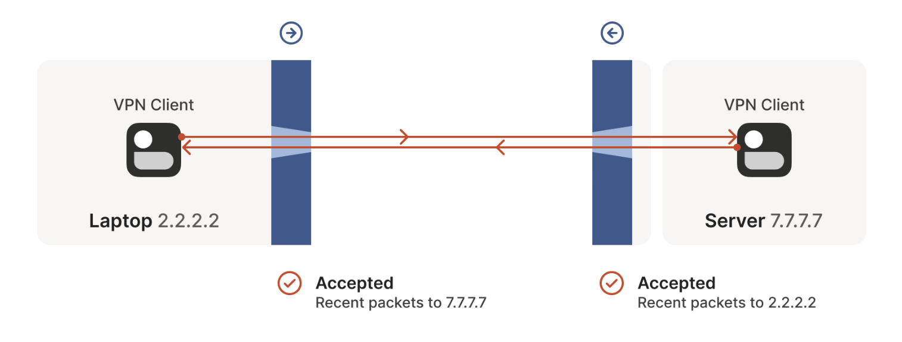

다음 문제는, NAT환경을 뚫는 것이다. 
NAT는 `ip:port`를 모두 바꿔버린다.  
그래서, 자신의 Public `ip:port`를 알 수 없다.  
이 문제를 해결해주는 것이 STUN이다.  
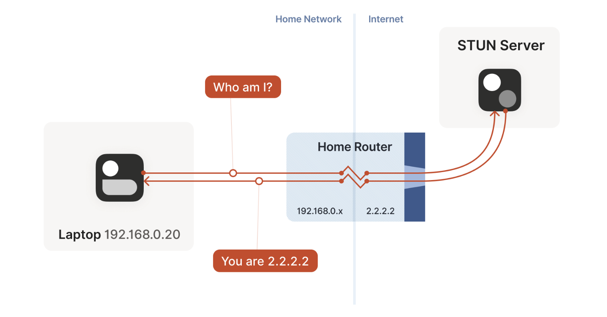
STUN 서버로부터 자신의 퍼블릭 네트워크 주소를 알아낼 수 있다.  

그러나, NAT는 너무 제각각이고, 수많은 장비들이 꼬여있을 수도 있다.  
이를 **ICE(Interactive Connectivity Establishment)** 프로토콜이 해결해준다.  
그 방법은 바로.. 모든 경우의 수를 시도하고, 최선을 찾는 것이다.  

상대방과 통신하기위해, 로컬 소켓으로부터 후보 엔드포인트들을 모으기 시작한다.  
후보는 `ip:port`의 꼴이다.  
- IPv6 `ip:ports`
- IPv4 LAN `ip:ports`
- STUN에 의해 알려진 IPv4 WAN `ip:ports`
- 포트 매핑 프로토콜에 의해 할당된 IPv4 WAN `ip:ports`
- 정적으로 설정된 엔드포인트들

그 뒤, 사이드 채널을 통해서 후보 리스트를 교환하고, 서로의 엔드포인트들에 probe를 보낸다.  
이 패킷들은 두 개의 의무를 가진다.  
- 방화벽과 NAT를 뚫기
- 헬스체킹
"ping"과 "pong"패킷을 교환하며, 서로의 경로가 유효한지 확인한다.

몇 가지 경우들이 통과된다면, 최고의 경로를 평가하여 해당 경로에 터널을 생성한다.
처음에는 LAN > WAN > WAN + NAT와 같은 고정된 순서를 고려했지만,  
동적 점수화 방식으로 변경하여, 실제 RTT와 성공률을 기반으로 경로를 선택한다.  
물론, 대부분 LAN > WAN > WAN + NAT의 순서로 되긴 한다.  

터널이 생성되고 통신을 하는 와중에도, 주기적으로 헬스체크 및 프로브가 이루어진다.  
더 좋게 평가된 경로가 발견된다면, 해당 경로로 업그레이드 될 수도 있다.  

비대칭적인 통신 흐름은 다시 문을 막게 하는 원인이 될 수 있다.
ICE는 경로가 닫히지 않도록, 즉, NAT나 방화벽의 stateful하고 일시적인 허용 정책을 유지시키기 위해 주기적으로 신호를 교환하도록 되어있다.  

터널 Failover를 위해, warm state의 경로들을 일부 유지시킨다.  
그 뒤, 기존 사용중이던 경로가 실패하면, 다운그레이드하여 사용한다.  

즉, NAT Traversal의 구현에는 다음이 필요하다:
- UDP 기반 프로토콜
- 프로그램에서 직접 소켓 접근
- Control Plane(Peer간 주소 및 공개키 등을 교환할, 또는 DERP 폴백)
- 2개 이상의 STUN서버 
- 릴레이 네트워크(DERP, TURN폴백용, optional)

그리고 다음의 절차를 가진다:
1. 로컬 IP수집: 자신의 네트워크 인터페이스의 모든 IP주소들을 확인한다.  
2. STUN요청: NAT로 변환된 주소를 보기 위해, `ip:ports`를 알아낸다. 동시에 NAT유형도 파악할 수 있다.  
3. Port Mapping 프로토콜 시도하여 더 많은 WAN `ip:ports`를 제공받는다.
4. IPv6-only인경우, NAT64존재도 확인하여, STUN으로 NAT64주소도 알아낸다.  
5. 수집된 모든 후보군들을 상대와 교환
6. 우선, 빠른 통신이 되도록 DERP와 같은 relay경로로 시작(optional)
7. 가진 모든 엔드포인트 조합(`ip:ports`)로 Ping-Pong으로 프로빙한다.  
8. 최선의 경로를 찾아서, 선택한다. 
9. 현재 경로가 장애가 있을 시, 다운드레이드한다.
- 모든 통신은 e2e암호화가 되도록 보장해야 한다.

TailScale은 이를 제공한다.  

더 자세한 부분에 대해서는, [여기](https://tailscale.com/blog/how-nat-traversal-works)를 참고.

### DERP
일부 트래픽에서는 UDP가 아예 막힐 수도 있다.  
TailScale에서는 DERP(Designated Encrypted Relay for Packets)서버를 제공하여 트래픽을 중개해준다.  
ICE표준의 TURN서버와 같은 역할을 한다.  
단, 구식의 TURN 방식이 아닌, HTTPS 스트림이나 WireGuard 키를 이용한다.

아래처럼 동작한다:
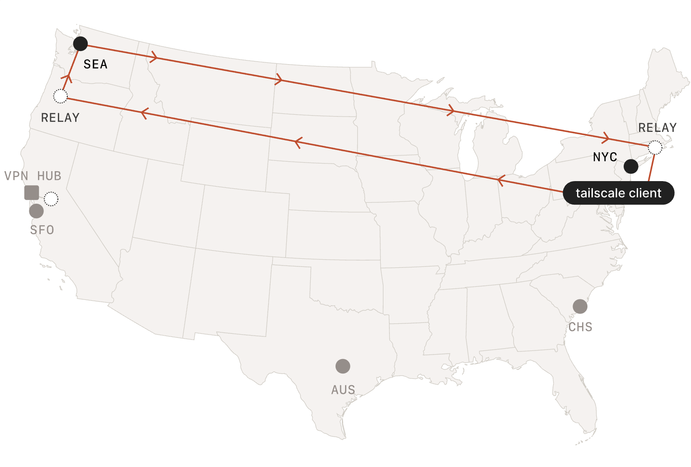

노드의 비밀키는 노드 혼자만 가지고 있기에, DERP서버는 데이터 내용을 열람할 수 없다.  

많은사람들이 OpenVPN방식도 제공하냐고 궁금해하지만, WireGuard 자체의 기능으로는 없고, TailScale서버에서 추가적으로 제공하는 기능이다.  

### ACL과 보안 정책들
사람들은 VPN을 보안 소프트웨어라고 생각한다.  
그리고, 충분히 그렇게 생각할만 하다. 인증과 암호기술이 들어가기 때문이다.  
그러나, 실제로는 "연결성"에 더 집중한 것이 VPN의 근본이다.  

기본 hub-and-spoke모델의 VPN제공자들은, 보안적 특성들도 붙여서 방화벽과 높은 응집도를 가진 제품들을 내놓았다.   
그렇게 현재는 VPN에 보안정책들을 제공하는 것도 중요하다.  
어떻게 메시 네트워크에서 보안 정책을 제공할까?  
TailScale이 내놓은 정답은, 모든 각 노드에서 정책을 가지고 있으면 된다는 것이다.  

이를 쉽게 하기 위해, 코디네이션 서버에서 정책들이 관리되도록 하고, 각 노드들에게 배포되게 하면 된다.  

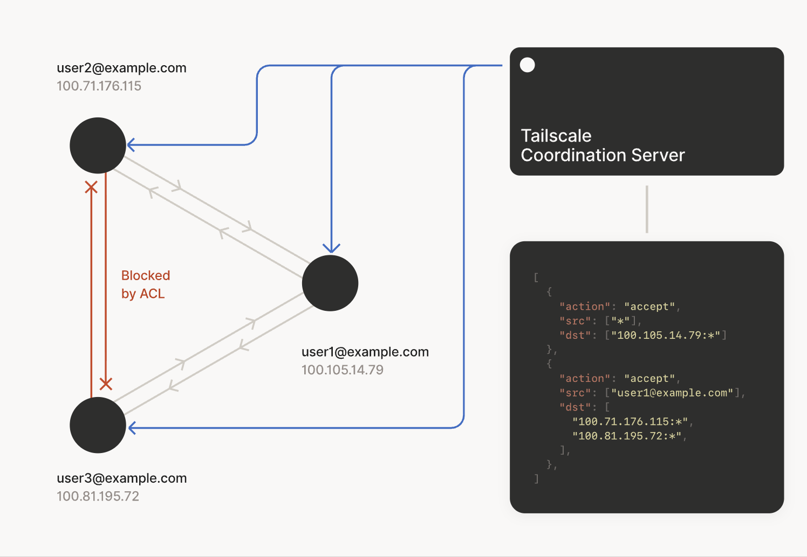

**실제로는, 정책에 따라서 가져갈 수 있는 공개키가 규칙에 따라 일부 제한되는 방식으로 되어있다.**  
그래서, 노드는 허용된 공개키만 가져갈 수 있는 것이다.  
이러한 방식은 프로토콜에 무관하기에, non-web 기반의 서비스들의 보안에 특히 더 좋다.  

### 감사 로그
다른 걱정은, 감사에 대한 것일 것이다.  
현대 방화벽들은 트래픽을 차단하지 않는다. 로깅까지 한다.  
P2P로 통신하는데, 어떻게 로그를 남길까?  

이 해답은, 각 노드에서 비동기적으로 중앙 수집기에 보내는 것이다.  
또 하나의 부산물은, 통신은 전이중적이기에, 중복 로그가 잡힌다는 것이다.  
이 덕분에, 로그 수정 공격이 힘들 것이다.  
동시에 두 개의 로그를 변환해야 하기 때문이다.  

실시간으로 스트림되기에, 윈도우는 매우 짧을 것이고, 탬퍼링 공격을 매우 힘들게 만들 것이다. 
TailScale은 중앙수집 서비스 역시 제공한다.

---
## 📚 References
- [WireGuard Overview](https://www.wireguard.com)
- [How TailScale Works](https://tailscale.com/blog/how-tailscale-works#the-data-plane-wireguardr)
- [How NAT Traversal Works](https://tailscale.com/blog/how-nat-traversal-works)
