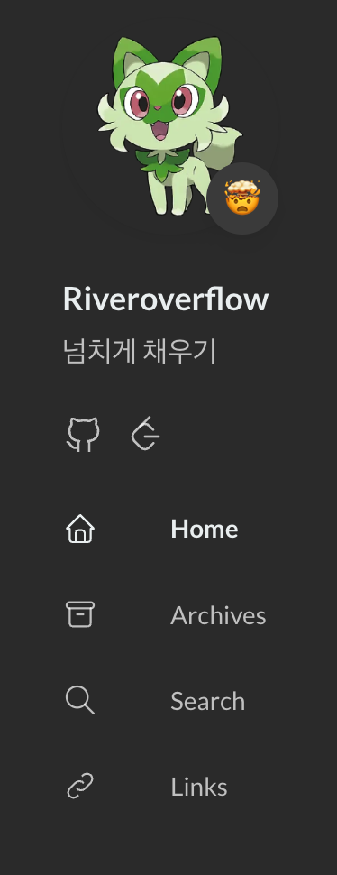

배포 파이프라인 및 국제화 세팅까지 구성했으니, 본격적인 블로그의 세팅을 건드려 볼 것이다.

---
## ⚙️ params.toml 수정하기
아래는 `config/_default/params.toml`의 구성 예시이다:
```toml
# Pages placed under these sections will be shown on homepage and archive page.
mainSections = ["post"]
# Output page's full content in RSS.
rssFullContent = true
favicon = "/favicon.ico"

[footer]
since = 2025
customText = ""

[dateFormat]
published = "Jan 02, 2006"
lastUpdated = "Jan 02, 2006 15:04 MST"

[sidebar]
emoji = "🤯"
subtitle = "Lorem ipsum dolor sit amet, consectetur adipiscing elit."

[sidebar.avatar]
enabled = true
local = true
src = "/img/avatar.png"

[article]
headingAnchor = false
math = true
readingTime = true

[article.license]
enabled = true
default = "Licensed under CC BY-NC-SA 4.0"
```

우선, 기본 셋업에서 이 부분들만 다루었다.
추가적인 수정이 필요하면, 공식 문서를 참고하면 된다.

### favicon
블로그의 파비콘을 입력하는 곳이다.  
파비콘이란, 브라우저 탭에서 현재 사이트를 대표하는 아이콘이다.  
위의 예시처럼 사용하면, `/static/favicon.ico`의 파일을 읽어서 파비콘으로 사용한다.

### sidebar
- `emoji`를 수정하여 사이드바의 이모지를 바꿀 수 있다.
- `subtitle`은 이미 언어별로 개별설정되어있다면, 딱히 의미는 없다. 
- `avatar`를 수정하여 아바타 변경이 가능하다. 
위처럼 작성한 경우, `/assets/img/avatar.png`에 사진이 있어야 한다.  
사진의 이미지는 150 x 150이어야 한다.

### article
- `math = true`로 설정하여 전역적으로 KaTex기반의 수식 사용이 가능해진다.

### footer
`since`를 수정하여 내 블로그의 생성일에 맞게 지정해주었다.

---
## 🧑‍🎨 Custom Menu 수정
**Custom Menu**에서 외부 링크를 아이콘과 함께 추가할 수 있다.  
아래는 나의 예시이다.  
기존의 설정에서 Twitter를 제거하고, GitHub레포지토리의 링크를 수정하고, LeetCode등의 외부 링크를 달아주었다.  

```toml
# Configure main menu and social menu
#[[main]]
#identifier = "home"
#name = "Home"
#url = "/"
#[main.params]
#icon = "home"
#newtab = true

[[social]]
identifier = "github"
name = "GitHub"
url = "https://github.com/fudoge"
weight = 1

[social.params]
icon = "brand-github"

[[social]] 
identifier = "leetcode"
name = "LeetCode"
url = "https://leetcode.com/u/fudoge/"
weight = 2

[social.params]
icon = "brand-leetcode"
```

### social
- `identifier`: 메뉴 고유의 식별자를 정한다
- `name`: 메뉴의 이름을 지정한다. 메뉴에 커서를 올리면 이 이름이 나온다.
- `url`: 메뉴 링크의 URL을 지정한다.
- `weight`: 우선순위를 지정한다. 숫자가 작을수록 더 왼쪽에 나온다.


### social.params
- `icon`: 아이콘을 지정한다.  
아이콘은 [Tabler](https://tabler.io/icons)의 아이콘을 사용하면, 이 테마와 매우 잘 맞는다.  
이 테마가 Tabler의 아이콘을 적극적으로 사용했다.  
아이콘 파일을 다운받아서, `assets/icons/example.svg`의 꼴로 저장해주면 된다. 

잘 수정되어있는 것을 볼 수 있다!



---
## 📚 References
[Stack Theme - site config](https://stack.jimmycai.com/config/site)  
[Stack Theme - menu config](https://stack.jimmycai.com/config/menu)  
[Stack Theme - sidebar config](https://stack.jimmycai.com/config/sidebar)
