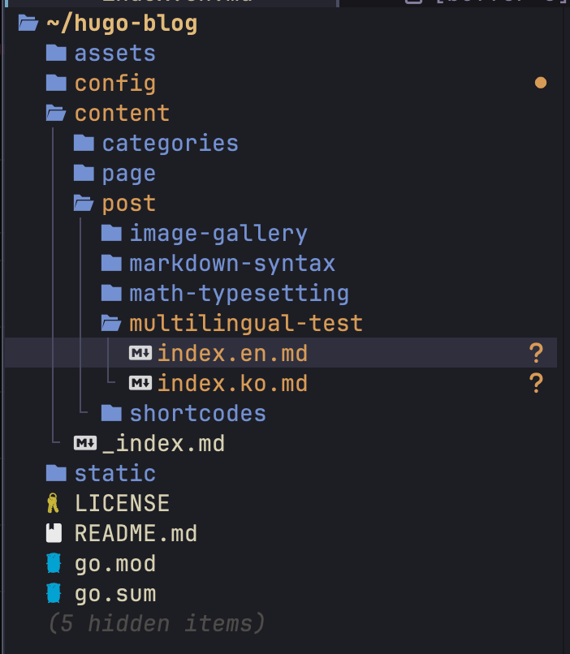
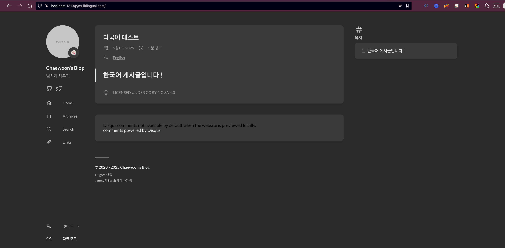
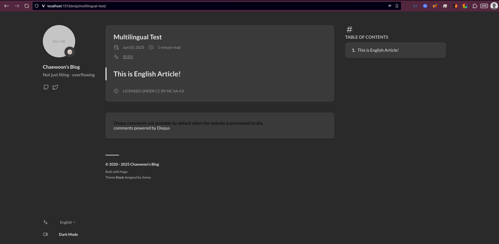
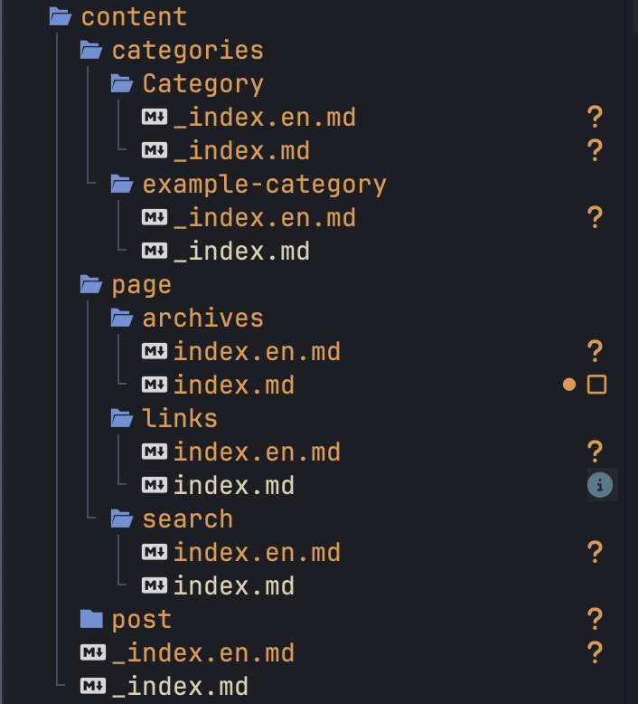

## 🧩 Config file setup

Even if you're not planning to support multiple languages right now, setting up your blog for multilingual support in advance will make future expansions much easier.  

This post uses ([Hugo-Theme-Stack by Jimmy](https://stack.jimmycai.com/config/site)).

This post sets up Korean as a main language, English as a secondary language.  
Edit `config/_default/config.toml` like :
```toml
# Change baseurl before deploy
baseurl = "https://riveroverflow.pages.dev"
title = "Chaewoon's Blog"

# Theme i18n support
# Available values: en, fr, id, ja, ko, pt-br, zh-cn, zh-tw, es, de, nl, it, th, el, uk, ar
defaultContentLanguage = "ko"

# Set hasCJKLanguage to true if DefaultContentLanguage is in [zh-cn ja ko]
# This will make .Summary and .WordCount behave correctly for CJK languages.
hasCJKLanguage = true

[languages]
    [languages.en]
        languageCode = 'en-US'
        languageName = 'English'
        weight = 1
        [languages.en.params.sidebar]
            subtitle = 'Not just filling - overflowing'

    [languages.ko]
        languageCode = 'ko-KR'
        languageName = '한국어'
        weight = 2
        [languages.ko.params.sidebar]
            subtitle = '넘치게 채우기'


[pagination]
pagerSize = 5

```
- `defaultContentLanguage = "ko"` declares default content language to Korean.  
If your default content Language is Chinese, Japanese, or Korean, you have to set: `hasCJKLanguage = true`.
- `weight` is the index number of the language list.
- `languageName` is the name of the language in the list.
- `subtitle` is the profile message of you.
- If you want to change page's title for each language, you can set for each of them with `languages.ko.title`.  
This is Korean example:


```toml
    [languages.ko]
        languageCode = 'ko-KR'
        languageName = '한국어'
        weight = 2
        title = 'Chaewoon의 블로그'
        [languages.ko.params.sidebar]
            subtitle = '넘치게 채우기'
```

---
## 📝 How to write multilingual posts and bind them
If you want to write some posts, you have to follow this structure:  



```plaintext
content/
├── post/
│   └── multilingual-test/
│       ├── index.en.md
│       └── index.ko.md
```
Location of Post file must be `content/post/<title>/index.<language-code>.md`

Posts that share their slug are binded.
You can write your multilingual test post like this: `/content/post/multilingual-test/index.en/md`:
```markdown
---
title: Multilingual Test
slug: "Multilingual Test"
date: 2025-06-03
---

## This is English Article!

```

`content/post/multilingual-test/index.ko.md` would be:
```markdown
---
title: 다국어 테스트
slug: "Multilingual Test"
date: 2025-06-03
---

## 한국어 게시글입니다!

```

Now, turn test server on.  
```bash
hugo server -D
```




You can go to the translated post!  


---
## 🎭 Multilingual Setup for sidebars, pages, etc
In English page, you can see that the sidebar is empty.
It is because other content has no translated component.  
So, you have to make your translated version of other components(page, content, categories, etc).  

Make your translated markdown files in `content/`.
You can make markdown files like this:  


Moreover, if you want to change some built-in translations in this theme, you can make `i18n/<lang>.toml` and override.  
You can check the stack theme's i18n setup [here](https://github.com/CaiJimmy/hugo-theme-stack/tree/master/i18n).  

---
## 📚 References
[Stack by Jimmicai - config/i18n](https://stack.jimmycai.com/config/i18n)  
[Hugo Documnet - content management/multilingual](https://gohugo.io/content-management/multilingual/)  
[Hugo Document - configuration/languages](https://gohugo.io/configuration/languages/)
