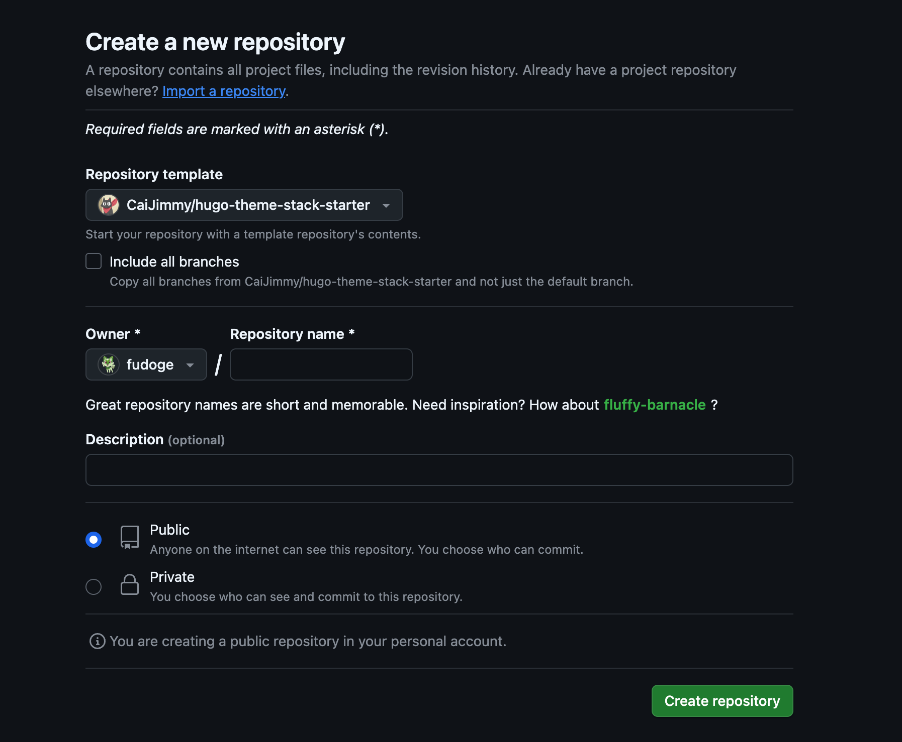
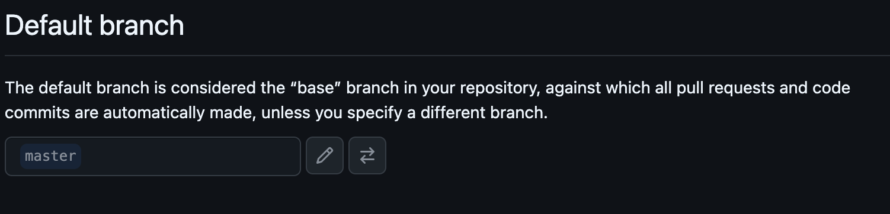
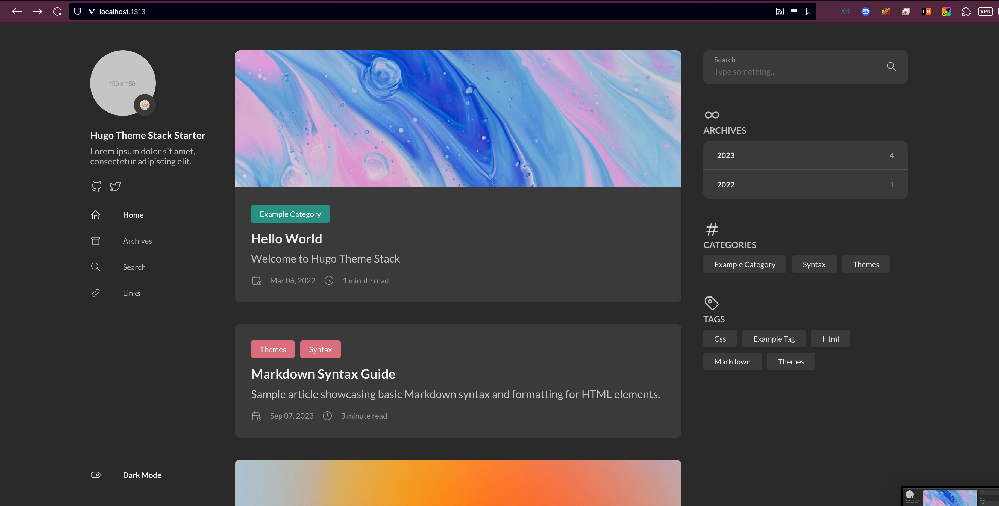
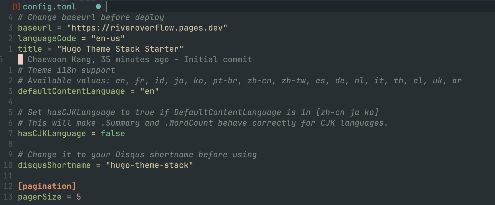
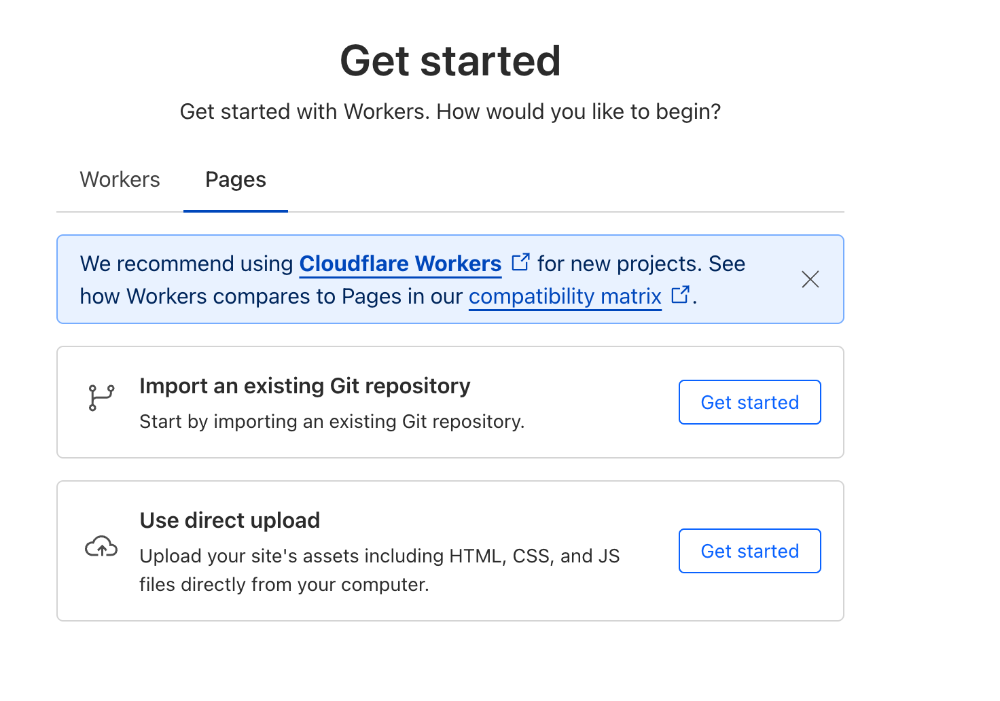
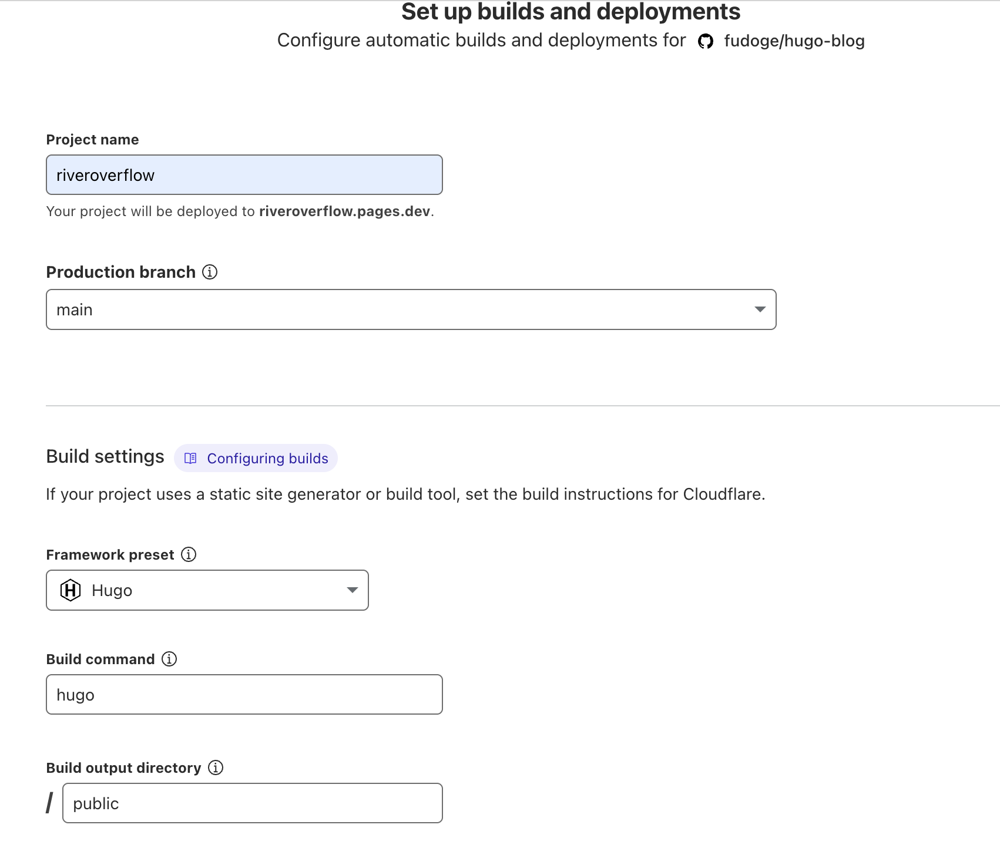
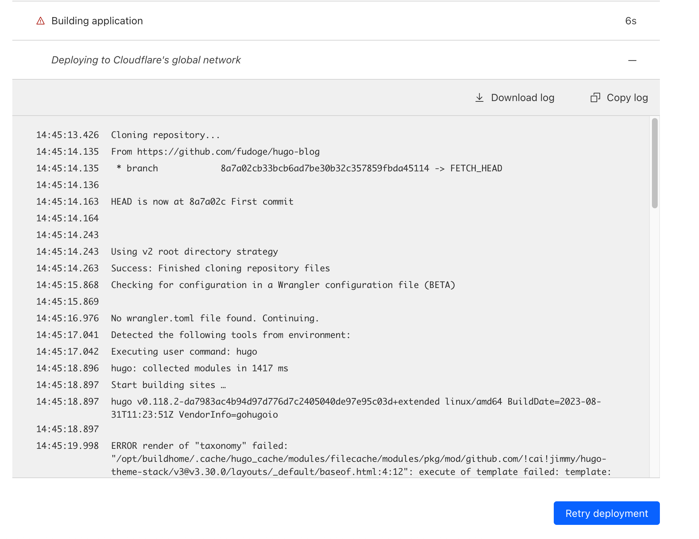
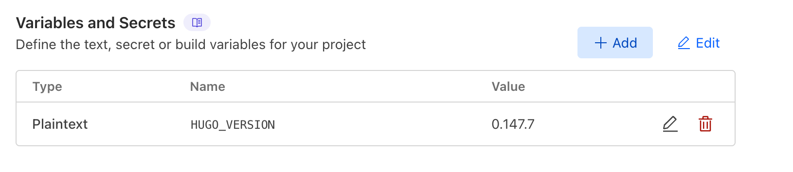
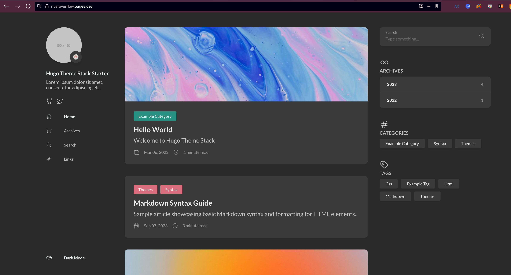

Hugo is a high-performance static site generator written in go.
With Hugo, you can create static site and manage them efficiently.
You can easily deploy it with GitHub Pages and Cloudflare Pages.

## 🚀Install Hugo
[Install GoHugo](https://gohugo.io/getting-started/installing)


## 🎨Install Theme
I used [hugo-theme-stack](https://stack.jimmycai.com/),
If you want another one, you can browse in [here](themes.gohugo.io)

Start with [Hugo-theme-stack-starter](https://github.com/CaiJimmy/hugo-theme-stack-starter/) template.  
Fork it to your repository using `Use This Template`.  
While the original author uses GitHub Pages, I preferred Cloudflare Pages for better performance and access control.


Then, clone it to local.  
```bash
git clone https://github.com/fudoge/hugo-blog.git
cd hugo-blog
```

Change branch `master` to `main`.  
Change our local branch to `main`, and Change GitHub's default branch to `main`.
```bash
git branch -m main
git push -u origin main
```



Delete master branch.
```bash
git push origin --delete master
```

Now, let's see the first blog page.
Execute this command below and open `localhost:1313` in your web browser.  
```bash
hugo server -D
```


You can also view this example site [here](https://demo.stack.jimmycai.com),

Remove GitHub Pages related files, and push your changes.  
Also, add `.vscode` and some unimportant files in `.gitignore`.
```bash
rm -rf .devcontainer .github .vscode
echo ".vscode" >> .gitignore
echo ".DS_Store" >> .gitignore
git add .
git commit -m "First commit"
git push origin main
```


## ☁️Deploy to Cloudflare Pages

First, we have to change baseURL.
If you don't change baseURL, your deployed blog might have broken links.
Fix it in `config/_default/config.toml`.


In Cloudflare Dashboard, Choose Compute(Workers)/Workers & Pages -> Pages.


Set your blog's repository, Project name, branch and build setups.  
And Follow the Hugo Template.


First build would be fail.
Cloudflare Pages may default to older Hugo versions, causing build errors when using newer theme features.


In Settings -> Variables and Secrets, change `HUGO_VERSION` to your local Hugo version.
You can easily see them in `hugo version`.


Deploy again. Now, You have your own Hugo blog now!
Feel free to customize your content, update the theme, and start writing awesome posts!



## 📚References
- [Stack Theme Document](https://stack.jimmycai.com/)
- [Stack Theme Starter](https://github.com/CaiJimmy/hugo-theme-stack-starter)
