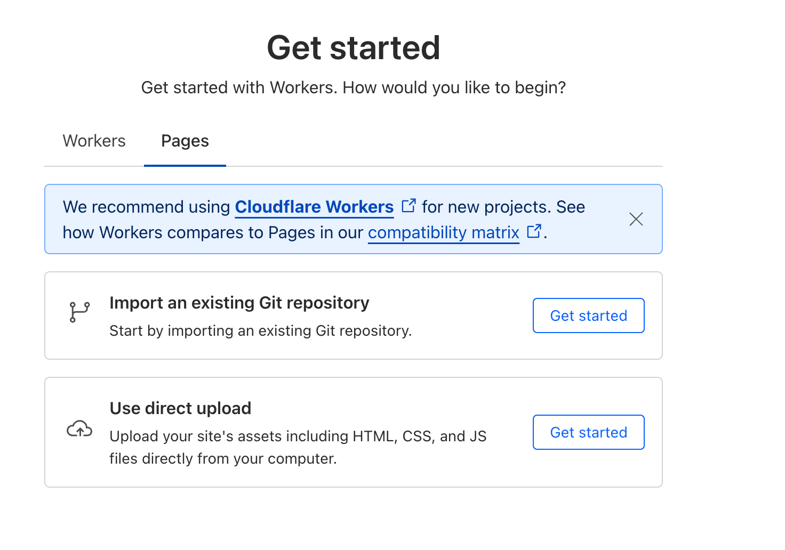
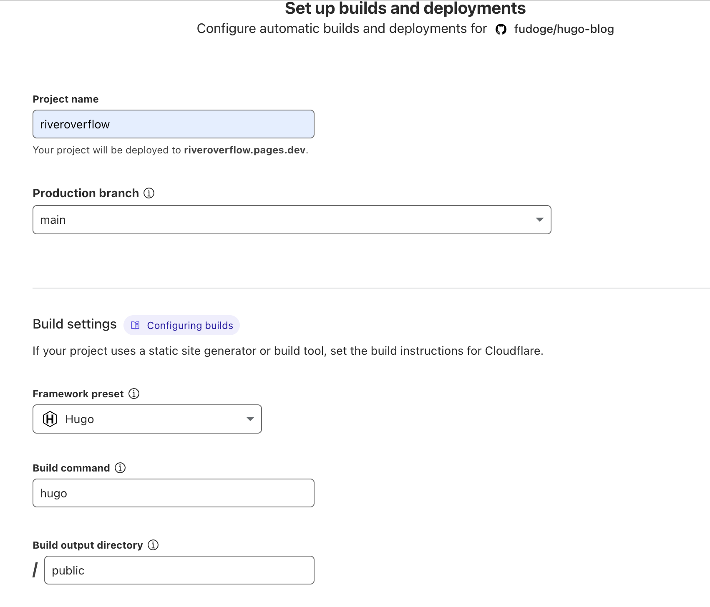
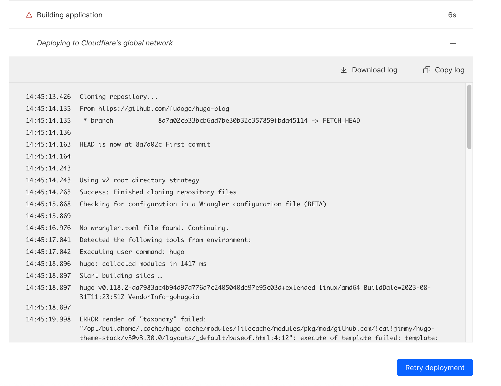
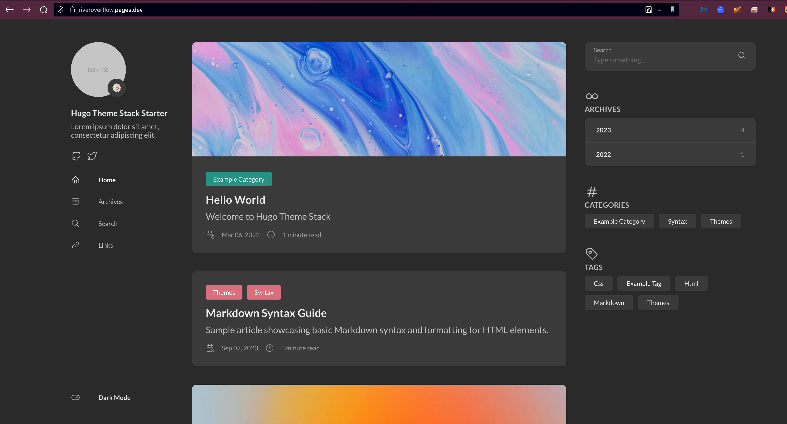

Hugo는 Go로 작성된 고성능의 정적 사이트 생성 도구이다.   
Hugo를 통해서 고성능의 정적 사이트를 빠르게 만들고 관리할 수 있고, GitHub Pages 또는 Cloudflare Pages를 통해서 쉽고 저렴하게 배포할 수 있다.

## 🚀Hugo 설치
[Install GoHugo](https://gohugo.io/getting-started/installing)


## 🎨테마 설치
여기서는 [hugo-theme-stack](https://stack.jimmycai.com/)을 이용했다.  
다른 테마를 원한다면, [여기](themes.gohugo.io)에서 둘러볼 수 있지만, 다른 테마를 이용시, 배포 단계 이전까지는 별도의 설정 과정이 필요하다.  

[Hugo-theme-stack-starter](https://github.com/CaiJimmy/hugo-theme-stack-starter/)에서 `Use This Template`를 눌러주고, 자신의 레포지토리로 불러온다.  
이 테마의 제작자는 GitHub Pages를 기본으로 전제하였지만, 여기서는 Cloudflare의 성능 및 접근제한 기능 때문에 Cloudflare Pages를 선택했다.  


그 뒤, 로컬에 불러와준다:  
```bash
git clone https://github.com/fudoge/hugo-blog.git
cd hugo-blog
```

메인 브랜치가 `master`로 되어있는데, `main`으로 바꿔주자.   
우선 로컬 브랜치를 main으로 해준 뒤, GitHub 레포지토리의 Default branch를 `master` -> `main`으로 바꿔준다.  
```bash
git branch -m main
git push -u origin main
```


그 뒤, master branch는 제거한다.
```bash
git push origin --delete master
```

이제, 초기 상태를 확인해보자. 아래 명령어를 입력하고, `localhost:1313`에 접속한다.
```bash
hugo server -D
```


이 데모 페이지는 [여기](https://demo.stack.jimmycai.com)에도 확인가능하다.

GitHub Pages에 관한 필요없는 내용들은 지우고, 커밋 및 푸시한다.   
`.gitignore`에 `.vscode`등을 추가해서 불필요한 파일이 Git에 포함되지 않도록 했다.
```bash
rm -rf .devcontainer .github .vscode
echo ".vscode" >> .gitignore
echo ".DS_Store" >> .gitignore
git add .
git commit -m "First commit"
git push origin main
```


## ☁️Cloudflare Pages에 연동

우선, baseURL을 설정해주자.
`config/_default/config.toml`에서 baseURL을 수정해준다.


Cloudflare Dashboard에서 Compute(Workers)/Workers & Pages에서 Pages를 선택한다.


블로그 레포지토리를 선택해주고, Project name에는 원하는 이름을 넣고, branch 및 빌드 세팅을 아래와 같이 한다:


첫 빌드는 실패하게 된다.  
Cloudflare의 Hugo 프리셋이 구버전을 사용하기 때문인데, 최신 버전으로 사용하도록 해주어야 한다.


Settings -> Variables and Secrets에서 `HUGO_VERSION`에서 현재 로컬의 HUGO 버전을 넣어준다.  
`hugo version`으로 현재 로컬에서의 버전을 알 수 있다.


다시 배포해보자. 성공적으로 배포됨을 알 수 있다!  
이제, 레포지토리에서 푸시만 하면 빌드-배포가 자동으로 이루어진다.



## 📚References
- [Stack Theme Document](https://stack.jimmycai.com/)
- [Stack Theme Starter](https://github.com/CaiJimmy/hugo-theme-stack-starter)
