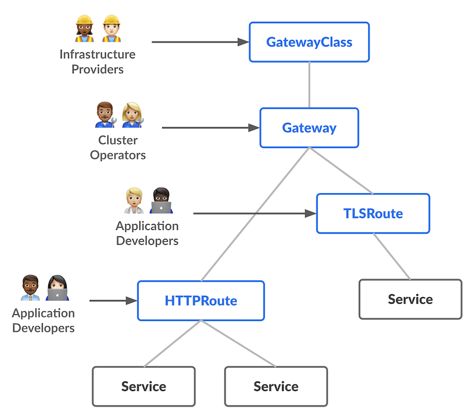
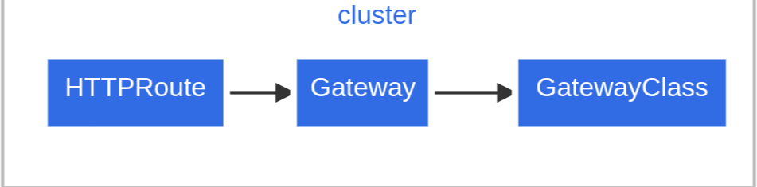

Gateway API는 동적인 인프라 프로비저닝과 강화된 트래픽 라우트를 지원하는 API이다.\
쉽게 생각하면 Ingress를 현대적인 모델로 개선한 버전이라고 보면 된다.

---
## ⚠️ 기존 Ingress의 문제점

Ingress Controller를 사용하여 Ingress를 구현하는 방식은 여러가지 문제가 있었다:

1. 한 리소스가 너무 많은 책임을 가진다
    - 외부 노출
    - 도메인
    - TLS
    - path별 라우팅
    - 벡엔드 연결
2. 리소스의 소유권이 모호하다
    - 앱 팀이 수정하면 운영 정책도 같이 건드려지고, 운영팀이 관리하면 앱 팀의 배포 속도가 느려진다
3. Controller별로 다르게 구현되어 있어 일관성이 없다
4. 너무 많은 것들이 annotation으로 구현되어 있어 유지보수가 어렵다

---
## 🧠 Gateway API의 설계 철학

Gateway API의 설계 철학은 다음과 같다:
- **Role-oriented**
  Kubernetes service networking을 관리하는데 드는 보통의 조직의 역할모델을 그대로 가져왔다.
	- Infrastructure Provider: 전체 시스템 플랫폼의 제공자. `GatewayClass`를 관리
	- Cluster Operator: 실제 클러스터를 운영하는 사람. 클러스터 내부에서 운영 정책을 통제.
	  `Gateway`를 관리
	- Application Developer: 클러스터 내부에서 실행되는 애플리케이션을 관리. 어떤 host 및 path로 받을지, 어떤 service로 트래픽을 통하게할지 실제 흐름에 관심
	  `HTTPRoute`, `GRPCRoute`와 같은 CRD관리
- **Portable**
  Custorm resources로 이루어져 있고, 다양한 구현체로 지원된다.
- **Expressive**
  기존 Ingress에서는 커스텀 annotation으로만 제공되던 특이기능들(e.g. 헤더기반 매칭, 트래픽 가중치)을 기본적으로 제공한다.
- **Extensible**
  기능 확장을 위해 별도 커스텀 리소스를 붙일 수 있는데, `GatewayClass/Gateway/Route`와 같은 적절한 계층에 연결하여 책임 범위에 맞는 세밀한 커스터마이징이 가능하다.

---
## 📦 리소스 모델



Gateway API는 4개의 안정적인 API가 있다:
- `GatewayClass`: Gateway들의 Type을 정의한다. Gateway의 설계도/상품 카탈로그에 가깝다.
  (ex. `cilium`, `aws-alb`, `istio`, `nginx` 등)
- `Gateway`: 실제 트래픽을 받는 구체적인 입구 인스턴스이다.
- `HTTPRoute`: HTTP트래픽을 어떤 규칙으로 어떤 서비스에 보낼지 결정한다.
	- host
	- path
	- header
	- query parameter
	- weight기반 분산
- `GRPCRoute`: gRPC트래픽을 어디에 보낼지 정의한다.
	- service/method기반 라우팅
- 이외에도 `TCPRoute`, `UDPRoute`, `TLSRoute` 등, 다양한 Route를 정의할 수 있다.


Gateway는 하나의 GatewayClass와 연관된다. \
GatewayClass는 gateway controller를 정의한다.

여러 개의 Route들은 `parentRefs`로 Gateway에 붙는다. \
Gateway는 `listeners`로 route들을 필터링할 수 있다. \
이렇게 양방향의 신뢰 관계가 만들어진다.



---
## 🛣️ Gateway API CRD들

### GatewayClass
Gateway는 여러 다양한 Controller들에 의해 구현될 수 있고, 설정이 다를 수 있다. \
Gateway는 반드시 controller의 이름을 포함하는  `GatewayClass`를 참조해야 한다.

최소한은 `GatewayClass`는 다음과 같다:
```yaml
apiVersion: gateway.networking.k8s.io/v1
kind: GatewayClass
metadata:
  name: example-class
spec:
  controllerName: example.com/gateway-controller
```

Gateway API는 스펙만 있고, 실제 동작은 구현체(Controller)가 한다. \
`GatewayClass`는 어떤 컨트롤러가 이 클래스를 처리할지 선언하는 것이다.


### Gateway
Gateway는 트래픽 핸들링 인프라의 인스턴스를 묘사한다. \
필터링, 밸런싱, 스플릿 등의 정책을 정의할 수 있다.

아래는 일반적인 Gateway의 예시이다:
```yaml
apiVersion: gateway.networking.k8s.io/v1
kind: Gateway
metadata:
  name: example-gateway
  namespace: example-namespace
spec:
  gatewayClassName: example-class
  listeners:
  - name: http
    protocol: HTTP
    port: 80
    hostname: "www.example.com"
    allowedRoutes:
      namespaces:
        from: Same
```

이 Gateway는 앞서 만든 `example-class`를 사용한다.

`listeners`로 어떤 트래픽을 어떻게 받을지 정의한다. \
http라는 이름의 리스너 규칙이 있는데, 이는 `www.example.com:80`으로 들어오는 HTTP요청을 받을 준비가 된 논리적 수신 지점을 하나 가짐을 말한다.

`allowedRoutes`에서의 의미는, Gateway와 같은 namespace에 있는 Route만 붙을 수 있다는 의미이다.

`spec.addresses`가 설정되지 않았는데, 이는 구현체별 방식으로 적절한 주소를 할당할 수 있다는 의미이다. \
실제 바인딩 주소는 `status.addresses`에 반영된다. \
이 말은, 클라우드 구현체면, 외부 LB 주소나 DNS이름이 붙을 수 있고, 다른 구현체면 내부 프록시의 엔드포인트가 붙을 수 있다는 의미이다.

클라이언트는 Gateway에 할당된 주소로 요청을 보내고, 그 다음 Route가 그 요청을 Service로 연결한다는 뜻이다.


### HTTPRoute

HTTPRoute는 라우팅 동작을 정의한다. \
즉, 실제로 어느 서비스에 넘길지를 정의한다.

HTTPRoute가 새로 생기거나 변경되면, 클러스터 내부 proxy server 또는 cloud load balancer에 구성이 변경될 수 있다.

```yaml
apiVersion: gateway.networking.k8s.io/v1
kind: HTTPRoute
metadata:
  name: example-httproute
spec: 
  parentRefs:
  - name: example-gateway
  hostnames:
  - "www.example.com"
  rules:
  - matches:
	- path:
	    type: PathPrefix
	    value: /login
    backendRefs:
    - name: example-svc
      port: 8080
```

이 HTTPRoute는 `example-gateway`에 붙고싶다는 의미이다. \
이 예시에서는, `example-gateway`로부터 온 HTTP 트래픽에서, `www.example.com` Host 헤더를 달아 오고, `/login` path로 왔다면, `example-svc`의 8080으로 이동한다는 뜻이다.


### GRPCRoute

gRPC요청을 어떤 벡엔드로 보낼지 정의하는 리소스이다. \
gRPC는 HTTP/2를 전제로 하기에, `GRPCRoute`를 지원하는 Gateway는 반드시 HTTP/2를 처리할 수 있어야 한다.

단순한 예제는 아래와 같다:
```yaml
apiVersion: gateway.networking.k8s.io/v1
kind: GRPCRoute
metadata:
  name: example-grpcroute
spec:
  parentRefs:
  - name: example-gateway
  hostnames:
  - "svc.example.com"
  rules:
  - backendRefs:
    - name: example-svc
      port: 50051
```

`example-gateway`로 들어온 `svc.example.com`대상 gRPC요청은 전부 `example-svc:50051`로 보낸다.

서비스/메서드를 매칭해보자:
```yaml
apiVersion: gateway.networking.k8s.io/v1
kind: GRPCRoute
metadata:
  name: example-grpcroute
spec:
  parentRefs:
  - name: example-gateway
  hostnames:
  - "svc.example.com"
  rules:
  - matches:
    - method:
        service: com.example
        method: Login
    backendRefs:
    - name: foo-svc
      port: 50051
```

여기서, `spec.rules[0].matches[0].method.service`는 K8s service가 아니라, gRPC service name을 말한다. \
`spec.rules[0].backendRefs[0].name`의 foo-svc는 K8s Service를 말한다.

---
## ➡️ 요청 흐름

요청 흐름은 아래와 같다:


1. 클라이언트가 `http://www.example.com`으로 HTTP요청 보냄
2. Client의 DNS리졸버는 Gateway에 대한 IP주소를 받음
3. Client는 Gateway에 요청. Gateway는 HTTPRoute를 기반으로 적절한 통신규약을 생성
4. (Optional) 헤더 및 경로기반으로 룰 매칭
5. (Optional) 헤더 제거 및 기타 필터링 작업 수행
6. backend에 통신 전달

---
## 🛸 구현체 예시

### Cilium
- [이 블로그 내에서]()
- [공식 문서](https://docs.cilium.io/en/stable/network/servicemesh/gateway-api/gateway-api/)

---
## 📚 Reference

- [Kubernetes Gateway](https://kubernetes.io/docs/concepts/services-networking/gateway/)
- [Gateway API](https://gateway-api.sigs.k8s.io)