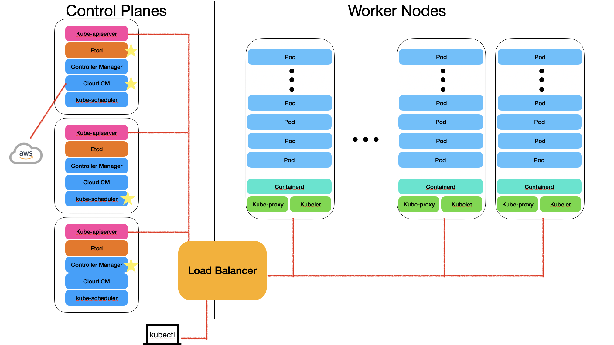

## ☸️ 쿠버네티스란?

쿠버네티스란, 구글이 Borg라는 내부 시스템을 기반으로 2014년 **Kubernetes** 로 공개한 **컨테이너 오케스트레이션(Container Orchestration)** 을 제공하는 오픈 소스 프로젝트이다.  
즉, 컨테이너들을 **자동으로 배포하고, 스케일링하고, 복구** 시켜준다.  
**Kubernetes** 라는 이름은 그리스어로 "선장"이라는 뜻을 가진다.  
이후 2015년, **CNCF(Cloud Native Computing Foundation)** 이 **Linux Foundation** 에 의해 설립되고, **Kubernetes** 는 **CNCF** 의 첫 **Graduated Project** 가 되었다.

쿠버네티스의 주요 기능은 다음과 같다:
- 애플리케이션에 집중하도록 **서비스 추상화**
- 수천 ~ 수만 개의 **컨테이너를 효과적으로 관리 가능**
- 운영팀이 인프라를 효과적으로 관리할 수 있도록 효과적인 도구 제공
    - 상태 확인
    - **자가 치유(self-healing)**
    - **오토 스케일링(auto-scaling)**
    - 어플리케이션 개발 단순화

---
## 📦 추상화

현대 소프트웨어 개발 및 인프라의 핵심은 바로 **추상화(abstraction)** 이다.
추상화는 내부의 복잡한 구현을 감추고, 필요한 기능만 오픈하고, 인터페이스를 표준화 해준다.  

`Virtual Machine`은 하드웨어를 추상화하여 자원을 논리적으로 나눠 사용할 수 있게 해주지만, 오버헤드가 크고, 애플리케이션을 위한 각종 의존성 문제는 해결되지 않았기에, OS수준의 추상화가 필요했다.  

이에 대한 솔루션은, 리눅스에 있는 `namespace(격리 제공)`와 `cgroup(control group, 리소스 제어)`을 이용한 컨테이너 기술이였다.  
리눅스는 많은 서버에서 사용되었고, 커널을 공유할 수 있다는 특징 역시 가지고 있었다.  
컨테이너 기능을 쉽게 사용할 수 있도록 추상화되어 컨테이너를 관리하는 API를 제공하는 기술이 바로 `Docker`였다.  

이러한 컨테이너들을 전체 인프라 시스템에서 유연하고 편리하게 관리할 방법이 필요해졌다.  
그래서 `Kubernetes`가 이 문제를 해결하기 위해 등장했다.

대량의 서비스들이 나누어지면서, 마이크로서비스들의 통신 흐름을 추상화하고 디버깅하는 기술이 필요해졌다.   
이 문제를 해결하기 위해 `Service Mesh`가 나왔다.  

정리 하자면, 아래와 같다:  
- **가상 머신** 은 하드위에 관점의 추상화
- **컨테이너** 는 서비스 관점의 추상화
- **쿠버네티스** 는 서비스 인프라의 추상화
- **서비스 메시(Service Mesh)** 는 서비스 트래픽 추상화 및 가시화

추상화에서 가장 중요한 것은, 내부에서 API를 제공한다는 것이다.  
이 API덕분에 이용자들은 입출력에만 신경을 쓰고, 내부 구현에 종속될 필요 없다.  

### 명령형과 선언형

**명령형**은 순차적으로 구문을 실행한다.  
이는 변경 이후 이전 상태로 돌아가게 하는 것을 힘들게 한다.  

반면, **선언형**은 선언된 상태를 유지하기 위해 조정한다.  
API를 통해 명령의 실행 등을 자동화하여, 실패 시에 이전의 상태로 돌아가기 상대적으로 편하다.  

---
## 🧩 쿠버네티스 기본 구성 단위

### Control Plane
컨테이너 인프라의 추상화를 제공하는 **중앙 관리 호스트** 이다.  
구성요소는 아래와 같다:
- `API-Server`: 외부로부터의 요청을 받고 각 `Worker Node`들과 통신하며 실제 요청을 실행하는 주체이다.  
- `Etcd`: **선언된 상태(Desired State)** 들과 현재의 클러스터 내부의 상태가 저장된다.  
- `Controller Manager`: 제어 루프를 이용하여 **선언된 상태(Desired State)를 지속적으로 유지하도록 클러스터 내부를 관리** 한다.  
- `Cloud Controller Manager`: 관리형 쿠버네티스의 경우, 클라우드 서비스 제공자와 상호작용한다.  
- `Scheduler`: 클러스터 내부의 노드에 Pod를 배포하는 역할을 한다.  

### Control Plane의 고가용성 구성
`API-Server`는 `Load-Balancer`를 통해서 수평적 확장이 가능하다.  
`etcd`는 분산형 **Key-Value** 저장소로, RAFT알고리즘을 통해 Master가 선정되고,  
**Master**에 쓰기 작업이 먼저 이뤄지면, 나머지 노드들에 복제되는 방식이다.  
CAP 중 CP 시스템으로, **Consistency**를 유지하고, **Partition tolerance**를 제공한다.
- **Consistency** : 일관성을 유지한다.  
- **Partition tolerance** : 네트워크 분할 발생 시에도 부분적으로 기능을 수행함을 말한다.  
- 이를 동시에 만족시키면, 일관성 유지를 위해, 장애가 생기고 새로운 대표가 선출되는 동안은 일부 기능(ex: 쓰기)을 수행할 수 없다.  
- 즉, **가용성(Availability)을 일부 포기** 한다. 
- 이는, 데이터의 신뢰성이 중요하기 때문이다. 현실적으로 P는 항상 대비해야 하기 때문에, CP이냐 또는 AP이냐고 갈린다.  
    - AP의 예시는 DNS가 있다. 정확성이 조금 떨어질 수 있지만, 응답을 제공한다.  

보통 고가용성을 위해 3대 이상으로 분산되고, 클라우드에서 제공되는 관리형 쿠버네티스의 경우, 클라우드에서 관리된다.  

나머지 `Controller Manager`, `Scheduler`은 각각 독립적인 대표자 선출이 되어 하나의 컨트롤 플레인에서 동작한다.  
즉, 1, 2, 3번 Control Plane이 있다고 하면, 1번이 `Controller Manager`, 3번이 `Scheduler`리더를 맡을 수 있다.  

위의 그림에서 별표 표시가 되어 있는 부분이 바로 현재의 리더를 표시하는 부분이다. 

### Worker Node
실제 컨테이너화 된 애플리케이션을 실행하는 호스트이다.  
애플리케이션을 실행하고, 모니터링하며, 다음의 구성 요소로 이루어진다:  
- `Container Runtime`: 컨테이너를 실행하는 엔진이다. 현재는 주로 `containerd`가 사용된다.  
- `kubelet`: Node에서 `API-Server`와 통신하며, 명령을 수행하고, 현재 노드의 상태를 보고한다.
- `kube-proxy`: 애플리케이션들 간의 네트워크 트래픽을 분산시킨다.  

### kubectl
`kubectl`은 쿠버네티스 클러스터에 요청을 날리는 클라이언트 애플리케이션이다.  
`API-Server`에 요청을 날릴 수 있는 어느 곳에서나 실행될 수 있다.  

---
## 🖋️ 마무리

서비스 인프라를 추상화한 컨테이너 오케스트레이션 솔루션인 쿠버네티스는 Control Plane과 Worker Node로 구성되며,  
**Control Plane**은 외/내부와 통신하며 클러스터를 지휘하고, **Worker Node**는 실제로 애플리케이션을 실행한다.  
Control Plane의 `API-Server` 및 `Etcd`의 고갸용성을 위해, Control Plane은 수평적 확장이 가능하다.  
