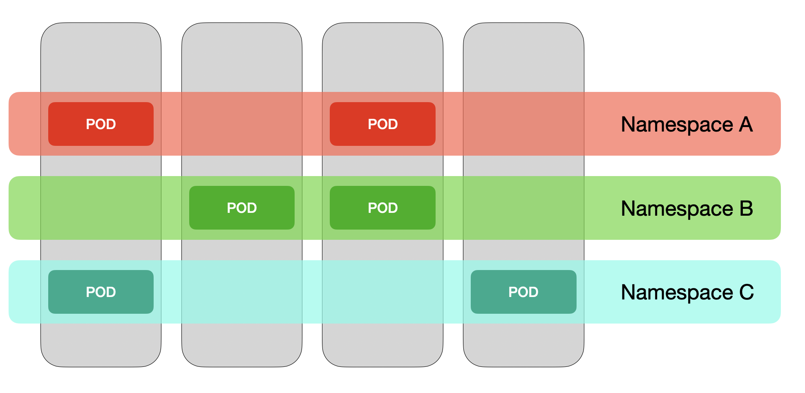

## ➗ Namespace란

단일 클러스터 내에서 **리소스 그룹 격리**를 제공한다.  
리소스의 이름은 네임스페이스 내에서 고유해야 하지만, 다른 네임스페이스 간에는 존재할 수 있다.  
`ResourceQuota`나 `LimitRange`를 통해서 CPU/MEMORY/DISK/GPU등의 자원 제한도 가능하다.  
`NetworkPolicy`를 통해 접근을 제어하고, `RBAC` 정책으로 권한을 제어할 수도 있다.  
**네임스페이스를 삭제하면, 내부의 모든 리소스들이 삭제된다.**

기본 네임스페이스는 `default`이다. 

---
## ⌨️ Namespace 관련 명령어

### 네임스페이스 조회
```bash
kubectl get namespace

kubens # kubens가 설치된 경우
```

### 특정 네임스페이스 리소스 조회
아래 예시는 `kube-system`이라는 클러스터를 위한 시스템 네임스페이스의 파드들을 조회한다.  
```bash
kubectl get po --namespace kube-system

# 또는
kubectl get po -n kube-system
```

### 네임스페이스 생성
네임스페이스는 `core`에 속하여, `v1`으로 api를 지정하면 된다.  
```yaml
apiVersion: v1
kind: Namespace
metadata:
    name: my-namespace
```

`kubectl`로 적용하면 된다.
```kubectl apply -f my-namespace.yaml```

또는 명령어로 직접 생성할 수 있다.
```kubectl create ns my-namespace2```

### 네임스페이스 조회

아래 명령어로 클러스터 전체의 네임스페이스를 조회한다: 
```bash
kubectl get ns # namespace도 가능
```

### 네임스페이스 전환
기본적으로, 아래 명령어를 사용한다:
```bash
kubectl config set-context --current --namespace=<ns_name>
```

`kubens`는 네임스페이스의 목록을 조회, 현재 네임스페이스 확인, 네임스페이스 전환을 간단하게 해준다.
```bash
kubens # 네임스페이스 조회. 현재 네임스페이스는 강조되어 보임

kubens my-namespace # my-namespace로 전환
```

### 네임스페이스 제거
```bash
kubectl delete ns my-namespace my-namespace2 (...)
```


### 기타 명령
```bash
kubectl get po -A # 모든 네임스페이스 Pod조회

kubectl get po -n kube-system # kube-system의 Pod조회

kubectl api-resources --namespaced=true # 네임스페이스 레벨의 리소스 조회(Pod등)

kubectl api-resources --namespaced=false # 네임스페이스 레벨이 아닌 리소스 조회(Node등)
```

---
## 🗣️ 요약
`namespace`는 단일 클러스터 내에서 논리적인 자원 분리를 해준다.  
자원, 접근, 권한의 제어가 가능하며, 네임스페이스 삭제 시, 소속 자원들도 삭제된다.  
기본은 `default`, `kube-system`이라는 네임스페이스는 쿠버네티스에서 중요한 역할을 한다.
