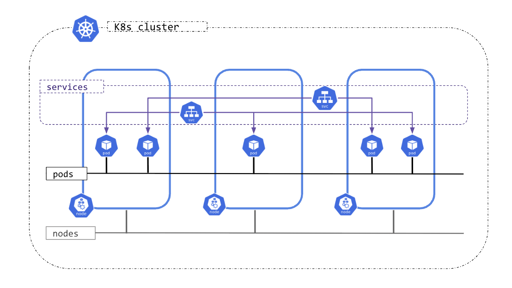
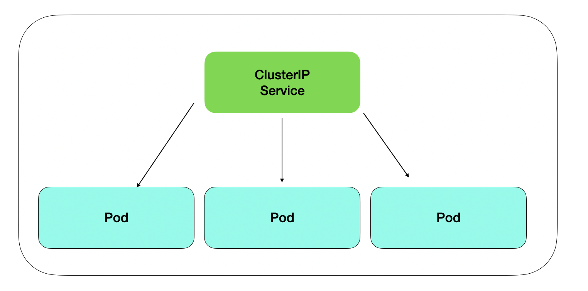
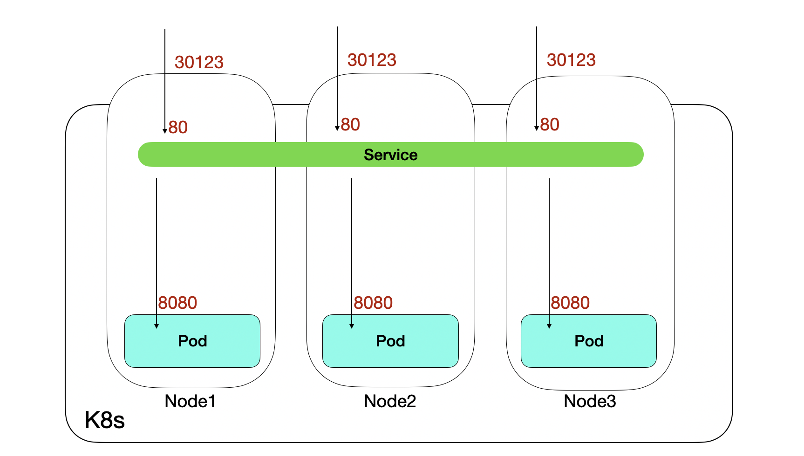
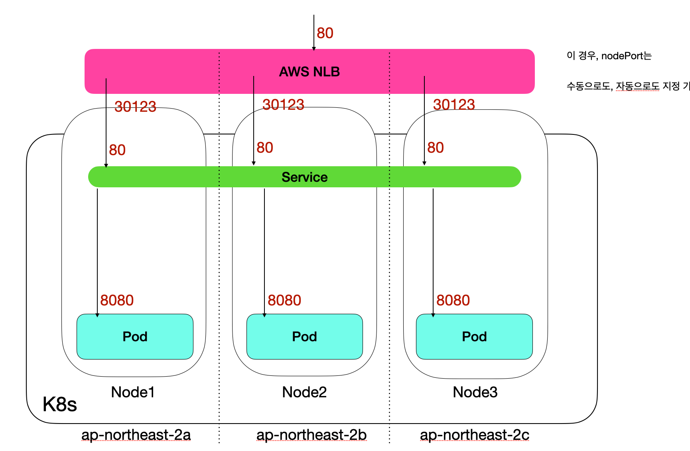
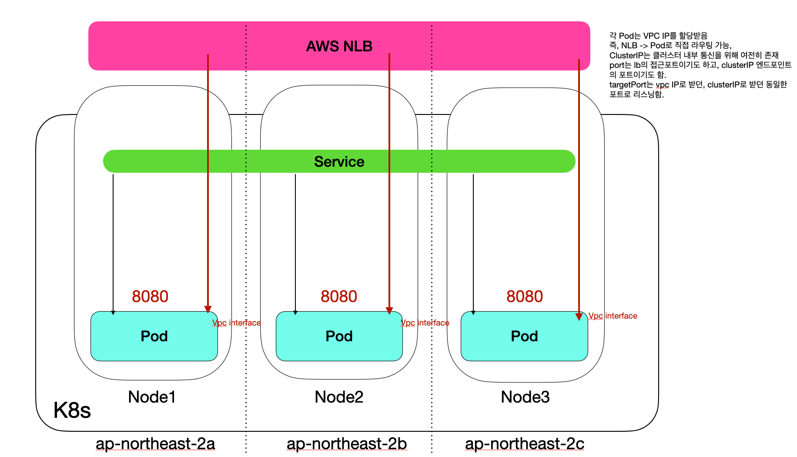
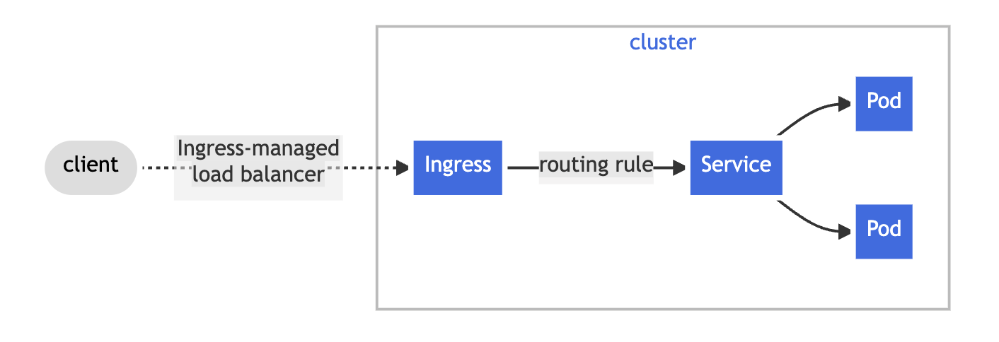
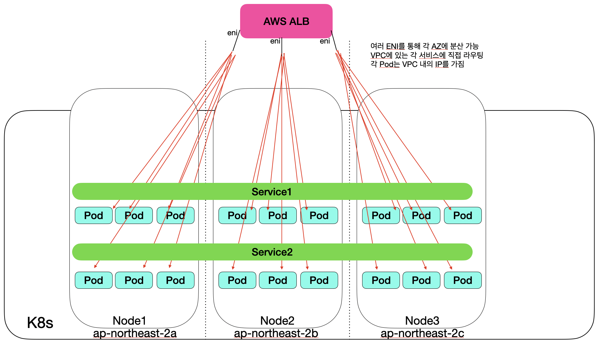

Pod 또는 컨테이너들이 어떻게 서로 통신하고, 외부와는 어떻게 통신하느냐는 쿠버네티스에서 가장 중요한 문제이다.  
4가지의 문제가 있다:
1. **강력하게 결합된 컨테이너 간 통신**: 이는 Pod내부의 컨테이너간 통신을 말하며, `localhost`를 통해서 서로 통신할 수 있다.  
Pod가 하나의 논리적 호스트이기 때문이다.
2. **Pod-to-Pod** 통신: CNI(Container Network Interface)플러그인을 통해 구현된다.  
모든 Pod들은 서로 Flat 네트워크에 존재하며, 이 통신은 각 Pod에 부여된 클러스터 내부 IP를 통해 이루어진다.
3. **Pod-to-Service** 통신: 특정 Pod대신, Service라는 추상화를 통해 접근한다.  
4. **External-to-Service** 통신: 외부 네트워크가 클러스터 내부의 애플리케이션과 통신하려면, `Service`는 **NodePort** 나 **LoadBalancer**, 혹은 **Ingress** / **Gateway API** 를 통해 외부 IP에 노출되어야 한다.  

서비스의 포트 충돌은 매우 골치아픈 존재이고, 동적으로 이들을 바꾸는 것은 큰 복잡도를 불러일으킨다.  
대신, 쿠버네티스는 `Service`를 통해서 이를 해결한다.

---
## 🌐 Kubernetes 네트워크 모델

쿠버네티스 네트워크 모델은 다음의 규칙들을 가진다:
- 클러스터의 Pod들은 각자의 cluster내부 IP 주소를 가진다.  
    - Pod는 각자의 네트워크를 가지며, Pod 내의 컨테이너들은 `localhost`를 통해 통신할 수 있다.
- `Pod 네트워크`는 Pod간 통신을 책임진다. Cluster Network라고도 불린다.  
    - Pod들은 서로 어느 노드에 있는지 관계없이 통신할 수 있다. 
    - 별도의 Proxy 또는 NAT(Network Address Translation)이 필요없다.  
    - `Daemon`이나 `kubelet`과 같은 노드의 에이전트들은 노드의 모든 Pod들과 통신할 수 있다.
- `Service API`는 수명이 긴 IP주소 또는 hostname을 가진다.  
- `Gateway API`또는 `Ingress`는 클러스터 외부에서 접속하는 클라이언트들에게 서비스를 제공하도록 돕는다.  
- `NetworkPolicy`는 Pod간 통신, 또는 Pod와 외부의 통신을 컨트롤하는 고급 API이다.  



쿠버네티스는 세 가지의 네트워크 계층을 가진다:
- **Pod Network**: Pod들이 소속되는 네트워크. 서로 다른 `namespace`의 Pod들도 모두 서로 통신가능하다.  
만약 다른 namespace간의 통신을 차단하고 싶다면, `NetworkPolicy`를 지원하는 CNI가 필요하고, 직접 설정해주어야 한다.  
- **Service Network**: Service들이 위치한 네트워크. Pod들에 대한 고정된 엔드포인트를 제공하기 위해 추상화된 채 존재한다.  
`kube-apiserver`가 관리하며, `kube-proxy`가 `iptables/ipvs`룰을 설정하여 Pod집합(엔드포인트)로의 로드밸런싱을 담당한다.  
- **Node Network**: 실제 노드들이 속한 네트워크 대역이다.  


---
## 🤓 왜 Service를 사용하는가
`Pod`만을 사용할 때에는 다음의 이유들이 있다:
- Pod는 몇 번이고 죽었다가 깨어난다.  
이렇게 삭제와 생성이 일어날 때 마다, 새로운 Cluster IP를 받는다.  
- 그러나, 사용자가 어느 특정한 Pod에 접속할 필요 없다.   
동일한 애플리케이션이라면, 어느 Pod에 할당되어도 상관없다는 뜻이다.  


그래서, `Service`라는 가상의 엔트포인트를 만들어서 사용자는 어느 Pod에 접속하는지 알 필요 없이 추상화되어 접속할 수 있는 것이다.  
`Service`는 실존하지 않는다. 대신, `kube-proxy`가 `iptables` 또는 `ipvs`규칙을 만들어 트래픽을 조작시키게 하는 추상적 개념이다.  

---
## 📜 내부 도메인 규칙
클러스터 내부 도메인은 `CoreDNS`를 통해 동작받는다.
| 항목 | 형식 | 설명 |
| --------------- | --------------- | --------------- |
| Pod | \<pod-name>.\<service-name>.\<namespace>.svc.cluster.local | Pod만 띄운경우는 없음 |
| Service |\<service-name>.\<namespace>.svc.cluster.local  |  |
| Headless Service | \<pod-name>.<Service name>.\<namespace>.svc.cluster.local |  |
| StatefulSet | \<pod-name>.\<headless-service-name>.\<namespace>.svc.cluster.local |  |


이들은 `RFC1123`을 따른다.  
- **영문소문자(a-z), 숫자(0-9), 하이픈(-)만** 사용가능
- 시작과 끝은 **영문소문자 또는 숫자여야 함**
- 전체 길이는 **253자 이하**
- 단일 부분(label)은 **63자 이하**

---
## 🍀 서비스의 종류

쿠버네티스는 다양한 `Service`를 제공한다.
- ClusterIP
- NodePort
- LoadBalancer
- Ingress(이제는 Gateway API가 권장)

### ClusterIP

기본적으로 항상 제공된다. 클러스터 내부에만 접근 가능한 가상 IP이다.  
즉, `Service`의 내부 IP라고 보면 된다. 
외부에서는 접근할 수 없고, DNS를 통한 이름 기반 접근이 가능하다.  
`kube-proxy`를 기반으로 내부의 `iptables`를조작하여 동작한다.

```yaml
spec:
  type: ClusterIP
```


### NodePort

Node의 특정 포트를 할당 및 개방하여 서비스(ClusterIP)와 연결한다.  
**클러스터 내 모든 노드들** 이 지정된 포트를 연다.  
노드의 포트 할당 범위가 **30000 ~ 32767** 로 제한된다(`--service-node-port-range`로 수정가능).  
특정 Node로 접속하더라도, `ClusterIP`로 연동 되어, 로드밸런싱 된다.  

통신 흐름은 다음과 같다:  
**[Client] -> [NodeIP:Port] -> [kube-proxy] -> [Pod]**


```yaml
apiVersion: v1
kind: Service
metadata:
  name: node-nodeport
spec:
  type: NodePort
  ports:
  - nodePort: 30123
    port: 80
    targetPort: 8080
  selector:
    app:  nodeapp-pod
``````


### LoadBalancer
내부로는 `ClusterIP`를, 외부에는 로드밸런서를 설치한다.   
사용중인 클라우드 서비스에 따른 로드밸런서(aws의 경우 nlb) 인스턴스가 생성된다.  
Cloud Controller들 중에서 LB Controller가 존재하며, 이것이 클라우드에서 인스턴스를 생성하도록 하는 것이다.  
기본적으로 `NodePort`를 사용하기는 한다.


그러나, 클라우드의 LB의 경우, 클라우드 자체의 CNI를 사용하여, POD ip로 직접 라우팅시킬 수 있다.  
NAT를 한번 건너뛰어 더 빠르게 통신 가능하다.  
(일부 클라우드 서비스에서만 지원, aws에서는 AWS VPC CNI가 제공되지만, GKE, AKS는 설정이 더 복잡함, 이외 클라우드 서비스는 매우 제한적)  
**LB는 클러스터 노드가 있는 각 가용 영역(AZ)에 하나씩 ENI를 생성한다.**  즉, 위의 그림에서는 하나만 있는 듯 하지만, 사실 노드가 있는 AZ별로 로드밸런싱이 지원된다.  
- nlb는 VPC종속이기에, 1개 이상의 AZ에 걸쳐야 한다.
- alb는 2개 이상의 AZ에 걸쳐야 한다.

되도록 같은 AZ내부에 트래픽을 우선전달한다.  
- 지연을 감소하고, 트래픽 요금이 절감되기 때문이다.  



온프레미스에서는 `MetalLB`등을 사용한다.  
온프레미스에서도 고급 CNI설정 시, Pod로 직접라우팅이 가능하다.  

```yaml
spec:
  type: LoadBalancer
```


AWS의 nlb를 쓰기 위해서는, `Service`의 `annotation`에 아래의 주석들이 있어야 한다:
파드 수준의 로드밸런싱을 지원할 수 있다.  

```yaml
annotations:
    service.beta.kubernetes.io/aws-load-balancer-type: external # VPC 외부접속 가능
    service.beta.kubernetes.io/aws-load-balancer-nlb-target-type: ip # POD ip로 직접 전달
    service.beta.kubernetes.io/aws-load-balancer-scheme: internet-facing # 공인 IP사용
```

### Ingress
HTTP/HTTPS 트래픽을 라우팅하는 고급 L7프록시이다.  
여러 서비스를 하나의 도메인/IP에 경로 또는 호스트 기반으로 연결 가능하다.  
Ingress 자체는 규칙을 정의할 뿐이며, **Ingress Controller**가 있어야 동작한다.  

일반적인 구조는 아래와 같다:  
**[사용자] -> [외부 LB] -> [Ingress Controller] -> [ClusterIP Services] -> [Pod]**


그러나, 일부 클라우드 서비스의 경우, 실제 Pod로 직접 라우팅한다.  특별한 CNI를 쓰면 가능하다.  



아래 예시는 EKS에서 `alb`가 Pod에 바로 트래픽을 전달해준다.  
여기서는 Ingress로 단일의 ALB가 하나 생기고, 그 ALB는 AZ별로 ENI를 하나씩 가져서 직접 Pod에 트래픽을 보낼 수 있다.   

`nginx-ingress.yaml` 예시
```yaml
apiVersion: networking.k8s.io/v1
kind: IngressClass
metadata:
  name: alb-ingress-class
spec:
  controller: ingress.k8s.aws/alb
---
apiVersion: networking.k8s.io/v1
kind: Ingress
metadata:
  name: nginx-ingress
  annotations:
    alb.ingress.kubernetes.io/scheme: internet-facing
    alb.ingress.kubernetes.io/target-type: ip # Service의 ClusterIP를 무시하고 바로 연결. instance인 경우, NodePort사용. 
spec:
  ingressClassName: "alb-ingress-class"
  rules:
  - host: nginx.example.com
    http:
      paths:
      - path: /
        pathType: Prefix
        backend:
          service:
            name: nginx-service
            port:
              number: 80
```

`nginx-svc.yaml`

```yaml
apiVersion: v1
kind: Service
metadata:
  name: nginx-service
spec:
  selector:
    app: nginx
  ports:
  - port: 80
    targetPort: 80
```


---
## 🎃 Headless Service
StatefulSet, 정밀 로드밸런싱, 분산 DB, 클라이언트 로드밸런싱등의 이유로 사용된다.  

기존의 `Service`는 1개의 ClusterIP를 반환하고, `kube-proxy`가 적절한 Pod로 로드밸런싱하지만,  
`Headless Service`는 각 Pod의 IP를 전부 반환한다.    
`StatefulSet`을 통해 생성된 주소는 특정 Pod를 직접 지칭할 수 있다.  


```yaml
spec:
  clusterIP: None
```


---
## 📚 요약
- `Service`는 가변의 IP를 가지는 Pod에 접근하기 위해 도와주는 추상화된 엔드포인트이다.  
- `ClusterIP`는 서비스 공통으로 기본적으로 사용된다.  
- `LoadBalancer`는 각 AZ별로 생긴다. 온프레미스는 `MetalLB`를 이용한다.  
- `Ingress`는 L7기반의 라우팅을 지원한다. 
- `LoadBalancer` 및 `Ingress`는 일부 지원되는 CNI에 한해, Pod에 직접 트래픽 분산이 가능한데, 이는 더 좋은 성능을 가진다.  
- `Headless Service`는 소속 Pod의 IP를 전부 반환하는데, 분산 DB 또는 StatefulSet등에 사용된다. 


