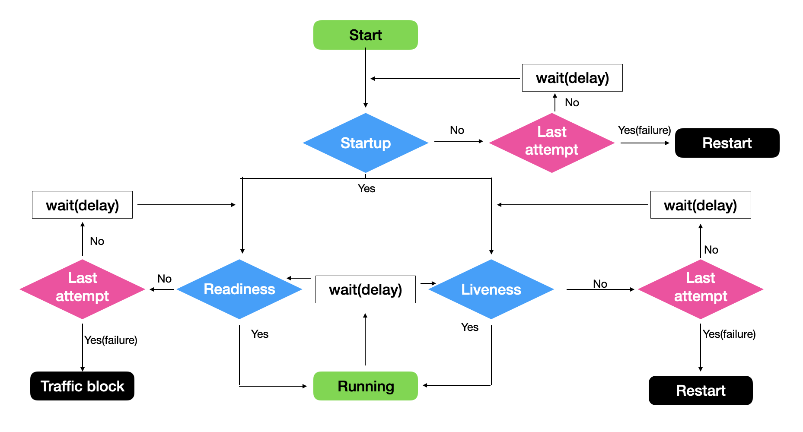

## 🟢 Probe란? 
**Probe**는 컨테이너의 상태(health)를 주기적으로 확인하기 위한 **헬스 체크 메커니즘** 이다. 
쿠버네티스는 상태를 계속 감시한다고 했는데, 왜 필요하느냐?
기본적으로 Pod단위로 살았냐 죽었냐를 보기 때문이다.  
실제로는 애플리케이션이 살아는 있는데, 죽어있는 상태에 머물러 있을 수도 있다.  
Probe는 Pod 내의 실제 상태, 즉 서비스를 이용가능한지에 대해 검사한다.  

### Probe의 종류
종류는 3가지가 있다:
- **Startup Probe**: 애플리케이션이 정상적으로 시작되었는지 확인
    - 실패 시, 컨테이너 재시작
    - 컨테이너 초기화 중 작동
    - ex) 애플리케이션의 시작 상태 보호
- **Readliness Probe**: 트래픽 처리를 할 수 있는 상태인지 확인
    - 실패 시, 트래픽을 차단(서비스 엔드포인트에서 일시 제거됨)
    - 컨테이너 실행 중 작동
    - ex) 비정상 상태일 때 트래픽 차단
- **Liveness Probe**: 정상적으로 살아있는 상태인지 확인
    - 실패 시, 컨테이너를 재시작
    - 컨테이너 실행 중 작동
    - ex) 데드락, 메모리 leak, 무한루프 등의 비정상 상태 대응
        - 성공할 때 까지 Readliness와 Lievness 차단

### 공통 설정

- `initialDealySeconds`: probe수행 대기시간
    - 보통 애플리케이션 실행시간의 3배수
- `periodSeconds`: 수행간격
- `timeoutSeconds`: 최대 응답 대기시간
- `successThreshold`: 실패한 이후에 지정된 횟수만큼 성공할경우 성공
- `failureThreshold`: 지정한 개수만큼 연속으로 실패하면 재가동

### HTTP 추가 설정
- `host`: 접속할 호스트명
- `scheme`: 접속방법
- `path`: 접속경로
- `httpHeaders`: request의 커스텀 헤더
- `port`: 접속할 컨테이너 포트번호

## 📜 Yaml 예시

### HTTP liveness Probe
실패 시, **컨테이너가 재실행** 되고, 이미지를 레지스트리로부터 새롭게 `pull`해온다. 
`k8s.gcr.io/liveness`는 liveness 테스트를 위해 만들어진 이미지이다. 처음 10초동안은 서비스를 하지만, 10초 후에는 에러를 발생시킨다.  
```Yaml
apiVersion: v1
kind: Pod
metadata: 
  lables: 
    test: liveness
  name: liveness-http
spec:
    containers:
    - name: liveness
      image: k8s.gcr.io/liveness
      args:
      - /server
      livenessProbe:
        httpGet:
          path: /healthz
          port: 8080
          httpHeaders:
          - name: Custom-Header
            value: Awesome
        initialDealySeconds: 3
        periodSeconds: 3
```

### Command Liveness Probe
HTTP 요청 외에도 방법은 있다. 아래 예제는 `/tmp/healthy`가 오류가 생기면 에러로 간주하여 컨테이너를 재실행한다.  
```Yaml
apiVersion: v1
kind: Pod
metadata: 
  name: liveness-cmd-pod
spec:
  containers:
  - name: liveness-cmd
    image: busybox:latest
    command: ["/bin/sh", "-c", "touch /tmp/healthy; sleep 30; rm -rf /tmp/healthy; sleep 600"]
    livenessProbe:
    exec:
      command:
      - cat
      - /tmp/healthy
    initialDealySeconds: 5
    periodSeconds: 5
```

### HTTP Readiness Probe
```Yaml
apiVersion: v1
kind: Pod
metadata:
  name: readiness-http-pod
spec:
  containers:
  - name: readiness-http
    image: nginx:latest
    ports:
    - containerPort: 80
    readinessProbe:
      httpGet:
        path: /
        port: 80
      initialDealySeconds: 5
      periodSeconds: 3
      timeoutSeconds: 2
      failureThreshold: 2
```

### TCP Readiness Probe
```Yaml
apiVersion: v1
kind: Pod
metadata:
  name: readiness-tcp-pod
spec:
  containers:
  - name: readiness-tcp
    image: redis:latest
    ports:
    - containerPort: 6379
    readinessProbe:
      tcpSocket:
        port: 6379
      initialDealySeconds: 5
      periodSeconds: 10
```

### Startup Probe
```Yaml
apiVersion: v1
kind: Pod
metadata:
  name: startup-probe-pod
spec:
  containers:
  - name: startup-app
    image: nginx:latest
    ports:
    - containerPort: 80
    startupProbe:
      httpGet:
        path: /
        port: 80
      failureThreshold: 30
      periodSeconds: 10
    livenessProbe:
      httpGet:
        path: /
        port: 80
      periodSeconds: 5
    readinessProbe:
      httpGet:
        path: /
        port: 80
      periodSeconds: 3
```

## 🏁 요약
서비스의 헬스체크를 위해 Probe가 사용된다.  
Pod 내의 컨테이너의 생명주기는 아래와 같다:  


