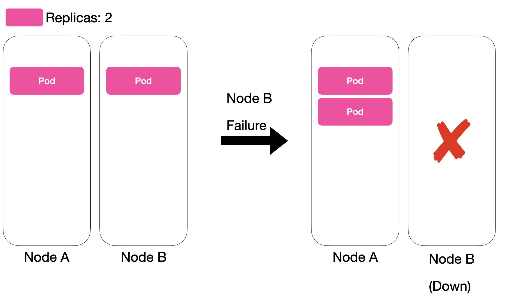
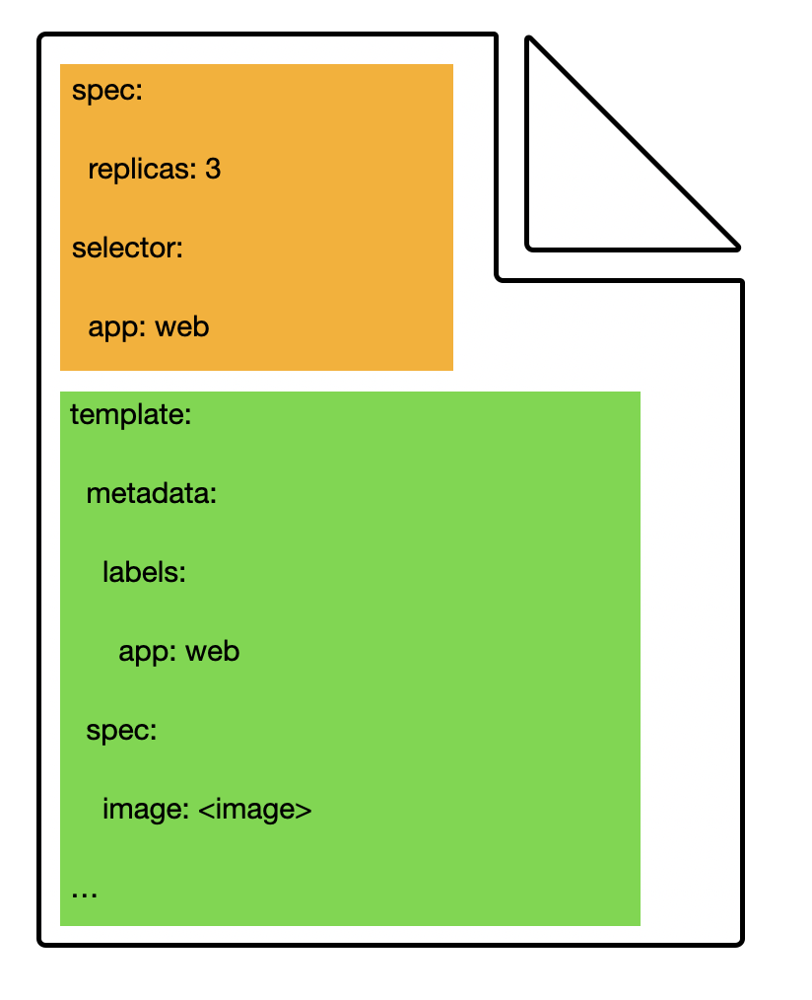
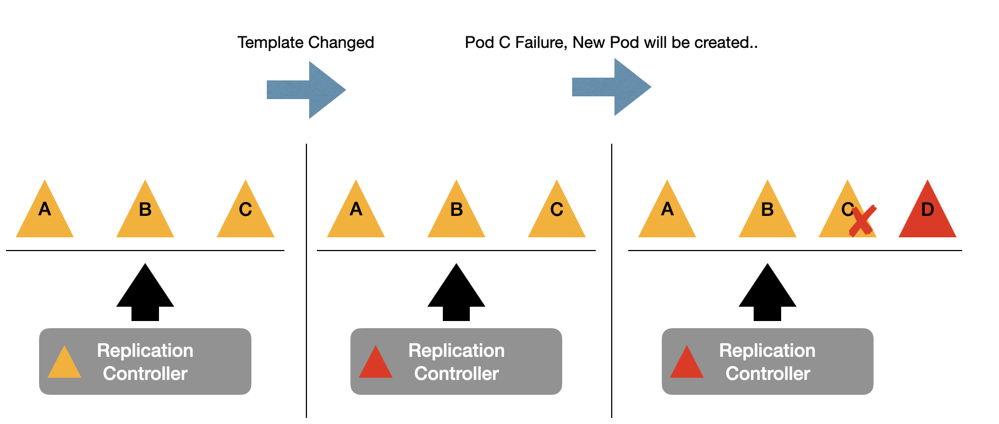

## 👯‍♂️ Replication Controller
### Replication Controller란



**Replication Controller** 는 어떠한 이유로든, Pod가 사라지면, 대체 할 Pod를 생성한다.  
즉, **desired** 된 레플리카의 개수를 맞추기 위해 최선을 다한다.  
 

### Replication Controller의 template

**Replication Controller의 마니페스트** 는 하위 프로퍼티로 Pod의 마니페스트를 담는 `template` 프로퍼티를 가진다.  
`template`에서 매칭되는 `Label`을 가지고 있어야 레플리카 추적이 된다.  


`Pod`의 정보인 `Template`는 언제든지 수정가능하다.  
그러나, 새로운 `Template`의 적용은 이후의 새로운 `Pod`가 생길 때에 적용이 된다.  


### Replication Controller 사용해보기

```yaml
apiVersion: v1
kind: ReplicationController
metadata:
  name: web-rc
spec:
  replicas: 3
  selector:
    app: web
  template:
    metadata:
      name: web
      labels:
        app: web
    spec:
      containers:
      - name: web
        image: nginx:latest
        ports:
        - containerPort: 80
```


생성을 확인해보자.
```bash
kubectl get po,rc
```

삭제 후, 재생성을 확인해보자.
```bash
kubectl delete po web-<random-str>
```

Pod를 Label들과 함께 확인해보자.
```bash
kubectl get po --show-labels
```

RC의 이미지를 변경해주자.  
이미지 부분에서 `httpd:latest`로 변경해주자.   
Pod를 일부 지워보고, `kubectl describe po <새로운 Pod 이름>`으로 어떤 이미지를 사용하는지 확인해보자.  
```bash
kubectl edit rc web-rc
```


이번에는, Scale-out을 해보자. 5개로 조정해보자.  
```bash
kubectl scale rc web-rc --replicas=5

kubectl get po
```

삭제하고 싶다면, `delete`로 삭제하면 되는데, `--cascade=orphan`으로 감시되는 Pod는 남길 수 있다.  
```bash
kubectl delete rc web-rc # Pod까지 삭제

kubectl delete rc web-rc --cascade=orphan # Pod들은 남길
```

> **주의사항**  
> RC가 감시하는 Pod의 label이 변경되어서 `labelSelector`의 범위를 벗어난다면, 더는 Replica로 인정받지 못한다.  


---
## 👫 ReplicaSet
### Replication Controller vs ReplicaSet
Replication Controller가 `LabelSelector`만을 사용하는데 비해, ReplicaSet은 풍부한 표현식으로 Pod를 선택할 수 있는 차이가 있다.  
보통 직접 사용되기보다, Deployemnt를 통해 사용된다.  

`matchLabels`와 `matchExpressions`가 있다.
- `in`: label이 지정된 값들 중 하나와 일치해야 함
- `notin`: label이 지정된 값과 일치해서는 안됨
- `exists`: Pod에 지정된 key가 있는 label이 포함되어야 함(값은 상관없이)
- `doesnotexist`: Pod에 지정된 키가 있는 label이 포함되면 안됨


예를 들어 두 Pod가 있다고 해보자:
- Pod A(label: `loc=asia`)
- Pod B(label: `loc=europe`)

Replication Controller는 서로 다른 label을 가진 Pod를 관리할 수 없지만, ReplicaSet은 서로 다른 label도 표현식으로 매칭할 수 있다.  

생성 단계는 다음과 같다:
1. `kubectl`로 `kube-apiserver`에 RS 생성 요청
2. `ReplicaSet Controller`가 선언된 개수와 현재 개수 비교 -> 부족함을 확인
3. 부족한 만큼 `kube-apiserver`에게 Pod 생성 요청
4. `kube-scheduler`가 Node에 Pod할당
5. Node의 `kubelet`이 명령받음
6. Node에서 Pod 생성
7. `kubelet`은 Pod의 상태를 지속적으로 보고

### ReplicaSet 사용해보기
아래 ReplicaSet의 표현식은 `app`에 `my-app`이 있으면서, `tier`에 `cache`가 없는 pod를 선택한다.
```yaml
apiVersion: apps/v1
kind: ReplicaSet
metadata:
  name: example-replicaset
  labels:
    app: my-app
spec:
  replicas: 3
  selector:
    matchExpressions:
    - key: app
      operator: In
      values:
      - my-app
    - key: tier
      operator: NotIn
      values:
      - cache
  template:
    metadata:
      labels:
        app: my-app
        tier: frontend
    spec:
      containers:
      - name: nginx
        image: nginx:1.21
        ports:
        - containerPort: 80
```

이외 명령어들은 `rc` -> `rs`로 변경된 것을 제외하면 같다고 보면 된다.  

## 🏁 요약
Replication Controller는 라벨 기반으로 Pod를 추적하여 개수를 유지,  
ReplicaSet은 표현식 기반으로 Pod를 추적하여 개수를 유지시킨다.  
실무적으로는 Deployemnt에 ReplicaSet이 포함되어 사용된다.  
