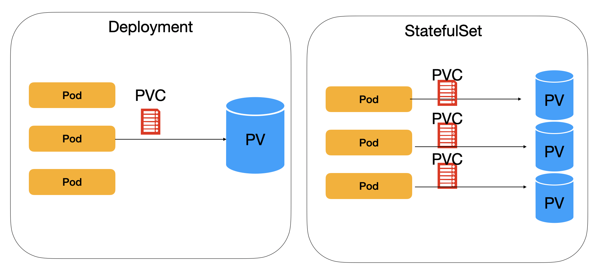
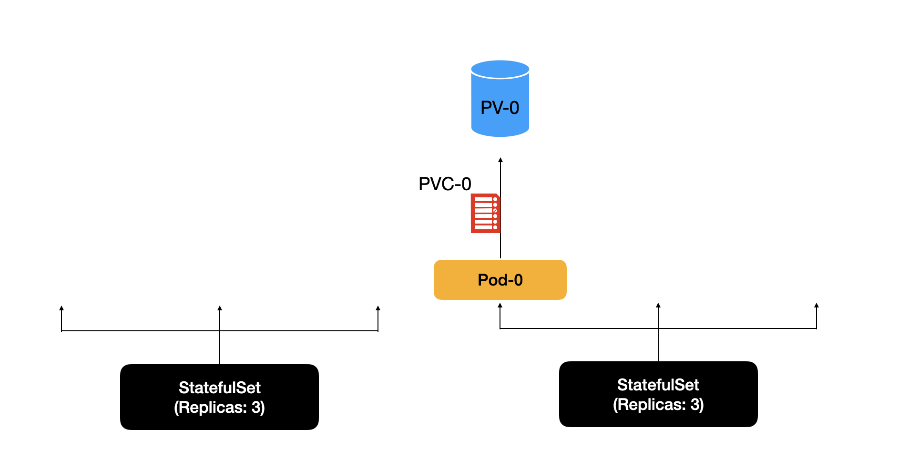
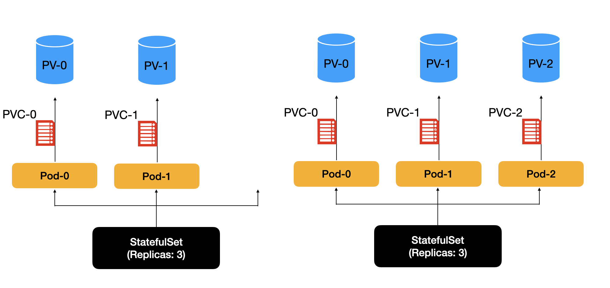
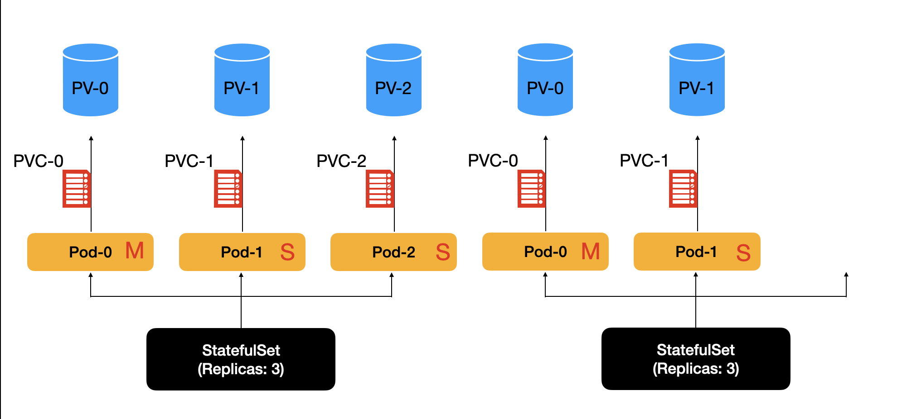
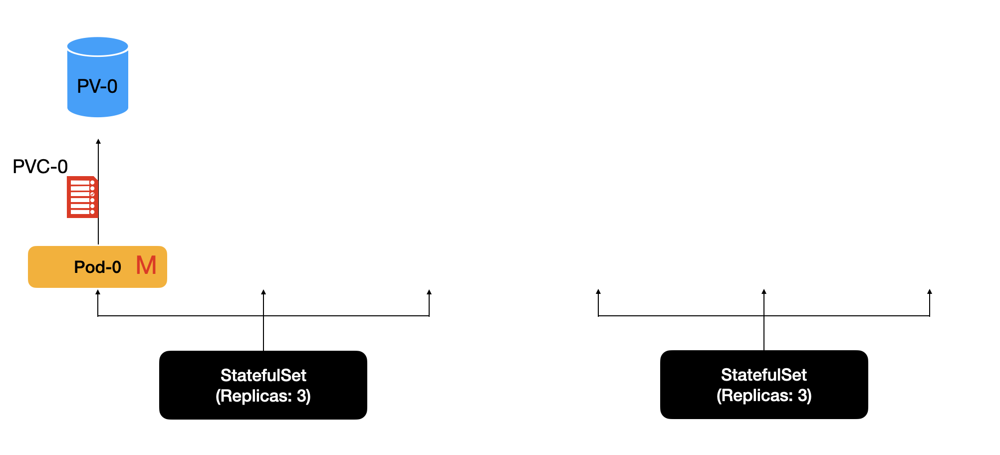
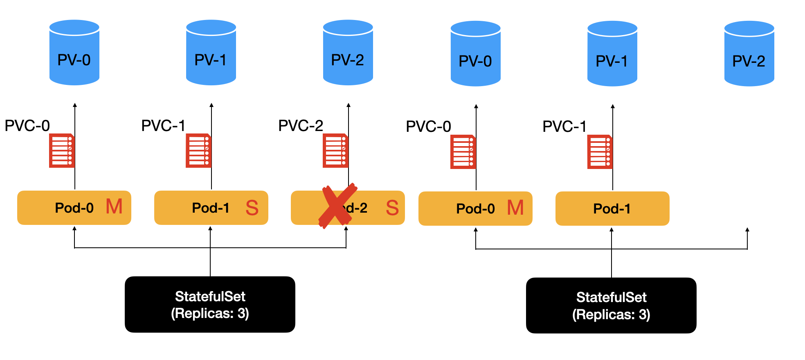
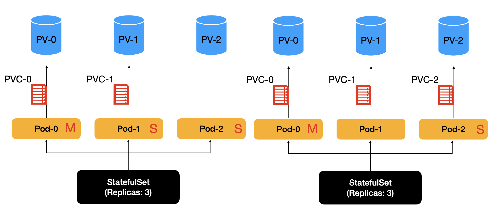

## 🗣️ Statefulset이 사용되는 이유
웹, WAS등의 서비스들은 무상태(Stateless)의 서비스이다.  
하나의 PV를 여럿이서 공유한다.  
그러고 보통 공통으로 읽기만 하면 된다.  
(Deployment는 RWO를 거의 쓰지 않는다. 대신, ROX, RWX등이 지원되는 파일 스토리지를 많이 사용한다.)

그러나, 데이터베이스, 메시지 브로커 등은 각각의 PV를 가질 필요가 있다.
이렇게 되면,  각 Pod가 동일하지는 않다.
즉, Stateful하다.  
보통 분산 데이터베이스를 위해 사용되는 경우가 대부분이다.  

---
## 💜 StatefulSet


StatefulSet의 Pod들은 동일한 컨테이너 스펙을 가진다.  
그러나, 각 Pod는 고유한 ID를 항상 가진다.  상태를 가지고, 각각의 PVC로 각각의 PV에 접근해야 하기 때문이다.  




StatefulSet의 생성은 항상 작은 번호부터 순차적으로 생긴다.  롤링 업데이트도 작은 번호부터 순차적으로 이루어진다.  
이렇게 되면, Pod - PVC - PV의 매칭에 편리하다.  



제거될 때에는 거꾸로 제거된다.  
분산 시스템의 경우, 보통 Write가 이루어지는 Master가 0번과 같이 낮은 번호를 가지는데, 낮은 번호부터 제거되면 새로운 대표자 선출이 계속되어 비효율적이기 때문이다.  
대신, 높은 숫자부터 제거하면, 새로운 대표자 선출이 최소화될 수 있어 더 성능에 좋다.  



만약 Pod가 죽고 재생성되면 어떻게 될까?    
동일한 Pod의 ID로 생성되기에, 이전에 생성된 PVC-PV와 다시 매칭될 수 있다.  


---
## 🏋️ StatefulSet 연습


### StatefulSet 생성
**nginx-sts.yaml**
```yaml
apiVersion: apps/v1
kind: StatefulSet
metadata:
  name: web
spec:
  serviceName: "nginx"
  replicas: 3
  selector:
    matchLabels:
      app: nginx
  template:
    metadata:
      labels:
        app: nginx
    spec:
      containers:
      - name: nginx
        image: nginx:1.21
        ports:
        - containerPort: 80
          name: web
        volumeMounts:
        - name: www
          mountPath: /usr/share/nginx/html
  volumeClaimTemplates:
  - metadata:
      name: www
    spec:
      accessModes: [ "ReadWriteOnce" ]
      storageClassName: gp2
      resources:
        requests:
          storage: 1Gi
```

### Headless Service 생성
**headless-nginx.yaml**
```yaml
apiVersion: v1
kind: Service
metadata:
  name: nginx
spec:
  clusterIP: None
  selector:
    app: nginx
  ports:
  - port: 80
    targetPort: 80
```

### 데이터 지속성 확인

**각자 다른 페이지를 생성해주자.**
```bash
kubectl exec web-0 -- sh -c "echo 'Data from web-0 at $(date)' > /usr/share/nginx/html/index.html"
kubectl exec web-1 -- sh -c "echo 'Data from web-1 at $(date)' > /usr/share/nginx/html/index.html"
kubectl exec web-2 -- sh -c "echo 'Data from web-2 at $(date)' > /usr/share/nginx/html/index.html"

kubectl exec web-0 -- cat /usr/share/nginx/html/index.html
kubectl exec web-1 -- cat /usr/share/nginx/html/index.html
kubectl exec web-2 -- cat /usr/share/nginx/html/index.html
```

0번 파드를 제거해보자.
```bash
kubectl delete po web-0
```

이후, 다시 데이터를 확인해보자:
```bash
kubectl exec web-0 -- cat /usr/share/nginx/html/index.html
```
