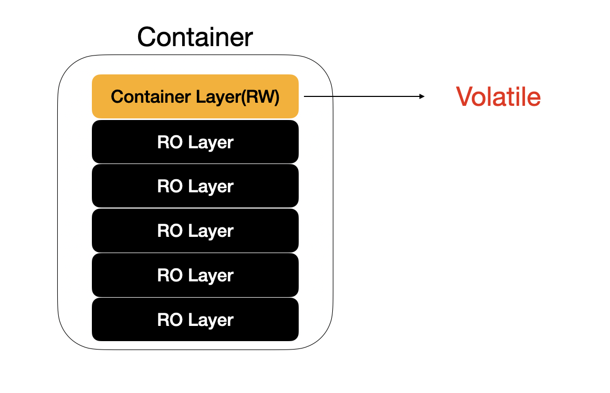
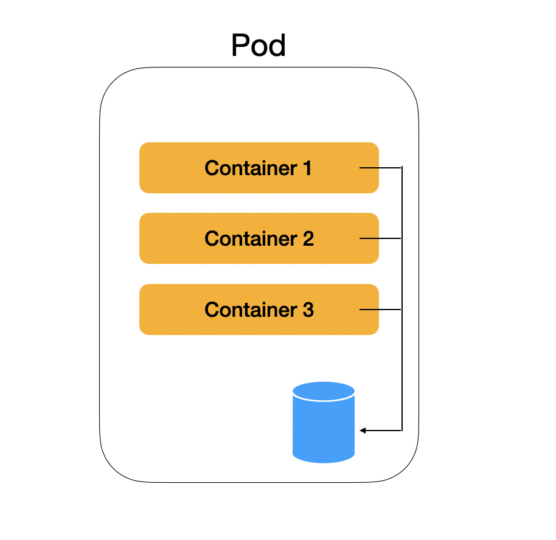
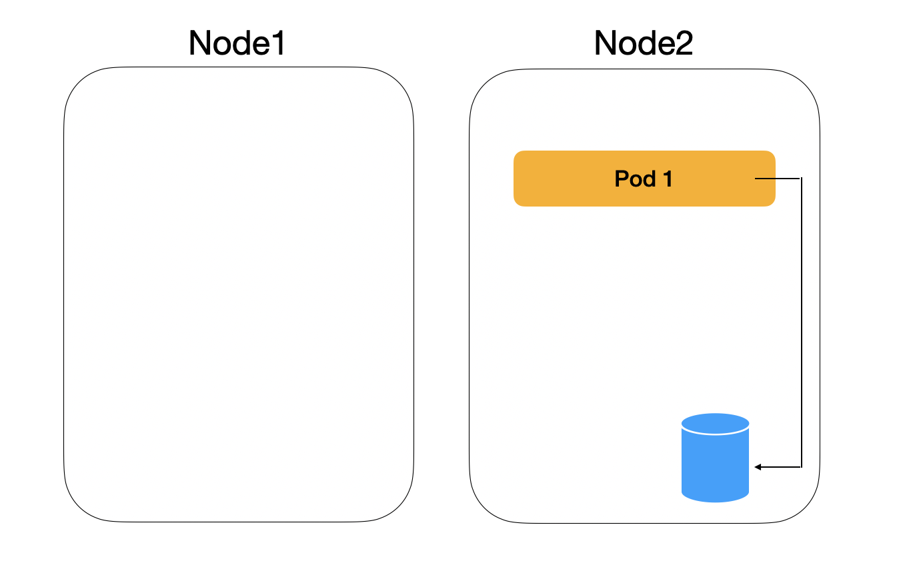
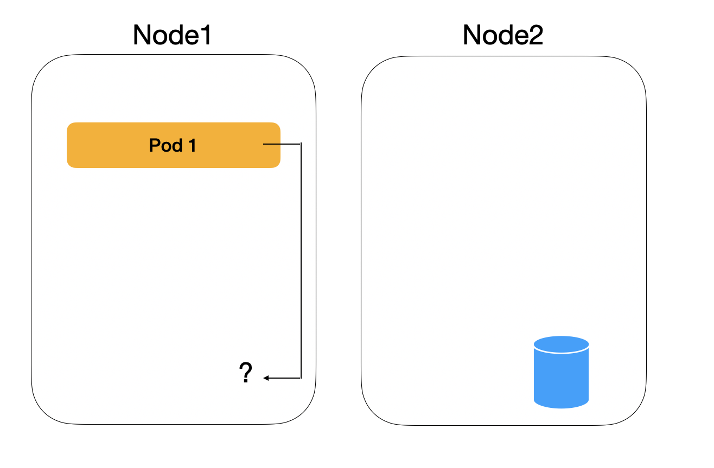
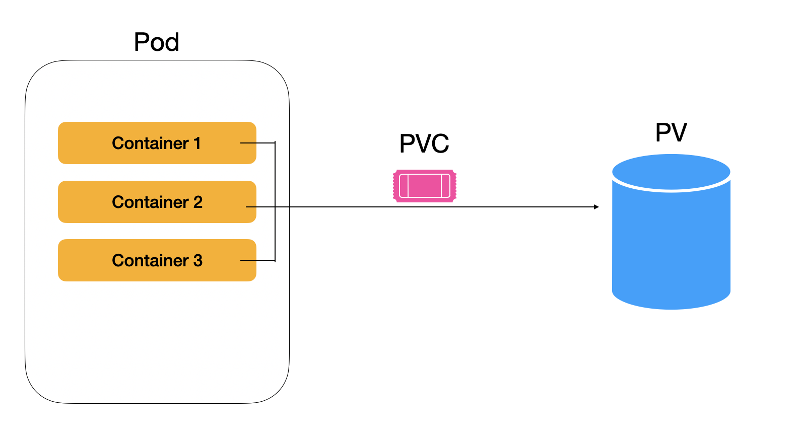
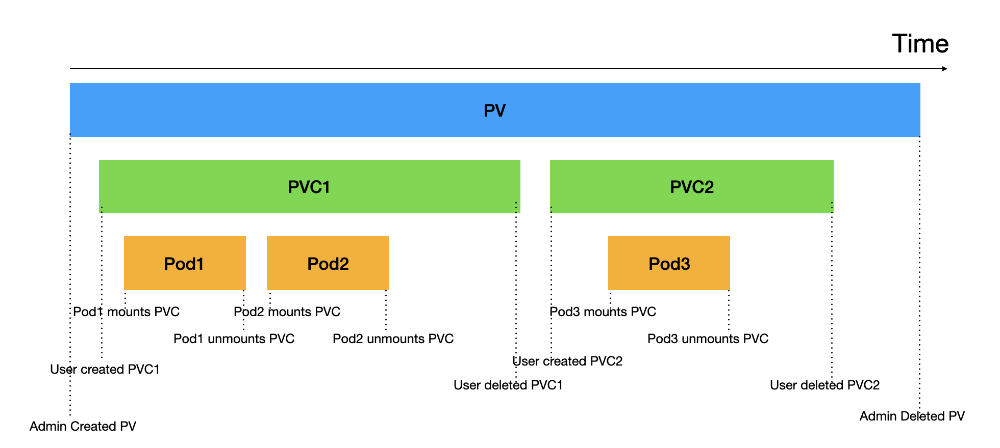
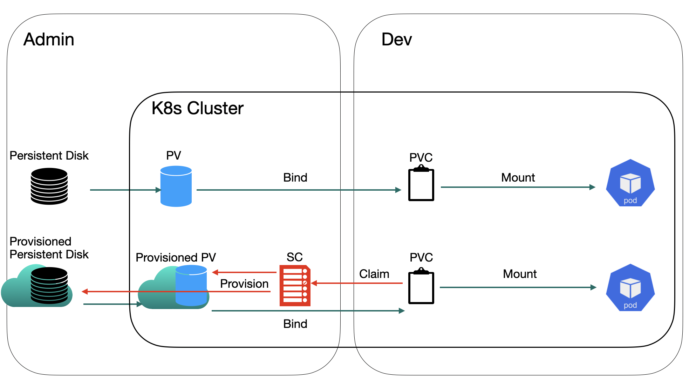

## 📦 Volume 개요

컨테이너의 Container Layer(Read-Write Layer)는 휘발적이다.   
그러나, 컨테이너의 집합인 Pod는 몇 번이고 죽고 다시 살아난다.  
우리는 **Pod와 상이한 생명주기를 가지는 파일시스템이 필요한 순간이 생겼고, 공유된 스토리지를 사용하기를 원한다.**    

이 문제의 해결 방법은 외부 디스크에 마운트 하는 것이고, 이것이 `Volume`이다.  


---
## 🎭 EmptyDir


**EmptyDir** 은 Pod가 종료되면 영구적으로 삭제된다.  
즉, Pod와 동일한 생명주기를 가진다.  

이것만 보면, 왜 존재하는지 의문이 생길 수 있지만, 다음의 이유를 가진다:
- 대규모 파일 기반 Sorting 작업
- Pod내부 컨테이너간 데이터 공유
- 장시간 작업 중간 저장소(체크포인트)

마치 도커 컴포즈에서 볼륨처럼 쓰는데, Pod같은 생명주기를 쓴다고 보면 된다.  

예시
```yaml
apiVersion: v1
kind: Pod
metadata:
  name: test-pd
spec:
  containers:
  - image: registry.k8s.io/test-webserver
    name: test-container
    volumeMounts:
    - mountPath: /cache
      name: cache-volume
  volumes:
  - name: cache-volume
    emptyDir:
      sizeLimit: 500Mi
```


---
## 📀 HostPath



**HostPath** 는 Pod가 종료되어도 상태가 유지된다.  
Node의 파일시스템에 직접 데이터를 저장한다.  
그러나, 보안상의 취약점이 있고, Pod가 다른 노드에 재할당될 시에 사용할 수 없게 되어서 잘 쓰이질 않는다.  
실제로 다른 볼륨의 사용이 권장된다.  


---
## ✋ PersistentVolume & PersistentVolumeClaim


둘은 마치 하드디스크 공급자 하드디스크 소비자의 관계와 같다.   
약어는 각각 `pv`, `pvc`이다.


### PersistentVolumeClaim
**PersistentVolumeClaim** 은 네임스페이스 종속 자원으로, 사용자가 스토리지를 요청하는 객체이다.  
즉, PV에 대한 요청 권리라고 보면 된다.  

### PersistentVolume
**PersistentVolume(PV)** 은 클러스터 관리자가 미리 생성해 둔 스토리지 리소스 객체이다.  
네임스페이스와 무관하게 클러스터 전역에 존재하며, 다양한 벡엔드 스토리지를 지원한다.  
- `csi`: Container Storage Interface
- `fc`: Fiver Channel Storage
- `isci`: iSCI(SCSI over IP) 스토리지
- `local`: node에 마운트된 로컬스토리지
- `nfs`: Network File Storage

클라우드 서비스의 경우, 다음의 서비스를 이용한다:  
| 구분 | AWS | GCP | Azure |
| --------------- | --------------- | --------------- | --------------- |
| 블록 스토리지 | EBS | Persistent Disk | Azure Disk |
| 파일 스토리지 | EFS | Filestore |Azure Files |
| 동적 프로비저닝 | StorageClass 지원 | GKE에서 자동 설정 | AKS에서 자동 설정 |

객체 스토리지는 사용할 수 없는데, 파일시스템 마운트로 사용해야 하기 때문이다. 


온프레미스의 경우, NFS의 사용이 보편적이고, 특정 노드의 디스크에 마운트하는 `LocalPV`는 고성능이지만 관리가 까다롭다.

### 번외 - 스토리지: 블록 스토리지 VS 파일 스토리지 VS 객체 스토리지

스토리지는 세 가지가 있다:
1. **블록 스토리지**
    - 데이터를 고정 크기의 블록으로 분할하여 저장
    - 빠른 속도 
    - 제한적인 확장성(수직확장만 가능)
    - 파일 시스템 설치 필요
2. **파일 스토리지**
    - 계층적 파일 시스템
    - 보통의 속도를 가짐
    - 제한적인 확장(파일시스템의 제약)
3. **객체 스토리지**
    - 객체 단위 저장(데이터, 메타데이터, ID)
    - API를 통한 접근
    - 수평적 확장 가능
    - 병렬 접근 가능 (동시에 동일 버킷의 서로 다른 객체 접근 가능)


### Access Mode
PersistentVolume에서 **Access Modes** 는 해당 Volume을 Pod들이 어떻게 접근할 수 있는지를 정의한다.   
4가지의 방법이 있다:  
1. **ReadWriteOnce(RWO)**
    - Volume이 단일 Node에만 마운트되어 읽기-쓰기가 가능하다. 
    - 해당 Node의 여러 Pod들이 동시에 접근가능하다.
2. **ReadOnlyMany(ROX)**
    - 다수의 노드들에게 읽기-전용으로 마운트된다.
3. **ReadWriteMany(RWX)**
    - 다수의 노드들에게 읽기-쓰기모드로 마운트된다. 
4. **ReadWriteOncePod(RWOP)**
    - 단일 Pod만 접근가능하다.  
    - 기존에는 없는 방법이지만, 보안상의 이유로 v1.29부터 생겼다.

### PersistentVolumeReclaimPolicy
PV의 PVC가 제거되고 나서의 옵션들이다:
- **Retain**: PVC를 삭제해도 PV를 유지한다.  
데이터를 유지하지만, 수동으로 정리해야 한다.
- **Delete**: 관련된 모든 볼륨을 삭제한다.  
- **Recycle**: 볼륨 자체를 삭제하지 않고, `rm -rf mountPath/*` 처럼 데이터만 삭제한다. 

전체적인 생명주기가 다음과 같다고 보면 된다: 



### 예시: AWS ELB 이용

**pv.yaml**
```yaml
# pv.yaml
apiVersion: v1
kind: PersistentVolume
metadata:
   name: mongodb-pv
spec:
  capacity:
    storage: 1Gi # 실제로는 최소 40기가 할당. 특정 용량 넘어가면 분할되어 성능 좋음
  csi:
    driver: ebs.csi.aws.com
    fsType: ext4
    volumeHandle: vol{-********} # your volume id
  accessModes: # 지원하는 모드에 대한 Pool
  - ReadWriteOnce
  persistentVolumeReclaimPolicy: Retain # PVC가 삭제되더라도 유지
  nodeAffinity:
    required:
      nodeSelectorTerms:
        - matchExpressions:
            - key: topology.ebs.csi.aws.com/zone
              operator: In
              values:
                - ap-northeast-2a # 노드가 없는 존으로 하면? 안됨
```

**pvc.yaml**
```yaml
# pvc.yaml
apiVersion: v1
kind: PersistentVolumeClaim
metadata:
  name: mongodb-pvc
spec:
  resources:
    requests:
      storage: 1Gi
  accessModes: # 실제 이용을 요청하는 액세스 모드
  - ReadWriteOnce
  storageClassName: "" #빈 칸이면 sc사용하지 않음 -> PV에서 고르겠다
```


**mongo-pod.yaml**
```yaml
# mongo-pod.yaml
apiVersion: v1
kind: Pod
metadata:
  name: mongodb
spec:
  containers:
  - image: mongo
    name: mongodb
    volumeMounts:
    - name: mongodb-data
      mountPath: /data/db
    ports:
    - containerPort: 27017
      protocol: TCP
  volumes:
  - name: mongodb-data
    persistentVolumeClaim:
      claimName: mongodb-pvc
```

### 예시: NFS 기반 PV에 접속

```yaml
apiVersion: v1
kind: PersistentVolume
metadata: 
  name: nfs-pv
spec: 
  capacity: 
    storage: 10Gi
  accessModes:
    - ReadWriteMany
  nfs:
    path: <nfs_path>
    server: <nas_server_ip>
```

---
## 📝 SC(Storage Classes)

### SC
기존의 PV를 직접 구성하고, PVC를 만드는 방식은 많은 불편함을 만든다.  
AWS EBS의 예시만 봐도, EBS의 리전을 정하고, 노드를 강제하는 듯한 느낌이 들면서 유연하지 못한 모습을 보임을 알 수 있다.  
**StorageClass** 는 PV의 요청 탬플릿을 제공하는 객체로 이해하면 된다.  

즉, 정의된 SC 탬플릿에 따라서 PV가 만들어진다.  

클라우드 환경에서 주로 쓰이며, 온프레미스에서는 CSI 드라이버 설치 등 복잡한 과정이 동반되어 PV만 쓰는 경우도 많다.   
SC는 설정되어있다는 전체하여 PV를 대체하고 동적 프로비저닝이 제공되어 편리한 이용이 가능하다.  

아래는 쿠버네티스에서의 PV 정적 프로비저닝과 동적 프로비저닝의 비교이다:


### 예시: AWS EKS + EBS기준
**sc.yaml**
```yaml
# sc.yaml
apiVersion: storage.k8s.io/v1
kind: StorageClass
metadata:
  name: fast
provisioner: ebs.csi.aws.com
volumeBindingMode: WaitForFirstConsumer # Pod할당까지 PV생성을 지연
# volumeBindingMode: Immediate
reclaimPolicy: Delete
parameters:
  csi.storage.k8s.io/fstype: ext4
  type: gp2
allowedTopologies: # Zone Pool 정의
  - matchLabelExpressions:
    - key: topology.ebs.csi.aws.com/zone
      values:
      - ap-northeast-2a
      - ap-northeast-2b
      - ap-northeast-2c
```

**pvc.yaml**
```yaml
# pvc.yaml
apiVersion: v1
kind: PersistentVolumeClaim
metadata:
   name: mongodb-pvc
spec:
  storageClassName: fast # Sc를 찾음
  resources:
    requests:
      storage: 2Gi
  accessModes:
    - ReadWriteOnce
```

**pod.yaml**
```yaml
# pod.yaml
apiVersion: v1
kind: Pod
metadata:
  name: mongodb
spec:
  containers:
  - image: mongo
    name: mongodb
    volumeMounts:
    - name: mongodb-data
      mountPath: /data/db
    ports:
    - containerPort: 27017
      protocol: TCP
  volumes:
  - name: mongodb-data
    persistentVolumeClaim:
      claimName: mongodb-pvc
```

---
## 🔒 ConfigMap & Secret
ConfitMap과 Secret은 **Key-Value** 쌍으로 데이터를 저장하는 특수 볼륨이다.   
Namespace에 종속되어 있다.  
`kubectl edit` 등으로 동적인 변경이 가능하지만, 실제 반영은 이야기가 다르다.  
환경 변수, Arg등으로 주입한 경우는 Pod재시작 이후에 적용되고, 볼륨 마운트는 즉각 적용된다.

### 번외: Arg를 통해 컨테이너에 Arg 주입
```yaml
spec:
  containers:
  - image: image
    args: ["5"]
    name: mypod
```

### 번외: env로 환경변수 주입

```yaml
spec:
  containers:
  - image: image
    env:
    - name: mykey
      value: myvalue
    name: mypod
```

### ConfigMap
**ConfigMap** 은 설정 파일, 환경 변수, Arg등의 덜 민감한 데이터를 저장하고 관리하기 위한 리소스이다.  

**예시: ConfigMap 정의**
```yaml
apiVersion: v1
kind: ConfigMap
metadata: 
  name: myconfig
data: 
  my-cm-key: "my-cm-value"
```

**예시: ConfigMap으로부터 Key-Value쌍 가져오기**
```yaml
spec:
  containers:
  - image: image
    env:
    - name: MYENV
      valueFrom:
        configMapKeyRef:
          name: myconfig
          key: my-cm-key
```

**예시: ConfigMap으로부터 모든 Key-Value쌍 가져오기**
```yaml
spec:
  containers:
  - image: image
    envFrom:
    - configMapRef:
        name: myconfig
```

**예시: ConfigMap기반 volumeMount**
파일이나 디렉토리로도 ConfigMap을 주입할 수 있다.  
파일명이 `key`, 파일내용이 `value`이다.
```nginx
# kubetemp/config-dir/custom-nginx-config.conf
server {
    listen 8080;
    server_name www.example.com;
}
```


```bash
# from-literal이면 문자로 받음
kubectl create configmap nginx-config --from-file config-dir
```

**파일 단위로 마운트**
```yaml
# kubetemp/configmap-volume-file-pod.yaml
apiVersion: v1
kind: Pod
metadata:
  name: nginx-configvol
spec:
  containers:
  - image: nginx
    name: web-server
    volumeMounts:
    - name: config
      mountPath: /etc/nginx/conf.d/default.conf
      subPath: custom-nginx-config.conf # key값과 일치해야함!
      readOnly: true
    ports:
    - containerPort: 8080
      protocol: TCP
  volumes:
  - name: config
    configMap:
      name: nginx-config
      defaultMode: 0660
```

**디렉토리 단위로 마운트**
```yaml
# kubetemp/configmap-volume-dir-pod.yaml
apiVersion: v1
kind: Pod
metadata:
  name: nginx-configvol
spec:
  containers:
  - image: nginx:1.7.9
    name: web-server
    volumeMounts:
    - name: config
      mountPath: /etc/nginx/conf.d
      readOnly: true
    ports:
    - containerPort: 8080
      protocol: TCP
  volumes:
  - name: config
    configMap:
      name: nginx-config
```

### Secret
**Secret** 은 비밀번호, 토큰 번호, SSH 키 등의 **민감한 정보** 를 저장하기 위한 리소스이다.  
- 기본적으로 base64로 인코딩되고, 암호화는 아니니 유의하자.  
- 필요 시, `etcd`암호화를 통해 별도 설정 가능하다.  
- RBAC를 통해 접근제한이 가능하다.  
- `get`명령을 사용할 수 없다.


정의할 때 인코딩된 채로 넣어야 한다.

```yaml
apiVersion: v1
kind: Secret
metadata:
  name: my-secret
type: Opaque
data:
  username: YWRtaW4=      # admin (base64 인코딩)
  password: MTIzNDUK      # 1234 (base64 인코딩)
```

사용하는 방법은 거의 유사하다.  
**`key-value`주입 예시:**
```yaml
apiVersion: v1
kind: Pod
metadata:
  name: secret-env-pod
spec:
  containers:
    - name: mycontainer
      image: nginx
      env:
        - name: USERNAME
          valueFrom:
            secretKeyRef:
              name: my-secret2
              key: username
        - name: PASSWORD
          valueFrom:
            secretKeyRef:
              name: my-secret2
              key: password
```

**볼륨 주입 예시**
```yaml
apiVersion: v1
kind: Pod
metadata:
  name: secret-volume-pod
spec:
  containers:
    - name: mycontainer
      image: nginx
      volumeMounts:
        - name: secret-volume
          mountPath: "/etc/secret"
          readOnly: true
  volumes:
    - name: secret-volume
      secret:
        secretName: my-secret2
```


---
## 📚 요약
- 쿠버네티스에서는 `PersistentVolume`을 이용하여 데이터를 영속적으로 보관하고, 실제 저장소는 클러스터 외부에 있다.  
- `PersistentVolumeClaim`으로 `PV`에 접근할 수 있다.  
- `StorageClass`를 이용하면 `PV`를 만들지 않고 `PVC`의 요구에 따라 유연하게 `PV`가 생성된다.  
- `ConfigMap`은 환경변수 등의 주입에 주로 사용되고, 환경변수로도, 파일로도 이용 가능하다.  
- `Secret`은 `ConfigMap`과 사용이 거의 유사하지만, 민감한 정보에 사용된다.
