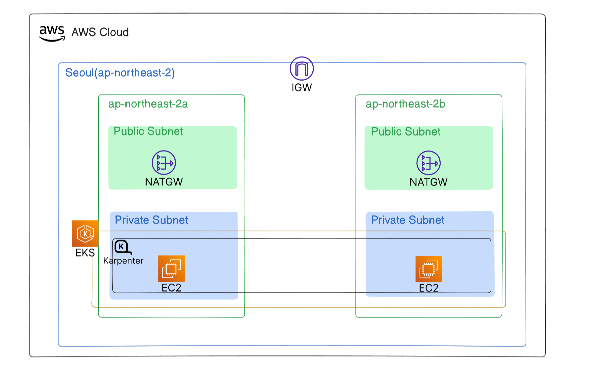
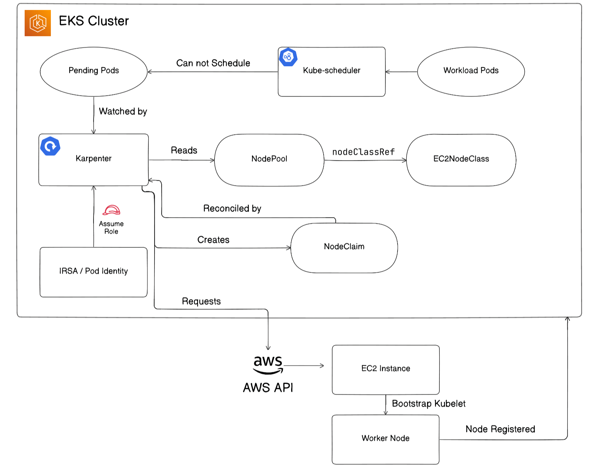
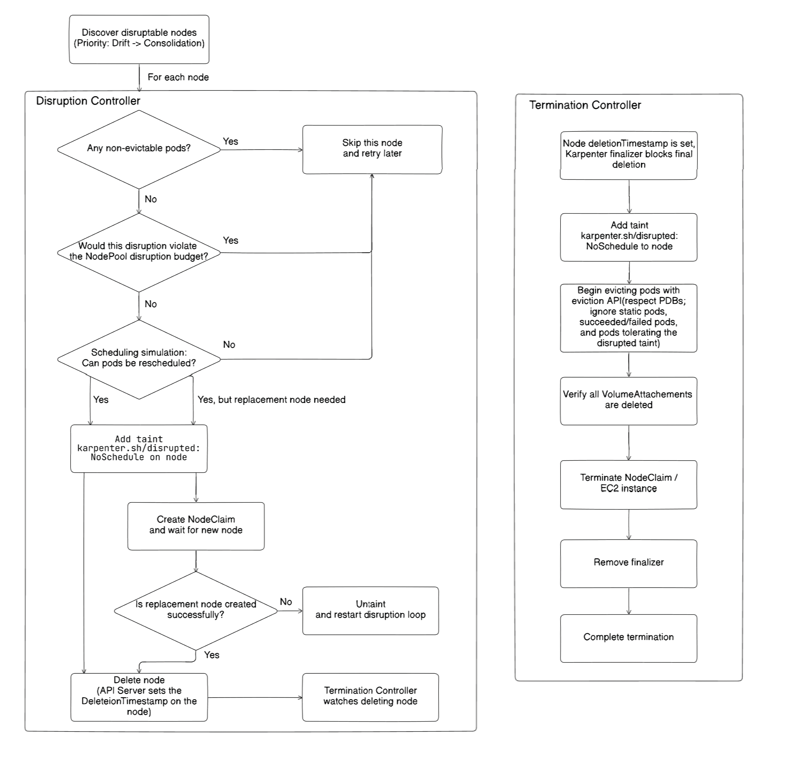
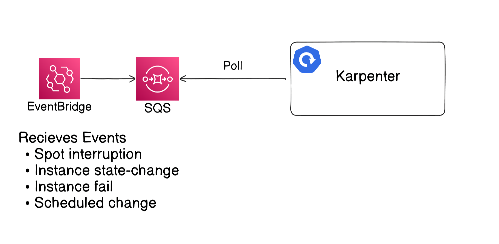
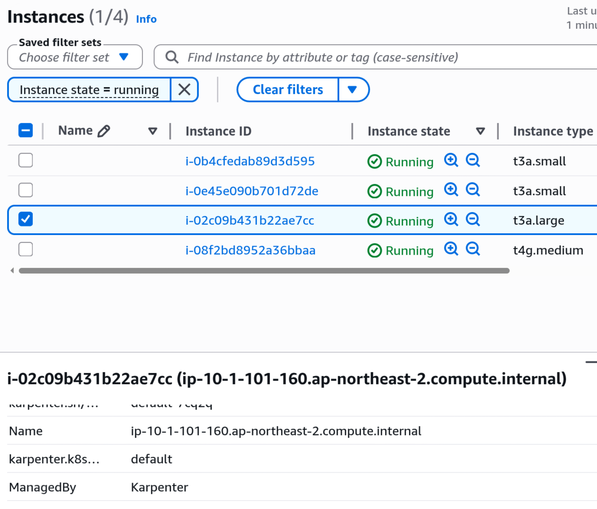

## ❓ Karpenter 란?



Karpenter는 cloud-based의 쿠버네티스 환경에서 노드를 자동 확장해주는 오픈 소스 도구이다. \
주로 Amazon EKS에서 쓰이며, 가장 권장되는 방식이다. \
AWS상에서 EKS를 쓰지 않는 쿠버네티스에서도 동작하지만, 권장되지는 않는다. \
Karpenter는 AKS나 Alibaba Cloud등, 다양한 다른 클라우드에서도 사용될 수 있다.

Karpenter는 다양한 이점이 있다:
- **Automatic node scaling**: 스케줄되지 못한 pod가 있으면, Karpenter는 새로운 노드를 프로비저닝하여 pod가 스케줄링될 수 있도록 한다. \
또한 더 이상 쓰이지 않는 노드 등을 정리하기도 한다.
- **Cost efficiency**: Karpenter는 pod의 자원 요구량과 노드의 자원들을 종합하여 가장 비용 효율적인 노드 사용으로 맞춘다. (bin-packing)
- **Speed**: Karpenter는 전통적인 EKS에서의 오토스케일 방식은 Cluster Autoscaler보다 빠르다.

EKS에서 Auto Mode를 사용하면, AWS가 Karpenter를 자동으로 관리해준다. \
그러나, EKS AUto Mode자체로 추가 비용이 든다는 것을 알아야 한다.

---
## 🚀 동작 방식

### Provisioning



Karpenter는 Kubernetes가 부적절한 클러스터 스펙으로 pod를 스케줄하지 못할 때, 새 노드를 프로비저닝 한다.

프로비저닝의 단계는 다음과 같다:
1. Karpenter는 지속적으로 스케줄링 되지 못하거나 대기 중인 pod들을 조회한다.
2. Karpenter는 어떻게 노드를 생성할지에 대한 `EC2NodeClass`와 같은 `NodeClass`를 참조하는 `NodePool`을 적절히 선택한다.
3. Karpenter는 `NodeClaim`을 만들어 새로운 EC2 인스턴스를 생성하도록 AWS에 요청한다.
4. 새로운 EC2 인스턴스는 워커 노드로써의 초기화 작업을 진행한다.
5. 워커 노드가 새로 합류하며, pod는 스케줄될 수 있다.

### Disruption

또한, 노드 제거에 관한 작업도 진행한다. 자동으로 제거할 노드를 찾아서, 필요시에는 대체 노드를 생성하기도 한다. \
여러 이유로 제거가 일어날 수 있다:

- **Drift**
  - `NodePool`또는 `NodeClass`의 설정 변경
- **Consolidation**
  - 노드가 비어있음
  - 노드가 거의 사용되지 않음
  - 더 저렴한 노드에서 실행될 수 있음
- **Expiration**
  - `NodePool`에서 정해진 `expireAfter`와 같은 유효기간이 지난 경우
- **Interruption**
  - AWS가 인터럽트 이벤트를 보낸 경우

이중에서 drift로 인한 노드 제거는 클러스터의 일관된 상태를 유지하기 위해 가장 우선시된다. \
제거 플로우는 다음의 다이어그램처럼 된다:



#### Disruption Controller

1. Pod들이 종료될 수 있는지 확인
2. Disruption budget을 확인(`NodePool`의 `spec`에 있는데, 너무 자주 제거되지 않기 위한 제한이다.)
3. 스케줄링 시뮬레이션으로 pod들이 재배치될 수 있는지 예측
4. `karpenter.sh/disrupted:NoSchedule` taing 를 추가하여 새로운 스케줄링이 되는것을 차단
5. 대체 노드 필요시, `NodeClaim`을 만들어서 추가
6. 노드 제거. Termination Controller가 이후 흐름을 제어

#### Termination Controller

1. `DeletionTimestamp`가 노드에 설정되고, Finalizer도 설정되어 노드 제거가 블록됨
2. `karpenter.sh/disrupted:NoSchedule` taint 추가
3. Pod들이 Kubernetes Eviction API를 통해 PDB를 준수하면서 제거됨
4. 모든 `VolumeAttachemtns`가 제거되었는지 확인
5. 노드의 `NodeClaim`과 EC2 인스턴스 제거
6. Finalizer제거
7. 노드 제거 완료

> **왜 Disruption이 두 단계로 나뉘는가**
> Karpenter-managed노드가 여러 방법으로 제거될 수 있는데(ex. `kubectl delete node <node-name>`), \
> 그러한 방식들의 제거들 모두 제거 과정에서 Graceful Shutdown이 필요하여 Termination 단계는 다른 곳에서도 재사용되어야 한다. \
> 그리고 이것이 `karpenter.sh/disrupted:NoSchedule` taint를 붙이는 과정이 둘 다 있는 이유이다.

### Interruption



Interruption은 AWS 이벤트에 의한 노드 종료이다.
이벤트가 나면, Karpenter는 영향을 받는 노드의 제거작업을 실시한다.

다음의 이벤트들이 잡힐 수 있다:
- Spot 인스턴스 회수
- 유지보수 이벤트 등의 주기적인 이벤트
- 인스턴스 종료 / 중지 / 헬스 체크 실패

다음의 과정을 따른다:
1. EventBridge rule이 AWS 이벤트를 수신한다.
2. 이벤트 메시지가 SQS queue로 보내진다.
3. Karpenter는 주기적으로 SQS queue에 폴링한다.
4. 이벤트가 감지되면, 해당 노드를 제거하는 프로세스를 진행한다.

Spot 인스턴스의 경우, 2분 내로 노드가 회수된다. Karpenter는 동시에 대안이 되는 노드를 프로비저닝 진행한다. \
AWS는 Spot 재조정 추천 이벤트를 제안하지만, 그에 대한 기존 노드 정리 등의 작업이 자동으로 일어나지 않는다. \
이 기능을 켜기 위해선, 아래 flag로 Karpenter가 구동되어야 한다:
```bash
--interruption-queue=<queue-name>
```

---
## 🍪 Karpenter를 위해 필요한 것들

Karpenter를 설치하기 전에, AWS 리소스에 대한 권한 설정이 필요하다:
- **IAM role for Karpenter**
  - Karpenter가 AWS API에 클라우드 자원에 대해 요청할 수 있어야 한다.
- **IAM role for Karpenter-provisioned nodes**
  - Karpenter 워커 노드들이 받는 IAM Role
- **Subnets for Karpenter-provisioned nodes**
  - 각 서브넷은 `karpenter.sh/discovery` 태그가 필요하다.
- **Security groups for Karpenter-provisioned nodes**
  - 각 보안그룹은 `karpenter.sh/discovery` 태그가 필요하다.
- **EKS access entry for Karpenter-provisioned nodes**
  - Access entry 타입이 `EC2_LINUX` or `EC2_WINDOWS`여야 한다.
- **Optional: SQS queue**
  - Interruption handling이 필요하다면, 생성되어야 한다.
- **Optional: EventBridge rule and target**
  - 이벤트들을 수신받기 위해 필요하다.

아래의 IaC참고자료들을 보면, IAM Policy를 어떻게 설정하는지 알기 좋을 것이다.
- [(Official) CloudFormation](https://karpenter.sh/docs/reference/cloudformation)
- [Author's Terraform code](https://github.com/Hallym-Workerbees/hivewiki-infra/blob/main/modules/karpenter-prerequisite/main.tf)

---
## 📊 Helm으로 설치

Karpenter는 공식 Helm chart를 통해 쉽게 설치될 수 있다.

```bash
helm upgrade --install karpenter oci://public.ecr.aws/karpenter/karpenter \
  --version <KARPENTER_VERSION> \
  --namespace <KARPENTER_NAMESPACE> \
  --create-namespace \
  --set "settings.clusterName=<CLUSTER_NAME>" \
  --set "settings.interruptionQueue=<INTERRUPTION_QUEUE_NAME>" \
  --set "settings.enableZonalShift=<ENABLE_ZONAL_SHIFT>" \
  --wait
```

주요 파라미터를 아래와 같다:
- `settings.clusterName`: EKS cluster의 이름
- `settings.interruptionQueue`: 인터럽션 핸들링을 위한 SQS queue.
- `settings.enableZonalShift`: Zonal shift를 활성화

---
## ⚙️ 구성 예시

### NodePool

아래는 간단한 `NodePool`예시이다. \
Karpenter를 사용하면 `NodePool`과 그에 대응되는 `EC2NodeClass`와 같은 `NodeClass`들을 구독해야 한다.

```yaml
apiVersion: karpenter.sh/v1
kind: NodePool
metadata:
  name: default
spec:
  # Priority of this NodePool.
  # A higher weight gives the NodePool higher scheduling priority.
  weight: 10

  template:
    spec:
      # Node requirements
      requirements:
        - key: kubernetes.io/arch
          operator: In
          values: ["amd64"]

        - key: kubernetes.io/os
          operator: In
          values: ["linux"]

        - key: karpenter.sh/capacity-type
          operator: In
          values: ["spot", "on-demand", "reserved"]

        - key: karpenter.k8s.aws/instance-category
          operator: In
          values: ["c", "m", "r"]

        - key: karpenter.k8s.aws/instance-generation
          operator: Gt
          values: ["2"]

      # Reference to the EC2NodeClass
      nodeClassRef:
        group: karpenter.k8s.aws
        kind: EC2NodeClass
        name: default

      # Node expiration time
      expireAfter: "720h"

  limits:
    # Maximum CPU capacity that this NodePool can provision
    cpu: 64

  disruption:
    # If set to WhenEmptyOrUnderutilized, Karpenter may remove or replace
    # empty or underutilized nodes to reduce cost.
    #
    # If set to WhenEmpty, Karpenter only consolidates nodes that do not
    # have any workload pods.
    consolidationPolicy: WhenEmptyOrUnderutilized

    # The amount of time Karpenter waits before consolidating a node
    # after a pod has been added or removed.
    consolidateAfter: 1m
```


### NodeClass

아래는 `EC2NodeClass` 예시이다.

`EC2NodeClass`는 IAM role, AMi selection, Subnet, Security Group, ec2 tag등의 설정들이 담겨있다.

```yaml
apiVersion: karpenter.k8s.aws/v1
kind: EC2NodeClass
metadata:
  name: default
spec:
  # You must specify either `role` or `instanceProfile`.
  role: <NODE_ROLE_NAME>

  # AMI selection
  amiSelectorTerms:
    - alias: al2023@latest

  # Subnet discovery
  subnetSelectorTerms:
    - tags:
        karpenter.sh/discovery: <CLUSTER_NAME>

  # Security group discovery
  securityGroupSelectorTerms:
    - tags:
        karpenter.sh/discovery: <CLUSTER_NAME>

  # Tags added to EC2 instances created by Karpenter
  tags:
    ManagedBy: "Karpenter"
```

---
## 🧑‍🔬 노드 확장 테스트

Karpenter를 테스트하기 위해, 워크로드들을 스케줄시켜보자. \
아래명령어는 cpu "500m"을 요구하는 `nginx` deployment의 Pod수를 10개 띄우는 명령이다.

```bash
cat <<EOF | kubectl apply -f -
apiVersion: apps/v1
kind: Deployment
metadata:
  name: nginx
  labels:
    app: nginx
spec:
  replicas: 10
  selector:
    matchLabels:
      app: nginx
  template:
    metadata:
      labels:
        app: nginx
    spec:
      containers:
        - name: nginx
          image: nginx:latest
          resources:
            requests:
              cpu: "500m"
EOF
```

다음의 명령으로 확장되는 상태를 간단히 볼 수 있다
```bash
kubectl get pods -w
kubectl get nodes -w
```

새로운 EC2 인스턴스에서 tag가 `EC2NodeClass`에 쓰인 것과 같은 tag를 가진 것을 볼 수 있다.
```bash
ManagedBy: Karpenter
```



---
## 📚 References

- [Karpenter - documentations](https://karpenter.sh/docs/)
