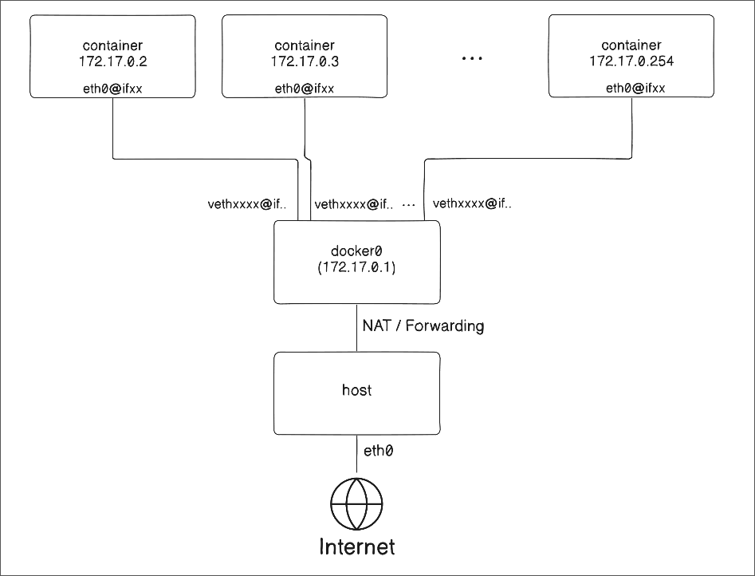

---
## 🛠️ `ip` Command

`ip` is a networking tool in the `iproute2` suite.  

### `ip link`

The `ip link` command lets you inspect and operate on the host's network interfaces.  

```bash
ip l
ip link
ip l show
ip link show
```

```bash
❯ ip link 
1: lo: <LOOPBACK,UP,LOWER_UP> mtu 65536 qdisc noqueue state UNKNOWN mode DEFAULT group default qlen 1000 
link/loopback 00:00:00:00:00:00 brd 00:00:00:00:00:00
2: enp2s0: <NO-CARRIER,BROADCAST,MULTICAST,UP> mtu 1500 qdisc fq_codel state DOWN mode DEFAULT group default qlen 1000 
link/ether c4:ef:bb:95:51:09 brd ff:ff:ff:ff:ff:ff
altname enxc4efbb955109 
3: wlp3s0: <BROADCAST,MULTICAST,UP,LOWER_UP> mtu 1500 qdisc noqueue state UP mode DORMANT group default qlen 1000 
link/ether 70:08:94:a7:25:05 brd ff:ff:ff:ff:ff:ff
altname wlx700894a72505 
4: tailscale0: <POINTOPOINT,MULTICAST,NOARP,UP,LOWER_UP> mtu 1280 qdisc fq_codel state UNKNOWN mode DEFAULT group default qlen 500 
link/none 
5: docker0: <NO-CARRIER,BROADCAST,MULTICAST,UP> mtu 1500 qdisc noqueue state DOWN mode DEFAULT group default 
link/ether 66:57:9f:99:ed:08 brd ff:ff:ff:ff:ff:ff
```

- Flag: the values inside `< >` after the interface name summarize the main characteristics of the interface.  
	- `LOOPBACK`: means this is a loopback interface.  
	- `BROADCAST`: means the interface supports broadcast.  
	- `MULTICAST`: means the interface supports multicast.  
	- `UP`: means the link's administrative state is enabled.  
	  From the kernel's point of view, the interface has been enabled by the user or the system.  
	  This is independent of the actual physical or operational link state.  
	  If it is `DOWN`, the administrative state is disabled.  
	- `LOWER_UP`: means the operational state is up.  
	  The lower network layer, such as the physical or data-link layer, is actually up.  
	  For a physical interface, this usually means Ethernet or Wi-Fi is connected normally.  
- `mtu`: Maximum Transmission Unit, the maximum frame size at the data-link layer.  
- `qdisc`: queueing discipline, or the queueing rule.  
  Use `tc qdisc show` to see more details.  
	- `noqueue`: does not use a transmit queue.  
	- `pfifo_fast`: uses FIFO queues with priority bands.  
	- `fq_codel`: Fair Queueing + Controlled Delay. It separates multiple flows while keeping delay from growing too large.  
- `state DOWN/UP`: the administrative state value.  
- `mode`  
	- `DEFAULT`: decides the operational state based on the kernel or driver state.  
	- `DORMANT`: allows a userspace program to participate in the operational state.  
		- ex. 802.1X supplicant  
- `group default`: belongs to the default network interface group.  
- `qlen <number>`: the `tx_queue_len` attribute value of `net_device`.  
	- The qlen field can still be populated even when the qdisc is `noqueue`.  
	- Each `qdisc` has its own queue management method, so qlen is related to queue length, but it does not always act as a strict maximum length.  
- `link/<type>`: the link type. It is followed by a MAC address, and may also be followed by `brd <Broadcast address>`.  
- `altname <name>`: an alternative name for the interface.  


You can add interfaces with `ip link add` as follows:  
```bash
# Add a dummy interface
ip link add mylink type dummy

# Add a veth, or virtual Ethernet, pair
ip link add veth0 type veth peer name veth1

# Bring the link up
ip link set dev <link> up
```
- Physical interfaces are usually created automatically by drivers.  
- A veth is always created as a pair.  
	- Think of plugging in an Ethernet cable. We always use both ends, and traffic entering one side comes out the other side.  

```bash
6: mylink: <BROADCAST,NOARP> mtu 1500 qdisc noop state DOWN mode DEFAULT group default qlen 1000 
link/ether f2:7d:f0:6f:58:e1 brd ff:ff:ff:ff:ff:ff
7: veth1@veth0: <BROADCAST,MULTICAST,M-DOWN> mtu 1500 qdisc noop state DOWN mode DEFAULT group default qlen 1000 
link/ether a2:c3:27:52:44:7d brd ff:ff:ff:ff:ff:ff
8: veth0@veth1: <BROADCAST,MULTICAST,M-DOWN> mtu 1500 qdisc noop state
DOWN mode DEFAULT group default qlen 1000 
link/ether 42:6b:70:14:13:82 brd ff:ff:ff:ff:ff:ff
```


### `ip addr`

The `ip addr(address)` command shows current IP link and IP address information, and also lets you perform IP address-related operations.  

```bash
ip a
ip addr
ip address
ip a show
ip addr show
ip address show
```

```bash
ubuntu@ubuntu:~$ ip a 
1: lo: <LOOPBACK,UP,LOWER_UP> mtu 65536 qdisc noqueue state UNKNOWN group default qlen 1000 
	link/loopback 00:00:00:00:00:00 brd 00:00:00:00:00:00
	inet 127.0.0.1/8 scope host lo valid_lft forever preferred_lft forever 
	inet6 ::1/128 scope host noprefixroute valid_lft forever preferred_lft forever 
2: eth0: <BROADCAST,MULTICAST,UP,LOWER_UP> mtu 1500 qdisc pfifo_fast state UP group default qlen 1000 
	link/ether bc:24:11:94:0b:0a brd ff:ff:ff:ff:ff:ff
	altname enp6s18 
	altname enxbc2411940b0a 
	inet 192.168.10.10/24 brd 192.168.10.255 scope global eth0 valid_lft forever preferred_lft forever 
	inet6 fe80::be24:11ff:fe94:b0a/64 scope link proto kernel_ll valid_lft forever preferred_lft forever
```

- `inet`: IPv4 address information.  
- `inet6`: IPv6 address information.  
- `scope`: the address scope.  
	- `host`: used only on the host.  
	- `link`: used on the same network link.  
	- `global`: a generally routable address.  
- `valid_lft forever`: means the IP address has no limited valid lifetime.  
- `proto`: information about how the address was created.  
	- `kernel_ll`: created by the kernel as a link-local address.  
- valid_lft  
- preferred_lft  

The following example assigns an IP address to the `dummy` type interface `mylink` with `ip addr add`:  
```bash
root@ubuntu:~# ip addr add dev mylink 10.10.0.4/24
root@ubuntu:~# ip addr
...
3: mylink:<BROADCAST,NOARP> mtu 1500 qdisc noop state DOWN group default qlen 1000 
	link/ether f2:7d:f0:6f:58:e1 brd ff:ff:ff:ff:ff:ff 
	inet 10.10.0.4/24 scope global mylink valid_lft forever preferred_lft forever
...
```
---
## 🧭 `ip route`

The `ip route` command manages the routing table.  

```bash
ip r
ip route
ip r show
ip route show
```

```bash
root@ubuntu:~# ip r 
default via 192.168.10.1 dev eth0 proto static 
192.168.10.0/24 dev eth0 proto kernel scope link src 192.168.10.10
```

- `default`: defines the default route rule.  
  In this example, traffic is sent toward `192.168.0.1`, which is called the default gateway.  
  The route uses the `eth0` link, and `proto static` means this is a statically configured route.  
- The second line means that destinations in the same network are directly reachable on the same link without going through the default gateway.  
  `proto kernel` means the route was created by the kernel.  
- `src` specifies the source IP address to use when sending packets.  

```bash
❯ ip route 
default via 192.168.0.1 dev wlp3s0 proto dhcp src 192.168.0.16 metric 600
172.17.0.0/16 dev docker0 proto kernel scope link src 172.17.0.1 linkdown
192.168.0.0/24 dev wlp3s0 proto kernel scope link src 192.168.0.16 metric 600
```

This example is from my actual laptop. The default route was set through `dhcp`, and because Docker is installed, the routing information for Docker's default bridge network is also present.  
The metric indicates priority when routes have the same nexthop condition. A lower number has higher priority.  

You can use `ip route get <IP address>` to see which path will be selected when sending packets to a destination IP address.  
```bash
root@ubuntu:~# ip route get 8.8.8.8
8.8.8.8 via 192.168.10.1 dev eth0 src 192.168.10.10 uid 0 
	cache 
root@ubuntu:~# ip route get 192.168.10.100
192.168.10.100 dev eth0 src 192.168.10.10 uid 0 
	cache
```

When going to `8.8.8.8`, the nexthop is `192.168.10.1`, the outgoing interface is `eth0`, the source IP is `192.168.10.10`, and the evaluated UID is 0, or root.  
The reason it shows the UID is that you can create rules with `uidrange` to send traffic from specific UIDs to a different routing table.  

---
## 📦 Network Namespace

A network namespace has a logically separate network stack, with its own routes, firewall rules, and network devices.  

A named namespace bind-mounts `/var/run/netns/NAME`.  
If you want a namespace named `myvpn` to have its own `/etc/resolv.conf`, you can place it at `/var/run/netns/myvpn/resolv.conf`.  
This does not mean `/etc` is simply bind-mounted to `/var/run/netns/myvpn`.  

The default namespace does not have a separate name, does not appear in `ip netns`, and is not bind-mounted, so it is not visible under `/run/netns/NAME`.  

> On modern Linux, `/var/run` points to `/run`, usually through a symbolic link.  


The main commands are as follows:  
```bash
# List network namespaces
ip netns list 

# Execute cmd inside the NAME netns
ip netns exec NAME cmd...

# Create a named namespace called NAME
ip netns add NAME 

# Assign NAME netns to the process with PID.
# Child processes basically inherit the parent's netns.
ip netns attach NAME PID 

# Delete the NAME netns.
# However, it may not disappear immediately.
# If a process is using it, that process still holds a reference to the netns, so it remains alive inside the kernel.
# To clean it up reliably, use the following steps:
# $ ip netns pids NAME | xargs -r kill
# $ ip netns delete NAME
# In other words, this is closer to unlinking the name and reference than directly removing the netns object immediately.
ip netns delete NAME 

# Set the identifier, or nsid, used when referring to NAME netns from the current netns.
# For example:
# $ ip netns set foo 12
# $ ip -n bar netns set foo 42
# In this case, from the default netns, foo's ID is 12.
# From bar, foo's ID is 42.
ip netns set NAME NETNSID 

# Print PIDs of processes that belong to NAME netns
ip netns pids NAME

# Find the netns that the process with PID belongs to
ip netns identify PID
```
---
## 🌉 Docker Bridge Network

Before mimicking Docker's bridge network, it is important to understand what kind of structure it has.  

When no containers are running on the host, the state of the `docker0` bridge is `DOWN`.  
```bash
5: docker0: <NO-CARRIER,BROADCAST,MULTICAST,UP> mtu 1500 qdisc noqueue state DOWN group default 
	link/ether ba:7b:75:b7:7e:d5 brd ff:ff:ff:ff:ff:ff
	inet 172.17.0.1/16 brd 172.17.255.255 scope global docker0 
		valid_lft forever preferred_lft forever
```

After running a container, run `ip a` again.  
The state changes to `UP`, and a new network interface appears. In this example, `vethb4265a7@if2` is the newly created virtual Ethernet interface.  
As mentioned earlier, a `veth` is created as a pair, and the other side is connected to a container in a different namespace.  
```bash
5: docker0: <BROADCAST,MULTICAST,UP,LOWER_UP> mtu 1500 qdisc noqueue state UP group default
    link/ether ba:7b:75:b7:7e:d5 brd ff:ff:ff:ff:ff:ff
    inet 172.17.0.1/16 brd 172.17.255.255 scope global docker0
       valid_lft forever preferred_lft forever
    inet6 fe80::b87b:75ff:feb7:7ed5/64 scope link proto kernel_ll
       valid_lft forever preferred_lft forever
7: vethb4265a7@if2: <BROADCAST,MULTICAST,UP,LOWER_UP> mtu 1500 qdisc noqueue master docker0 state UP group default
    link/ether 5a:f1:dd:fa:2e:00 brd ff:ff:ff:ff:ff:ff link-netnsid 0
    inet6 fe80::fc23:b2ff:febd:3e65/64 scope link proto kernel_ll
       valid_lft forever preferred_lft forever
```

After installing `iproute2` inside the container, run the `ip a` command.  
You can see a veth link, and you can also see that it belongs to the same network as `docker0`.  
```bash
root@00d4a100c3fe:/# ip a 
1: lo: <LOOPBACK,UP,LOWER_UP> mtu 65536 qdisc noqueue state UNKNOWN group default qlen 1000 
	link/loopback 00:00:00:00:00:00 brd 00:00:00:00:00:00
	inet 127.0.0.1/8 scope host lo valid_lft forever preferred_lft forever 
	inet6 ::1/128 scope host proto kernel_lo 
		valid_lft forever preferred_lft forever 
2: eth0@if17: <BROADCAST,MULTICAST,UP,LOWER_UP> mtu 1500 qdisc noqueue state UP group default 
	link/ether 72:1c:9b:81:bb:22 brd ff:ff:ff:ff:ff:ff link-netnsid 0 
	inet 172.17.0.2/16 brd 172.17.255.255 scope global eth0 
		valid_lft forever preferred_lft forever
```

However, the namespace does not appear in `ip netns list`.  
Because Docker is not using a named namespace here, it does not attach a name under `/run/netns`, so it does not show up in `ip netns list`.  
Instead, by looking at `/proc/PID/ns/net`, you can see that the container is using a network namespace.  
```bash
❯ docker run -d --name nginx nginx
❯ PID=$(docker inspect -f '{{.State.Pid}}' nginx)

❯ ls -l /proc/${PID}/ns/net
lrwxrwxrwx 1 root root 0 Aug 15 00:27 /proc/236362/ns/net -> 'net:[4026533090]'
```

Docker's default bridge network, `docker0`, can be understood as having the following structure:  
It not only lets containers communicate within the same bridge network, but also supports NAT so containers can connect to the Internet.  
It can also provide forwarding so a specific port coming into the host is connected to a container through options such as `-p`.  

  

---
## 🏗️ Recreating a Docker Bridge Network

### Connecting a Bridge and Virtual Ethernet Interfaces

```bash
# Create a network namespace
ip netns add mycontainer

# Create the mydocker0 bridge
ip link add mydocker0 type bridge
# Assign an IP address to mydocker0
ip addr add 172.18.0.1/16 dev mydocker0 broadcast 172.18.0.255 
# Bring mydocker0 up
ip link set mydocker0 up

# Create a veth pair
ip link add veth-host type veth peer name veth-container 

# Attach veth-root to mydocker0
ip link set veth-host master mydocker0
# Bring veth-root up
ip link set veth-host up

# Move veth-container to the mycontainer netns
ip link set veth-container netns mycontainer
# Assign an IP address to veth-container
ip netns exec mycontainer ip addr add 172.18.0.2/16 dev veth-container
# Bring veth-container up
ip netns exec mycontainer ip link set veth-container up
# Bring up mycontainer's loopback interface. This is a different loopback interface from the one in the default namespace.
ip netns exec mycontainer ip link set lo up
```

Test it:  
```bash
# Run ip a in the default netns
# Run ip a in mycontainer
ip netns exec mycontainer ip a
# Ping from veth-host to veth-container
ping 172.18.0.2

# Run nginx inside mycontainer
ip netns exec mycontainer nginx
# nginx is not running in the default namespace,
# but it is running inside the namespace.
ss -ntlp
ip netns exec mycontainer ss -ntlp
# Send curl to mycontainer
curl 172.18.0.2
```

Because we created a bridge type interface, the routing table is also created, so communication works immediately.  
```bash
root@ubuntu:~# ip route 
default via 192.168.10.1 dev eth0 proto static
172.18.0.0/16 dev mydocker0 proto kernel scope link src 172.18.0.1
192.168.10.0/24 dev eth0 proto kernel scope link src 192.168.10.10
```
### Adding Another Namespace and Communicating
Because this uses a bridge network, the default namespace does not need to have an IP address for every pair that gets created.  
You can keep attaching them to the existing `mydocker0`.  

```bash
ip netns add mycontainer2

ip link add veth-host2 type veth peer name veth-container2

ip link set veth-host2 master mydocker0 
ip link set veth-host2 up 

ip link set veth-container2 netns mycontainer2 
ip netns exec mycontainer2 ip addr add 172.18.0.3/16 dev veth-container2 
ip netns exec mycontainer2 ip link set veth-container2 up 
ip netns exec mycontainer2 ip link set lo up 
ip netns exec mycontainer2 ip a
```

Communication works inside the same bridge network.  
```bash
# ping
ping 172.18.0.3

# mycontainer2 -> mycontainer1 nginx
ip netns exec mycontainer2 curl 172.18.0.2
```

However, you can see that traffic inside the namespace cannot reach the external network.  
This is because we did not add a default route. Even if we add one and send traffic to `mydocker0`, there is no response.  
This is because the host itself is not in a state where it can forward the traffic, and network address translation, or NAT, is also needed to send it out to the Internet.  
```bash
ip netns exec mycontainer ip r
	# Result:
	# 172.18.0.0/16 dev veth-container proto kernel scope link src 172.18.0.2

# Fails with no route to host
ip netns exec mycontainer2 ping 8.8.8.8

# Add a route table entry
ip netns exec mycontainer ip route add default via 172.18.0.1 dev veth-container
ip netns exec mycontainer ip r
	# Result:
	# default via 172.18.0.1 dev veth-container
	# 172.18.0.0/16 dev veth-container proto kernel scope link src 172.18.0.2
	
# timeout
ip netns exec mycontainer2 ping 8.8.8.8
```

### Cleaning Up the Lab Environment
```bash
# Clean up mycontainer
ip netns pids mycontainer | xargs -r kill
ip netns delete mycontainer
# Clean up mycontainer2
ip netns pids mycontainer2 | xargs -r kill
ip netns delete mycontainer2

ip link delete mydocker0
```
---
## 🧹 Closing

In this post, we looked at the `ip` command and the basic structure of container networking.  
In the next post, we will make Docker's `-p` option work and connect a namespace to the Internet.  

---
## 📚 References
- https://www.man7.org/linux/man-pages/man8/ip-link.8.html  
- https://linuxvox.com/blog/using-ip-what-does-lower-up-mean/  
- https://docs.kernel.org/networking/operstates.html  
- https://linuxvox.com/blog/linux-tc-qdisc/  
- https://unix.stackexchange.com/questions/765819/what-does-qlen-1000-mean-for-a-noqueue-qdisc  
- https://tldp.org/HOWTO/Traffic-Control-HOWTO/classless-qdiscs.html  
- https://wireless.docs.kernel.org/en/latest/en/developers/documentation/mac80211.html  
- https://serverfault.com/questions/63014/ip-address-scope-parameter  
- http://linux-ip.net/html/tools-ip-address.html  
- https://superuser.com/questions/1389292/what-does-scope-do-in-ip-route-and-why-it-is-necessary-to-setup-static-route-i  
- https://linuxcommandlibrary.com/man/ip-route-get  
- https://www.linux.org/docs/man8/ip-netns.html  
- https://docs.docker.com/engine/network/drivers/bridge/  
- https://docs.docker.com/engine/network/  
