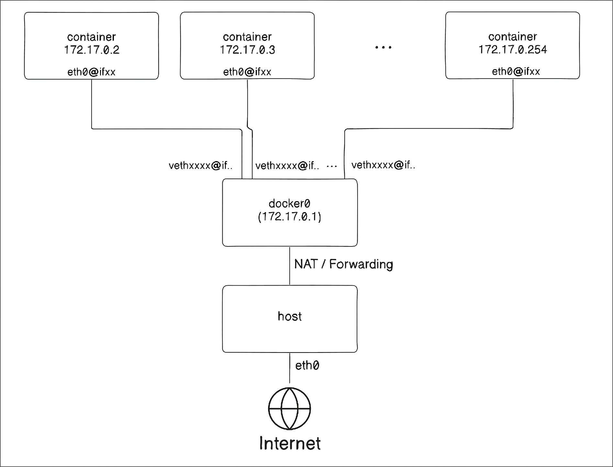

---
## 🛠️ `ip` 명령어 

`ip`는 `iproute2` suite의 네트워킹 도구이다.  

### `ip link`

`ip link` 명령은 host의 네트워크 인터페이스 작업을 할 수 있다.  

```bash
ip l
ip link
ip l show
ip link show
```

```bash
❯ ip link 
1: lo: <LOOPBACK,UP,LOWER_UP> mtu 65536 qdisc noqueue state UNKNOWN mode DEFAULT group default qlen 1000 
link/loopback 00:00:00:00:00:00 brd 00:00:00:00:00:00
2: enp2s0: <NO-CARRIER,BROADCAST,MULTICAST,UP> mtu 1500 qdisc fq_codel state DOWN mode DEFAULT group default qlen 1000 
link/ether c4:ef:bb:95:51:09 brd ff:ff:ff:ff:ff:ff
altname enxc4efbb955109 
3: wlp3s0: <BROADCAST,MULTICAST,UP,LOWER_UP> mtu 1500 qdisc noqueue state UP mode DORMANT group default qlen 1000 
link/ether 70:08:94:a7:25:05 brd ff:ff:ff:ff:ff:ff
altname wlx700894a72505 
4: tailscale0: <POINTOPOINT,MULTICAST,NOARP,UP,LOWER_UP> mtu 1280 qdisc fq_codel state UNKNOWN mode DEFAULT group default qlen 500 
link/none 
5: docker0: <NO-CARRIER,BROADCAST,MULTICAST,UP> mtu 1500 qdisc noqueue state DOWN mode DEFAULT group default 
link/ether 66:57:9f:99:ed:08 brd ff:ff:ff:ff:ff:ff
```

- Flag: 인터페이스 이름 뒤 `< >`에 있는 값들로, 주요 특징을 요약한다.  
	- `LOOPBACK`: 루프백 인터페이스를 의미한다.  
	- `BROADCAST`: 브로드캐스트 가능함을 의미한다.  
	- `MULTICAST`: 멀티캐스트 가능함을 의미한다.  
	- `UP`: 링크의 Administrative state가 켜져 있음을 말한다.  
	  user 또는 system에서, 즉 커널의 입장에서 인터페이스를 활성화 했음을 말한다.   
	  단, 실제 링크의 상태와는 무관하다.   
	  `DOWN`으로 되어있으면 Administrative state가 꺼져 있음을 의미한다.  
	- `LOWER_UP`: Operational State가 켜져 있음을 말한다.  
	  실제 lower network layer(physical, data link later)의 인터페이스가 켜져있을을 말한다.  
	  예를 들면, 물리적인 인터페이스의 경우 이더넷이나 와이파이 등에 정상적으로 접속되어있다는 의미이다.  
- `mtu`: Maximum Transmission Unit, datalink 계층에서의 프레임(frame)의 최대 크기이다.  
- `qdisc`: queueing discipline, 즉 큐잉 규칙이다.   
  세부 정보를 보려면 `tc qdisc show`를 이용.  
	- `noqueue`: 송신 큐를 사용하지 않음.   
	- `pfifo_fast`: 우선순위 계층을 가진 fifo큐들을 사용  
	- `fq_codel`: Fair Queueing + Controlled Delay. 여러 flow를 적절히 나누면서도 지연이 너무 커지지는 않게 조절  
- `state DOWN/UP` Administrative state값  
- `mode`  
	- `DEFAULT`: 커널/드라이버 상태를 기반으로 Operational state를 결정  
	- `DORMANT`: userspace 프로그램이 operational state에 관여가능함  
		- ex. 82.1X supplicant  
- `group default`: 네트워크 인터페이스으 기본 그룹에 속함  
- `qlen <number>`: `net_device`의 `tx_queue_len`속성값.  
	- `noqueue`상태에서 qlen필드는 채워져있을 수 있다.  
	- `qdisc`마다 자체 큐 관리 방식이 있기에, 큐 길이에 관련이 있으나, 항상 최대 길이를 제한하지도 않는다.  
- `link/<type>`: 링크의 종류. 뒤에는 MAC주소가 붙으며, 이후 `brd <Broadcast 주소>` 가 붙을 수 있다.   
- `altname <name>`: 인터페이스의 대체 이름  


`ip link add` 명령으로 다음과 같이 인터페이스를 추가할 수 있다:  
```bash
# dummy interface 추가
ip link add mylink type dummy

# veth(가상 이더넷) 추가
ip link add veth0 type veth peer name veth1

# 링크 켜기
ip link set dev <link> up
```
- 물리적인 인터페이스는 보통 드라이버가 자동으로 생성해준다.  
- veth는 항상 pair를 만든다.  
	- 이더넷 케이블을 연결한다고 생각해봤을 떄, 우린 항상 양쪽에 연결하여 사용하고, 한쪽으로 들어가면 다른 쪽으로 나온다.  

```bash
6: mylink: <BROADCAST,NOARP> mtu 1500 qdisc noop state DOWN mode DEFAULT group default qlen 1000 
link/ether f2:7d:f0:6f:58:e1 brd ff:ff:ff:ff:ff:ff
7: veth1@veth0: <BROADCAST,MULTICAST,M-DOWN> mtu 1500 qdisc noop state DOWN mode DEFAULT group default qlen 1000 
link/ether a2:c3:27:52:44:7d brd ff:ff:ff:ff:ff:ff
8: veth0@veth1: <BROADCAST,MULTICAST,M-DOWN> mtu 1500 qdisc noop state
DOWN mode DEFAULT group default qlen 1000 
link/ether 42:6b:70:14:13:82 brd ff:ff:ff:ff:ff:ff
```


### `ip addr`

`ip addr(address)` 명령은 현재 IP link 정보와 IP주소 정보를 조회할 수 있으며, IP주소 관련 작업을 할 수 있다.  

```bash
ip a
ip addr
ip address
ip a show
ip addr show
ip address show
```

```bash
ubuntu@ubuntu:~$ ip a 
1: lo: <LOOPBACK,UP,LOWER_UP> mtu 65536 qdisc noqueue state UNKNOWN group default qlen 1000 
	link/loopback 00:00:00:00:00:00 brd 00:00:00:00:00:00
	inet 127.0.0.1/8 scope host lo valid_lft forever preferred_lft forever 
	inet6 ::1/128 scope host noprefixroute valid_lft forever preferred_lft forever 
2: eth0: <BROADCAST,MULTICAST,UP,LOWER_UP> mtu 1500 qdisc pfifo_fast state UP group default qlen 1000 
	link/ether bc:24:11:94:0b:0a brd ff:ff:ff:ff:ff:ff
	altname enp6s18 
	altname enxbc2411940b0a 
	inet 192.168.10.10/24 brd 192.168.10.255 scope global eth0 valid_lft forever preferred_lft forever 
	inet6 fe80::be24:11ff:fe94:b0a/64 scope link proto kernel_ll valid_lft forever preferred_lft forever
```

- `inet`: IPv4 주소 정보  
- `inet6`: IPv6주소 정보  
- `scope`: 주소의 범위  
	- `host`: host에서만 사용  
	- `link`: 같은 네트워크 링크에서 사용  
	- `global`: 일반적인 라우팅 가능 주소  
- `valid_lft forever`: IP주소의 유효기간(valid lifetime)이 제한이 없다는 의미  
- `proto`: 주소가 어떻게 생성되었는지에 대한 정보  
	- `kernel_ll`: 커널이 link-local주소로 생성  
- valif_lft  
- preferred_lft  

아래는 `ip addr add`명령어를 통해 `dummy`타입의 `mylink`에 ip주소를 할당한 모습이다:  
```bash
root@ubuntu:~# ip addr add dev mylink 10.10.0.4/24
root@ubuntu:~# ip addr
...
3: mylink:<BROADCAST,NOARP> mtu 1500 qdisc noop state DOWN group default qlen 1000 
	link/ether f2:7d:f0:6f:58:e1 brd ff:ff:ff:ff:ff:ff 
	inet 10.10.0.4/24 scope global mylink valid_lft forever preferred_lft forever
...
```
---
## 🧭 `ip route`

`ip route` 명령은 라우팅 테이블을 관리한다.  

```bash
ip r
ip route
ip r show
ip route show
```

```bash
root@ubuntu:~# ip r 
default via 192.168.10.1 dev eth0 proto static 
192.168.10.0/24 dev eth0 proto kernel scope link src 192.168.10.10
```

- `default`: 기본 라우트 (default route)규칙을 정의한다.  
  여기서는 192.168.0.1을 향하며, 이 주소를 기본 게이트웨이라 부른다.  
  링크는 `eth0`을 이용하며, `proto static`은 정적으로 설정된 라우트를 의미한다.  
- 2번째 줄은 같은 네트워크의 경우 기본 게이트웨이를 경유하지 않고, 같은 링크 안에서 바로 도달 가능하다는 의미이다.  
  `proto kernel`은 커널이 생성한 라우트임을 의미한다.  
- `src`는 송신할 때의 source ip를 명시한다.  

```bash
❯ ip route 
default via 192.168.0.1 dev wlp3s0 proto dhcp src 192.168.0.16 metric 600
172.17.0.0/16 dev docker0 proto kernel scope link src 172.17.0.1 linkdown
192.168.0.0/24 dev wlp3s0 proto kernel scope link src 192.168.0.16 metric 600
```

이 예시는 실제 내 랩탑에서 가져온 정보인데, `dhcp`를 통해 기본라우트가 정해졌으며,  docker가 설치되어있어서 docker의 기본 브릿지 네트워크에 대한 라우팅 정보도 들어있다.  
metric의 경우 같은 nexthop조건의 경우 우선순의를 의미하며, 낮은 숫자가 더 높은 우선순의를 가진다.  

`ip route get <IP주소>`를 통해서 대상 IP주소에 패킷을 보낼 때 어떤 경로를 선택할지 보여준다.  
```bash
root@ubuntu:~# ip route get 8.8.8.8
8.8.8.8 via 192.168.10.1 dev eth0 src 192.168.10.10 uid 0 
	cache 
root@ubuntu:~# ip route get 192.168.10.100
192.168.10.100 dev eth0 src 192.168.10.10 uid 0 
	cache
```

`8.8.8.8`에 갈때, nexthop은 `192.16.8.10.1`이며, 나가는 인터페이스는 `eth0`, source ip는 `192.168.10.10`, 평가 기준 uid는 0(root)이다.  
uid를 보여주는 이유는, `uidrange`로 특정 UID의 트래픽을 다른 라우팅 테이블로 보낼 수 있는 규칙을 만들 수 있기 때문이다.  

---
## 📦 Network namespace

네트워크 네임스페이스는 논리적으로 다른 네트워크 스택을 가지고, 자신만의 route, 방화벽 규칙, 네트워크 장치를 가진다.  

이름이 있는 네임스페이스(named namespace)는 `/var/run/netns/NAME`을 bind mount한다.  
만약 `/etc/resolv.conf`를 myvpn이라는 네임스페이스 내에서 별도로 두고 싶다면, `/var/run/netns/myvpn/resolv.conf`에 두면 된다.  
그렇다고 `/etc:/var/run/netns/myvpn`처럼 단순하게 bind mount되는것은 아니다.  

기본 네임스페이스는 따로 이름을 가지지도 않고, `ip netns`에서도 보이지 않으며, 따로 bind mount되지 않아 `/run/netns/NAME`에서 보이지 않는다.  

> 모던 리눅스에서 `/var/run`은 `/run`으로 연결된다(심볼릭 링크가 있음)  


주요 명령어는 다음과 같다:  
```bash
# 네트워크 네임스페이스 리스트 조회
ip netns list 

# NAME netns 안에서 cmd를 실행
ip netns exec NAME cmd...

# NAME으로된 이름의 namespace 생성
ip netns add NAME 

# PID번 프로세스에게 NAME netns를 할당. 자식 프로세스는 기본적으로 부모 프로세스의 netns를 가진다.
ip netns attach NAME PID 

# NAME netns제거. 
# 그러나 바로 제거되지 않고, 어떤 프로세스가 사용중이라면 그 프로세스가 netns에 대한 참조를 가지기에, 실제로 커널 내부에서 살아있다. 
# 그래서, 확실히 정리하려면 아래의 과정을 거친다:
# $ ip netns pids NAME | xargs -r kill
# $ ip netns delete NAME
# 즉, 실제로 netns를 지우기보다는 이름과 참조를 unlink하는것에 더 가깝다.
ip netns delete NAME 

# 현재 netns에서 NAME netns를 가리킬 때 사용할 식별자(nsid)
# 즉, 
# $ ip netns set foo 12
# $ ip -n bar netns set foo 42
# 와 같은 경우, default netns입장에서 foo를 볼때 foo의 ID는 12
# bar에서  foo를 볼때 foo의 ID는 42라는 뜻이다.
ip netns set NAME NETNSID 

# NAME netns에 소속된 프로세스 PID들을 출력
ip netns pids NAME

# PID번 프로세스의 소속 netns 찾기
ip netns identify PID
```
---
## 🌉 Docker 브릿지 네트워크

우선, Docker의 브릿지 네트워크를 모방하기 위해, 어떤 구조로 되어있는지 아는 것이 중요하다.  

호스트에서 아무 컨테이너도 실행중이지 않을 때에는 `docker0` 브릿지의 state는 `DOWN`이다.  
```bash
5: docker0: <NO-CARRIER,BROADCAST,MULTICAST,UP> mtu 1500 qdisc noqueue state DOWN group default 
	link/ether ba:7b:75:b7:7e:d5 brd ff:ff:ff:ff:ff:ff
	inet 172.17.0.1/16 brd 172.17.255.255 scope global docker0 
		valid_lft forever preferred_lft forever
```

컨테이너를 하나 실행시킨 뒤, 다시 `ip a`명령을 실행해보자.  
이후에는 state가 `UP`이 되고, 새로운 네트워크 인터페이스가 생기는데, 이 `vethb4265a7@if2`가 새로 생긴 가상 이더넷 인터페이스이다.  
`veth`는 페어로 생긴다고 했는데, 다른 namespace에 있는 컨테이너와 연결된 것이다.  
```bash
5: docker0: <BROADCAST,MULTICAST,UP,LOWER_UP> mtu 1500 qdisc noqueue state UP group default
    link/ether ba:7b:75:b7:7e:d5 brd ff:ff:ff:ff:ff:ff
    inet 172.17.0.1/16 brd 172.17.255.255 scope global docker0
       valid_lft forever preferred_lft forever
    inet6 fe80::b87b:75ff:feb7:7ed5/64 scope link proto kernel_ll
       valid_lft forever preferred_lft forever
7: vethb4265a7@if2: <BROADCAST,MULTICAST,UP,LOWER_UP> mtu 1500 qdisc noqueue master docker0 state UP group default
    link/ether 5a:f1:dd:fa:2e:00 brd ff:ff:ff:ff:ff:ff link-netnsid 0
    inet6 fe80::fc23:b2ff:febd:3e65/64 scope link proto kernel_ll
       valid_lft forever preferred_lft forever
```

컨테이너 안에서 `iproute2`를 설치한 후, `ip a`명령어를 실행해보자.  
veth링크가 있고, `docker0`와 같은 네트워크에 속했음을 알 수 있다.  
```bash
root@00d4a100c3fe:/# ip a 
1: lo: <LOOPBACK,UP,LOWER_UP> mtu 65536 qdisc noqueue state UNKNOWN group default qlen 1000 
	link/loopback 00:00:00:00:00:00 brd 00:00:00:00:00:00
	inet 127.0.0.1/8 scope host lo valid_lft forever preferred_lft forever 
	inet6 ::1/128 scope host proto kernel_lo 
		valid_lft forever preferred_lft forever 
2: eth0@if17: <BROADCAST,MULTICAST,UP,LOWER_UP> mtu 1500 qdisc noqueue state UP group default 
	link/ether 72:1c:9b:81:bb:22 brd ff:ff:ff:ff:ff:ff link-netnsid 0 
	inet 172.17.0.2/16 brd 172.17.255.255 scope global eth0 
		valid_lft forever preferred_lft forever
```

그러나, `ip netns list`로는 namespace가 보이질 않는다.  
이는 named namespace를 사용하는 것이 아니기 때문에, `/run/netns`에 이름을 붙이지 않으며, 이의 경우 `ip netns list`에서는 뜨지 않는다.  
대신, `/proc/PID/ns/net`을 보면, 컨테이너가 network namespace를 사용함을 알 수 있다.  
```bash
❯ docker run -d --name nginx nginx
❯ PID=$(docker inspect -f '{{.State.Pid}}' nginx)

❯ ls -l /proc/${PID}/ns/net
lrwxrwxrwx 1 root root 0 Aug 15 00:27 /proc/236362/ns/net -> 'net:[4026533090]'
```

Docker가 제공하는 기본 브릿지 네트워크인 `docker0`는 다음과 같은 구조를 가진다고 볼 수 있다:  
컨테이너가 같은 브릿지 네트워크간의 통신을 할 뿐만 아니라, 인터넷에 연결될 수 있도록 NAT를 지원하며,   
`-p`옵션등을 통해서 host에 들어오는 특정 포트가 컨테이너에 연결되도록 포워딩을 제공할 수 있다.  

  

---
## 🏗️ Docker 브릿지 네트워크 따라하기

### 브릿지 및 가상이더넷 연결

```bash
# network namespace 생성
ip netns add mycontainer

# mydocker0 브릿지 생성
ip link add mydocker0 type bridge
# mydocker0에 ip 할당
ip addr add 172.18.0.1/16 dev mydocker0 broadcast 172.18.0.255 
# mydocker0 브릿지 활성화
ip link set mydocker0 up

# veth pair 생성
ip link add veth-host type veth peer name veth-container 

# veth-root를 mydocker0에 연결
ip link set veth-host master mydocker0
# veth-root를 활성화
ip link set veth-host up

# veth-container를 mycontainer netns로 이동
ip link set veth-container netns mycontainer
# veth-container에 ip 할당
ip netns exec mycontainer ip addr add 172.18.0.2/16 dev veth-container
# veth-container 활성화
ip netns exec mycontainer ip link set veth-container up
# mycontainer의 loopback 활성화. default namespace와는 다른 loopback interface이다.
ip netns exec mycontainer ip link set lo up
```

테스트:  
```bash
# default netns에서 ip a실행
# mycontainer에서 ip a 실행
ip netns exec mycontainer ip a
# veth-host -> veth-container 로 ping날리기
ping 172.18.0.2

# mycontainer에서 nginx실행
ip netns exec mycontainer nginx
# default namespace에서는 nginx가 안켜져있지만,
# 내부에서는 켜져있다.
ss -ntlp
ip netns exec mycontainer ss -ntlp
# mycontainer에 curl날려보기
curl 172.18.0.2
```

브릿지 타입의 인터페이스를 만들었으므로, 라우팅 테이블까지 만들어져있어 바로 통신가능하다.  
```bash
root@ubuntu:~# ip route 
default via 192.168.10.1 dev eth0 proto static
172.18.0.0/16 dev mydocker0 proto kernel scope link src 172.18.0.1
192.168.10.0/24 dev eth0 proto kernel scope link src 192.168.10.10
```
### 다른 namespace를 더 추가하여 통신
브릿지 네트워크를 사용하기에, default namespace는 매번 생기는 pair마다 ip주소를 가질 필요가 없다.   
만들어둔 `mydocker0`에 계속 붙히면 된다.  

```bash
ip netns add mycontainer2

ip link add veth-host2 type veth peer name veth-container2

ip link set veth-host2 master mydocker0 
ip link set veth-host2 up 

ip link set veth-container2 netns mycontainer2 
ip netns exec mycontainer2 ip addr add 172.18.0.3/16 dev veth-container2 
ip netns exec mycontainer2 ip link set veth-container2 up 
ip netns exec mycontainer2 ip link set lo up 
ip netns exec mycontainer2 ip a
```

같은 브릿지 네트워크 안에서 통신가능하다.  
```bash
# ping
ping 172.18.0.3

# mycontainer2 -> mycontainer1 nginx로
ip netns exec mycontainer2 curl 172.18.0.2
```

그러나, namespace 내부에서 외부 네트워크에 닿지는 못하는것을 알 수 있다.  
기본라우트를 추가하지 않았기 때문이고, 설령 추가해서 mydocker0로 보낸다고 해도, 응답이 없다.  
이는 host 자체가 포워딩할 수 없는 상태이기 때문이고, 인터넷으로 보내기 위해서는 네트워크 주소 변환(NAT)역시 필요하다.  
```bash
ip netns exec mycontainer ip r
	# 결과:
	# 172.18.0.0/16 dev veth-container proto kernel scope link src 172.18.0.2

# no route host로 실패
ip netns exec mycontainer2 ping 8.8.8.8

# Route 테이블 추가
ip netns exec mycontainer ip route add default via 172.18.0.1 dev veth-container
ip netns exec mycontainer ip r
	# 결과:
	# default via 172.18.0.1 dev veth-container
	# 172.18.0.0/16 dev veth-container proto kernel scope link src 172.18.0.2
	
# timeout
ip netns exec mycontainer2 ping 8.8.8.8
```

### 실습 환경 정리
```bash
# mycontainer 정리
ip netns pids mycontainer | xargs -r kill
ip netns delete mycontainer
# mycontainer2 정리
ip netns pids mycontainer2 | xargs -r kill
ip netns delete mycontainer2

ip link delete mydocker0
```
---
## 🧹 마무리

이 게시글을 통해 `ip`명령과 컨테이너 네트워킹의 기본적인 구조를 살펴보았다.  
다음 게시글에서는 Docker의 `-p`옵션이 동작하도록, 그리고 namespace 안에서 인터넷에 연결할 수 있도록 해볼 것이다.  

---
## 📚 References
- https://www.man7.org/linux/man-pages/man8/ip-link.8.html  
- https://linuxvox.com/blog/using-ip-what-does-lower-up-mean/  
- https://docs.kernel.org/networking/operstates.html  
- https://linuxvox.com/blog/linux-tc-qdisc/  
- https://unix.stackexchange.com/questions/765819/what-does-qlen-1000-mean-for-a-noqueue-qdisc  
- https://tldp.org/HOWTO/Traffic-Control-HOWTO/classless-qdiscs.html  
- https://wireless.docs.kernel.org/en/latest/en/developers/documentation/mac80211.html  
- https://serverfault.com/questions/63014/ip-address-scope-parameter  
- http://linux-ip.net/html/tools-ip-address.html  
- https://superuser.com/questions/1389292/what-does-scope-do-in-ip-route-and-why-it-is-necessary-to-setup-static-route-i  
- https://linuxcommandlibrary.com/man/ip-route-get  
- https://www.linux.org/docs/man8/ip-netns.html  
- https://docs.docker.com/engine/network/drivers/bridge/  
- https://docs.docker.com/engine/network/  
