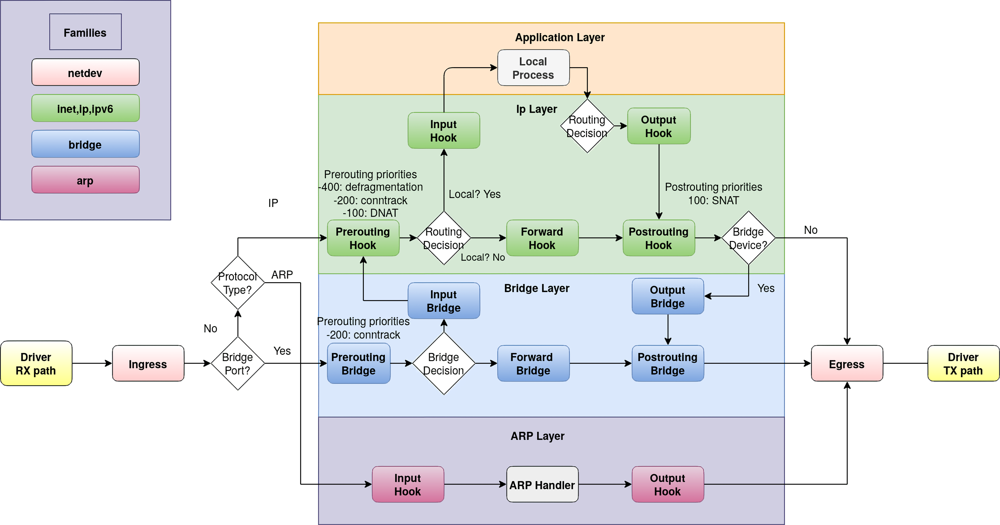

To understand Linux firewalls, NAT, and port forwarding, it helps to know **where packets pass through Netfilter hooks**.
This post walks through nftables base chains and priorities first, then looks at how Docker bridge networking implements NAT and port publishing.

---
## 🪝 Netfilter Hooks

The following diagram shows the packet flow in the Linux networking stack.



- Driver RX path / Driver TX path:
    - RX path:
        - RX means receive.
        - This is the path from receiving a frame from the NIC to passing it up from the NIC driver into the Linux networking stack.
    - TX path:
        - TX means transmit.
        - This is the path from the Linux networking stack to the NIC driver.
- Ingress:
    - The point right before an incoming packet enters the networking stack.
    - The ingress hook can filter earlier than prerouting.
        - It is evaluated before fragmented datagrams are reassembled.
        - This means matches such as UDP destination port only work for the first fragment or unfragmented packets, so ingress is not always a good place for port matching.
- Egress:
    - The point right before an outgoing packet leaves through a network interface after the networking stack has processed it.
    - Like ingress, it can have its own hook.

Let's walk through a few flows from the diagram.

- When the host receives an ARP request:
    1. RX path
    2. Ingress
    3. Bridge Port? -> No, Protocol Type? -> ARP
    4. ARP Input hook
    5. ARP Handler processing (response generation)
    6. Output hook
    7. Egress
    8. TX path
- When a web server receives an HTTP request:
    1. RX path
    2. Ingress
    3. Bridge Port? -> No, Protocol Type? -> IP
    4. IP Prerouting Hook
    5. Routing Decision
    6. IP Input Hook
    7. TCP socket
    8. Local Process (Web server, from here the response is a new outbound packet)
    9. TCP socket
    10. Routing Decision
    11. IP Output Hook
    12. IP Postrouting Hook
    13. Egress
    14. TX path
- When container A at `172.17.0.2` sends traffic to container B at `172.17.0.3` on the same host's default Docker bridge network:
    - A learns B's MAC address through ARP, then sends the frame through its veth interface.
    1. RX path
    2. Ingress
    3. Bridge Port? -> Yes
    4. Prerouting Bridge
    5. Bridge Decision (dst MAC == B's MAC)
    6. Forward Bridge
    7. Postrouting Bridge
    8. Egress
    9. TX path
- When container A on Docker's default bridge wants to access the internet, for example `8.8.8.8`:
    - The frame's destination MAC is the MAC address of `docker0`.
    1. RX path
    2. Ingress
    3. Bridge Port? -> Yes
    4. Bridge Prerouting
    5. Bridge Decision
        - dst MAC == docker0 (local)
    6. Bridge INPUT
    7. IP Prerouting
    8. IP Routing Decision
        - dst = 8.8.8.8
        - default route -> eth0
    9. IP Forward
    10. IP Postrouting
        - MASQUERADE(NAT)
        - src 172.17.0.2 -> 192.168.10.10
    11. Egress(eth0)
    12. TX path

In short, the common flows are:

- **External -> Local**\
  PREROUTING -> Routing -> INPUT
- **External -> External (Router)**\
  PREROUTING -> Routing -> FORWARD -> POSTROUTING
- **Local -> External**\
  Routing -> OUTPUT -> POSTROUTING

To allow forwarding, enable it with:

```bash
echo 1 > /proc/sys/net/ipv4/ip_forward
```

A major difference from iptables is that nftables does **not** provide predefined chains for each hook.
You have to create **base chains** yourself and attach them to Netfilter hooks.

---
## 🧩 nftables Hook/Priority

Unlike iptables, nftables does not have predefined chains such as `INPUT` or `OUTPUT`.
If you want to filter packets at a specific processing step, create a base chain and attach it to the appropriate Netfilter hook.

### Adding a Base Chain

A base chain is a chain registered to a Netfilter hook.
It allows nftables to inspect and process packets as they move through the Linux TCP/IP stack.

The basic syntax is:

```nft
add chain [<family>] <table_name> <chain_name> { type <type> hook <hook> [device <device>] priority <priority> ; [policy <policy> ;] [comment <comment> ;]}
```

This example adds a base chain to the `input` hook in an `ip` table named `filter`.

```bash
nft 'add chain ip filter input { type filter hook input priority 0; }'
```

- This command registers an `input` chain and attaches it to the input hook.
    - The chain sees packets whose destination is a local process on this host.
- **Priority matters because it decides chain evaluation order.**
    - If multiple chains are attached to the input hook, smaller priority values run first.
    - Two base chains can have the same priority, but the evaluation order becomes undefined.
    - In this command, `filter` is the table name, not the chain type.

You can also register an output chain on a desktop machine that does not forward traffic.
This output chain handles packets generated by local processes.

```bash
nft 'add chain ip filter output { type filter hook output priority 0; }'
```

Now you can filter incoming traffic destined for local processes and outgoing traffic generated by local processes.

> **NOTE**\
> If you create a chain without the `{}` block, it is a regular chain that does not see packets by itself.
> This is similar to `iptables -N chain-name`.

Since nftables 0.5, a default policy can be added.
Like iptables, the default policy can be either `accept` or `drop`.

```bash
nft 'add chain ip filter output { type filter hook output priority 0; policy accept; }'
```

When adding a chain to the ingress hook, you must specify the device it attaches to.

```bash
nft 'add chain netdev filter eth0_filter { type filter hook ingress device eth0 priority 0; }'
```

#### Base Chain Types

There are three base chain types:

- **filter**:
    - Used to filter packets. It can accept, drop, and perform other filtering decisions.
    - Supported by `arp`, `bridge`, `ip`, `ip6`, and `inet` table families.
- **route**:
    - Used to recalculate routing when relevant IP header fields or packet marks change.
    - Similar to iptables `mangle`.
    - The route chain type is only valid for the output hook.
    - For other hooks, use `filter` instead.
    - Supported by `ip`, `ip6`, and `inet` table families.
- **nat**:
    - Used for NAT(Network Address Translation).
    - Only the first packet of a flow passes through a `nat` chain.
    - Later packets in the same flow do not pass through it.
    - Supported by `ip`, `ip6`, and `inet` table families.

#### Base Chain Hooks

Base chains can use the following hooks:

- **ingress**: Packets right after they come up from the NIC driver
- **prerouting**: All packets entering the system, before routing
- **input**: Packets whose destination is the local system or a local process
- **forward**: Packets for which this host is not the final destination
- **output**: Packets generated by local processes
- **postrouting**: Packets right before leaving the system, after forwarding or output

#### Base Chain Priority

Each nftables base chain has a priority value.
The priority decides when it runs relative to other base chains, flowtables, and internal Netfilter operations on the same hook.

For example, a chain attached to the prerouting hook with priority `-300` runs before connection tracking(CONNTRACK).

> **NOTE**\
> If a packet is accepted and another chain with a later priority exists on the same hook type, evaluation continues in the next chain.\
> In other words, `accept` is not a final allow decision.\
> However, `drop` is final immediately.

Consider this ruleset:

```bash
table ip filter {
        # This chain is evaluated first due to priority
        chain services {
                type filter hook input priority 0; policy accept;

                # If matched, this rule will prevent any further evaluation
                tcp dport http drop

                # If matched, and despite the accept verdict, the packet proceeds to enter the chain below
                tcp dport ssh accept

                # Likewise for any packets that get this far and hit the default policy
        }

        # This chain is evaluated last due to priority
        chain input {
                type filter hook input priority 1; policy drop;
                # All ingress packets end up being dropped here!
        }
}
```

Both chains are attached to the input hook.
Since smaller priority values run first, the order is `services` -> `input`.

- HTTP packet:
    - Dropped in the `services` chain by `tcp dport http drop`
- SSH packet:
    - Accepted in the `services` chain by `tcp dport ssh accept`
    - But then dropped in the `input` chain
- Other packets:
    - Accepted by the default policy in `services`
    - But then dropped in the `input` chain
- What if the `input` chain priority is changed to `-1`?
    - Packets are dropped in `input` before they ever reach `services`.

#### Base Chain Policy

When no more rules are left to evaluate, a base chain can use one of two policies:

- accept: let the packet continue through the network stack (default)
- drop: drop the packet when it reaches the end of the base chain

### Adding a Regular Chain

You can create a regular chain with:

```bash
add chain [family] <table_name> <chain_name> [comment <comment>]
```

The chain name can be anything.
Notice that a regular chain does not have the `hook` keyword.

Because it is not attached to a Netfilter hook, a regular chain does not see traffic on its own.
However, one or more base chains can `jump` or `goto` to it.

- `jump`: Works like a function call and returns to the caller chain
- `goto`: Does not return to the original chain

So a regular chain is useful for **reusing and modularizing rules**.

### Deleting a Chain

Use this syntax to delete a chain:

```bash
delete chain [family] <table_name> <chain_name>
```

The chain must be empty. Otherwise, deletion fails like this:

```bash
nft 'delete chain ip filter input'
delete chain ip filter input
^^^^^^^^^^^^^^^^^^^^^^^^^^^^
```

If a regular chain is referenced by another chain, it also cannot be deleted.
Remove the references first.

### Flushing a Chain

Use this syntax to remove all rules from a chain:

```bash
flush chain [family] <table_name> <chain_name>
```

---
## 🔎 conntrack

`conntrack` is a userspace CLI tool for Netfilter connection tracking.
It replaces the old `/proc/net/ip_conntrack` interface and can list, inspect, monitor, and manage the kernel's `nf_conntrack` subsystem.
You can dump current tracked connections, delete entries from the state table, or add new entries.

```bash
# Dump the current table
conntrack -L

# Show more information
conntrack -L -o extended

# Filter TCP connections
conntrack -L -p tcp

# Flush the whole table
conntrack -F

# Monitor events
conntrack -E
```

---
## 🧵 nft monitor trace

This is basically an improved version of the old `iptables -j TRACE` workflow.
It lets you trace how packets are handled inside nftables.

There are two steps:

- Enable tracing in the ruleset
- Watch trace events with the `nft` tool

### Enabling nftrace

This rule sets `nftrace=1` in the packet metadata.

```bash
meta nftrace set 1
```

On a busy system, you usually want to narrow the matching scope.
For example, this enables tracing only for TCP packets:

```bash
ip protocol tcp meta nftrace set 1
```

### Enabling Tracing in a Chain

For tracing, it is usually better to create a dedicated chain and enable tracing as early as possible.
Anything that happens before tracing is enabled cannot be traced.
By attaching it early, you can observe almost the whole path.

When you are done, you can simply remove that chain.

### Watching Trace Events

Use:

```bash
nft monitor trace
```

---
## 🧱 Example: Building NAT Manually

Assume `eth1` is connected to an internal network and `eth0` is connected to the internet.
The following nftables ruleset makes the host act as a NAT gateway.

```nginx
# nat.nft

table inet firewall {
    chain forward {
        type filter hook forward priority filter; policy drop;

        # Allow eth1 -> eth0 traffic
        iifname "eth1" oifname "eth0" accept

        # Allow replies from eth0 -> eth1 if conntrack marks them as established or related
        # Note that conntrack's established state is not the same thing as TCP ESTABLISHED.
        # For conntrack, established means a packet is a reply for an already tracked flow.
        # UDP replies can also be tracked as established.
        # related means a new connection related to an existing one, such as FTP data or ICMP errors.
        iifname "eth0" oifname "eth1" ct state related,established accept
    }

    chain postrouting {
        type nat hook postrouting priority srcnat; policy accept;

        # If the outbound interface is eth0, masquerade using eth0's address
        oifname "eth0" masquerade
    }
}
```

Apply it with:

```bash
nft -f nat.nft
```

The equivalent imperative commands are:

```bash
nft add rule inet firewall postrouting oifname "eth0" masquerade
nft add rule inet firewall forward iifname "eth1" oifname "eth0" accept
nft add rule inet firewall forward \
    iifname "eth0" oifname "eth1" ct state related,established accept
```

With iptables, it would look like:

```bash
iptables -t nat -A POSTROUTING -o eth0 -j MASQUERADE
iptables -A FORWARD -i eth1 -o eth0 -j ACCEPT
iptables -A FORWARD -i eth0 -o eth1 -m state --state RELATED,ESTABLISHED -j ACCEPT
```

Rules alone are not enough.
Forwarding must also be enabled on the machine.

Temporarily:

```bash
sysctl -w net.ipv4.ip_forward=1
```

Persistently:

```bash
cat <<EOF | sudo tee /etc/sysctl.d/99-router.conf > /dev/null
net.ipv4.ip_forward = 1
net.ipv6.conf.all.forwarding = 1
EOF

sudo sysctl --system
```

---
## 🐳 Practice: Docker-Style Bridge NAT and Port Forwarding

### Inspecting the `docker0` Network

SNAT can be built similarly to the example above.
But how does port forwarding, or DNAT, work?
Let's look at how Docker handles NAT and port publishing.

The following is an example from `nft list ruleset`:

- As of Docker Engine 29, the native nftables backend is still experimental. This example shows nftables rules generated by `iptables-nft`.
- `counter packets 0 bytes 0` is rule counter metadata, not a match condition.

```nginx
# Warning: table ip nat is managed by iptables-nft, do not touch!
table ip nat {
        chain DOCKER {
                # If TCP destination port is 8080 and the packet did not come from docker0,
                # DNAT it to 172.17.0.2:80.
                iifname != "docker0" tcp dport 8080 counter packets 0 bytes 0 dnat to 172.17.0.2:80
        }

        chain PREROUTING {
                type nat hook prerouting priority dstnat; policy accept;
                # If the destination address is local from the Linux routing perspective,
                # jump to the DOCKER chain.
                fib daddr type local counter packets 0 bytes 0 jump DOCKER
        }

        chain OUTPUT {
                type nat hook output priority dstnat; policy accept;
                # If the destination is not loopback and is local from the FIB perspective,
                # jump to the DOCKER chain. Loopback is handled by docker-proxy.
                ip daddr != 127.0.0.0/8 fib daddr type local counter packets 0 bytes 0 jump DOCKER
        }

        chain POSTROUTING {
                type nat hook postrouting priority srcnat; policy accept;
                # If source is 172.17.0.0/16 and outbound interface is not docker0,
                # SNAT/MASQUERADE to the outbound interface address.
                ip saddr 172.17.0.0/16 oifname != "docker0" counter packets 0 bytes 0 masquerade
        }
}

table ip filter {
        chain DOCKER {
                # Allow traffic DNATed to 172.17.0.2:80 and going out through docker0.
                ip daddr 172.17.0.2 iifname != "docker0" oifname "docker0" tcp dport 80 counter packets 0 bytes 0 accept
                # Drop non-docker0 -> docker0 traffic that did not match the allow rule above.
                iifname != "docker0" oifname "docker0" counter packets 0 bytes 0 drop
        }

        chain DOCKER-FORWARD {
                counter packets 0 bytes 0 jump DOCKER-CT
                counter packets 0 bytes 0 jump DOCKER-INTERNAL
                counter packets 0 bytes 0 jump DOCKER-BRIDGE
                iifname "docker0" counter packets 0 bytes 0 accept
        }

        chain DOCKER-BRIDGE {
                oifname "docker0" counter packets 0 bytes 0 jump DOCKER
        }

        chain DOCKER-CT {
                oifname "docker0" ct state related,established counter packets 0 bytes 0 accept
        }

        chain DOCKER-INTERNAL {
        }

        chain FORWARD {
                type filter hook forward priority filter; policy accept;
                counter packets 0 bytes 0 jump DOCKER-USER
                counter packets 0 bytes 0 jump DOCKER-FORWARD
        }

        chain DOCKER-USER {
        }
}

table ip raw {
        chain PREROUTING {
                type filter hook prerouting priority raw; policy accept;
                ip daddr 172.17.0.2 iifname != "docker0" counter packets 0 bytes 0 drop
        }
}
```

The following example uses the native nftables backend introduced experimentally in Docker Engine 29.
It is fairly similar to the iptables backend output.

```nginx
# In /etc/docker/daemon.json:
# { "firewall-backend": "nftables" }

table ip nat {
    chain PREROUTING {
        type nat hook prerouting priority dstnat; policy accept;
    }

    chain OUTPUT {
        type nat hook output priority dstnat; policy accept;
    }

    chain POSTROUTING {
        type nat hook postrouting priority srcnat; policy accept;
    }
}

table ip filter {
    chain FORWARD {
        type filter hook forward priority filter; policy accept;
        counter packets 0 bytes 0 jump DOCKER-USER
    }

    chain DOCKER-USER {
    }
}

table ip raw {
    chain PREROUTING {
        type filter hook prerouting priority raw; policy accept;
    }
}

table ip docker-bridges {
    chain nat-prerouting-and-output {
        iifname != "docker0" tcp dport 8080 counter packets 0 bytes 0 dnat to 172.17.0.2:80 comment "DNAT"
    }

    chain raw-PREROUTING {
        type filter hook prerouting priority raw; policy accept;
        ip daddr 172.17.0.2 iifname != "docker0" counter packets 0 bytes 0 drop comment "DROP DIRECT ACCESS"
    }

    chain filter-forward-in__docker0 {
        ct state established,related counter packets 0 bytes 0 accept
        iifname "docker0" counter packets 0 bytes 0 accept comment "ICC"
        ip daddr 172.17.0.2 tcp dport 80 counter packets 0 bytes 0 accept
        counter packets 0 bytes 0 drop comment "UNPUBLISHED PORT DROP"
    }

    chain filter-forward-out__docker0 {
        ct state established,related counter packets 0 bytes 0 accept
        counter packets 0 bytes 0 accept comment "OUTGOING"
    }

    chain nat-postrouting-out__docker0 {
        oifname != "docker0" ip saddr 172.17.0.0/16 counter packets 0 bytes 0 masquerade comment "MASQUERADE"
    }
}
```

You can also see that the `docker-proxy` process binds the published port.

```bash
root@ubuntu:~# docker run -d --name nginx -p 8080:80 nginx
8e241826e0620f38049fb96f5c4c5781c89ff3acd8e61545953310aec4cc5479
root@ubuntu:~# ss -ntlp
State Recv-Q Send-Q Local Address:Port Peer Address:Port Process
...
LISTEN 0 4096 0.0.0.0:8080 0.0.0.0:* users:(("docker-proxy",pid=11562,fd=8))
...
```

One important detail is that the firewall rules do **not** handle loopback addresses in this setup.
As shown by `ss`, `docker-proxy` handles that path.
This is because loopback, older kernel behavior, and compatibility concerns are difficult to cover with kernel NAT alone.

Modern Linux routing can handle hairpin scenarios.
Enable `route_localnet`, then disable `userland-proxy`.

```json
# /etc/docker/daemon.json
{
  "userland-proxy": false
}
```

Restart Docker:

```bash
systemctl restart docker
```

With `docker ps`, IPv6 port publishing is not shown.
Conversions such as `[::1]:8080->80` still have limitations even with `route_localnet`.

```bash
root@cp-1:~# docker ps
CONTAINER ID IMAGE COMMAND CREATED STATUS PORTS NAMES
618abe9aff42 nginx "/docker-entrypoint...." 11 seconds ago Up 11 seconds 0.0.0.0:8080->80/tcp nginx
```

In `ss`, `dockerd` reserves `0.0.0.0:8080` so other processes cannot bind it.
Notice that `[::1]:8080` is not reserved here.

```bash
root@cp-1:~# ss -ntlp
State Recv-Q Send-Q Local Address:Port Peer Address:Port Process
LISTEN 0 4096 0.0.0.0:8080 0.0.0.0:* users:(("dockerd",pid=19866,fd=30))
```

`route_localnet` is now enabled for `docker0`.
This allows traffic targeting `127.0.0.0/8` to be routed.

```bash
root@cp-1:~# sysctl -a | grep docker0.route_localnet
net.ipv4.conf.docker0.route_localnet = 1
```

Check the rules again with `nft list ruleset`.

```nginx
table inet nat {
    # ...
    chain DOCKER {
        tcp dport 8080 counter packets 0 bytes 0 dnat to 172.17.0.2:80
    }

    chain OUTPUT {
        type nat hook output priority dstnat; policy accept;
        # The daddr != 127.0.0.1/8 condition is gone.
        fib daddr type local counter packets 0 bytes 0 jump DOCKER
    }

    chain POSTROUTING {
        type nat hook postrouting priority srcnat; policy accept;
        # Host -> host port -> container
        # src = 127.0.0.1, dst = 127.0.0.1:8080
        # After OUTPUT DNAT: src = 127.0.0.1, dst = 172.17.0.2:80
        # This rule masquerades it to:
        # src = 172.17.0.1, dst = 172.17.0.2:80
        oifname "docker0" fib saddr type local counter packets 0 bytes 0 masquerade

        ip saddr 172.17.0.0/16 oifname != "docker0" counter packets 0 bytes 0 masquerade

        # Container -> host port -> itself
        # src = 172.17.0.2, dst = HostIP:8080
        # After DNAT: src = 172.17.0.2, dst = 172.17.0.2:80
        # This may not return through the host conntrack/NAT path correctly,
        # so the source is masqueraded to 172.17.0.1.
        ip saddr 172.17.0.2 ip daddr 172.17.0.2 tcp dport 80 counter packets 0 bytes 0 masquerade
    }

    # ...
}
```

The rest of this post follows the version with `userland-proxy` disabled.

### Network Topology

Create a network namespace named `ns1`, then connect it with a veth pair.
This creates a Docker-like topology.

```bash
ip link add mydocker0 type bridge
ip addr add 172.18.0.1/16 dev mydocker0 broadcast 172.18.255.255
ip link set mydocker0 up

ip link add veth-host1 type veth peer name veth-ns1

ip link set veth-host1 master mydocker0
ip link set veth-host1 up
ip netns add ns1
ip link set veth-ns1 netns ns1
ip netns exec ns1 ip addr add 172.18.0.2/16 dev veth-ns1 broadcast 172.18.255.255
ip netns exec ns1 ip link set veth-ns1 up
ip netns exec ns1 ip link set lo up
ip netns exec ns1 ip route add default via 172.18.0.1
ip netns exec ns1 nginx

# Optional: create one more netns
ip link add veth-host2 type veth peer name veth-ns2

ip link set veth-host2 master mydocker0
ip link set veth-host2 up

ip netns add ns2
ip link set veth-ns2 netns ns2
ip netns exec ns2 ip addr add 172.18.0.3/16 dev veth-ns2 broadcast 172.18.255.255
ip netns exec ns2 ip link set veth-ns2 up
ip netns exec ns2 ip link set lo up
ip netns exec ns2 ip route add default via 172.18.0.1
ip netns exec ns2 nginx
```

### Enabling Forwarding and Local Routing

Enable IPv4 forwarding and local routing:

```bash
sysctl -w net.ipv4.ip_forward=1
sysctl -w net.ipv4.conf.mydocker0.route_localnet=1
```

For persistent configuration:

```bash
cat <<EOF | sudo tee /etc/sysctl.d/99-router.conf > /dev/null
net.ipv4.ip_forward = 1
net.ipv4.conf.mydocker0.route_localnet = 1
EOF

sudo sysctl --system
```

### Configuring nftables for NAT

Create rules like this:

```nginx
table ip mynat {
    chain raw_prerouting {
        type filter hook prerouting priority raw; policy accept;

        # Block direct routing to container IPs from outside
        ip daddr { 172.18.0.2, 172.18.0.3 } \
            iifname != "mydocker0" \
            drop
    }

    chain prerouting {
        type nat hook prerouting priority dstnat; policy accept;

        fib daddr type local tcp dport 8080 \
            dnat to 172.18.0.2:80

        fib daddr type local tcp dport 8081 \
            dnat to 172.18.0.3:80
    }

    chain output {
        type nat hook output priority dstnat; policy accept;

        fib daddr type local tcp dport 8080 \
            dnat to 172.18.0.2:80

        fib daddr type local tcp dport 8081 \
            dnat to 172.18.0.3:80
    }

    chain forward {
        type filter hook forward priority filter; policy drop;

        ct state invalid drop

        # Replies going back to containers
        oifname "mydocker0" ct state established,related accept

        # Container-originated forwarding
        iifname "mydocker0" accept

        # New connections DNATed through published ports
        oifname "mydocker0" ct status dnat accept
    }

    chain postrouting {
        type nat hook postrouting priority srcnat; policy accept;

        # Host -> published port -> container
        oifname "mydocker0" \
            fib saddr type local \
            masquerade

        # Container -> published port -> same bridge
        iifname "mydocker0" \
            oifname "mydocker0" \
            ct status dnat \
            masquerade

        # Container -> outside
        ip saddr 172.18.0.0/24 \
            oifname != "mydocker0" \
            masquerade
    }
}
```

### Testing

Try `curl`.
You should receive a response from nginx in `ns1`, which means **DNAT is working**.

```bash
# Through localhost
curl localhost:8080

# Through another host IP
curl 192.168.10.101:8080
```

Check whether `ns1` can reach the internet:

```bash
ip netns exec ns1 ping 8.8.8.8
```

You can also inspect the flow with `conntrack`:

```bash
root@ubuntu:~# conntrack -L -p tcp
tcp 6 8 TIME_WAIT
    # Original direction tuple
    src=127.0.0.1 dst=127.0.0.1 sport=60712 dport=8080
    # Reply direction tuple
    src=172.18.0.2 dst=172.18.0.1 sport=80 dport=60712
    [ASSURED]
```

---
## 📚 References

- https://wiki.nftables.org/wiki-nftables/index.php/Netfilter_hooks
- https://wiki.nftables.org/wiki-nftables/index.php/Configuring_chains
- https://conntrack-tools.netfilter.org/manual.html
- https://man.archlinux.org/man/conntrack.8.en
- https://kernel-internals.org/net/conntrack/
- https://wiki.nftables.org/wiki-nftables/index.php/Ruleset_debug/tracing
- https://docs.kernel.org/networking/ip-sysctl.html
- https://docs.kernel.org/networking/kapi.html
- https://docs.kernel.org/networking/nf_flowtable.html
- https://wiki.nftables.org/wiki-nftables/index.php/Quick_reference-nftables_in_10_minutes
- https://docs.docker.com/engine/network/firewall-iptables
- https://docs.docker.com/engine/network/firewall-nftables/
- https://docs.docker.com/reference/cli/dockerd
- https://github.com/moby/moby/issues/45629
