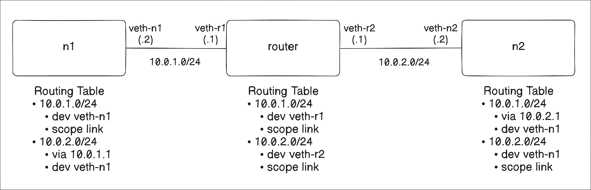
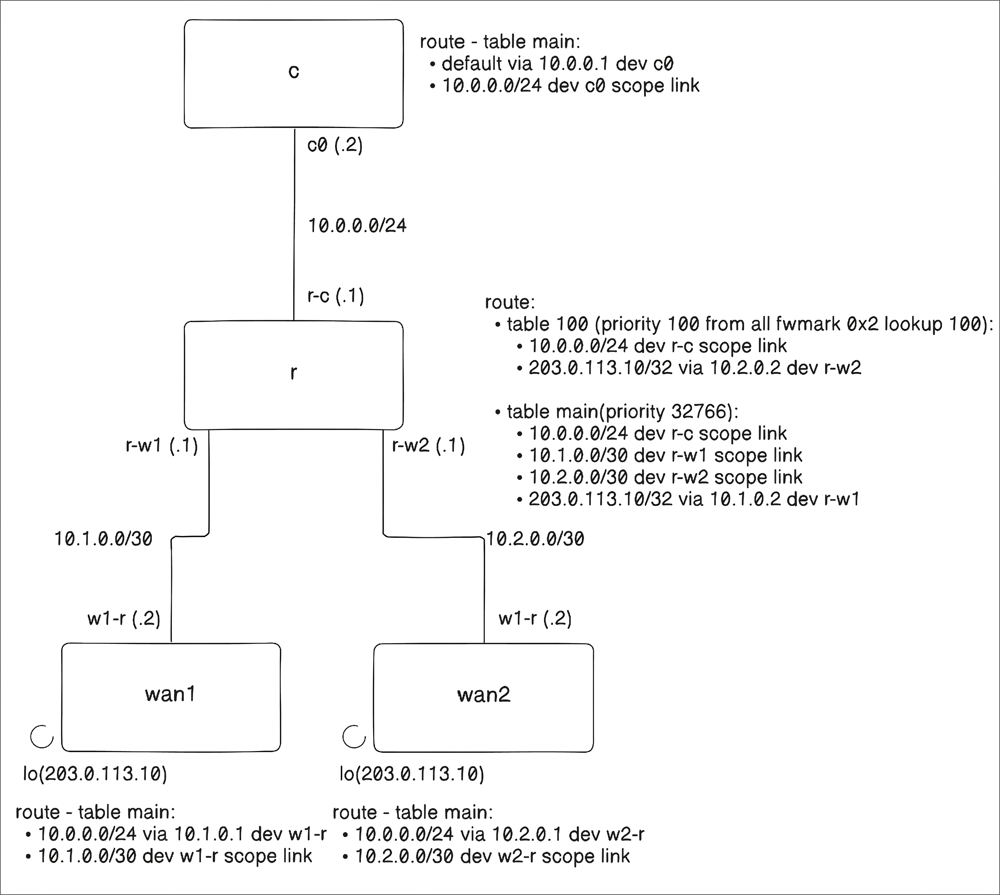

Linux에서 **라우팅은 단순히 default gateway 하나를 설정하는 것으로 끝나지 않는다.**  
라우팅 테이블에는 여러 종류의 route entry가 들어갈 수 있고, `ip rule`을 사용하면 목적지 주소뿐 아니라 **source address, incoming interface, fwmark 같은 패킷 메타데이터**를 기준으로도 라우팅 경로를 바꿀 수 있다.  

이번 글에서는 `ip route`와 `ip rule`의 기본 동작을 보고, network namespace를 이용해 **일반 라우팅과 fwmark 기반 policy routing**을 직접 구성해본다.  

---
## 🧭 `ip route` man page 같이보기

### Route type

`ip route`에서 다루는 route entry에는 여러 타입이 있다.  
일반적으로는 `unicast` route를 가장 많이 보지만, **의도적으로 패킷을 버리거나 정책적으로 차단하는 route**도 만들 수 있다.  

- **unicast**
    - 목적지까지 패킷을 전달하기 위한 일반적인 route entry이다.
    - gateway를 향하는 route뿐 아니라, 같은 링크에서 직접 도달 가능한 route도 `unicast` 타입이라고 보면 된다.
- **unreachable**
    - 해당 목적지로는 도달할 수 없음을 명시한다.
    - 패킷은 버려지고, ICMP host unreachable 메시지가 응답된다.
    - userspace에서는 `EHOSTUNREACH` 에러를 받는다.
- **blackhole**
    - 패킷을 조용히 버린다.
    - ICMP 메시지도 보내지 않는다.
    - userspace에서는 `EINVAL` 에러를 받는다.
- **prohibit**
    - 해당 목적지로는 도달할 수 없음을 명시한다.
    - `unreachable`과의 차이는 단순한 경로 부재가 아니라, 정책적으로 도달하면 안 된다는 의미가 더 강하다는 점이다.
    - userspace에서는 `EACCES` 에러를 받는다.
- **local**
    - 목적지가 Linux host 자신이라는 의미이다.
    - 외부로 forward하지 않고 local networking stack으로 보낸다.
- **broadcast**
    - 목적지가 broadcast 주소라는 의미이다.
- **throw**
    - policy routing과 함께 사용되는 특별한 route이다.
    - 이 route가 선택되면 해당 table 검색은 route를 찾지 못한 것처럼 종료된다.
    - policy routing이 없다면 라우팅 테이블에 route가 없는 것처럼 동작하고, 패킷은 drop되며 ICMP net unreachable 메시지가 생성된다.
    - local sender는 `ENETUNREACH` 에러를 받는다.
- **nat**
    - Linux 2.6 이후에는 지원되지 않는다.
    - 과거에는 route 자체가 address translation의 의미를 가질 수 있었다.
- **anycast**
    - 현재 구현되어 있지 않다.
    - 목적지가 anycast address인 경우를 의미한다.
    - destination으로 들어오는 것은 `local`처럼 동작하지만, source address로 사용하는 것은 허용되지 않는다.
- **multicast**
    - multicast routing에서 사용되는 특별한 타입이다.
    - 일반적인 라우팅 테이블에는 보통 나타나지 않는다.

### Route table

Linux는 route들을 **routing table**로 묶는다.  
테이블은 $1$부터 $2^{32}-1$까지의 번호로 식별되며, `/usr/lib/iproute2/rt_tables` 또는 `/etc/iproute2/rt_tables`에서 이름을 지정할 수 있다.  
두 파일에 같은 table 이름이나 ID가 있으면 `/etc/iproute2/rt_tables`가 더 우선한다.  

일반적인 route는 기본적으로 **`main(id: 254)` 테이블**에 추가된다.  
커널도 일반적인 라우팅 계산에서는 이 테이블을 사용한다.  
ID `0`, `253`, `254`, `255`는 built-in table을 위해 예약되어 있다.  
policy routing을 사용할 때는 목적에 따라 여러 routing table을 함께 활용할 수 있다.  

잘 보이지 않지만 중요한 테이블도 있다.  
바로 **`local(id: 255)` 테이블**이다.  
이 테이블은 local address와 broadcast address를 위한 route들로 구성된다.  
커널이 자동으로 유지하므로 관리자가 직접 수정할 일은 많지 않다.  

### `ip route` 명령어로 route 관리

아래 명령어는 모두 `main` 테이블에 있는 route entry를 조회한다.  

```bash
ip r
ip route
ip route show
ip route show table main
```

`local` 테이블도 조회할 수 있다.  
앞에서 본 것처럼 local 및 broadcast route들이 들어 있다.  

```bash
ip route show table local
```

모든 route entry를 조회하려면 `table all`을 사용한다.  

```bash
ip route show table all
```

`blackhole`, `unreachable`, `prohibit` route도 직접 추가해보자.  

```bash
ip route add blackhole 10.0.1.0/24
ip route add unreachable 10.0.2.0/24
ip route add prohibit 10.0.3.0/24
```

각 목적지로 `ping`을 보내보면 route type에 따라 userspace에서 관측되는 에러가 달라진다.  

```bash
# Blackhole
root@ubuntu:~# ping 10.0.1.1
ping: connect: Invalid argument # EINVAL

# Unreachable
root@ubuntu:~# ping 10.0.2.1
ping: connect: No route to host # EHOSTUNREACH

# Prohibit
root@ubuntu:~# ping 10.0.3.1
ping: Do you want to ping broadcast? Then -b. If not, check your local firewall rules

root@ubuntu:~# ping -b 10.0.3.1
WARNING: pinging broadcast address
ping: connect: Permission denied # EACCES
```

`prohibit`의 경우 `ping`이 처음에는 broadcast 주소 ping과 관련된 메시지를 함께 보여줄 수 있다.  
`-b` 옵션을 붙이면 최종적으로 `EACCES`에 해당하는 `Permission denied`를 확인할 수 있다.  

이번에는 특정 목적지 주소의 route 평가를 확인해보자.  
`8.8.8.8`로 패킷을 보내기 위해 실제로 어떤 route, interface, source IP를 사용하는지 확인할 수 있다.  

```bash
# 8.8.8.8로 패킷을 보내면 어떤 route/interface/source IP를 사용하는가?
root@ubuntu:~# ip route get 8.8.8.8
8.8.8.8 via 192.168.10.1 dev eth0 src 192.168.10.10 uid 0
    cache

# source IP를 192.168.10.10으로 지정하면 어떤 route를 사용하는가?
# policy routing을 확인할 때 자주 사용한다.
root@ubuntu:~# ip route get 8.8.8.8 from 192.168.10.10
8.8.8.8 from 192.168.10.10 via 192.168.10.1 dev eth0 uid 0
    cache

# FIB 기준으로 실제 매칭된 route entry를 확인한다.
root@ubuntu:~# ip route get fibmatch 8.8.8.8
default via 192.168.10.1 dev eth0 proto static
```

**FIB(Forwarding Information Base)**는 커널이 패킷을 어디로 보낼지 결정할 때 조회하는 라우팅 정보를 담은 내부 구조이다.  
Linux는 LC-trie(Level-Compressed trie) 계열의 구조를 사용해 **longest prefix match**를 찾는다.  

아래 명령어로 앞에서 추가한 route entry들을 정리할 수 있다.  

```bash
ip route del blackhole 10.0.1.0/24
ip route del unreachable 10.0.2.0/24
ip route del prohibit 10.0.3.0/24
```

---
## 🧪 실습: 서로 다른 네트워크 라우팅하기

network namespace를 이용해 서로 다른 두 네트워크 사이에 router를 만들고, 양쪽 네트워크가 서로 통신할 수 있도록 구성해보자.  



위 토폴로지는 아래 명령어로 구성할 수 있다.  

```bash
# namespace 추가
ip netns add n1
ip netns add router
ip netns add n2

# 두 개의 veth pair 생성
ip link add veth-n1 type veth peer name veth-r1
ip link add veth-n2 type veth peer name veth-r2

# 각각의 인터페이스를 namespace로 이동
# n1, n2에는 각각 1개씩 넣고, router에는 반대쪽 인터페이스 2개를 넣는다.
ip link set veth-n1 netns n1
ip link set veth-r1 netns router
ip link set veth-r2 netns router
ip link set veth-n2 netns n2

# 각각의 네트워크 인터페이스에 IP 할당
ip netns exec n1 ip addr add 10.0.1.2/24 dev veth-n1
ip netns exec router ip addr add 10.0.1.1/24 dev veth-r1
ip netns exec router ip addr add 10.0.2.1/24 dev veth-r2
ip netns exec n2 ip addr add 10.0.2.2/24 dev veth-n2

# 각 namespace의 loopback 활성화
ip netns exec n1 ip link set lo up
ip netns exec router ip link set lo up
ip netns exec n2 ip link set lo up

# veth interface 활성화
ip netns exec n1 ip link set veth-n1 up
ip netns exec router ip link set veth-r1 up
ip netns exec router ip link set veth-r2 up
ip netns exec n2 ip link set veth-n2 up

# router namespace에서 IPv4 forwarding 활성화
ip netns exec router sysctl -w net.ipv4.ip_forward=1

# 반대편 네트워크로 가기 위한 route 추가
ip netns exec n1 ip route add 10.0.2.0/24 via 10.0.1.1
ip netns exec n2 ip route add 10.0.1.0/24 via 10.0.2.1
```

이제 `n1`에서 `n2`로, `n2`에서 `n1`으로 ping을 보내보자.  

```bash
# n1 -> n2
ip netns exec n1 ping 10.0.2.2

# n2 -> n1
ip netns exec n2 ping 10.0.1.2
```

실습이 끝나면 namespace를 삭제한다.  

```bash
ip netns del n1
ip netns del router
ip netns del n2
```

---
## 🚦 라우트 정책

일부 상황에서는 목적지 주소만으로 라우팅 경로를 결정하기 어렵다.  
source address, incoming interface, TOS, fwmark 같은 다른 패킷 필드를 기준으로 라우팅하고 싶을 수 있다.  
이런 방식을 policy routing이라고 한다.  

Linux는 policy routing을 위해 **RPDB(Routing Policy Database)**를 사용한다.  
RPDB는 여러 rule로 구성되며, 각 rule은 selector와 action으로 나뉜다.  

RPDB에서 **priority 값은 낮을수록 높은 우선순위**를 가진다.  
각 rule의 selector는 source address, destination address, incoming interface, TOS, fwmark 등을 패킷과 비교한다.  
selector가 패킷과 매칭되면 해당 rule의 action이 수행된다.  

중요한 점은 **action이 실행되었다고 해서 항상 RPDB lookup이 끝나는 것은 아니라는 것**이다.  
action이 **최종 결과**를 반환해야 lookup이 종료된다.  
최종 결과는 정상 route일 수도 있고, `unreachable`, `prohibit`, `blackhole` 같은 실패 결과일 수도 있다.  
특정 테이블에서 route를 찾지 못하면 다음 rule로 넘어갈 수 있다.  

커널은 startup 시점에 기본 RPDB를 다음 세 가지 rule로 구성한다.  

1. Priority: `0`, Selector: match anything, Action: `local(id: 255)` 테이블 조회
    - local과 broadcast 주소를 위한 특별한 테이블이다.
2. Priority: `32766`, Selector: match anything, Action: `main(id: 254)` 테이블 조회
    - 일반적인 라우팅 테이블이다.
    - 관리자가 route entry를 추가, 제거, 변경할 수 있다.
3. Priority: `32767`, Selector: match anything, Action: `default(id: 253)` 테이블 조회
    - 기본적으로 비어 있다.
    - 마지막 fallback 용도로 예약된 table이다.
    - 제거할 수 있으며, 현재는 자주 사용되지 않는다.

`ip rule`의 action은 `lookup table`만 가능한 것이 아니다.  
route type처럼 `blackhole`, `unreachable`, `prohibit` 같은 동작도 지정할 수 있다.  

### 직접 rule 만들어보기

`source ip = 10.0.1.0/24`인 경우 `id = 100`인 table을 lookup하는 priority 100 rule을 만들어보자.  
그리고 100번 테이블에는 default route로 `192.168.10.1`을 사용하도록 route를 추가한다.  

```bash
ip rule add priority 100 from 10.0.1.0/24 lookup 100
ip route add table 100 default via 192.168.10.1
```

새로 만든 rule과 table을 조회한다.  

```bash
ip rule
ip route show table 100
```

selector에 매칭되도록 source address를 지정해서 `route get`도 실행해보자.  

```bash
# LOCAL OUTPUT
# 이 host가 source IP를 10.0.1.2로 해서 8.8.8.8로 보내려면
# 어떤 route를 사용해야 하는가?
# local address로 10.0.1.2가 없다면 실패할 수 있다.
ip route get 8.8.8.8 from 10.0.1.2

# FORWARDING
# eth0으로 10.0.1.2 source IP를 가진 패킷이 들어왔을 때
# 8.8.8.8로 forward하려면 어떤 route를 사용해야 하는가?
ip route get 8.8.8.8 from 10.0.1.2 iif eth0
```

forwarding 기준의 `route get`이 제대로 동작하려면 IPv4 forwarding이 켜져 있어야 한다.  

```bash
sysctl -w net.ipv4.ip_forward=1
```

이번에는 아래 rule을 추가해보자.  

```bash
ip rule add priority 200 from 10.0.1.0/25 lookup 200
```

새 rule은 기존 `10.0.1.0/24` rule보다 더 긴 prefix를 가진다.  
하지만 priority 숫자가 더 크므로 priority 100 rule이 먼저 평가된다.  
즉, **prefix 길이는 같은 table 안에서 route를 고를 때 중요**하고, **table 간 조회 순서는 `ip rule`의 priority**가 결정한다.  

아래 명령어로 rule 및 table 설정을 정리할 수 있다.  

```bash
ip rule del priority 200
ip rule del priority 100
ip route flush table 100
```

---
## 🏷️ 패킷 메타데이터: mark

패킷에는 **라우팅 판단에 사용할 수 있는 메타데이터**를 붙일 수 있다.  
이 메타데이터를 이용하면 policy routing을 더 유연하게 구성할 수 있다.  

여기서 말하는 mark는 IPv4의 DS field나 IPv6의 Traffic Class처럼 패킷 헤더에 들어가는 QoS용 8-bit marking 값이 아니다.  
Linux kernel 내부의 **`struct sk_buff`에 있는 `mark` 값**이다.  
즉, **외부 네트워크로 전송되는 패킷 자체에 실려 나가는 값이 아니다.**  

### Packet mark

다음은 nftables로 packet mark를 설정하는 예시이다.  

```bash
# output hook에서 패킷의 skb mark를 123으로 설정한다.
nft add table ip mangle
nft 'add chain ip mangle output { type route hook output priority mangle; policy accept; }'
nft add rule ip mangle output meta mark set 123
```

### Packet mark와 conntrack mark

mark는 단일 패킷에만 설정할 수도 있고, conntrack entry에 설정할 수도 있다.  
**conntrack mark를 사용하면 개별 패킷이 아니라 flow 단위로 mark를 유지**할 수 있고, 양방향 통신에서도 같은 판단 기준을 재사용할 수 있다.  

```bash
# forward chain을 지나는 패킷의 skb->mark = 1
nft add rule filter forward meta mark set 1

# packet mark를 conntrack mark에 저장한다.
nft add rule filter forward ct mark set meta mark
```

---
## 🧬 실습: fwmark를 이용한 policy routing

아래와 같은 네트워크 토폴로지를 구성하여 fwmark 기반 policy routing을 실습해보자.  



이 실습에서는 client가 같은 서버 IP인 **`203.0.113.10`**으로 요청을 보낸다.  
`203.0.113.0/24`는 RFC 5737에서 문서와 예제에 사용하도록 예약된 **TEST-NET-3 대역**이다.  
실제 인터넷 host를 가리키는 주소가 아니라, 이런 네트워크 실습이나 문서에서 안전하게 사용할 수 있는 예시 주소라고 보면 된다.  
기본 경로는 WAN1로 향하게 두고, **TCP destination port가 `8443`인 트래픽만 fwmark `0x2`를 붙여 WAN2로** 보내본다.  

최종적으로 확인하려는 상태는 아래와 같다.  

- **`203.0.113.10:8080` 요청**은 mark 없이 main table을 따라 WAN1로 나간다.
- **`203.0.113.10:8443` 요청**은 nftables에서 fwmark `0x2`가 붙고, `ip rule`에 의해 table 100을 조회해 WAN2로 나간다.
- conntrack 정보에서 **`dport=8080` flow는 `mark=0`**, **`dport=8443` flow는 `mark=2`**로 보인다.

먼저 namespace와 veth pair를 구성한다.  

```bash
# namespace 생성
ip netns add c
ip netns add r
ip netns add wan1
ip netns add wan2

ip -n c link set lo up
ip -n r link set lo up
ip -n wan1 link set lo up
ip -n wan2 link set lo up

# Client <-> Router 연결
ip link add c0 type veth peer name r-c
ip link set c0 netns c
ip link set r-c netns r

ip -n c addr add 10.0.0.2/24 dev c0
ip -n r addr add 10.0.0.1/24 dev r-c

ip -n c link set c0 up
ip -n r link set r-c up

# Router <-> WAN1 연결
ip link add w1-r type veth peer name r-w1

ip link set w1-r netns wan1
ip link set r-w1 netns r

ip -n wan1 addr add 10.1.0.2/30 dev w1-r
ip -n r addr add 10.1.0.1/30 dev r-w1

ip -n wan1 link set w1-r up
ip -n r link set r-w1 up

# Router <-> WAN2 연결
ip link add w2-r type veth peer name r-w2

ip link set w2-r netns wan2
ip link set r-w2 netns r

ip -n wan2 addr add 10.2.0.2/30 dev w2-r
ip -n r addr add 10.2.0.1/30 dev r-w2

ip -n wan2 link set w2-r up
ip -n r link set r-w2 up

# WAN1, WAN2에 동일한 서버 IP 부여
ip -n wan1 addr add 203.0.113.10/32 dev lo
ip -n wan2 addr add 203.0.113.10/32 dev lo

# client는 모든 트래픽을 router로 보낸다.
ip -n c route add default via 10.0.0.1

# WAN 쪽에서 client network로 돌아갈 경로
ip -n wan1 route add 10.0.0.0/24 via 10.1.0.1
ip -n wan2 route add 10.0.0.0/24 via 10.2.0.1

# 기본 main table에는 WAN1 경로를 넣는다.
ip -n r route add 203.0.113.10/32 \
    via 10.1.0.2 dev r-w1

# table 100에는 WAN2 경로를 넣는다.
ip -n r route add 203.0.113.10/32 \
    via 10.2.0.2 dev r-w2 \
    table 100
ip -n r route add 10.0.0.0/24 \
    dev r-c \
    table 100

# fwmark 0x2가 붙은 패킷은 table 100을 조회한다.
ip -n r rule add priority 100 \
    fwmark 0x2 table 100

# router namespace의 IPv4 forwarding 활성화
ip netns exec r \
    sysctl -w net.ipv4.ip_forward=1
```

이제 router namespace인 `r`에서 `ip route get`을 실행해보자.  

```bash
# mark가 없는 패킷은 main table의 WAN1 경로를 사용한다.
ip netns exec r \
    ip route get 203.0.113.10

# mark 0x2가 붙은 패킷은 table 100의 WAN2 경로를 사용한다.
ip netns exec r \
    ip route get 203.0.113.10 mark 0x2
```

다음으로 nftables를 이용해 TCP `8443` 트래픽에 mark를 붙인다.  
여기서 핵심은 **첫 패킷을 보고 routing에 사용할 packet mark를 붙인 뒤, 그 값을 conntrack mark에 저장**해 같은 connection의 이후 패킷에서도 동일한 라우팅 판단을 유지하는 것이다.  

packet mark인 **`meta mark`는 현재 패킷의 `skb->mark` 값**이다.  
반면 **`ct mark`는 conntrack entry에 저장되는 mark**이다.  
TCP connection은 여러 패킷으로 구성되므로, 첫 SYN 패킷에만 조건이 잘 맞아 mark가 설정되고 이후 패킷에서 mark가 사라지면 **라우팅이 흔들릴 수 있다.**  
그래서 **`ct mark`에 값을 저장**하고, 이후 같은 connection의 패킷이 들어올 때 **`ct mark`를 다시 `meta mark`로 복원**한다.  

base chain의 `priority mangle`도 중요하다.  
nftables에서 같은 hook에 여러 base chain이 붙을 수 있는데, priority는 그 chain들이 실행되는 순서를 정한다.  
여기서는 **routing decision 전에 패킷 mark를 설정해야** `ip rule fwmark 0x2`가 의미 있게 동작하므로, packet modification에 주로 쓰이는 mangle priority에 chain을 붙인다.  

```bash
# r(router) namespace에 inet family의 pbr table 생성
ip netns exec r nft add table inet pbr

# prerouting 단계의 base chain 생성
# priority mangle은 routing decision 전에 mark를 설정하기 위한 위치로 보면 된다.
ip netns exec r nft 'add chain inet pbr prerouting {
    type filter hook prerouting priority mangle;
    policy accept;
}'

# 현재 패킷의 fwmark(meta mark)를 conntrack mark(ct mark) 값으로 복원한다.
# 즉, 첫 연결 설정 이후에는 ct mark에 저장된 값으로부터 skb mark를 다시 복원한다.
ip netns exec r nft add rule inet pbr prerouting meta mark set ct mark

# 입력 interface가 r-c이고,
# conntrack 상태가 new이며,
# TCP protocol이고,
# destination port가 8443인 패킷에 대해 fwmark를 0x2로 설정한다.
# 즉, client 쪽에서 TCP 8443 SYN이 들어올 때 이 connection은 WAN2로 보낼 대상으로 표시된다.
ip netns exec r nft add rule inet pbr prerouting \
    iifname "r-c" \
    ct state new \
    tcp dport 8443 \
    meta mark set 0x2

# 위와 동일한 조건에서 packet mark를 conntrack mark에 저장한다.
# 이후 이 connection에 속한 패킷들은 ct mark를 통해 다시 fwmark를 복원할 수 있다.
ip netns exec r nft add rule inet pbr prerouting \
    iifname "r-c" \
    ct state new \
    tcp dport 8443 \
    ct mark set meta mark
```

다음으로 WAN1, WAN2 namespace에 웹 서버를 띄운다.  
두 서버는 같은 IP를 사용하지만, WAN1은 `8080`, WAN2는 `8443` 포트에서 listen하도록 한다.  

```bash
# WAN1
mkdir -p /tmp/w1
echo 'I am WAN1' > /tmp/w1/index.html
ip netns exec wan1 \
    python3 -m http.server 8080 \
    --bind 203.0.113.10 \
    --directory /tmp/w1

# 다른 터미널에서 WAN2
mkdir -p /tmp/w2
echo 'I am WAN2' > /tmp/w2/index.html
ip netns exec wan2 \
    python3 -m http.server 8443 \
    --bind 203.0.113.10 \
    --directory /tmp/w2
```

이후 또 다른 터미널에서 client namespace의 HTTP 요청을 보내보자.  

```bash
# WAN1로 요청 보내기
ip netns exec c \
    curl 203.0.113.10:8080

# WAN2로 요청 보내기
ip netns exec c \
    curl 203.0.113.10:8443
```

요청을 보내는 동안 router namespace에서 `tcpdump`를 같이 보면 어느 interface로 트래픽이 나가는지 확인하기 좋다.  

```bash
ip netns exec r \
    tcpdump -ni r-w1

ip netns exec r \
    tcpdump -ni r-w2
```

최종적으로 conntrack 정보도 확인해보자.  

```bash
root@ubuntu:~# ip netns exec r conntrack -L -o extended
ipv4 2 tcp 6 111 TIME_WAIT src=10.0.0.2 dst=203.0.113.10 sport=52262 dport=8443 src=203.0.113.10 dst=10.0.0.2 sport=8443 dport=52262 [ASSURED] mark=2 use=1
ipv4 2 tcp 6 118 TIME_WAIT src=10.0.0.2 dst=203.0.113.10 sport=42574 dport=8080 src=203.0.113.10 dst=10.0.0.2 sport=8080 dport=42574 [ASSURED] mark=0 use=1
conntrack v1.4.9 (conntrack-tools): 2 flow entries have been shown.
```

**`dport=8443` flow는 `mark=2`**, **`dport=8080` flow는 `mark=0`**인 것을 확인할 수 있다.  
즉, **TCP 8443 트래픽만 fwmark 기반 rule에 의해 table 100을 조회하고 WAN2 경로로** 나간다.  

아래 명령어로 실습 환경을 정리할 수 있다.  

```bash
ip netns del c
ip netns del r
ip netns del wan1
ip netns del wan2
```

---
## 📚 References

- [ip-route(8) - Linux manual page](https://man7.org/linux/man-pages/man8/ip-route.8.html)
- [LC-trie implementation notes](https://docs.kernel.org/networking/fib_trie.html)
- [ip-rule(8) - Linux manual page](https://man7.org/linux/man-pages/man8/ip-rule.8.html)
- [struct sk_buff documentation](https://docs.kernel.org/networking/skbuff.html)
- [nftables - Setting packet metainformation](https://wiki.nftables.org/wiki-nftables/index.php/Setting_packet_metainformation)
- [RFC 5737 - IPv4 Address Blocks Reserved for Documentation](https://www.rfc-editor.org/rfc/rfc5737.html)
