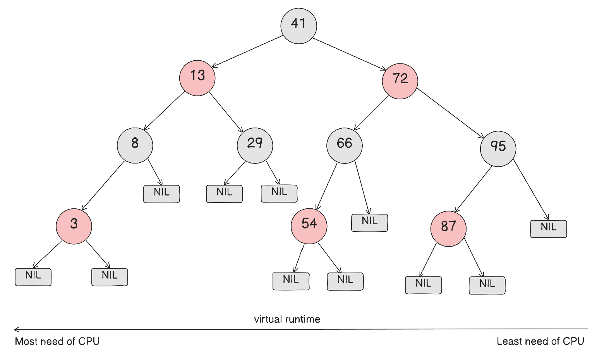
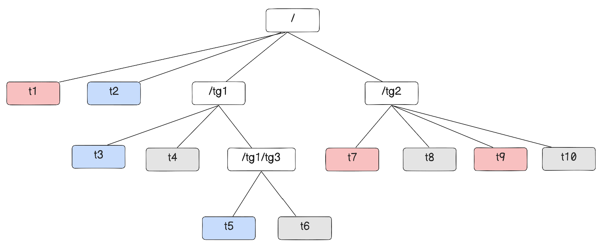
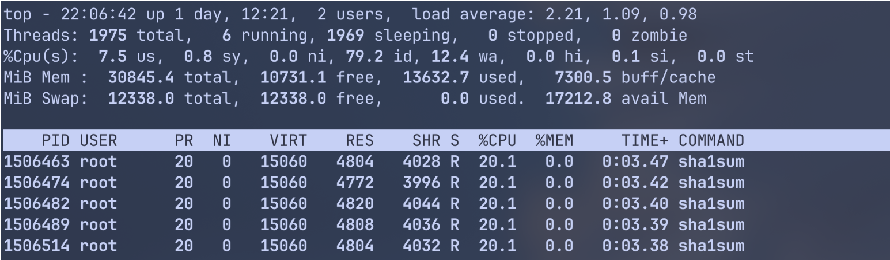
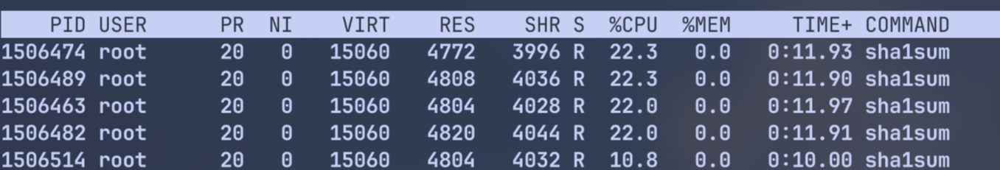
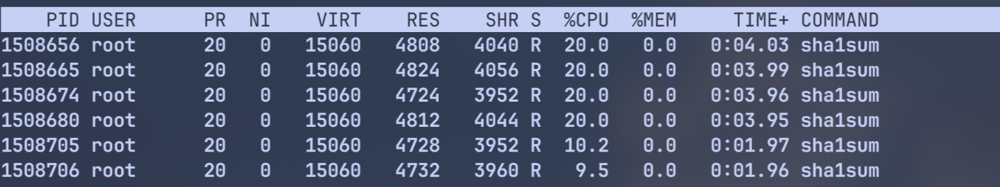

## ⚖️ CFS 스케줄러

### 개요

**CFS(Completely Fair Scheduler)** 는 Linux 2.6.23이후의 작업 스케줄러이다.

이상적인 CPU라면 여러 프로그램이 동시에 돌아갈 때, 각 작업에게 CPU시간을 아주 공정하고 정확하게 나눠줘야 하는데, 그 이상적인 모습을 현실에서 최대한 흉내내려는 스케줄러가 CFS스케줄러이다.

실제 하드웨어에서는, 하나의 작업만 실행할 수 있는데, "이상적인 동시 실행"을 위해서는 각 Task가 공정하게 얼마나 CPU를 받았느냐는 기준이 필요하다.  
이를 위해 **"virtual runtime(vruntime)"** 이라는 개념을 이용한다.

CFS에서 vruntime은 태스크별로 `task_struct->se.vruntime`값을 nanosec단위로 가진다.  
이를 통해서 시간을 정확히 측정가능하며 예상된 CPU타임을 부여받을 수 있게 된다.

CFS의 Task picking로직은 이 `task_struct->se.vruntime`값에 기반한다.  
항상 가장 작은 `p->se.vruntime`값을 가진 task를 실행하려고 시도한다.  
CFS는 항상 CPU타임을 쪼개서 runnable한 tasks들 사이에서 이상적인 멀티태스킹 하드웨어를 모방하기 위해 노력한다.

### RBTree

기존에는 `active/expired` 두 개의 배열을 번갈아서 스위치하는 방식이었다.  
task가 다 사용되면 expired, active가 비면 둘을 스왑시켰다.  
이러한 방식때문에 이 경계에서 이상한 현상이 생겼고, 순서가 바뀌거나 지연이 튀는 현상이 발생하였다.

대신, CFS에서는 RBTree(레드블랙트리) 자료구조를 이용해서, 정렬 키를 `p->se.vruntime`으로 하였다.  
즉, vruntme이 가장 작으면 CPU를 덜 받은 task이다.  

**RBTree안에서 가장 왼쪽 끝**   
**= 가장 작은 키**   
**= CPU를 덜 받은 태스크**   
**= 다음에 할 작업**  
인 것이다.    
**실행되다보면 vruntime이 증가하므로, 오른쪽으로 밀려나게 된다.**    
그래서 언젠가는 다른 노드가 왼쪽 끝이 되어 CPU를 받게 된다.  
즉, 공정성이 해결되며 기아를 방지하게 된다.  


CFS는 또한 `rq->cfs.min_vruntime`값을 이용하는데, runqueue내에서 가장 작은 vruntime을 추적한다.  
시스템 내부의 모든 작업은 이 시간만큼 보장받았음을 의미하는데, 새로 활성화된 태스크(ex. block대기 끝나거나 sleep끝나고 깨어남)를 보정하는데 쓰인다.  
이 값은 이 CPU가 지금까지 공정하게 처리한 작업량의 기준점이 된다.  

### 주요 자료구조
- `struct sched_entity`: 스케줄가능한 엔티티는 모두 `sched_entity`라는 객체를 통해 추적된다.
  스케줄가능한 엔티티는 하나의 task일수도 있고, task들의 그룹일 수 있다.
	- `sched_entity::load`: 이 entity의 가중치 정보이다.
	- `sched_entity::vruntime`: 이 엔티티의 vruntime값. 
	  핵심 **key**가 된다
	- `sched_entity::run_node`: RB트리에 연결되는 노드(트리에 넣기 위한 link)
	- `sum_exec_runtime`: 지금까지 CPU에서 실행된 실제 시간.
	- `prev_sum_exec_runtime`: 이전까지 CPU에서 실행된 실제 시간.
	-> 둘의 차이로 얼마 돌았는지 계산된다.
- `struct load_weight`: `sched_entity`가 얼마나 CPU를 받을 수 있는지에 대한 숫자 가중치이다.
	- 즉,`sched_entity::load는 struct load_weight`
	- 기본적으로 nice값(-20 ~ +19)의 영향을 받는다.
	- 그룹 스케줄링(cgroup)에서는 `cpu.weight`/`cpu.shares`를 기반으로 결정된다.
- `struct task_struct`: Task에 필요한 모든 정보는 이 구조체에 들어가있다.
	- 스케줄링에 관한 정보인 `task_struct::se`필드의 타입은 `struct sched_entity`이다.
- `struct rq`: 이 CPU에서의 모든 runnable한 task들에 대한 정보를 가진다.
	- per-CPU의 자원이며, 필드에는 CFS스케줄러를 위한 runqueue 이외에도, 다른 스케줄링 클래스(`rt`, `dl`등)들의 runqueue들도 필드로 가진다.
	- CFS의 runqueue필드는 `rq::cfs`이다.
- `struct cfs_rq`: CFS 전용 runqueue.
	- 내부에는 vruntime으로 정렬된 RB Tree를 가진다.
	- `cfs_rq::tasks_timeline`: RB Tree의 루트 노드
	- `cfs_rq::nr_running`: CPU위에 있는 runnable한 CFS task들의 수
	- `cfs_rq::load` runqueue내부의 `se::load`들의 합
	- `cfs_rq::min_vruntime`: CFS runqueue내부의 가장 작은 `sched_entity::vruntime`값.
		- 오랫동안 sleep하다온 task가 runqueue에 복귀했을 때 RB Tree의 맨 왼쪽에 계속 머무르지 않게 이 값을 이용해서 복귀 시 보정에 이 값의 근사한 값으로 넣어준다.

### running중에서의 동작
Task가 CPU에서 실행되는 동안, 매 tick마다 `update_curr()`가 현재 task(curr)의 시간을 누적한다.  
실제 실행시간은 다음의 과정으로 업데이트된다:
```c
delta_exec = now - curr->exec_start;
curr->exec_start = now;
curr->sum_exec_runtime += delta_exec;
```

이후, `vruntime`은 다음과 같이 업데이트된다:
```c
curr->vruntime += calc_delta_fair(delta_exec, curr);
```

반올림이나 오버플로우 체크 부분을 생략하면, `calc_delta_fair()`는 다음처럼 계산된다:
```c
// NICE_0_LOAD = nice가 0인경우 매핑되는값 = 상수값 1024
delta_exec * (NICE_0_LOAD / se->load.weight)
```
weight가 클수록, 즉 우선순위가 높으면 분모가 커지므로, `vruntime`의 누적이 작아지고,  
`weight`가 작아지면, 분모가 작아져서 `vruntime`의 누적이 커져서,  
우선순위가 클수록 더 자주 rbtree 왼쪽에 머무르게 된다.  
nice값이 0인경우, weight = `NICE_0_LOAD`여서, vruntime 증가량이 실제 cpu시간과 같아진다.

매 tick마다, 이 task가 이번 스케줄링 기간동안 받을 타임슬라이스(quota)를 정한다.  
```c
// sched_period는 모든 task들을 적어도 한 번 돌리기 위한 시간
sched_period * (se->load.weight / cfs_rq->load)
```

위의 두 보정(`vruntime`증가량, `quota`)를 계산하면, 결국 Task들이 자기 몫만큼 돌고나면, `vruntime`이 똑같이 증가한다.  
아래의 예시를 보면 알 수 있다:
1. A의 weight = 2, B의 weight를 1로 두자
2. Sched Period는 P라고 두자.
	-  A slice = P * 2/3
	-  B slice = P * 1/3
3. slice만큼 돌면, vruntime 증가량이 둘다 같아진다(아래 수식 참고).

$$\triangle vruntime \approx \triangle exec \times \frac{c(=NICE\_0\_LOAD)}{weight}$$
$$\triangle vr_A \approx (P \cdot 2/3) \times \frac{c}{2} = P \cdot c / 3$$
$$\triangle vr_B \approx (P \cdot 1/3) \times \frac{c}{1} = P \cdot c / 3$$


현재 task가 자신의 quota보다 더 실행되면, `TIF_NEED_RESHED`플래그가 세팅되어, 다음 기회에 선점(preempt)하고, 다음 task(최소 vruntime)로 교체한다.

> Tick이란?  
> 리눅스 시스템에서의 주기적 타이머 인터럽트 이다.  
> jiffies는 이 tick의 누적 카운트이며,   
> HZ는 1초에 tick이 몇 번 오냐에 대한 주파수 값이다.  
> 
> 최신 리눅스에서는 완전 주기적이지는 않다.   
> 유휴 상태에서는 전력을 아끼기 위해 tick을 줄인다고 한다.

CFS는 RBTree에 들어오는 task에 대해 vruntime을 보정하기도 한다.  
CFS는 sleep에서 wakeup된 task도 보정할 수 있는데, sleep되던 task는 vruntime이 한참 부족하다.  
일어나게 되면, CFS는 새로운 `vruntime`으로 보정하는데, 다음의 방법을 따른다:  
```python
if scheduler supports GENTLE_FAIR_SLEEPERS feature:
	placed_vruntime = cfs_rq.min_vruntime - sysctl_shced_latency/2
else:
	placed_vruntime = cfs_rq.min_vruntime - sysctl_shced_latency
	
se->vruntime = max(se->vruntime, placed_vruntime)
```
즉, 기존 `min_vruntime`보다 약간 덜받은정도로 새로운 보정값을 우선 만든다.  
`GENTLE_FAIR_SLEEPERS`를 키면, vruntime 보너스를 덜 주게 된다(latency를 덜 뺌)  
이후, `min_vruntime`에 근접한 값으로 보정한 값과 기존 vruntime과 비교해서, 더 큰 값을 고른다.  
-> 기존에도 충분히 보장받았음에도 또 보정을 받는 것을 방지한다.   
-> 단, sleep이 너무 긴 경우, 오버플로우 문제와 같은 극단 케이스가 발생할 수도 있는데, 이럴 때에는 그냥 기존 vruntime을 쓴다.  
그 뒤, runqueue에 `sched_entity`가 들어가진다.  
깨운 task의 vruntime이 현재 실행 중인 task보다 충분히 작으면, 현재 task가 선점 대상이 될 수 있다.  

`fork()`로 인해 자식 프로세스가 생길 수 있는데, 이 때는 `sysctl_sched_child_runs_first`가 중요하다.  
이 값이 0(기본값)이면, 부모 프로세스의 vruntime이 더 작은 경우 부모 프로세스가 먼저 실행된다.  
1이면 자식프로세스가 부모프로세스의 vruntime을 스왑하여 더 일찍 실행될 수 있는데, 보통 `exec()`가 `fork()`직후 일어나는 패턴이 많으므로, 불필요한 **copy-on-write(cow) 비용을 줄일 수 있다.**  

Task가 블록되거나 종료되면, vruntime이 업데이트되고, `sched_entitiy`가 RBTree로부터 제거된다.


### CFS 특징
기존 스케줄러와는 달리, jiffies/HZ와 같은 수치에만 의존하지 않는다.  
CFS는 실제 나노초(ns)단위로 정확히 누적시킨다.  
- 그래서 HS, jiffies에 상관없이 실행시간을 정밀하게 다룬다.  

또한, timeslice라는 개념이 없다.   
기존에는 휴리스틱 기반의 고정된 시간조각을 돌려주는 설계였지만 이제는 그런 개념을 사용하지 않는다.  
휴리스틱이 없으면, 규칙의 빈틈이 없어지고, 프로세스가 악용하는 경우를 없앤다.   
그러한 예외적인 규칙들을 줄이고 수학적으로 실행 시간을 관리하여, 공격이나 악용이 잘 통하지 않게 된다.   

유일한 튜닝은 `/sys/kernel/debug/sched/min_granularity_ns`이다.   
이는 최소 CPU할당의 하한선인데,   
값을 작게하면, low-latency가 되어 데스크톱에서 더 즉각적인 경험을 하게 되고,   
값을 크게하면, batching이 증가하여 캐시 효율도 좋아지고 큰 작업을 묶어 처리하기에도 좋다.   

CFS는 모든 runnable task들이 이 스케줄링 기간 안에는 한 번씩은 CPU를 받게 하려고 창을 잡는다.   
`shced_period = sysctl_sched_latency`이다.   
그러나, runnable task의 개수가 많아지면, 각 태스크에게 그러한 시간을 보장할 수도 없어지는데, `runnable`의 수가 `sysctl_sched_nr_latency`보다 많아지면, period를 늘린다.   

그리고 task는 최대한 `min_granularity_ns`만큼 실행되도록 한다.   

nice값 처리에도 좋은데, nice값이 높으면 vruntime이 더 크게 늘어나서 결과적으로 CPU를 덜 받게 된다.   

SMP(멀티코어) 로드밸런싱에서도 단순해졌는데, 복잡한 runqueue-walking assumption이 사라지고, 스케줄링 모듈에서의 iterator를 이용하여 밸런싱 코드가 단순해지고 안전해졌다.   

### CFS정책
CFS는 다음의 세 가지 스케줄링 정책을 구현한다:   
- `SCHED_NORMAL`: 보통의 task들을 위한 스케줄링 정책
- `SCHED_BATCH`: 보통의 task들만큼 자주 선점하지 않고, 한번에 많은 양을 처리하기 위한 스케줄링.
- `SCHED_IDLE`: nice값 19보다도 약한 값이지만, true-idle 생태는 아니다.

실시간 스케줄링으로 `SHCED_FIFO`/`_RR`이 있는데,  POSIX표준으로 `sched/rt.c`에 구현되어있다.
- 이들은 CFS정책은 아니다.

### 스케줄링 클래스
scheduler core는 정책을 직접 구현하지 않고, `shced_class`로 알고리즘을 분리해둔 뒤, core는 이벤트가 생길 시, 해당 class의 hook함수를 호출한다.

- `sched/fair.c`: CFS class구현
- `sched/rt.c`: RT(Real-Time) class 구현(FIFO/RR)
- `sched/deadline.c`: DEADLINE class 구현
core에서는 Deadline -> RT -> CFS class순으로 우선순위를 가진다.
즉, 이렇게 검사한다:
```python
if deadline task exists:
	run deadline
else if rt task exists:
	run rt
else if cfs task exists:
	run cfs
else:
	run idle
```

> 서버 워크로드에서는 보통 CFS를 신경쓰면 된다

다음은  hook들의 예시이다:
- `enqueue_task()`
- `dequeue_task()`
- `yield_task()`
- `check_preempt_curr()`
- `pick_next_task()`
- `set_curr_task()`
- `task_tick()`

---
## 🍕 그룹 스케줄링

### 그룹 스케줄링 개요
만약 Alice가 1개의 task를 돌리려는데, Bob은 4개의 task를 돌린다고 하자.   
CFS에 의해, task의 관점으로 각각 20%씩 할당해줬지만, 사용자의 입장에서는 20%, 80%씩 사용한것이다.   

커널 옵션에서 `CONFIG_CGROUP_SCHED`와 `CONFIG_FAIR_GROUP_SCHED`를 이용하면, CPU cgroup controller를 이용한다.

그룹 스케줄링이 활성화되면, `root_task_group`이라는 루트 레벨의 task group이 생긴다.   
태스크가 아무 그룹에도 없다면, `root_task_group`에 속하게 된다.   
모든 다른 task group은 `root_task_group`의 자식이다.   

Task group들이 생기고 CPU 사용량(`cpu.shares`/`cpu.weight`)가 정해질 수 있다.   
이 수치는 CPU가 경쟁 상태일 때, 누구에게 더 많이 배분할지 정하는 가중치이다.

### 그룹 스케줄링의 동작
그룹 스케줄링에서는 `task_group`이라는 새로운 오브젝트가 등장한다.   
task group에서는 여러 개의 runnable한 task들을 가질 수 있으며, 멀티코어 시스템에서는 이러한 task들이 서로 다른 CPU에 할당될 수 있다.   
그룹 스케줄링의 결정을 할때, 스케줄러는 `sched_entity`만 믿고 결정할 수는 없다.   
스케줄러는 task group의 task들이 태스크 그룹 내에서 quota를 받을 수 있도록  `task_group`레벨의 CFS runq가 필요하다.   

`task_group`은 `sched_entity`의 배열을 가지고 있으며, `task_group::se[i]`는 CPU i에 대한 CPU runq위에서 이 그룹을 대표하는 `sched_entity`이다.   
즉, i번째 CPU할당을 받기 위해 경쟁하는 그룹의 가상 `sched_entity`이다.   
`task_group::cfs_rq[i]`는 CPU i에서의 그룹 전용 CFS runq이다.   
CPU i에 있는 모든 runnable task중에서 이 그룹에 속한 task들은 `task_group::cfs_rq[i]`에 있다.   

Task group에 있는 CFS runq, 즉 `task_group::cfs_rq[i]`는 `tast_group::se[i]`의 `my_q`를 통해 참조될 수 있다.   
즉, `task_group::se[i]::my_q == task_group::cfs_rq[i]`이다.   
`task_group::shares`는 유저 스페이스에서 설정하는 `cpu.shares`나 `cpu.weight`과 같은 `task_group`의 CPU 할당비율을 말한다.   
`task_group::load_avg`는 그 그룹 내부에서의 평균 부하를 말한다.   
 
`root_task_group::cfs_rq[i]` 는 per-CPU의 CFS rq랑 같다.   
그래서 `root_task_group::se[i]` 는 `null`이다.   

i번째 CPU에서, `root_task_group::cfs_rq[i]`에서 다음 `sched_entity`를 꺼낸다.   
그 `sched_entity`는 실제 Task일수도 있고, `task_group`일수도 있다.   
task라면 실행하면 되고, `task_group`이라면 `my_q`를 통해 해당 내부 rq에서 내부의 `sched_entity`를 꺼낸다.    
이것이 반복된다.   
**즉, task와 task_group을 모두 함께 스케줄하고, 그룹이 뽑히면 내부 에서 다시 고르는 방식이 재귀적으로 이뤄지며 cgroup계층을 스케줄한다.**   

`task_group::se[i]`는 항상 큐에존재하는 것이 아닐 수도 있다.   
해당 그룹 안에서 Runnable한 task가 하나도 없다면, 그 그룹은 Runnable하지 못하므로 상위 큐에 없을 수도 있다. 

### 멀티코어에서의 그룹 스케줄링
두 개의 CPU코어를 가진다고 해보자.   
아래 그림과 같은 Task group계층을 가정한다.   
빨간색 Task는 CPU0에서, 파란색은 CPU1에서 Runnable하다고 하고, 회색 Task는 Runnable하지 않다고 가정한다.   
단, 저 Task들이 어디서 Runnable한지에 대해서는 특정 시점에 대해서만 유효하다.   



CPU0의 runq 에서는 `sched_entity(ies)`로 `t1`과 `tg2`를 가진다.   
`tg1`은 CPU0에서 runnable한 `sched_entiy(ies)`가 0개이므로, CPU0에서의 대표 `sched_entity`를 가지지 않는다. 

CPU1의 runq에서는 `shced_entity(ies)`로 `t2`와 `tg1`을 가진다.   
`tg2`는 CPU1에서 runnable한 `sched_entity(ies)`가 0개이므로, CPU1에서의 대표 `sched_entity`를 가지지 않는다.

CPU0에서는 `t1`과 `tg2`중 더 우선인 `sched_entity(ies)`를 고르고, 단일 Task라면 바로 실행하지만, Task group이라면 내부에서 또 우선순위를 비교한다.   
CPU1에서도 같다.

### 가중치 분배
Task들은 이렇게 여러 CPU들에 분배될 수 있는데, 다 합친 Task Group의 사용량이 몫을 넘지 않도록 조절해야 한다.    
그러나, task group 내의 task들은 항상 균등하게 분배되지 않는다.   
예를 들어서, 4개의 task로 이루어진 task group이 있고, 4코어의 시스템에서 돌아간다면, 4개 다 runnable해서 4코어에 퍼질 수가 있고, 어떤 순간에는 runnable이 1\~2개만 남아서 1\~2코어에서만 동작할 수 있다.(lock, I/O, sleep 등으로 인해)   
그래서 **그룹 스케줄링은 매 순간마다 runnable의 분포에 맞춰서 그룹 몫을 CPU들에 재분배**해야 한다.   

이전에 설명했듯이, 그룹 스케줄링에서는 task group의 CPU할당은 `cpu.shares` 또는 `cpu.weight`으로 정해진다.   
nice값처럼, `cpu.shares` 또는 `cpu.weight`은 그룹의 CPU 할당에 관여한다.   
그룹의 CPU할당은 태스크와 내부 그룹의 태스크의 CPU 할당으로 분배된다.   
기본적으로, `cpu.shares`는 1024이고, `cpu.weight`은 100이다.   
커널 내부에서, 둘은 같은 스케일로 바뀌어 사용된다.   
즉, cgroup v1인 `cpu.shares=1024`와 cgroup v2인 `cpu.weight=100`은 커널 내부에서 nice=0의 값인 `NICE_0_LOAD`로 바뀐다.   
그래서 `task_group`을 만들 때, weight/shares는 내부 가중치로 환산되어 `task_group::shares`에 저장해두고, 그 값에 기반해 CFS가 그룹끼리 CPU시간을 나눈다.  

예를 들어서, 3개의 CFS task가 nice=0, 2개의 CFS task group이 `cpu.shares = 1024`라면, 3개의 CFS task는 각각 20%의 CPU를 할당받고, 2개의 task group은 각각 20%의 CPU를 할당받아 내부에서 나눠쓴다.   

한 번 cgroup이 만들어지고 나서는, `cpu.shares`/`cpu.weight`을 수정해서 할당시간을 조절시킬 수도 있다.   

### 예시: 가중치 분배
`systemd-run`을 이용해서 실험해보자.   
cgroup v2 + systemd환경이라면 따라해볼 수 있다.

#### 하나의 group에서 하나의 Task
5개의 프로세스를 전부 같은 100의 weight로 하나의 CPU에서 실행한다.
```bash
sudo systemd-run --unit=w1 -p AllowedCPUs=0 -p CPUQuota=100% -p CPUWeight=100 bash -lc 'sha1sum /dev/zero >/dev/null'
sudo systemd-run --unit=w2 -p AllowedCPUs=0 -p CPUQuota=100% -p CPUWeight=100 bash -lc 'sha1sum /dev/zero >/dev/null'
sudo systemd-run --unit=w3 -p AllowedCPUs=0 -p CPUQuota=100% -p CPUWeight=100 bash -lc 'sha1sum /dev/zero >/dev/null'
sudo systemd-run --unit=w4 -p AllowedCPUs=0 -p CPUQuota=100% -p CPUWeight=100 bash -lc 'sha1sum /dev/zero >/dev/null'
sudo systemd-run --unit=w5 -p AllowedCPUs=0 -p CPUQuota=100% -p CPUWeight=100 bash -lc 'sha1sum /dev/zero >/dev/null'
```

이후, 프로세스를 확인해보자.  
각자 한 CPU에서 경쟁함에도, 대략 20%씩은 보장받고있다.


이제, w5만 weight을 절반으로 낮춰보자.
```bash
sudo systemctl set-property w5 CPUWeight=50
```


상한은 없게 하였기에(`CPUQuota=100%`), 전체 CPU시간을 weight만으로 공평하게 할당해주고 있다.


아래 명령어로 정리하면 된다.
```bash
sudo systemctl stop demo1 demo2 demo3 demo4 demo5 w1 w2 w3 w4 w5 2>/dev/null
sudo systemctl reset-failed demo1 demo2 demo3 demo4 demo5 w1 w2 w3 w4 w5 2>/dev/null
```


#### Group 내에 여러 task
이번에는 5개의 cgroup인데, 하나의 그룹 안에서는 두 개의 task가 돌아가도록 해보자.
```bash
sudo systemd-run --unit=g1 -p AllowedCPUs=0 -p CPUQuota=100% -p CPUWeight=100 \
  bash -lc 'sha1sum /dev/zero >/dev/null'

sudo systemd-run --unit=g2 -p AllowedCPUs=0 -p CPUQuota=100% -p CPUWeight=100 \
  bash -lc 'sha1sum /dev/zero >/dev/null'

sudo systemd-run --unit=g3 -p AllowedCPUs=0 -p CPUQuota=100% -p CPUWeight=100 \
  bash -lc 'sha1sum /dev/zero >/dev/null'

sudo systemd-run --unit=g4 -p AllowedCPUs=0 -p CPUQuota=100% -p CPUWeight=100 \
  bash -lc 'sha1sum /dev/zero >/dev/null'

# 두 개의 sha1sum을 실행
sudo systemd-run --unit=g5 -p AllowedCPUs=0 -p CPUQuota=100% -p CPUWeight=100 \
  bash -lc 'sha1sum /dev/zero >/dev/null & sha1sum /dev/zero >/dev/null & wait'
```

두 개의 `sha1sum`이 대략 10씩 나눠쓰는 모습을 볼 수 있다!


아래 명령어로 정리하자:
```bash
sudo systemctl stop g1 g2 g3 g4 g5 g5b 2>/dev/null
sudo systemctl reset-failed g1 g2 g3 g4 g5 g5b 2>/dev/null
```

### 가중치 할당

Task group에는 그룹 전체의 weight(`task_group::shares`)를 가진다.  
서로 다른 CPU들에서의 부하에 대한 기여도가 각자 다를 수 있다.  
어떤 순간에는 CPU0에 여러 개, 어떤 순간에는 CPU1에 runnable task가 없음 등의 상황이 생길 수 있다.  
그래서 그룹의 몫을 CPU 수로 똑같이 나누는 것은 불가능하다.  
그러면서도 그룹의 CPU share를 만족시켜야 한다.  

Task group이 생성되고, per-cpu의 `sched_entity(ies)`, 즉 `task_group::se[i]`가 `NICE_0_LOAD`의 weight로 나오는데, 처음 그룹을 만들 때에는 runnable task가 없기 때문에 기본값으로 줘도 된다.  

Task group의 task들이 1개 이상의 CPU에서 동작하기 시작하면, `task_group::se[i]`가 해당 CPU에서의 부하 비율로 업데이트된다.  
다음의 근사식을 통해 CPU i에서의 그룹 엔티티의 weight가 정해진다:  
```c
task_group.se[i].load.weight = task_group.weight * task_group.cfs_rq[i].avg.load_avg / task_group.load_avg
```
- `tg.weight`: 그룹 전체 weight값(shares)
- `tg.cfs_rq[i].avg.load_avg`: CPU i 에서 tg가 실제로 돌려고 하는 평균 load
- `tf.load_avg`: tg의 전체 load(대략 모든 CPU의 load 합)

예를 들면, tg의 runnable load가   
- CPU0에 3개
- CPU1에 1개
있다면, tg 전체 몫에서는  
- CPU0에 75%
- CPU1에 25%   
할당한다.

CFS 스케줄러는 완전 정밀하게 계산하지 않고, 근사값으로만 계산하는데, 매 순간 정확히 계산하는 데에는 오버헤드가 있기 때문이다.   
그래서 `load_avg`같은 평균치기반으로 근사하게 나오는 것이다.

### 가중치 계산
이러한 weight 계산은 `calc_group_shares()`를 호출하는 `update_cfs_group()`을 통해서 일어난다.   
`calc_group_shares`는 `task_group::cfs_rq[i]`를 본다.   
즉, CPU i에서 이 그룹이 얼마나 바쁘게 돌고 있는지를 확인한다.   
이후, 그 정도에 비례하여 `task_group::shares`를 CPU별로 나눈다.   
그렇게 `task_group::se[i]`의 weight에 저장된다.   

그러면 `update_cfs_group`은 언제 호출될까?    
주기적으로 scheduler tick이 오면, 그 CPU에서 실행중인 task의 `sched_entity`에 대해 `entity_tick`이 호출되면서 호출된다.   
그리고 그 태스크의 조상 그룹의 entity들까지 같이 호출된다.   

또한, 이벤트 발생 시에도 호출되는데, 다음의 이벤트에서 호출된다:
- `enqueue_task_fair`
- `dequeue_task_fair`
- `enqueue_entity`
- `dequeue_entity`
이러한 함수들은 task가 rq에 들어오거나 나가는 순간들이다.

예를 들면, 다음과 같은 상황이 있다:   
- task가 깨어남
- task가 sleep/block됨
- task가 다른 cpu로 migrate됨(기존 CPU dequeue -> 현재 CPU enqueue)
- task가 다른 cgroup으로 이동 (기존 그룹에서 dequeue, 새 그룹에 enqueue)

Load balancing으로 인해서 Task가 할당되는 CPU가 바뀌거나 cgroup을 바꾸면 `task_group::cfs_rq[i]`의 load기여와 `task_group::se[i]`의 weight도 바뀌어야 하므로 enqueue/dequeue에서도 update를 하는 것이다.

유저 공간에서의 `cpu.shares` 또는 `cpu.weight`를 변경하면 커널 벡엔드의 `sched_group_set_shares()`를 호출하여 `task_group::shares`를 업데이트하며 `update_cfs_group`이 호출된다.

`task_group::load_avg`은 이상적으로 다음과 같이 저장된다:
```python
task_group.load_avg = sum of (task_group.cfs_rq[i].avg.load_avg)
```

Task group의 평균 부하는 `update_tg_load_avg`에서 업데이트되는데, 이는 per-cpu의 CFS runq들중 하나에서 호출된다.   
우선 현재 runq의 부하와 이전 task_group의 load에 대한 contribution의 차이가 기록된다.   
만약 그 차이가 충분히 크면(마지막 기여값의 1/64 보다 크면), 그 차이를 `task_group::load_avg`에 반영(변화량을 누적)하고, 그리고 task_group이 기억해두는 이 runq에서의 마지막 기여값을 현재 load로 갱신한다.   
**너무 자잘한 변화까지 매번 반영하면, 업데이트가 너무 잦아지면서 비용이 커지므로, 작은 오차는 그냥 무시해서 성능을 챙기는 전략** 이다.   

그래서 결과적으로 task group의 `load_avg`는 항상 `sum(task_group.cfs_rq[i].load)`와 완전히 같지는 않지만, 거의 비슷하며 그 차이가 가져오는 부작용은 거의 없다고 본다.   

만약에 load가 줄어드는 경우, 즉 음수 delta인 경우에는    
`(현재 load - 마지막 기여값)`이 음수가 될 수 있다.   
그 음수 delta를 `task_group::load_avg`에 더한다는 것은, 그 runq가 이전에 기여했던 load를 빼는 효과로, 이 runq의 기여가 줄었으니 그룹 총 load에서도 그만큼 줄이게 된다는 의미이다.

### 스케줄링 다시 정리해보기

task group의 `sched_entity`는 CPU의 메인 CFS rq 또는 상위 task group에 존재하며, 그들의 quota는 각 scheduler period마다 그룹 se가 host runq에서 가진 weight와 load에 따라 실행 시간 몫이 결정된다.

Task가 CPU에서 실행중이면, 매 tick마다 실제 실행시간(physical runtime)와 가상 실행시간(vruntime)이 `sched_entity`에 업데이트된다.   
그룹 스케줄링에서는 이 **업데이트가 아래에서 위로 계층적으로 올라가며 반영** 된다.   
즉, task -> task group -> 상위 task group -> ...   
그리고, 각 레벨마다 그 레벨의 `sched_entity`의 weight가 쓰인다.   
- task level에서는 우선순위로 정해지는 load weight   
- task_group레벨에서는 `calc_cfs_share()`가 계산해주는 group weight가 쓰인다.   
만약 quota를 다 사용함을 감지하면, 현재 task를 preempt(선점)대상으로 표시한다.   
   
만약 task t1이 하나 있는데, 이 task 자체가 quota를 다 사용하거나, 상위 그룹이 quota를 다 사용하거나, 그 상위 그룹이 quota를 다 사용해버리거나 한다면, t1은 선점 대상이 된다.   
즉, task가 잘 돌고 있어도, 상위 그룹이 quota가 다 차버리면 끊길 수도 있다.


다음에 누구를 실행할지 고를 때에도, "왼쪽 끝"을 계층적으로 내려간다.   
스케줄러가 다음 실행 대상을 고를 때:
1. 메인 CFS runq의 RB-Tree에서 가장 왼쪽의 `sched_entity`를 고른다
2. task가 아니라 task_group의 `sched_entity`라면
	-  그 그룹의 `task_group.cfs_rq[i]` RB-Tree로 들어가서
	-  그 안에서도 가장 왼쪽 entity를 고른다.
3. 이를 반복하여 결국 실제 task의 `sched_entity`까지 내려간다.

---
## 🚀 EEVDF 스케줄러

CFS는 좋은 공정성을 가졌지만, 다음의 문제가 있었다:   
- interactive workload에서의 latency문제
- sleeper fairness 문제

그래서, 이를 보완한 EEVDF 스케줄러가 등장했다.


### EEVDF란
**Earliest Eligible Virtual Deadline First(EEVDF)** 스케줄러는 리눅스 커널 6.6버전부터 CFS 스케줄러를 대신한다.   
기존의 자료구조와 fairness 철학을 유지하며, 기존 CFS 코드를 기반으로 수정되었지만, task의 선택 로직은 바뀌었으며, latency의 모델이 더 명확해졌다.   
CFS 스케줄러와 유사하게, EEVDF는 runnable task들에 대해 CPU time을 공평하게 할당하는 것을 목표로 한다.   
그러기 위해, task마다 가상의 runtime을 할당하는데, "lag"라는 값으로 CPU time을 공평하게 받았는지 판단한다.   
**양수값의 lag는 CPU time을 덜 받은, 음수값의 lag는 CPU time을 충분히 받아서 덜 할당받아도 됨을 의미한다.**   
**EEVDF는 0 이상의 lag를 가진 task들 중에서, virtual deadline(VD)를 각각 계산하여, 가장 이른 VD를 가진 task를 골라 다음에 실행한다.**   
이러한 방법은 latency-sensitive한 task와 짧은 time slice를 우선시할 수 있어, 그들의 응답성에 도움이 된다.   

### lag 계산

lag값은 다음과 같이 계산된다:
```c
/*
 * lag_i = S - s_i = w_i * (V - v_i)
 *
 * However, since V is approximated by the weighted average of all entities it
 * is possible -- by addition/removal/reweight to the tree -- to move V around
 * and end up with a larger lag than we started with.
 *
 * Limit this to either double the slice length with a minimum of TICK_NSEC
 * since that is the timing granularity.
 *
 * EEVDF gives the following limit for a steady state system:
 *
 *   -r_max < lag < max(r_max, q)
 *
 * XXX could add max_slice to the augmented data to track this.
 */
static void update_entity_lag(struct cfs_rq *cfs_rq, struct sched_entity *se)
{
	s64 vlag, limit;

	WARN_ON_ONCE(!se->on_rq);

	vlag = avg_vruntime(cfs_rq) - se->vruntime;
	limit = calc_delta_fair(max_t(u64, 2*se->slice, TICK_NSEC), se);

	se->vlag = clamp(vlag, -limit, limit);
}
```

`cfs_rq`의 vruntime avg값은 근사된 평균 vruntime값이며, 이 값에 현재 `sched_entity->vruntime`을 뺀다.   
그래서 이 값이 양수면, **평균보다 vruntime이 뒤쳐졌으므로 CPU를 덜 할당받은 task라는 의미** 이다.   
음수이면, 평균보다 vruntime을 더 앞섰다는 뜻으로 CPU를 이미 많이 할당 받았다는 의미이다.   

`clamp()`하는 이유는, V는 근사값이기에 트리에서 연산이 일어날때 값이 급변할 수 있는데, 이러한 경우 `vlag`이 이상한 값이 되어 스케줄링이 잘못될 수 있으므로, 최대 `2*slice(최소 tick단위)`의 범위로 lag의 크기를 제한한 것이다.   


### VD 업데이트

```c
static bool update_deadline(struct cfs_rq *cfs_rq, struct sched_entity *se)
{
	if (vruntime_cmp(se->vruntime, "<", se->deadline))
		return false;

	/*
	 * For EEVDF the virtual time slope is determined by w_i (iow.
	 * nice) while the request time r_i is determined by
	 * sysctl_sched_base_slice.
	 */
	if (!se->custom_slice)
		se->slice = sysctl_sched_base_slice;

	/*
	 * EEVDF: vd_i = ve_i + r_i / w_i
	 */
	se->deadline = se->vruntime + calc_delta_fair(se->slice, se);

	/*
	 * The task has consumed its request, reschedule.
	 */
	return true;
}
```

아직 vruntime이 deadline을 넘지 않았다면, 요청량을 다 못썼으므로 갱신이 불필요함을 의미한다.   
크거나 같다면, 갱신이 필요하다.   
slice 요청량을 보정하고, deadline을 새로 갱신해준다.   
이후, `true`를 반환하여 재스케줄 트리거를 일으킬 수 있다.   

### 선택 로직

```c
/*
 * Earliest Eligible Virtual Deadline First
 *
 * In order to provide latency guarantees for different request sizes
 * EEVDF selects the best runnable task from two criteria:
 *
 *  1) the task must be eligible (must be owed service)
 *
 *  2) from those tasks that meet 1), we select the one
 *     with the earliest virtual deadline.
 *
 * We can do this in O(log n) time due to an augmented RB-tree. The
 * tree keeps the entries sorted on deadline, but also functions as a
 * heap based on the vruntime by keeping:
 *
 *  se->min_vruntime = min(se->vruntime, se->{left,right}->min_vruntime)
 *
 * Which allows tree pruning through eligibility.
 */
static struct sched_entity *__pick_eevdf(struct cfs_rq *cfs_rq, bool protect)
{
	struct rb_node *node = cfs_rq->tasks_timeline.rb_root.rb_node;
	struct sched_entity *se = __pick_first_entity(cfs_rq);
	struct sched_entity *curr = cfs_rq->curr;
	struct sched_entity *best = NULL;

	/*
	 * We can safely skip eligibility check if there is only one entity
	 * in this cfs_rq, saving some cycles.
	 */
	if (cfs_rq->nr_queued == 1)
		return curr && curr->on_rq ? curr : se;

	/*
	 * Picking the ->next buddy will affect latency but not fairness.
	 */
	if (sched_feat(PICK_BUDDY) &&
	    cfs_rq->next && entity_eligible(cfs_rq, cfs_rq->next)) {
		/* ->next will never be delayed */
		WARN_ON_ONCE(cfs_rq->next->sched_delayed);
		return cfs_rq->next;
	}

	if (curr && (!curr->on_rq || !entity_eligible(cfs_rq, curr)))
		curr = NULL;

	if (curr && protect && protect_slice(curr))
		return curr;

	/* Pick the leftmost entity if it's eligible */
	if (se && entity_eligible(cfs_rq, se)) {
		best = se;
		goto found;
	}

	/* Heap search for the EEVD entity */
	while (node) {
		struct rb_node *left = node->rb_left;

		/*
		 * Eligible entities in left subtree are always better
		 * choices, since they have earlier deadlines.
		 */
		if (left && vruntime_eligible(cfs_rq,
					__node_2_se(left)->min_vruntime)) {
			node = left;
			continue;
		}

		se = __node_2_se(node);

		/*
		 * The left subtree either is empty or has no eligible
		 * entity, so check the current node since it is the one
		 * with earliest deadline that might be eligible.
		 */
		if (entity_eligible(cfs_rq, se)) {
			best = se;
			break;
		}

		node = node->rb_right;
	}
found:
	if (!best || (curr && entity_before(curr, best)))
		best = curr;

	return best;
}
```

RBTree의 정렬 키는 `deadline`이다.   
그래서 가장 earlier한 deadline을 가진 `sched_entity`를 `__pick_first_entity()`로 뽑아낼 수 있다.

그렇지 않다면, **augmented RB-tree** 를 검사하는데, 평소에 각 노드에는 `se->min_vruntime = min(se->vruntime, left->min_vruntime, right->min_vruntime)`을 유지시켜서, 서브트리 안에 eligible할 가능성이 있는 vruntime이 있을 수 있는지 빠르게 체크가능하다.   
왼쪽 서브트리에 가능성이 있다면 왼쪽으로, 현재노드가 가능성이 있다면, 현재 노드로 확정, 그게 아니라면 오른쪽 서브트리로 이동하며 RBTree를 순회한다.

그렇게 `best`가 선정되면, `curr`와 비교한다. `curr`이 여전히 더 앞서면, `curr`을 유지한다.   
주요 로직 이전에는 보호 및 최적화 로직이 있는데, buddy는 선점과 관련된 helper라고 보면 된다.   
이외에도 `nr_queue`면 조기종료, slice보호 등의 처리가 있다.

### sleeping task와 lag
lag를 어떻게 관리할지, 특히 sleeping task에 대한 lag관리는 어떻게 해야할지 등에 대한 논의는 여전히 지속되고 있다.   
커널 6.19.0기준의 EEVDF는 **VRT(virtrual runtime)** 에 기반한 부패하는(decaying) 매커니즘을 이용한다.   
이는 짧은 시간동안 sleep되어 negative lag이 초기화되는 악용을 막는다.   
Task가 잠이 들면, runq에서 여전히 남지만, **"deferred dequeue"** 로 마킹되어 VRT를 기반으로 lag이 부패되도록 하는것이다.   
그래서 장기간 sleep된 task는 최종적으로 lag reset에 도달할 수 있다.   
최종적으로 task는 자신의 VD가 더 이른 시간이라면, 다른 task로부터 선점할 수 있으며, task들은 `sched_setattr()` 시스템 콜을 이용하여 새로운 특정한 time slice를 요청해서 latency-sensitive 애플리케이션에서의 유용하게 쓰일 수 있다. 


---
## 📚 References
- [The Linux Kernel - CFS Scheduler](https://www.kernel.org/doc/html/v6.1/scheduler/sched-design-CFS.html)
- [IBM Developer - Inside the Linux 2.6 - Completely Fair Scheduler](https://developer.ibm.com/tutorials/l-completely-fair-scheduler/)
- [Oracle Blog - CFS Group Scheduling](https://blogs.oracle.com/linux/cfs-group-scheduling)
- [Tuning the task scheduler - SUSE System Analysis and Tuning Guide](https://documentation.suse.com/de-de/sles/15-SP7/html/SLES-all/cha-tuning-taskscheduler.html)
- [The Linux Kernel - EEVDF Scheduler](https://docs.kernel.org/scheduler/sched-eevdf.html)
- [linux/kernel/sched/fair.c](https://github.com/torvalds/linux/blob/master/kernel/sched/fair.c)
